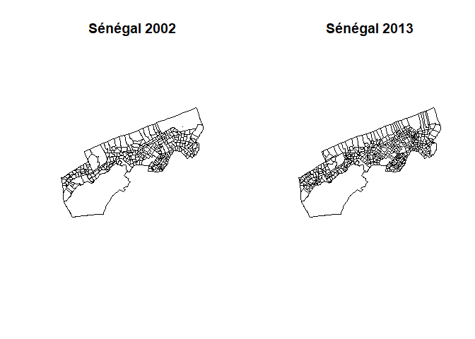
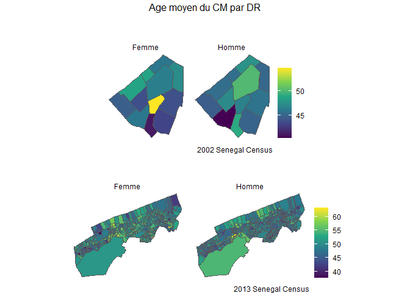
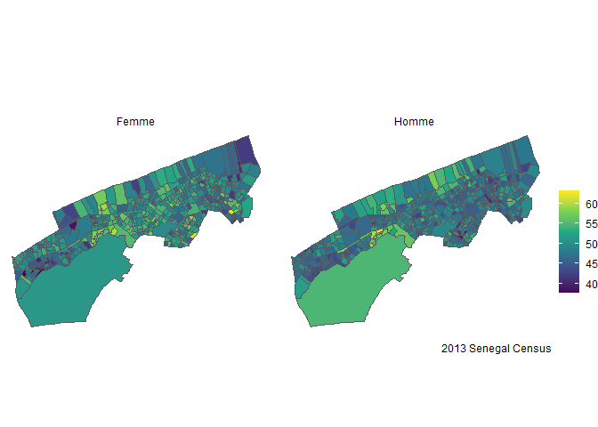

## Project Sénégal

### Preambule: 


```r
rm(list=ls())
```


```r
## Importing library
### List of required packages
required_packages <- c("tidyverse","janitor" ,"readr","dplyr","haven","sf", "flextable","sp", "factoextra", "FactoMineR","gtsummary", "sjPlot", "fastDummies")

# Check if packages are installed
missing_packages <- setdiff(required_packages, installed.packages()[,"Package"])

### Install missing packages
if (length(missing_packages) > 0) {
  install.packages(missing_packages)
}

### Load all packages
lapply(required_packages, library, character.only = TRUE)
```

### Import data


```r
# Read shapefile data for 2002 and 2013
sp_rgph_2002 <- sf::read_sf(paste0(here::here(),"/output/output_data/EAs_2002_new.shp"))

sp_rgph_2013 <- sf::read_sf(paste0(here::here(),"/data/SHAPEFILE/EAs_2013.shp"))

# Display the first 10 rows of the 2002 and 2013 shapefiles
head(sp_rgph_2002, 10L)
```

```
## Simple feature collection with 10 features and 15 fields
## Geometry type: POLYGON
## Dimension:     XY
## Bounding box:  xmin: 239595.4 ymin: 1633867 xmax: 242081.9 ymax: 1635051
## Projected CRS: WGS 84 / UTM zone 28N
## # A tibble: 10 × 16
##    OBJECTID CODE_DR NUMDEPT NUM_ARRDT NUM_CA DEPT    NOM_ARRDT NOM_CA Shape_Leng
##       <dbl>   <dbl>   <dbl>     <dbl>  <dbl> <chr>   <chr>     <chr>       <dbl>
##  1        1 2101062       2         1      1 GUEDIA… GUEDIAWA… GOLF …      1422.
##  2        4 2101001       2         1      1 GUEDIA… GUEDIAWA… GOLF …      2448.
##  3        5 2101002       2         1      1 GUEDIA… GUEDIAWA… GOLF …       901.
##  4        6 2101003       2         1      1 GUEDIA… GUEDIAWA… GOLF …       786.
##  5        7 2101004       2         1      1 GUEDIA… GUEDIAWA… GOLF …       576.
##  6        8 2101005       2         1      1 GUEDIA… GUEDIAWA… GOLF …       840.
##  7        9 2101006       2         1      1 GUEDIA… GUEDIAWA… GOLF …       653.
##  8       10 2101007       2         1      1 GUEDIA… GUEDIAWA… GOLF …       778.
##  9       11 2101009       2         1      1 GUEDIA… GUEDIAWA… GOLF …       595.
## 10       12 2101008       2         1      1 GUEDIA… GUEDIAWA… GOLF …       883.
## # ℹ 7 more variables: Shape_Area <dbl>, IDDR <chr>, REGION <chr>,
## #   NUM_REG <chr>, DR <chr>, id_dr <chr>, geometry <POLYGON [m]>
```

```r
head(sp_rgph_2013, 10L)
```

```
## Simple feature collection with 10 features and 24 fields
## Geometry type: POLYGON
## Dimension:     XY
## Bounding box:  xmin: 243503.8 ymin: 1634951 xmax: 244568.3 ymax: 1635897
## Projected CRS: WGS 84 / UTM zone 28N
## # A tibble: 10 × 25
##    OBJECTID DR_2012_CO QRT_VLG_HA       DR_2012 REG   DEPT   CAV   CCRCA COD_REG
##       <dbl> <chr>      <chr>            <chr>   <chr> <chr>  <chr> <chr> <chr>  
##  1        1 25_1/1     TOUBA GUEDIAWAYE 0095    DAKAR GUEDI… GUED… WAKH… 01     
##  2        2 26_1/1     TOUBA GUEDIAWAYE 0096    DAKAR GUEDI… GUED… WAKH… 01     
##  3        3 05_1/2     WAKHINANE        0009    DAKAR GUEDI… GUED… WAKH… 01     
##  4        4 01_1/1     WAKHINANE        0001    DAKAR GUEDI… GUED… WAKH… 01     
##  5        5 04_2/2     WAKHINANE        0007    DAKAR GUEDI… GUED… WAKH… 01     
##  6        6 06_2/2     WAKHINANE        0011    DAKAR GUEDI… GUED… WAKH… 01     
##  7        7 07_1/2     WAKHINANE        0012    DAKAR GUEDI… GUED… WAKH… 01     
##  8        8 18_2/2     WAKHINANE        0048    DAKAR GUEDI… GUED… WAKH… 01     
##  9        9 19_1/1     WAKHINANE        0046    DAKAR GUEDI… GUED… WAKH… 01     
## 10       10 02_2/2     WAKHINANE        0003    DAKAR GUEDI… GUED… WAKH… 01     
## # ℹ 16 more variables: COD_DEPT <chr>, COD_CAV <chr>, COD_CCRCA <chr>,
## #   COD_DR2012 <chr>, DR_2002 <chr>, COD_CAV_1 <chr>, COD_DEP1 <chr>,
## #   CA_CR <chr>, COD_CACR1 <chr>, ARR <chr>, COD_ARR <chr>, COD_CCACR <chr>,
## #   Shape_Leng <dbl>, Shape_Area <dbl>, IDDR <chr>, geometry <POLYGON [m]>
```


```r
# Read and check for duplicated rows in the "menage_2002" dataset
menage_2002 <- haven::read_sav(paste0(here::here(),"/output/output_data/menage_2002.sav"))
menage_2002 %>% janitor::get_dupes() 
```

```
## # A tibble: 209 × 64
##    id_dr      ID_MENAGE       RGPH  `filter_$` nb_indiv type_log nbr_piece_occup
##    <chr>      <chr>           <chr> <dbl+lbl>  <dbl+lb> <dbl+lb> <dbl+lbl>      
##  1 131181028O 131181028O48056 2002  NA         4 [Mais… 4 [4]    1 [1]          
##  2 131181028O 131181028O48056 2002  NA         4 [Mais… 4 [4]    1 [1]          
##  3 131181028O 131181028O48056 2002  NA         4 [Mais… 4 [4]    1 [1]          
##  4 131181028O 131181028O48056 2002  NA         4 [Mais… 4 [4]    1 [1]          
##  5 131181028O 131181028O48056 2002  NA         4 [Mais… 4 [4]    1 [1]          
##  6 131181028O 131181028O48056 2002  NA         4 [Mais… 4 [4]    1 [1]          
##  7 131181019O 131181019O12018 2002  NA         3 [Mais… 3 [3]    1 [1]          
##  8 131181019O 131181019O12018 2002  NA         3 [Mais… 3 [3]    1 [1]          
##  9 131181019O 131181019O12018 2002  NA         3 [Mais… 3 [3]    1 [1]          
## 10 131181019O 131181019O12018 2002  NA         3 [Mais… 3 [3]    1 [1]          
## # ℹ 199 more rows
## # ℹ 57 more variables: stat_occupation <dbl+lbl>, type_aisance <dbl+lbl>,
## #   approv_eau <dbl+lbl>, eclairage <dbl+lbl>, combustible_cuisine <dbl+lbl>,
## #   nature_mur <dbl+lbl>, nature_toit <dbl+lbl>, nature_sol <dbl+lbl>,
## #   radio <dbl+lbl>, televiseur <dbl+lbl>, video <dbl+lbl>,
## #   refri_conge <dbl+lbl>, telephone <dbl+lbl>, rechaud_cuis <dbl+lbl>,
## #   foyer_ameli <dbl+lbl>, climatisateur <dbl+lbl>, machine_coudre <dbl+lbl>, …
```

```r
# Read and check for duplicated rows in the "menage_2013" dataset
menage_2013 <- haven::read_sav(paste0(here::here(),"/output/output_data/menage_2013.sav"))
menage_2013 %>% janitor::get_dupes() 
```

```
## # A tibble: 0 × 60
## # ℹ 60 variables: id_dr <chr>, ID_MENAGE <chr>, RGPH <chr>, nb_indiv <dbl>,
## #   type_log <dbl+lbl>, nbr_piece_occup <dbl+lbl>, stat_occupation <dbl+lbl>,
## #   type_aisance <dbl+lbl>, approv_eau <dbl+lbl>, eclairage <dbl+lbl>,
## #   combustible_cuisine <dbl+lbl>, nature_mur <dbl+lbl>, nature_toit <dbl+lbl>,
## #   nature_sol <dbl+lbl>, radio <dbl+lbl>, televiseur <dbl+lbl>,
## #   video <dbl+lbl>, refri_conge <dbl+lbl>, telephone <dbl+lbl>,
## #   rechaud_cuis <dbl+lbl>, foyer_ameli <dbl+lbl>, climatisateur <dbl+lbl>, …
```


```r
par(mfrow=c(1,2))
plot(sp_rgph_2002$geometry, main="Sénégal 2002")
plot(sp_rgph_2013$geometry, main="Sénégal 2013")
```

<!-- -->


```r
indicateur_menage_2002 <- menage_2002 %>% 
  group_by(RGPH, id_dr, sexe_cm) %>% 
  summarise(n=n(),
            age_moyen=mean(age_cm, na.rm = TRUE))


indicateur_menage_2013 <- menage_2013 %>% 
  group_by(RGPH, id_dr, sexe_cm) %>% 
  summarise(n=n(),
            age_moyen=mean(age_cm, na.rm = TRUE))
```


```r
indicateur_menage_2002 <- sp_rgph_2002 %>% 
  left_join(indicateur_menage_2002, by="id_dr") %>% 
  select(names(indicateur_menage_2002), geometry) %>% 
  filter(!is.na(sexe_cm)) %>% 
  mutate(
    sexe_cm=as.numeric(sexe_cm),
    sexe_cm = recode(sexe_cm, 
                         "1"="Homme",
                         "2"="Femme")) %>% 
  filter(!is.na(sexe_cm)) 
# %>% 
#   mutate(sexe_cm= recode(sexe_cm, 
#                          "1"="Homme",
#                          "2"="Femme"))

# indicateur_menage_2002$sexe_cm <- car::recode(indicateur_menage_2002$sexe_cm, "1 = Homme; 2=Femme")


# indicateur_menage_2013 <- sp_rgph_2013 %>% 
#   left_join(indicateur_menage_2013, by="id_dr") 

g_2002 <- ggplot(indicateur_menage_2002, aes(fill = age_moyen)) + 
          geom_sf() + 
          scale_fill_viridis_c() + 
          theme_void() + 
          facet_wrap(~sexe_cm, ncol = 2) +
          labs(fill = "",
               title = "",
               subtitle = "",
               caption = "2002 Senegal Census")


indicateur_menage_2013 <- sp_rgph_2013 %>% 
  rename(id_dr=COD_DR2012) %>% 
  left_join(indicateur_menage_2013, by="id_dr") %>% 
  select(names(indicateur_menage_2013), geometry) %>% 
  filter(!is.na(sexe_cm)) %>% 
  mutate(
    sexe_cm=as.numeric(sexe_cm),
    sexe_cm= recode(sexe_cm, 
                         "1"="Homme",
                         "2"="Femme")) %>% 
  filter(!is.na(sexe_cm)) 
# %>%
#   mutate(sexe_cm= recode(sexe_cm,
#                          "1"="Homme",
#                          "2"="Femme"))
# indicateur_menage_2013$sexe_cm <- dplyr::recode(indicateur_menage_2013$sexe_cm, "1"="Homme","2"="Femme")

# indicateur_menage_2013 <- sp_rgph_2013 %>% 
#   left_join(indicateur_menage_2013, by="id_dr") 

g_2013 <- ggplot(indicateur_menage_2013, aes(fill = age_moyen)) + 
          geom_sf() + 
          scale_fill_viridis_c() + 
          theme_void() + 
          facet_wrap(~sexe_cm, ncol = 2) +
          labs(fill = "",
               title = "",
               subtitle = "",
               caption = "2013 Senegal Census")


gridExtra::grid.arrange(g_2002,g_2013, nrow=2, top="Age moyen du CM par DR")
```

<!-- -->


```r
ggplot(indicateur_menage_2013, aes(fill = age_moyen)) + 
          geom_sf() + 
          scale_fill_viridis_c() + 
          theme_void() + 
          facet_wrap(~sexe_cm, ncol = 2) +
          labs(fill = "",
               title = "",
               subtitle = "",
               caption = "2013 Senegal Census")
```

<!-- -->


