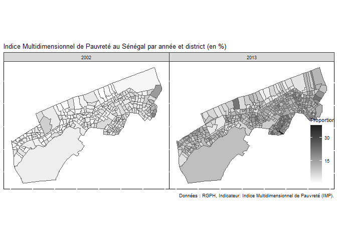

# Preambule: 

This MPI computation is inspired from the method described in the [link](https://www.publichealthnotes.com/what-is-multidimensional-poverty-index-mpi/).

```r
rm(list=ls())
```
## Importing library


```r
## Importing library
### List of required packages
required_packages <- c("tidyverse","janitor" ,"readr","dplyr","haven","sf", "flextable","sp", "factoextra", "FactoMineR","gtsummary", "sjPlot", "fastDummies","ggthemes")

# Check if packages are installed
missing_packages <- setdiff(required_packages, installed.packages()[,"Package"])

### Install missing packages
if (length(missing_packages) > 0) {
  install.packages(missing_packages)
}

### Load all packages
lapply(required_packages, library, character.only = TRUE)
```

## Importing dataset


```r
# Read and check for duplicated rows in the "menage_2002" dataset
menage_2002 <- base::readRDS(paste0(here::here(),"/output/output_data/menage_2002.rds"))
menage_2002 %>% janitor::get_dupes() 

# Read and check for duplicated rows in the "menage_2013" dataset
menage_2013 <- base::readRDS(paste0(here::here(),"/output/output_data/menage_2013.rds"))
menage_2013 %>% janitor::get_dupes() 

# Read shapefile data for 2002 and 2013
sp_rgph_2002 <- sf::read_sf(paste0(here::here(),"/output/output_data/EAs_2002_new.shp"))
sp_rgph_2013 <- sf::read_sf(paste0(here::here(),"/data/SHAPEFILE/EAs_2013.shp"))


# Importing the crosswalk
#crosswalk_table_dr <- readxl::read_excel(paste0(here::here(),"/data/TABLE_CORRESPONDANCE_SPATIALE_DR.xls"))
```


```r
# Convert to character the variables that are needed to compute the MPI

# For RGPH 2002
# Update the 'menage_2002' dataframe using the pipe operator '%>%'
menage_2002 <- menage_2002 %>%  
  # Add a new column 'MPI' to the dataframe
  mutate(
    deces_under_five_dim = as.numeric(as.character(deces_under_five_dim)),   # Convert 'deces_under_five_dim' to numeric
    deces_under_five_dim = ifelse(deces_under_five_dim>0,1,0),
    years_schooling_dim = as.numeric(as.character(years_schooling_dim)),     # Convert 'years_schooling_dim' to numeric
    school_attendance_dim = as.numeric(as.character(school_attendance_dim)), # Convert 'school_attendance_dim' to numeric
    cooking_fuel_dim = as.numeric(as.character(cooking_fuel_dim)),           # Convert 'cooking_fuel_dim' to numeric       
    sanitation_dim = as.numeric(as.character(sanitation_dim)),               # Convert 'sanitation_dim' to numeric   
    drinking_water_dim = as.numeric(as.character(drinking_water_dim)),       # Convert 'drinking_water_dim' to numeric
    electricity_dim = as.numeric(as.character(electricity_dim)),             # Convert 'electricity_dim' to numeric
    housing_dim = as.numeric(as.character(housing_dim)),                     # Convert 'housing_dim' to numeric
    assets_dim = as.numeric(as.character(assets_dim))                         # Convert 'assets_dim' to numeric
  )


# For RGPH 2013

# Update the 'menage_2013' dataframe using the pipe operator '%>%'
menage_2013 <- menage_2013 %>%  
  mutate(deces_under_five_dim=0,
    years_schooling_dim = as.numeric(as.character(years_schooling_dim)),     # Convert 'years_schooling_dim' to numeric
    school_attendance_dim = as.numeric(as.character(school_attendance_dim)), # Convert 'school_attendance_dim' to numeric
    cooking_fuel_dim = as.numeric(as.character(cooking_fuel_dim)),           # Convert 'cooking_fuel_dim' to numeric       
    sanitation_dim = as.numeric(as.character(sanitation_dim)),               # Convert 'sanitation_dim' to numeric   
    drinking_water_dim = as.numeric(as.character(drinking_water_dim)),       # Convert 'drinking_water_dim' to numeric
    electricity_dim = as.numeric(as.character(electricity_dim)),             # Convert 'electricity_dim' to numeric
    housing_dim = as.numeric(as.character(housing_dim)),                     # Convert 'housing_dim' to numeric
    assets_dim = as.numeric(as.character(assets_dim))                         # Convert 'assets_dim' to numeric
  )
```


```r
dimen = c("deces_under_five_dim","years_schooling_dim","school_attendance_dim","cooking_fuel_dim","sanitation_dim","drinking_water_dim","electricity_dim","housing_dim","assets_dim")

menage_2002 %>% 
  
  # Selecting relevant variables
  select(RGPH, deces_under_five_dim, years_schooling_dim,school_attendance_dim,cooking_fuel_dim,sanitation_dim,drinking_water_dim,electricity_dim,housing_dim,assets_dim) %>% 
  
  plyr::rbind.fill(
    
    # Selecting relevant variables
    menage_2013 %>% 
      select(RGPH, deces_under_five_dim, years_schooling_dim,school_attendance_dim,cooking_fuel_dim,sanitation_dim,drinking_water_dim,electricity_dim,housing_dim,assets_dim)) %>% 

# Generate a summary table using "tbl_summary" for the specified columns
  tbl_summary(
    by = RGPH,  # Group by "RGPH" column
    # label = list(years_schooling_dim,school_attendance_dim,cooking_fuel_dim,sanitation_dim,drinking_water_dim,electricity_dim,housing_dim,assets_dim),
    type = c(dimen~"categorical"),
    statistic = list(
                     all_categorical() ~ "{n} ({p}%,{n}/{N})",
                     all_continuous() ~ "{mean}"
                     ),
    digits = everything() ~ c(0,0),
    missing = "no"
  ) %>% 

  # Modify the table header to provide a descriptive label
  modify_header(label ~ "MPI - Dimensions") %>%
  add_overall() %>%
  add_n()%>% 
  # Add difference statistics to the table
  add_difference() %>% 
  bold_labels() 
```

```{=html}
<div id="naensetrbj" style="padding-left:0px;padding-right:0px;padding-top:10px;padding-bottom:10px;overflow-x:auto;overflow-y:auto;width:auto;height:auto;">
<style>#naensetrbj table {
  font-family: system-ui, 'Segoe UI', Roboto, Helvetica, Arial, sans-serif, 'Apple Color Emoji', 'Segoe UI Emoji', 'Segoe UI Symbol', 'Noto Color Emoji';
  -webkit-font-smoothing: antialiased;
  -moz-osx-font-smoothing: grayscale;
}

#naensetrbj thead, #naensetrbj tbody, #naensetrbj tfoot, #naensetrbj tr, #naensetrbj td, #naensetrbj th {
  border-style: none;
}

#naensetrbj p {
  margin: 0;
  padding: 0;
}

#naensetrbj .gt_table {
  display: table;
  border-collapse: collapse;
  line-height: normal;
  margin-left: auto;
  margin-right: auto;
  color: #333333;
  font-size: 16px;
  font-weight: normal;
  font-style: normal;
  background-color: #FFFFFF;
  width: auto;
  border-top-style: solid;
  border-top-width: 2px;
  border-top-color: #A8A8A8;
  border-right-style: none;
  border-right-width: 2px;
  border-right-color: #D3D3D3;
  border-bottom-style: solid;
  border-bottom-width: 2px;
  border-bottom-color: #A8A8A8;
  border-left-style: none;
  border-left-width: 2px;
  border-left-color: #D3D3D3;
}

#naensetrbj .gt_caption {
  padding-top: 4px;
  padding-bottom: 4px;
}

#naensetrbj .gt_title {
  color: #333333;
  font-size: 125%;
  font-weight: initial;
  padding-top: 4px;
  padding-bottom: 4px;
  padding-left: 5px;
  padding-right: 5px;
  border-bottom-color: #FFFFFF;
  border-bottom-width: 0;
}

#naensetrbj .gt_subtitle {
  color: #333333;
  font-size: 85%;
  font-weight: initial;
  padding-top: 3px;
  padding-bottom: 5px;
  padding-left: 5px;
  padding-right: 5px;
  border-top-color: #FFFFFF;
  border-top-width: 0;
}

#naensetrbj .gt_heading {
  background-color: #FFFFFF;
  text-align: center;
  border-bottom-color: #FFFFFF;
  border-left-style: none;
  border-left-width: 1px;
  border-left-color: #D3D3D3;
  border-right-style: none;
  border-right-width: 1px;
  border-right-color: #D3D3D3;
}

#naensetrbj .gt_bottom_border {
  border-bottom-style: solid;
  border-bottom-width: 2px;
  border-bottom-color: #D3D3D3;
}

#naensetrbj .gt_col_headings {
  border-top-style: solid;
  border-top-width: 2px;
  border-top-color: #D3D3D3;
  border-bottom-style: solid;
  border-bottom-width: 2px;
  border-bottom-color: #D3D3D3;
  border-left-style: none;
  border-left-width: 1px;
  border-left-color: #D3D3D3;
  border-right-style: none;
  border-right-width: 1px;
  border-right-color: #D3D3D3;
}

#naensetrbj .gt_col_heading {
  color: #333333;
  background-color: #FFFFFF;
  font-size: 100%;
  font-weight: normal;
  text-transform: inherit;
  border-left-style: none;
  border-left-width: 1px;
  border-left-color: #D3D3D3;
  border-right-style: none;
  border-right-width: 1px;
  border-right-color: #D3D3D3;
  vertical-align: bottom;
  padding-top: 5px;
  padding-bottom: 6px;
  padding-left: 5px;
  padding-right: 5px;
  overflow-x: hidden;
}

#naensetrbj .gt_column_spanner_outer {
  color: #333333;
  background-color: #FFFFFF;
  font-size: 100%;
  font-weight: normal;
  text-transform: inherit;
  padding-top: 0;
  padding-bottom: 0;
  padding-left: 4px;
  padding-right: 4px;
}

#naensetrbj .gt_column_spanner_outer:first-child {
  padding-left: 0;
}

#naensetrbj .gt_column_spanner_outer:last-child {
  padding-right: 0;
}

#naensetrbj .gt_column_spanner {
  border-bottom-style: solid;
  border-bottom-width: 2px;
  border-bottom-color: #D3D3D3;
  vertical-align: bottom;
  padding-top: 5px;
  padding-bottom: 5px;
  overflow-x: hidden;
  display: inline-block;
  width: 100%;
}

#naensetrbj .gt_spanner_row {
  border-bottom-style: hidden;
}

#naensetrbj .gt_group_heading {
  padding-top: 8px;
  padding-bottom: 8px;
  padding-left: 5px;
  padding-right: 5px;
  color: #333333;
  background-color: #FFFFFF;
  font-size: 100%;
  font-weight: initial;
  text-transform: inherit;
  border-top-style: solid;
  border-top-width: 2px;
  border-top-color: #D3D3D3;
  border-bottom-style: solid;
  border-bottom-width: 2px;
  border-bottom-color: #D3D3D3;
  border-left-style: none;
  border-left-width: 1px;
  border-left-color: #D3D3D3;
  border-right-style: none;
  border-right-width: 1px;
  border-right-color: #D3D3D3;
  vertical-align: middle;
  text-align: left;
}

#naensetrbj .gt_empty_group_heading {
  padding: 0.5px;
  color: #333333;
  background-color: #FFFFFF;
  font-size: 100%;
  font-weight: initial;
  border-top-style: solid;
  border-top-width: 2px;
  border-top-color: #D3D3D3;
  border-bottom-style: solid;
  border-bottom-width: 2px;
  border-bottom-color: #D3D3D3;
  vertical-align: middle;
}

#naensetrbj .gt_from_md > :first-child {
  margin-top: 0;
}

#naensetrbj .gt_from_md > :last-child {
  margin-bottom: 0;
}

#naensetrbj .gt_row {
  padding-top: 8px;
  padding-bottom: 8px;
  padding-left: 5px;
  padding-right: 5px;
  margin: 10px;
  border-top-style: solid;
  border-top-width: 1px;
  border-top-color: #D3D3D3;
  border-left-style: none;
  border-left-width: 1px;
  border-left-color: #D3D3D3;
  border-right-style: none;
  border-right-width: 1px;
  border-right-color: #D3D3D3;
  vertical-align: middle;
  overflow-x: hidden;
}

#naensetrbj .gt_stub {
  color: #333333;
  background-color: #FFFFFF;
  font-size: 100%;
  font-weight: initial;
  text-transform: inherit;
  border-right-style: solid;
  border-right-width: 2px;
  border-right-color: #D3D3D3;
  padding-left: 5px;
  padding-right: 5px;
}

#naensetrbj .gt_stub_row_group {
  color: #333333;
  background-color: #FFFFFF;
  font-size: 100%;
  font-weight: initial;
  text-transform: inherit;
  border-right-style: solid;
  border-right-width: 2px;
  border-right-color: #D3D3D3;
  padding-left: 5px;
  padding-right: 5px;
  vertical-align: top;
}

#naensetrbj .gt_row_group_first td {
  border-top-width: 2px;
}

#naensetrbj .gt_row_group_first th {
  border-top-width: 2px;
}

#naensetrbj .gt_summary_row {
  color: #333333;
  background-color: #FFFFFF;
  text-transform: inherit;
  padding-top: 8px;
  padding-bottom: 8px;
  padding-left: 5px;
  padding-right: 5px;
}

#naensetrbj .gt_first_summary_row {
  border-top-style: solid;
  border-top-color: #D3D3D3;
}

#naensetrbj .gt_first_summary_row.thick {
  border-top-width: 2px;
}

#naensetrbj .gt_last_summary_row {
  padding-top: 8px;
  padding-bottom: 8px;
  padding-left: 5px;
  padding-right: 5px;
  border-bottom-style: solid;
  border-bottom-width: 2px;
  border-bottom-color: #D3D3D3;
}

#naensetrbj .gt_grand_summary_row {
  color: #333333;
  background-color: #FFFFFF;
  text-transform: inherit;
  padding-top: 8px;
  padding-bottom: 8px;
  padding-left: 5px;
  padding-right: 5px;
}

#naensetrbj .gt_first_grand_summary_row {
  padding-top: 8px;
  padding-bottom: 8px;
  padding-left: 5px;
  padding-right: 5px;
  border-top-style: double;
  border-top-width: 6px;
  border-top-color: #D3D3D3;
}

#naensetrbj .gt_last_grand_summary_row_top {
  padding-top: 8px;
  padding-bottom: 8px;
  padding-left: 5px;
  padding-right: 5px;
  border-bottom-style: double;
  border-bottom-width: 6px;
  border-bottom-color: #D3D3D3;
}

#naensetrbj .gt_striped {
  background-color: rgba(128, 128, 128, 0.05);
}

#naensetrbj .gt_table_body {
  border-top-style: solid;
  border-top-width: 2px;
  border-top-color: #D3D3D3;
  border-bottom-style: solid;
  border-bottom-width: 2px;
  border-bottom-color: #D3D3D3;
}

#naensetrbj .gt_footnotes {
  color: #333333;
  background-color: #FFFFFF;
  border-bottom-style: none;
  border-bottom-width: 2px;
  border-bottom-color: #D3D3D3;
  border-left-style: none;
  border-left-width: 2px;
  border-left-color: #D3D3D3;
  border-right-style: none;
  border-right-width: 2px;
  border-right-color: #D3D3D3;
}

#naensetrbj .gt_footnote {
  margin: 0px;
  font-size: 90%;
  padding-top: 4px;
  padding-bottom: 4px;
  padding-left: 5px;
  padding-right: 5px;
}

#naensetrbj .gt_sourcenotes {
  color: #333333;
  background-color: #FFFFFF;
  border-bottom-style: none;
  border-bottom-width: 2px;
  border-bottom-color: #D3D3D3;
  border-left-style: none;
  border-left-width: 2px;
  border-left-color: #D3D3D3;
  border-right-style: none;
  border-right-width: 2px;
  border-right-color: #D3D3D3;
}

#naensetrbj .gt_sourcenote {
  font-size: 90%;
  padding-top: 4px;
  padding-bottom: 4px;
  padding-left: 5px;
  padding-right: 5px;
}

#naensetrbj .gt_left {
  text-align: left;
}

#naensetrbj .gt_center {
  text-align: center;
}

#naensetrbj .gt_right {
  text-align: right;
  font-variant-numeric: tabular-nums;
}

#naensetrbj .gt_font_normal {
  font-weight: normal;
}

#naensetrbj .gt_font_bold {
  font-weight: bold;
}

#naensetrbj .gt_font_italic {
  font-style: italic;
}

#naensetrbj .gt_super {
  font-size: 65%;
}

#naensetrbj .gt_footnote_marks {
  font-size: 75%;
  vertical-align: 0.4em;
  position: initial;
}

#naensetrbj .gt_asterisk {
  font-size: 100%;
  vertical-align: 0;
}

#naensetrbj .gt_indent_1 {
  text-indent: 5px;
}

#naensetrbj .gt_indent_2 {
  text-indent: 10px;
}

#naensetrbj .gt_indent_3 {
  text-indent: 15px;
}

#naensetrbj .gt_indent_4 {
  text-indent: 20px;
}

#naensetrbj .gt_indent_5 {
  text-indent: 25px;
}
</style>
<table class="gt_table" data-quarto-disable-processing="false" data-quarto-bootstrap="false">
  <thead>
    
    <tr class="gt_col_headings">
      <th class="gt_col_heading gt_columns_bottom_border gt_left" rowspan="1" colspan="1" scope="col" id="MPI - Dimensions">MPI - Dimensions</th>
      <th class="gt_col_heading gt_columns_bottom_border gt_center" rowspan="1" colspan="1" scope="col" id="&lt;strong&gt;N&lt;/strong&gt;"><strong>N</strong></th>
      <th class="gt_col_heading gt_columns_bottom_border gt_center" rowspan="1" colspan="1" scope="col" id="&lt;strong&gt;Overall&lt;/strong&gt;, N = 78,388&lt;span class=&quot;gt_footnote_marks&quot; style=&quot;white-space:nowrap;font-style:italic;font-weight:normal;&quot;&gt;&lt;sup&gt;1&lt;/sup&gt;&lt;/span&gt;"><strong>Overall</strong>, N = 78,388<span class="gt_footnote_marks" style="white-space:nowrap;font-style:italic;font-weight:normal;"><sup>1</sup></span></th>
      <th class="gt_col_heading gt_columns_bottom_border gt_center" rowspan="1" colspan="1" scope="col" id="&lt;strong&gt;2002&lt;/strong&gt;, N = 35,396&lt;span class=&quot;gt_footnote_marks&quot; style=&quot;white-space:nowrap;font-style:italic;font-weight:normal;&quot;&gt;&lt;sup&gt;1&lt;/sup&gt;&lt;/span&gt;"><strong>2002</strong>, N = 35,396<span class="gt_footnote_marks" style="white-space:nowrap;font-style:italic;font-weight:normal;"><sup>1</sup></span></th>
      <th class="gt_col_heading gt_columns_bottom_border gt_center" rowspan="1" colspan="1" scope="col" id="&lt;strong&gt;2013&lt;/strong&gt;, N = 42,992&lt;span class=&quot;gt_footnote_marks&quot; style=&quot;white-space:nowrap;font-style:italic;font-weight:normal;&quot;&gt;&lt;sup&gt;1&lt;/sup&gt;&lt;/span&gt;"><strong>2013</strong>, N = 42,992<span class="gt_footnote_marks" style="white-space:nowrap;font-style:italic;font-weight:normal;"><sup>1</sup></span></th>
      <th class="gt_col_heading gt_columns_bottom_border gt_center" rowspan="1" colspan="1" scope="col" id="&lt;strong&gt;Difference&lt;/strong&gt;&lt;span class=&quot;gt_footnote_marks&quot; style=&quot;white-space:nowrap;font-style:italic;font-weight:normal;&quot;&gt;&lt;sup&gt;2&lt;/sup&gt;&lt;/span&gt;"><strong>Difference</strong><span class="gt_footnote_marks" style="white-space:nowrap;font-style:italic;font-weight:normal;"><sup>2</sup></span></th>
      <th class="gt_col_heading gt_columns_bottom_border gt_center" rowspan="1" colspan="1" scope="col" id="&lt;strong&gt;95% CI&lt;/strong&gt;&lt;span class=&quot;gt_footnote_marks&quot; style=&quot;white-space:nowrap;font-style:italic;font-weight:normal;&quot;&gt;&lt;sup&gt;2,3&lt;/sup&gt;&lt;/span&gt;"><strong>95% CI</strong><span class="gt_footnote_marks" style="white-space:nowrap;font-style:italic;font-weight:normal;"><sup>2,3</sup></span></th>
    </tr>
  </thead>
  <tbody class="gt_table_body">
    <tr><td headers="label" class="gt_row gt_left" style="font-weight: bold;">deces_under_five_dim</td>
<td headers="n" class="gt_row gt_center">78,388</td>
<td headers="stat_0" class="gt_row gt_center"><br /></td>
<td headers="stat_1" class="gt_row gt_center"><br /></td>
<td headers="stat_2" class="gt_row gt_center"><br /></td>
<td headers="estimate" class="gt_row gt_center">0.35</td>
<td headers="ci" class="gt_row gt_center">0.34, 0.36</td></tr>
    <tr><td headers="label" class="gt_row gt_left">    0</td>
<td headers="n" class="gt_row gt_center"><br /></td>
<td headers="stat_0" class="gt_row gt_center">76,352 (97%,76,352/78,388)</td>
<td headers="stat_1" class="gt_row gt_center">33,360 (94%,33,360/35,396)</td>
<td headers="stat_2" class="gt_row gt_center">42,992 (100%,42,992/42,992)</td>
<td headers="estimate" class="gt_row gt_center"><br /></td>
<td headers="ci" class="gt_row gt_center"><br /></td></tr>
    <tr><td headers="label" class="gt_row gt_left">    1</td>
<td headers="n" class="gt_row gt_center"><br /></td>
<td headers="stat_0" class="gt_row gt_center">2,036 (3%,2,036/78,388)</td>
<td headers="stat_1" class="gt_row gt_center">2,036 (6%,2,036/35,396)</td>
<td headers="stat_2" class="gt_row gt_center">0 (0%,0/42,992)</td>
<td headers="estimate" class="gt_row gt_center"><br /></td>
<td headers="ci" class="gt_row gt_center"><br /></td></tr>
    <tr><td headers="label" class="gt_row gt_left" style="font-weight: bold;">years_schooling_dim</td>
<td headers="n" class="gt_row gt_center">45,377</td>
<td headers="stat_0" class="gt_row gt_center"><br /></td>
<td headers="stat_1" class="gt_row gt_center"><br /></td>
<td headers="stat_2" class="gt_row gt_center"><br /></td>
<td headers="estimate" class="gt_row gt_center">-0.08</td>
<td headers="ci" class="gt_row gt_center">-0.12, -0.03</td></tr>
    <tr><td headers="label" class="gt_row gt_left">    0</td>
<td headers="n" class="gt_row gt_center"><br /></td>
<td headers="stat_0" class="gt_row gt_center">40,418 (89%,40,418/45,377)</td>
<td headers="stat_1" class="gt_row gt_center">2,175 (91%,2,175/2,385)</td>
<td headers="stat_2" class="gt_row gt_center">38,243 (89%,38,243/42,992)</td>
<td headers="estimate" class="gt_row gt_center"><br /></td>
<td headers="ci" class="gt_row gt_center"><br /></td></tr>
    <tr><td headers="label" class="gt_row gt_left">    1</td>
<td headers="n" class="gt_row gt_center"><br /></td>
<td headers="stat_0" class="gt_row gt_center">4,959 (11%,4,959/45,377)</td>
<td headers="stat_1" class="gt_row gt_center">210 (9%,210/2,385)</td>
<td headers="stat_2" class="gt_row gt_center">4,749 (11%,4,749/42,992)</td>
<td headers="estimate" class="gt_row gt_center"><br /></td>
<td headers="ci" class="gt_row gt_center"><br /></td></tr>
    <tr><td headers="label" class="gt_row gt_left" style="font-weight: bold;">school_attendance_dim</td>
<td headers="n" class="gt_row gt_center">45,377</td>
<td headers="stat_0" class="gt_row gt_center"><br /></td>
<td headers="stat_1" class="gt_row gt_center"><br /></td>
<td headers="stat_2" class="gt_row gt_center"><br /></td>
<td headers="estimate" class="gt_row gt_center">-0.59</td>
<td headers="ci" class="gt_row gt_center">-0.63, -0.55</td></tr>
    <tr><td headers="label" class="gt_row gt_left">    0</td>
<td headers="n" class="gt_row gt_center"><br /></td>
<td headers="stat_0" class="gt_row gt_center">33,928 (75%,33,928/45,377)</td>
<td headers="stat_1" class="gt_row gt_center">2,252 (94%,2,252/2,385)</td>
<td headers="stat_2" class="gt_row gt_center">31,676 (74%,31,676/42,992)</td>
<td headers="estimate" class="gt_row gt_center"><br /></td>
<td headers="ci" class="gt_row gt_center"><br /></td></tr>
    <tr><td headers="label" class="gt_row gt_left">    1</td>
<td headers="n" class="gt_row gt_center"><br /></td>
<td headers="stat_0" class="gt_row gt_center">11,449 (25%,11,449/45,377)</td>
<td headers="stat_1" class="gt_row gt_center">133 (6%,133/2,385)</td>
<td headers="stat_2" class="gt_row gt_center">11,316 (26%,11,316/42,992)</td>
<td headers="estimate" class="gt_row gt_center"><br /></td>
<td headers="ci" class="gt_row gt_center"><br /></td></tr>
    <tr><td headers="label" class="gt_row gt_left" style="font-weight: bold;">cooking_fuel_dim</td>
<td headers="n" class="gt_row gt_center">78,388</td>
<td headers="stat_0" class="gt_row gt_center"><br /></td>
<td headers="stat_1" class="gt_row gt_center"><br /></td>
<td headers="stat_2" class="gt_row gt_center"><br /></td>
<td headers="estimate" class="gt_row gt_center">-0.31</td>
<td headers="ci" class="gt_row gt_center">-0.32, -0.29</td></tr>
    <tr><td headers="label" class="gt_row gt_left">    0</td>
<td headers="n" class="gt_row gt_center"><br /></td>
<td headers="stat_0" class="gt_row gt_center">65,161 (83%,65,161/78,388)</td>
<td headers="stat_1" class="gt_row gt_center">31,601 (89%,31,601/35,396)</td>
<td headers="stat_2" class="gt_row gt_center">33,560 (78%,33,560/42,992)</td>
<td headers="estimate" class="gt_row gt_center"><br /></td>
<td headers="ci" class="gt_row gt_center"><br /></td></tr>
    <tr><td headers="label" class="gt_row gt_left">    1</td>
<td headers="n" class="gt_row gt_center"><br /></td>
<td headers="stat_0" class="gt_row gt_center">13,227 (17%,13,227/78,388)</td>
<td headers="stat_1" class="gt_row gt_center">3,795 (11%,3,795/35,396)</td>
<td headers="stat_2" class="gt_row gt_center">9,432 (22%,9,432/42,992)</td>
<td headers="estimate" class="gt_row gt_center"><br /></td>
<td headers="ci" class="gt_row gt_center"><br /></td></tr>
    <tr><td headers="label" class="gt_row gt_left" style="font-weight: bold;">sanitation_dim</td>
<td headers="n" class="gt_row gt_center">78,388</td>
<td headers="stat_0" class="gt_row gt_center"><br /></td>
<td headers="stat_1" class="gt_row gt_center"><br /></td>
<td headers="stat_2" class="gt_row gt_center"><br /></td>
<td headers="estimate" class="gt_row gt_center">-0.08</td>
<td headers="ci" class="gt_row gt_center">-0.09, -0.06</td></tr>
    <tr><td headers="label" class="gt_row gt_left">    0</td>
<td headers="n" class="gt_row gt_center"><br /></td>
<td headers="stat_0" class="gt_row gt_center">75,299 (96%,75,299/78,388)</td>
<td headers="stat_1" class="gt_row gt_center">34,294 (97%,34,294/35,396)</td>
<td headers="stat_2" class="gt_row gt_center">41,005 (95%,41,005/42,992)</td>
<td headers="estimate" class="gt_row gt_center"><br /></td>
<td headers="ci" class="gt_row gt_center"><br /></td></tr>
    <tr><td headers="label" class="gt_row gt_left">    1</td>
<td headers="n" class="gt_row gt_center"><br /></td>
<td headers="stat_0" class="gt_row gt_center">3,089 (4%,3,089/78,388)</td>
<td headers="stat_1" class="gt_row gt_center">1,102 (3%,1,102/35,396)</td>
<td headers="stat_2" class="gt_row gt_center">1,987 (5%,1,987/42,992)</td>
<td headers="estimate" class="gt_row gt_center"><br /></td>
<td headers="ci" class="gt_row gt_center"><br /></td></tr>
    <tr><td headers="label" class="gt_row gt_left" style="font-weight: bold;">drinking_water_dim</td>
<td headers="n" class="gt_row gt_center">78,388</td>
<td headers="stat_0" class="gt_row gt_center"><br /></td>
<td headers="stat_1" class="gt_row gt_center"><br /></td>
<td headers="stat_2" class="gt_row gt_center"><br /></td>
<td headers="estimate" class="gt_row gt_center">0.27</td>
<td headers="ci" class="gt_row gt_center">0.26, 0.29</td></tr>
    <tr><td headers="label" class="gt_row gt_left">    0</td>
<td headers="n" class="gt_row gt_center"><br /></td>
<td headers="stat_0" class="gt_row gt_center">76,768 (98%,76,768/78,388)</td>
<td headers="stat_1" class="gt_row gt_center">33,880 (96%,33,880/35,396)</td>
<td headers="stat_2" class="gt_row gt_center">42,888 (100%,42,888/42,992)</td>
<td headers="estimate" class="gt_row gt_center"><br /></td>
<td headers="ci" class="gt_row gt_center"><br /></td></tr>
    <tr><td headers="label" class="gt_row gt_left">    1</td>
<td headers="n" class="gt_row gt_center"><br /></td>
<td headers="stat_0" class="gt_row gt_center">1,620 (2%,1,620/78,388)</td>
<td headers="stat_1" class="gt_row gt_center">1,516 (4%,1,516/35,396)</td>
<td headers="stat_2" class="gt_row gt_center">104 (0%,104/42,992)</td>
<td headers="estimate" class="gt_row gt_center"><br /></td>
<td headers="ci" class="gt_row gt_center"><br /></td></tr>
    <tr><td headers="label" class="gt_row gt_left" style="font-weight: bold;">electricity_dim</td>
<td headers="n" class="gt_row gt_center">78,388</td>
<td headers="stat_0" class="gt_row gt_center"><br /></td>
<td headers="stat_1" class="gt_row gt_center"><br /></td>
<td headers="stat_2" class="gt_row gt_center"><br /></td>
<td headers="estimate" class="gt_row gt_center">0.29</td>
<td headers="ci" class="gt_row gt_center">0.28, 0.31</td></tr>
    <tr><td headers="label" class="gt_row gt_left">    0</td>
<td headers="n" class="gt_row gt_center"><br /></td>
<td headers="stat_0" class="gt_row gt_center">73,186 (93%,73,186/78,388)</td>
<td headers="stat_1" class="gt_row gt_center">31,602 (89%,31,602/35,396)</td>
<td headers="stat_2" class="gt_row gt_center">41,584 (97%,41,584/42,992)</td>
<td headers="estimate" class="gt_row gt_center"><br /></td>
<td headers="ci" class="gt_row gt_center"><br /></td></tr>
    <tr><td headers="label" class="gt_row gt_left">    1</td>
<td headers="n" class="gt_row gt_center"><br /></td>
<td headers="stat_0" class="gt_row gt_center">5,202 (7%,5,202/78,388)</td>
<td headers="stat_1" class="gt_row gt_center">3,794 (11%,3,794/35,396)</td>
<td headers="stat_2" class="gt_row gt_center">1,408 (3%,1,408/42,992)</td>
<td headers="estimate" class="gt_row gt_center"><br /></td>
<td headers="ci" class="gt_row gt_center"><br /></td></tr>
    <tr><td headers="label" class="gt_row gt_left" style="font-weight: bold;">housing_dim</td>
<td headers="n" class="gt_row gt_center">78,388</td>
<td headers="stat_0" class="gt_row gt_center"><br /></td>
<td headers="stat_1" class="gt_row gt_center"><br /></td>
<td headers="stat_2" class="gt_row gt_center"><br /></td>
<td headers="estimate" class="gt_row gt_center">-0.02</td>
<td headers="ci" class="gt_row gt_center">-0.03, 0.00</td></tr>
    <tr><td headers="label" class="gt_row gt_left">    0</td>
<td headers="n" class="gt_row gt_center"><br /></td>
<td headers="stat_0" class="gt_row gt_center">78,326 (100%,78,326/78,388)</td>
<td headers="stat_1" class="gt_row gt_center">35,377 (100%,35,377/35,396)</td>
<td headers="stat_2" class="gt_row gt_center">42,949 (100%,42,949/42,992)</td>
<td headers="estimate" class="gt_row gt_center"><br /></td>
<td headers="ci" class="gt_row gt_center"><br /></td></tr>
    <tr><td headers="label" class="gt_row gt_left">    1</td>
<td headers="n" class="gt_row gt_center"><br /></td>
<td headers="stat_0" class="gt_row gt_center">62 (0%,62/78,388)</td>
<td headers="stat_1" class="gt_row gt_center">19 (0%,19/35,396)</td>
<td headers="stat_2" class="gt_row gt_center">43 (0%,43/42,992)</td>
<td headers="estimate" class="gt_row gt_center"><br /></td>
<td headers="ci" class="gt_row gt_center"><br /></td></tr>
    <tr><td headers="label" class="gt_row gt_left" style="font-weight: bold;">assets_dim</td>
<td headers="n" class="gt_row gt_center">78,388</td>
<td headers="stat_0" class="gt_row gt_center"><br /></td>
<td headers="stat_1" class="gt_row gt_center"><br /></td>
<td headers="stat_2" class="gt_row gt_center"><br /></td>
<td headers="estimate" class="gt_row gt_center">0.42</td>
<td headers="ci" class="gt_row gt_center">0.40, 0.43</td></tr>
    <tr><td headers="label" class="gt_row gt_left">    0</td>
<td headers="n" class="gt_row gt_center"><br /></td>
<td headers="stat_0" class="gt_row gt_center">72,952 (93%,72,952/78,388)</td>
<td headers="stat_1" class="gt_row gt_center">30,866 (87%,30,866/35,396)</td>
<td headers="stat_2" class="gt_row gt_center">42,086 (98%,42,086/42,992)</td>
<td headers="estimate" class="gt_row gt_center"><br /></td>
<td headers="ci" class="gt_row gt_center"><br /></td></tr>
    <tr><td headers="label" class="gt_row gt_left">    1</td>
<td headers="n" class="gt_row gt_center"><br /></td>
<td headers="stat_0" class="gt_row gt_center">5,436 (7%,5,436/78,388)</td>
<td headers="stat_1" class="gt_row gt_center">4,530 (13%,4,530/35,396)</td>
<td headers="stat_2" class="gt_row gt_center">906 (2%,906/42,992)</td>
<td headers="estimate" class="gt_row gt_center"><br /></td>
<td headers="ci" class="gt_row gt_center"><br /></td></tr>
  </tbody>
  
  <tfoot class="gt_footnotes">
    <tr>
      <td class="gt_footnote" colspan="7"><span class="gt_footnote_marks" style="white-space:nowrap;font-style:italic;font-weight:normal;"><sup>1</sup></span> n (%,n/N)</td>
    </tr>
    <tr>
      <td class="gt_footnote" colspan="7"><span class="gt_footnote_marks" style="white-space:nowrap;font-style:italic;font-weight:normal;"><sup>2</sup></span> Standardized Mean Difference</td>
    </tr>
    <tr>
      <td class="gt_footnote" colspan="7"><span class="gt_footnote_marks" style="white-space:nowrap;font-style:italic;font-weight:normal;"><sup>3</sup></span> CI = Confidence Interval</td>
    </tr>
  </tfoot>
</table>
</div>
```


```r
# For RGPH 2002

# Update the 'menage_2002' dataframe using the pipe operator '%>%'
menage_2002 <- menage_2002 %>% 
  
  # Add a new column 'MPI_index' to the dataframe
  mutate(
    
    # I use 1/3 as weight for the 'deces_under_five_dim' because the nutrition dimension is not available in the 2002 dataset. 
    

    deces_under_five_dim = deces_under_five_dim/3,  # Divide 'deces_under_five_dim' by 3
    years_schooling_dim = years_schooling_dim/6,     # Divide 'years_schooling_dim' by 6
      school_attendance_dim  = school_attendance_dim/6,   # Divide 'school_attendance_dim' by 6
         cooking_fuel_dim =cooking_fuel_dim/18,       # Divide 'cooking_fuel_dim' by 18
         sanitation_dim= sanitation_dim/18,       # Divide 'sanitation_dim' by 18
         drinking_water_dim =drinking_water_dim/18,    # Divide 'drinking_water_dim' by 18
          electricity_dim=electricity_dim/18,        # Divide 'electricity_dim' by 18
         housing_dim =housing_dim/18,           # Divide 'housing_dim' by 18
         assets_dim= assets_dim/18             # Divide 'assets_dim' by 18
          )


# For RGPH 2013

# Update the 'menage_2013' dataframe using the pipe operator '%>%'
menage_2013 <- menage_2013 %>% 
  
  # Add a new column 'MPI_index' to the dataframe
  # In the 2013 dataset, information for the health dimension are not available, so I will reallocate the weight uniformly across each dimension.
  
  mutate(
    deces_under_five_dim = 0, 
    years_schooling_dim = years_schooling_dim/4,     # Divide 'years_schooling_dim' by 4
      school_attendance_dim  = school_attendance_dim/4,   # Divide 'school_attendance_dim' by 4
         cooking_fuel_dim =cooking_fuel_dim/12,       # Divide 'cooking_fuel_dim' by 12
         sanitation_dim= sanitation_dim/12,       # Divide 'sanitation_dim' by 12
         drinking_water_dim =drinking_water_dim/12,    # Divide 'drinking_water_dim' by 12
          electricity_dim=electricity_dim/12,        # Divide 'electricity_dim' by 12
         housing_dim =housing_dim/12,           # Divide 'housing_dim' by 12
         assets_dim= assets_dim/12)             # Divide 'assets_dim' by 12
```


# Computing the MPI using the three dimension


```r
# For RGPH 2002

# Update the 'menage_2002' dataframe using the pipe operator '%>%'
menage_2002 <- menage_2002 %>% 
  
  # Add a new column 'MPI_index' to the dataframe
  mutate(
    
    # I use 1/3 as weight for the 'deces_under_five_dim' because the nutrition dimension is not available in the 2002 dataset. 
    

    MPI_index = rowSums(select(., .dots=all_of(dimen)),na.rm = T) %>% 
          structure(label = "Multidimensional Poverty Index (MPI)"))


# For RGPH 2013

# Update the 'menage_2013' dataframe using the pipe operator '%>%'
menage_2013 <- menage_2013 %>% 
  
  # Add a new column 'MPI_index' to the dataframe
  # In the 2013 dataset, information for the health dimension are not available, so I will reallocate the weight uniformly across each dimension.
  
  mutate(

    MPI_index = rowSums(select(., .dots=all_of(dimen)),na.rm = T) %>% 
          structure(label = "Multidimensional Poverty Index (MPI)"))
```

L'âge du décès n'est pas mentionné dans le recensement de 2013, nous ne pouvons donc pas calculer le nombre de décès pour les personnes de moins de 18 ans.


```r
# We can then compute the number of poor 

## For the RGPH 2002
menage_2002 <- menage_2002 %>%
  
  ## Indicator for the being Poor
  mutate(MPI_poor = as.factor(ifelse(MPI_index > 1/3, 1, 0)) %>%          
          structure(label = "Multidimensional Poor Household"))

## For the RGPH 2013
menage_2013 <- menage_2013 %>%
  
  ## Indicator for the being Poor
  mutate(MPI_poor = as.factor(ifelse(MPI_index > 1/2, 1, 0)) %>%          
          structure(label = "Multidimensional Poor Household"))


menage_2002 %>% 
  
  # Selecting relevant variables
  select(RGPH, MPI_poor) %>% 
  
  plyr::rbind.fill(
    
    # Selecting relevant variables
    menage_2013 %>% 
      select(RGPH, MPI_poor)) %>% 

# Generate a summary table using "tbl_summary" for the specified columns
  tbl_summary(
    by = RGPH,  # Group by "RGPH" column
    label = list(MPI_poor ~ "Pauvre (Oui = 1, Non = 0)"),
    type = c(MPI_poor~"dichotomous"),
    statistic = list(
                     all_categorical() ~ "{n} ({p}%)"
                     ),
    digits = everything() ~ c(0,0),
    missing = "no"
  ) %>% 

  # Modify the table header to provide a descriptive label
  modify_header(label ~ "Pauvreté multidimensionnelle entre les deux recensements") %>%
  
  # Add difference statistics to the table
  add_difference() %>% 
  bold_labels() 
```

```{=html}
<div id="dokzcpnvzf" style="padding-left:0px;padding-right:0px;padding-top:10px;padding-bottom:10px;overflow-x:auto;overflow-y:auto;width:auto;height:auto;">
<style>#dokzcpnvzf table {
  font-family: system-ui, 'Segoe UI', Roboto, Helvetica, Arial, sans-serif, 'Apple Color Emoji', 'Segoe UI Emoji', 'Segoe UI Symbol', 'Noto Color Emoji';
  -webkit-font-smoothing: antialiased;
  -moz-osx-font-smoothing: grayscale;
}

#dokzcpnvzf thead, #dokzcpnvzf tbody, #dokzcpnvzf tfoot, #dokzcpnvzf tr, #dokzcpnvzf td, #dokzcpnvzf th {
  border-style: none;
}

#dokzcpnvzf p {
  margin: 0;
  padding: 0;
}

#dokzcpnvzf .gt_table {
  display: table;
  border-collapse: collapse;
  line-height: normal;
  margin-left: auto;
  margin-right: auto;
  color: #333333;
  font-size: 16px;
  font-weight: normal;
  font-style: normal;
  background-color: #FFFFFF;
  width: auto;
  border-top-style: solid;
  border-top-width: 2px;
  border-top-color: #A8A8A8;
  border-right-style: none;
  border-right-width: 2px;
  border-right-color: #D3D3D3;
  border-bottom-style: solid;
  border-bottom-width: 2px;
  border-bottom-color: #A8A8A8;
  border-left-style: none;
  border-left-width: 2px;
  border-left-color: #D3D3D3;
}

#dokzcpnvzf .gt_caption {
  padding-top: 4px;
  padding-bottom: 4px;
}

#dokzcpnvzf .gt_title {
  color: #333333;
  font-size: 125%;
  font-weight: initial;
  padding-top: 4px;
  padding-bottom: 4px;
  padding-left: 5px;
  padding-right: 5px;
  border-bottom-color: #FFFFFF;
  border-bottom-width: 0;
}

#dokzcpnvzf .gt_subtitle {
  color: #333333;
  font-size: 85%;
  font-weight: initial;
  padding-top: 3px;
  padding-bottom: 5px;
  padding-left: 5px;
  padding-right: 5px;
  border-top-color: #FFFFFF;
  border-top-width: 0;
}

#dokzcpnvzf .gt_heading {
  background-color: #FFFFFF;
  text-align: center;
  border-bottom-color: #FFFFFF;
  border-left-style: none;
  border-left-width: 1px;
  border-left-color: #D3D3D3;
  border-right-style: none;
  border-right-width: 1px;
  border-right-color: #D3D3D3;
}

#dokzcpnvzf .gt_bottom_border {
  border-bottom-style: solid;
  border-bottom-width: 2px;
  border-bottom-color: #D3D3D3;
}

#dokzcpnvzf .gt_col_headings {
  border-top-style: solid;
  border-top-width: 2px;
  border-top-color: #D3D3D3;
  border-bottom-style: solid;
  border-bottom-width: 2px;
  border-bottom-color: #D3D3D3;
  border-left-style: none;
  border-left-width: 1px;
  border-left-color: #D3D3D3;
  border-right-style: none;
  border-right-width: 1px;
  border-right-color: #D3D3D3;
}

#dokzcpnvzf .gt_col_heading {
  color: #333333;
  background-color: #FFFFFF;
  font-size: 100%;
  font-weight: normal;
  text-transform: inherit;
  border-left-style: none;
  border-left-width: 1px;
  border-left-color: #D3D3D3;
  border-right-style: none;
  border-right-width: 1px;
  border-right-color: #D3D3D3;
  vertical-align: bottom;
  padding-top: 5px;
  padding-bottom: 6px;
  padding-left: 5px;
  padding-right: 5px;
  overflow-x: hidden;
}

#dokzcpnvzf .gt_column_spanner_outer {
  color: #333333;
  background-color: #FFFFFF;
  font-size: 100%;
  font-weight: normal;
  text-transform: inherit;
  padding-top: 0;
  padding-bottom: 0;
  padding-left: 4px;
  padding-right: 4px;
}

#dokzcpnvzf .gt_column_spanner_outer:first-child {
  padding-left: 0;
}

#dokzcpnvzf .gt_column_spanner_outer:last-child {
  padding-right: 0;
}

#dokzcpnvzf .gt_column_spanner {
  border-bottom-style: solid;
  border-bottom-width: 2px;
  border-bottom-color: #D3D3D3;
  vertical-align: bottom;
  padding-top: 5px;
  padding-bottom: 5px;
  overflow-x: hidden;
  display: inline-block;
  width: 100%;
}

#dokzcpnvzf .gt_spanner_row {
  border-bottom-style: hidden;
}

#dokzcpnvzf .gt_group_heading {
  padding-top: 8px;
  padding-bottom: 8px;
  padding-left: 5px;
  padding-right: 5px;
  color: #333333;
  background-color: #FFFFFF;
  font-size: 100%;
  font-weight: initial;
  text-transform: inherit;
  border-top-style: solid;
  border-top-width: 2px;
  border-top-color: #D3D3D3;
  border-bottom-style: solid;
  border-bottom-width: 2px;
  border-bottom-color: #D3D3D3;
  border-left-style: none;
  border-left-width: 1px;
  border-left-color: #D3D3D3;
  border-right-style: none;
  border-right-width: 1px;
  border-right-color: #D3D3D3;
  vertical-align: middle;
  text-align: left;
}

#dokzcpnvzf .gt_empty_group_heading {
  padding: 0.5px;
  color: #333333;
  background-color: #FFFFFF;
  font-size: 100%;
  font-weight: initial;
  border-top-style: solid;
  border-top-width: 2px;
  border-top-color: #D3D3D3;
  border-bottom-style: solid;
  border-bottom-width: 2px;
  border-bottom-color: #D3D3D3;
  vertical-align: middle;
}

#dokzcpnvzf .gt_from_md > :first-child {
  margin-top: 0;
}

#dokzcpnvzf .gt_from_md > :last-child {
  margin-bottom: 0;
}

#dokzcpnvzf .gt_row {
  padding-top: 8px;
  padding-bottom: 8px;
  padding-left: 5px;
  padding-right: 5px;
  margin: 10px;
  border-top-style: solid;
  border-top-width: 1px;
  border-top-color: #D3D3D3;
  border-left-style: none;
  border-left-width: 1px;
  border-left-color: #D3D3D3;
  border-right-style: none;
  border-right-width: 1px;
  border-right-color: #D3D3D3;
  vertical-align: middle;
  overflow-x: hidden;
}

#dokzcpnvzf .gt_stub {
  color: #333333;
  background-color: #FFFFFF;
  font-size: 100%;
  font-weight: initial;
  text-transform: inherit;
  border-right-style: solid;
  border-right-width: 2px;
  border-right-color: #D3D3D3;
  padding-left: 5px;
  padding-right: 5px;
}

#dokzcpnvzf .gt_stub_row_group {
  color: #333333;
  background-color: #FFFFFF;
  font-size: 100%;
  font-weight: initial;
  text-transform: inherit;
  border-right-style: solid;
  border-right-width: 2px;
  border-right-color: #D3D3D3;
  padding-left: 5px;
  padding-right: 5px;
  vertical-align: top;
}

#dokzcpnvzf .gt_row_group_first td {
  border-top-width: 2px;
}

#dokzcpnvzf .gt_row_group_first th {
  border-top-width: 2px;
}

#dokzcpnvzf .gt_summary_row {
  color: #333333;
  background-color: #FFFFFF;
  text-transform: inherit;
  padding-top: 8px;
  padding-bottom: 8px;
  padding-left: 5px;
  padding-right: 5px;
}

#dokzcpnvzf .gt_first_summary_row {
  border-top-style: solid;
  border-top-color: #D3D3D3;
}

#dokzcpnvzf .gt_first_summary_row.thick {
  border-top-width: 2px;
}

#dokzcpnvzf .gt_last_summary_row {
  padding-top: 8px;
  padding-bottom: 8px;
  padding-left: 5px;
  padding-right: 5px;
  border-bottom-style: solid;
  border-bottom-width: 2px;
  border-bottom-color: #D3D3D3;
}

#dokzcpnvzf .gt_grand_summary_row {
  color: #333333;
  background-color: #FFFFFF;
  text-transform: inherit;
  padding-top: 8px;
  padding-bottom: 8px;
  padding-left: 5px;
  padding-right: 5px;
}

#dokzcpnvzf .gt_first_grand_summary_row {
  padding-top: 8px;
  padding-bottom: 8px;
  padding-left: 5px;
  padding-right: 5px;
  border-top-style: double;
  border-top-width: 6px;
  border-top-color: #D3D3D3;
}

#dokzcpnvzf .gt_last_grand_summary_row_top {
  padding-top: 8px;
  padding-bottom: 8px;
  padding-left: 5px;
  padding-right: 5px;
  border-bottom-style: double;
  border-bottom-width: 6px;
  border-bottom-color: #D3D3D3;
}

#dokzcpnvzf .gt_striped {
  background-color: rgba(128, 128, 128, 0.05);
}

#dokzcpnvzf .gt_table_body {
  border-top-style: solid;
  border-top-width: 2px;
  border-top-color: #D3D3D3;
  border-bottom-style: solid;
  border-bottom-width: 2px;
  border-bottom-color: #D3D3D3;
}

#dokzcpnvzf .gt_footnotes {
  color: #333333;
  background-color: #FFFFFF;
  border-bottom-style: none;
  border-bottom-width: 2px;
  border-bottom-color: #D3D3D3;
  border-left-style: none;
  border-left-width: 2px;
  border-left-color: #D3D3D3;
  border-right-style: none;
  border-right-width: 2px;
  border-right-color: #D3D3D3;
}

#dokzcpnvzf .gt_footnote {
  margin: 0px;
  font-size: 90%;
  padding-top: 4px;
  padding-bottom: 4px;
  padding-left: 5px;
  padding-right: 5px;
}

#dokzcpnvzf .gt_sourcenotes {
  color: #333333;
  background-color: #FFFFFF;
  border-bottom-style: none;
  border-bottom-width: 2px;
  border-bottom-color: #D3D3D3;
  border-left-style: none;
  border-left-width: 2px;
  border-left-color: #D3D3D3;
  border-right-style: none;
  border-right-width: 2px;
  border-right-color: #D3D3D3;
}

#dokzcpnvzf .gt_sourcenote {
  font-size: 90%;
  padding-top: 4px;
  padding-bottom: 4px;
  padding-left: 5px;
  padding-right: 5px;
}

#dokzcpnvzf .gt_left {
  text-align: left;
}

#dokzcpnvzf .gt_center {
  text-align: center;
}

#dokzcpnvzf .gt_right {
  text-align: right;
  font-variant-numeric: tabular-nums;
}

#dokzcpnvzf .gt_font_normal {
  font-weight: normal;
}

#dokzcpnvzf .gt_font_bold {
  font-weight: bold;
}

#dokzcpnvzf .gt_font_italic {
  font-style: italic;
}

#dokzcpnvzf .gt_super {
  font-size: 65%;
}

#dokzcpnvzf .gt_footnote_marks {
  font-size: 75%;
  vertical-align: 0.4em;
  position: initial;
}

#dokzcpnvzf .gt_asterisk {
  font-size: 100%;
  vertical-align: 0;
}

#dokzcpnvzf .gt_indent_1 {
  text-indent: 5px;
}

#dokzcpnvzf .gt_indent_2 {
  text-indent: 10px;
}

#dokzcpnvzf .gt_indent_3 {
  text-indent: 15px;
}

#dokzcpnvzf .gt_indent_4 {
  text-indent: 20px;
}

#dokzcpnvzf .gt_indent_5 {
  text-indent: 25px;
}
</style>
<table class="gt_table" data-quarto-disable-processing="false" data-quarto-bootstrap="false">
  <thead>
    
    <tr class="gt_col_headings">
      <th class="gt_col_heading gt_columns_bottom_border gt_left" rowspan="1" colspan="1" scope="col" id="Pauvreté multidimensionnelle entre les deux recensements">Pauvreté multidimensionnelle entre les deux recensements</th>
      <th class="gt_col_heading gt_columns_bottom_border gt_center" rowspan="1" colspan="1" scope="col" id="&lt;strong&gt;2002&lt;/strong&gt;, N = 35,396&lt;span class=&quot;gt_footnote_marks&quot; style=&quot;white-space:nowrap;font-style:italic;font-weight:normal;&quot;&gt;&lt;sup&gt;1&lt;/sup&gt;&lt;/span&gt;"><strong>2002</strong>, N = 35,396<span class="gt_footnote_marks" style="white-space:nowrap;font-style:italic;font-weight:normal;"><sup>1</sup></span></th>
      <th class="gt_col_heading gt_columns_bottom_border gt_center" rowspan="1" colspan="1" scope="col" id="&lt;strong&gt;2013&lt;/strong&gt;, N = 42,992&lt;span class=&quot;gt_footnote_marks&quot; style=&quot;white-space:nowrap;font-style:italic;font-weight:normal;&quot;&gt;&lt;sup&gt;1&lt;/sup&gt;&lt;/span&gt;"><strong>2013</strong>, N = 42,992<span class="gt_footnote_marks" style="white-space:nowrap;font-style:italic;font-weight:normal;"><sup>1</sup></span></th>
      <th class="gt_col_heading gt_columns_bottom_border gt_center" rowspan="1" colspan="1" scope="col" id="&lt;strong&gt;Difference&lt;/strong&gt;&lt;span class=&quot;gt_footnote_marks&quot; style=&quot;white-space:nowrap;font-style:italic;font-weight:normal;&quot;&gt;&lt;sup&gt;2&lt;/sup&gt;&lt;/span&gt;"><strong>Difference</strong><span class="gt_footnote_marks" style="white-space:nowrap;font-style:italic;font-weight:normal;"><sup>2</sup></span></th>
      <th class="gt_col_heading gt_columns_bottom_border gt_center" rowspan="1" colspan="1" scope="col" id="&lt;strong&gt;95% CI&lt;/strong&gt;&lt;span class=&quot;gt_footnote_marks&quot; style=&quot;white-space:nowrap;font-style:italic;font-weight:normal;&quot;&gt;&lt;sup&gt;2,3&lt;/sup&gt;&lt;/span&gt;"><strong>95% CI</strong><span class="gt_footnote_marks" style="white-space:nowrap;font-style:italic;font-weight:normal;"><sup>2,3</sup></span></th>
      <th class="gt_col_heading gt_columns_bottom_border gt_center" rowspan="1" colspan="1" scope="col" id="&lt;strong&gt;p-value&lt;/strong&gt;&lt;span class=&quot;gt_footnote_marks&quot; style=&quot;white-space:nowrap;font-style:italic;font-weight:normal;&quot;&gt;&lt;sup&gt;2&lt;/sup&gt;&lt;/span&gt;"><strong>p-value</strong><span class="gt_footnote_marks" style="white-space:nowrap;font-style:italic;font-weight:normal;"><sup>2</sup></span></th>
    </tr>
  </thead>
  <tbody class="gt_table_body">
    <tr><td headers="label" class="gt_row gt_left" style="font-weight: bold;">Pauvre (Oui = 1, Non = 0)</td>
<td headers="stat_1" class="gt_row gt_center">628 (2%)</td>
<td headers="stat_2" class="gt_row gt_center">1,414 (3%)</td>
<td headers="estimate" class="gt_row gt_center">-1.5%</td>
<td headers="ci" class="gt_row gt_center">-1.7%, -1.3%</td>
<td headers="p.value" class="gt_row gt_center"><0.001</td></tr>
  </tbody>
  
  <tfoot class="gt_footnotes">
    <tr>
      <td class="gt_footnote" colspan="6"><span class="gt_footnote_marks" style="white-space:nowrap;font-style:italic;font-weight:normal;"><sup>1</sup></span> n (%)</td>
    </tr>
    <tr>
      <td class="gt_footnote" colspan="6"><span class="gt_footnote_marks" style="white-space:nowrap;font-style:italic;font-weight:normal;"><sup>2</sup></span> Two sample test for equality of proportions</td>
    </tr>
    <tr>
      <td class="gt_footnote" colspan="6"><span class="gt_footnote_marks" style="white-space:nowrap;font-style:italic;font-weight:normal;"><sup>3</sup></span> CI = Confidence Interval</td>
    </tr>
  </tfoot>
</table>
</div>
```


```r
# The RGPH 2002
# Grouping menage_2002 data by id_dr and summarizing relevant information
plt_df_2002 <- menage_2002 %>% 
  group_by(id_dr) %>% 
  summarise(nbr_menage = n(),  # Counting the number of households in each id_dr group
            #nbr_poor = sum(MPI_poor == 1, na.rm = TRUE),# Counting the number of poor households in each id_dr group
            nb_indiv = sum(nb_indiv, na.rm = TRUE),
            MPI_index = mean(MPI_index, na.rm = TRUE),
            nbr_educ_primaire = sum(niveau_instruction_cm == "elementaire", na.rm = TRUE),
            nbr_educ_moyen = sum(niveau_instruction_cm == "moyen", na.rm = TRUE),
            nbr_educ_secondaire = sum(niveau_instruction_cm == "secondaire", na.rm = TRUE),
            nbr_educ_superieur = sum(niveau_instruction_cm == "superieur", na.rm = TRUE),
            nbr_educ_aucune = sum(niveau_instruction_cm == "aucune", na.rm = TRUE),
            median_cm_age = median(age_cm, na.rm =TRUE),
            mean_cm_age = mean(age_cm, na.rm =TRUE),
            nbr_cm_homme = sum(sexe_cm == 1, na.rm = TRUE),
            nbr_cm_femme = sum(sexe_cm == 2, na.rm = TRUE),
            pct_cm_homme = nbr_cm_homme/(nbr_cm_homme + nbr_cm_femme)) %>%  
  # Ungrouping the data to avoid unintended side effects in subsequent operations
  ungroup() %>%
  
  # Calculating the proportion of poor households and adding the results as a new column
  mutate(#prop_poor = nbr_poor / nbr_menage,
                  
         # The information on the survey
         RGPH = "2002") %>%


  # Joining with the sp_rgph_2002 data frame based on the id_dr column
  left_join(sp_rgph_2002, by = "id_dr")

# The RGPH 2013
# Grouping menage_2013 data by id_dr and summarizing relevant information
plt_df_2013 <- menage_2013 %>% 
  group_by(id_dr) %>% 
  summarise(nbr_menage = n(),  # Counting the number of households in each id_dr group
            #nbr_poor = sum(MPI_poor == 1, na.rm = TRUE),# Counting the number of poor households in each id_dr group
            nb_indiv = sum(nb_indiv, na.rm = TRUE),
            MPI_index = mean(MPI_index, na.rm = TRUE),
            nbr_educ_primaire = sum(niveau_instruction_cm == "elementaire", na.rm = TRUE),
            nbr_educ_moyen = sum(niveau_instruction_cm == "moyen", na.rm = TRUE),
            nbr_educ_secondaire = sum(niveau_instruction_cm == "secondaire", na.rm = TRUE),
            nbr_educ_superieur = sum(niveau_instruction_cm == "superieur", na.rm = TRUE),
            median_cm_age = median(age_cm, na.rm =TRUE),
            mean_cm_age = mean(age_cm, na.rm =TRUE),
            nbr_cm_homme = sum(sexe_cm == 1, na.rm = TRUE),
            nbr_cm_femme = sum(sexe_cm == 2, na.rm = TRUE),
            pct_cm_homme = nbr_cm_homme/(nbr_cm_homme + nbr_cm_femme)) %>%  
  # Ungrouping the data to avoid unintended side effects in subsequent operations
  ungroup() %>%
  
  # Calculating the proportion of poor households and adding the results as a new column
  mutate(#prop_poor = nbr_poor / nbr_menage,
         
         # The information on the survey
         RGPH = "2013") %>%


  # Joining with the sp_rgph_2013 data frame based on the id_dr column
  left_join(
    sp_rgph_2013 %>%
  rename(id_dr=COD_DR2012), by = "id_dr")
```


```r
df_2002=plt_df_2002 %>%
  # Convert the resulting data frame to a spatial data frame using st_as_sf()
  st_as_sf()
df_2013=plt_df_2013 %>%
  # Convert the resulting data frame to a spatial data frame using st_as_sf()
  st_as_sf()
# Saving the merged dataset in the sf format (for the household data)
sf::st_write(obj = df_2002, paste0(here::here(), "/output/output_data/MPI_data_dr_2002.shp"),  driver = "ESRI Shapefile", delete_layer = TRUE)
```

```
## Deleting layer `MPI_data_dr_2002' using driver `ESRI Shapefile'
## Writing layer `MPI_data_dr_2002' to data source 
##   `C:/Users/AHema/OneDrive - CGIAR/Desktop/These Pape Djiby/Analysing Senegal Census Data/output/output_data/MPI_data_dr_2002.shp' using driver `ESRI Shapefile'
## Writing 268 features with 29 fields and geometry type Polygon.
```

```r
# Saving the merged dataset in the sf format (for the household data)
sf::st_write(obj = df_2013, paste0(here::here(), "/output/output_data/MPI_data_dr_2013.shp"),  driver = "ESRI Shapefile", delete_layer = TRUE)
```

```
## Deleting layer `MPI_data_dr_2013' using driver `ESRI Shapefile'
## Writing layer `MPI_data_dr_2013' to data source 
##   `C:/Users/AHema/OneDrive - CGIAR/Desktop/These Pape Djiby/Analysing Senegal Census Data/output/output_data/MPI_data_dr_2013.shp' using driver `ESRI Shapefile'
## Writing 435 features with 37 fields and geometry type Polygon.
```


```r
# Binding the datasets and creating an sf object plot
# Combine data from plt_2002 and plt_2013 using rbind.fill from plyr package
MPI_data_dr <- plt_df_2002 %>%
  plyr::rbind.fill(plt_df_2013) %>% 


  # Mutate columns and add labels using structure() for better readability
  mutate(
    id_dr = id_dr %>% structure(label = "DR identifier"),
    MPI_index = MPI_index %>% structure(label = "Multidimensional Poverty Index (MPI)"),
    #prop_poor = prop_poor %>% structure(label = "Proportion of poor in the DR"),
    #nbr_poor = nbr_poor %>% structure(label = "Number of poor households in the DR"),
    nbr_menage = nbr_menage %>% structure(label = "Number of households in the DR"),
    nb_indiv = nb_indiv %>% structure(label = "Number of household members"),
    RGPH = RGPH %>% structure(label = "RGPH year"),
    Shape_Area = Shape_Area %>% structure(label = "Shape Area"),
    Shape_Leng = Shape_Leng %>% structure(label = "Shape Length"),
    REGION = REGION %>% structure(label = "Region"), 
    DEPT = DEPT %>% structure(label = "Department"),
    NOM_ARRDT = NOM_ARRDT %>% structure(label = "Name district"), 
    NOM_CA = NOM_CA %>% structure(label = "Name CA")
  ) %>%


  # Convert the resulting data frame to a spatial data frame using st_as_sf()
  st_as_sf()

# Creating a ggplot object, mapping the fill color to the MPI
MPI_data_dr %>% 
    
      ggplot(aes(fill = MPI_index)) + 
      
      # Adding spatial features to the plot
      geom_sf() +
      
      # Customizing the color scale for the fill
      scale_fill_continuous(type = "gradient", low = "white", high = "#1E1E1E", 
                             name = 'Proportion', breaks = 0.15 * 0:4, 
                             labels = c("0", "15", "30", "45", "60")) +
       
      facet_wrap(~RGPH) +
      
      # Adjusting the plot theme
      theme_map(base_size = 8) +
      theme(panel.background = element_rect(),
            legend.background = element_blank(),
            axis.ticks = element_blank(),
            axis.text = element_blank(),
            legend.position = c(.92, .03), 
            text = element_text(size = 8), 
            panel.grid = element_line(color = "white", size = 0.8)) +
      
      # Adding plot titles, caption and saving the plot
      labs(
        title = "Indice Multidimensionnel de Pauvreté au Sénégal par année et district (en %)",
        caption = "Données : RGPH, Indicateur: Indice Multidimensionnel de Pauvreté (IMP).")
```

<!-- -->

```r
    ggsave(paste0(here::here(),"/output/output_img/MPI_rgph.pdf"), width = 8, height = 5)
```


# Exporting the datasets


