```r
rm(list=ls())
```

## Importing library


```r
## Importing library
### List of required packages
required_packages <- c("tidyverse","janitor" ,"readr","dplyr","haven","sf", "flextable","sp", "factoextra", "FactoMineR","gtsummary", "sjPlot", "fastDummies","ggthemes","spdep")

# Check if packages are installed
missing_packages <- setdiff(required_packages, installed.packages()[,"Package"])

### Install missing packages
if (length(missing_packages) > 0) {
  install.packages(missing_packages)
}

### Load all packages
lapply(required_packages, library, character.only = TRUE)
```


```r
# Read shapefile data for 2002 and 2013


MPI_data_dr_2002 <- sf::read_sf(paste0(here::here(),"/output/output_data/MPI_data_dr_2002.shp"))
MPI_data_dr_2013 <- sf::read_sf(paste0(here::here(),"/output/output_data/MPI_data_dr_2013.shp"))
```


```r
neighbors_2013 <- poly2nb(MPI_data_dr_2013, queen = TRUE)
neighbors_2002 <- poly2nb(MPI_data_dr_2002, queen = TRUE)
```


```r
dfw_coords <- MPI_data_dr_2013 %>%
  st_centroid() %>%
  st_coordinates()

plot(MPI_data_dr_2013$geometry)
plot(neighbors_2013, 
     coords = dfw_coords, 
     add = TRUE, 
     col = "blue", 
     points = FALSE,
     main = "Visualization of queens-case neighborhood relationships")
```

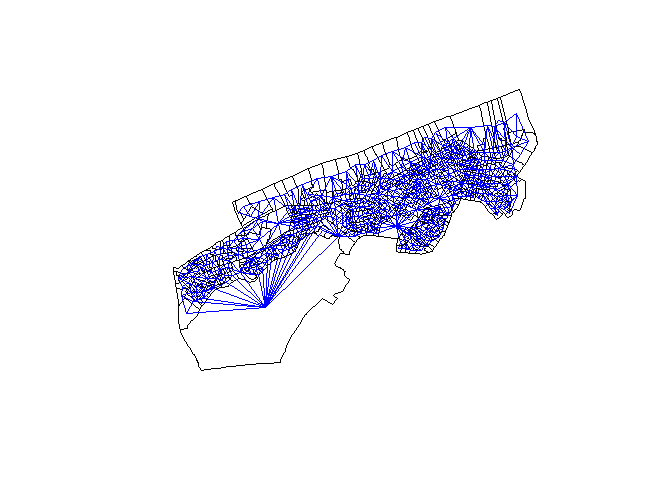<!-- -->

```r
# ggsave(paste0(here::here(),"/output/output_img/queens-case_neighborhood_relationships_rgph_2013.pdf"), width = 8, height = 5)

dfw_coords <- MPI_data_dr_2002 %>%
  st_centroid() %>%
  st_coordinates()

plot(MPI_data_dr_2002$geometry)
plot(neighbors_2002, 
     coords = dfw_coords, 
     add = TRUE, 
     col = "blue", 
     points = FALSE,
     main = "Visualization of queens-case neighborhood relationships")
```

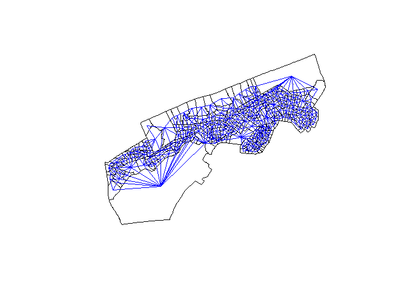<!-- -->


```r
#Generating the spatial weights matrix
weights_2013 <- nb2listw(neighbors_2013, style = "W")
weights_2002 <- nb2listw(neighbors_2002, style = "W")
```

# Global and local spatial autocorrelation

## Spatial lags and Moran’s I


```r
MPI_data_dr_2013$lag_MPI_men <- lag.listw(weights_2013, MPI_data_dr_2013$MPI_men)
MPI_data_dr_2002$lag_MPI_men <- lag.listw(weights_2002, MPI_data_dr_2002$MPI_men)
```


```r
ggplot(MPI_data_dr_2013, aes(x = MPI_men, y = lag_MPI_men)) + 
  geom_point(alpha = 0.3) + 
  geom_abline(color = "red") + 
  theme_minimal() + 
  labs(title = " Scatterplot of MPI relative to its spatial lag for Guediawaye census 2013",
       x = "MPI",
       y = "Spatial lag, MPI", 
       caption = "")
```

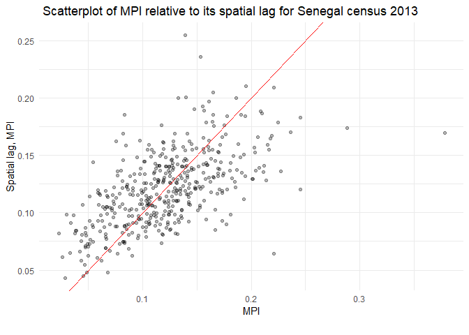<!-- -->

```r
ggsave(paste0(here::here(),"/output/output_img/mpi_spatialLag_rgph_2013.pdf"), width = 8, height = 5)

ggplot(MPI_data_dr_2002, aes(x = MPI_men, y = lag_MPI_men)) + 
  geom_point(alpha = 0.3) + 
  geom_abline(color = "red") + 
  theme_minimal() + 
  labs(title = " Scatterplot of MPI relative to its spatial lag for Guediawaye census 2002",
       x = "MPI",
       y = "Spatial lag, MPI", 
       caption = "")
```

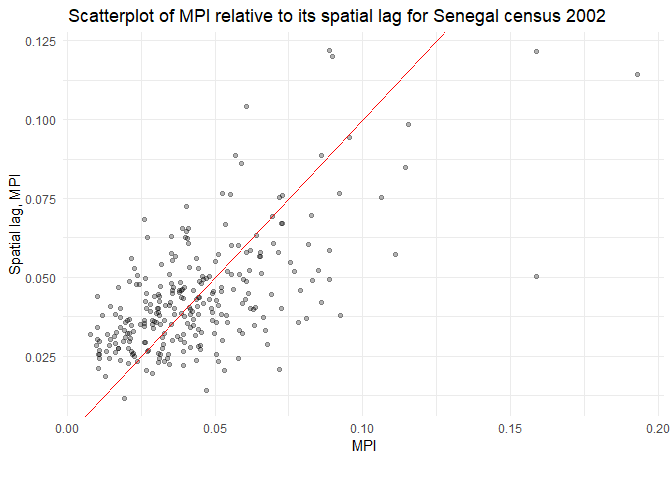<!-- -->

```r
ggsave(paste0(here::here(),"/output/output_img/mpi_spatialLag_rgph_2002.pdf"), width = 8, height = 5)
```

```r
moran.test(MPI_data_dr_2013$MPI_men, weights_2013)
```

```
## 
## 	Moran I test under randomisation
## 
## data:  MPI_data_dr_2013$MPI_men  
## weights: weights_2013    
## 
## Moran I statistic standard deviate = 14.667, p-value < 2.2e-16
## alternative hypothesis: greater
## sample estimates:
## Moran I statistic       Expectation          Variance 
##      0.4172763735     -0.0023041475      0.0008183715
```

```r
moran.test(MPI_data_dr_2002$MPI_men, weights_2002)
```

```
## 
## 	Moran I test under randomisation
## 
## data:  MPI_data_dr_2002$MPI_men  
## weights: weights_2002    
## 
## Moran I statistic standard deviate = 8.5843, p-value < 2.2e-16
## alternative hypothesis: greater
## sample estimates:
## Moran I statistic       Expectation          Variance 
##       0.311619557      -0.003745318       0.001349626
```


## Local spatial autocorrelation

We can explore this further with local spatial autocorrelation analysis. Local measures of spatial autocorrelation disaggregate global results to identify “hot spots” of similar values within a given spatial dataset. One such example is the Getis-Ord local G statistic (Getis and Ord 1992), which is computed as follows:


$$
G_i = \frac{\sum_j{w_{ij}x_j}}{\sum_{j=1}^nx_j} 
$$


Given that the returned results are z-scores, an analyst can choose hot spot thresholds in the statistic, calculate them with case_when(), then plot them accordingly.


```r
# For Gi*, re-compute the weights with `include.self()`
localg_weights_2013 <- nb2listw(include.self(neighbors_2013))
MPI_data_dr_2013$localG <- localG(MPI_data_dr_2013$MPI_men, localg_weights_2013)
MPI_data_dr_2013$localG <- as.numeric(MPI_data_dr_2013$localG)
#
localg_weights_2002 <- nb2listw(include.self(neighbors_2002))
MPI_data_dr_2002$localG <- localG(MPI_data_dr_2002$MPI_men, localg_weights_2002)
MPI_data_dr_2002$localG <- as.numeric(MPI_data_dr_2002$localG)
```


```r
ggplot(MPI_data_dr_2013) + 
  geom_sf(aes(fill = localG), color = NA) + 
  scale_fill_distiller(palette = "RdYlBu") + 
  theme_void() + 
  labs(fill = "Local Gi* statistic") +
labs(title = "Map of local Gi* scores for Guediawaye Census 2013")
```

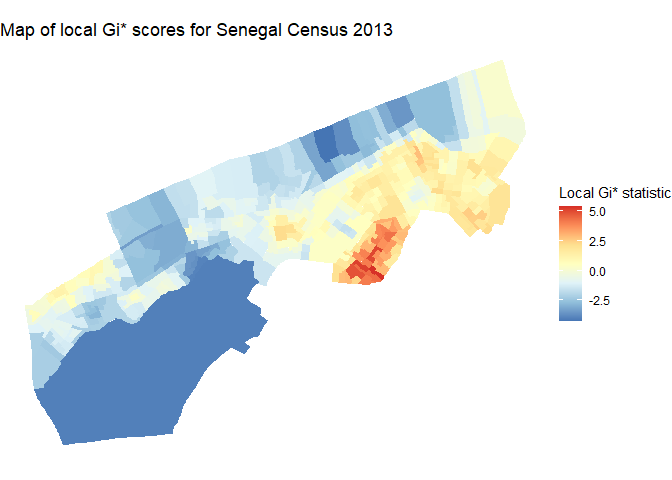<!-- -->

```r
ggsave(paste0(here::here(),"/output/output_img/localgi_rgph_2013.pdf"), width = 8, height = 5)

#
ggplot(MPI_data_dr_2002) + 
  geom_sf(aes(fill = localG), color = NA) + 
  scale_fill_distiller(palette = "RdYlBu") + 
  theme_void() + 
  labs(fill = "Local Gi* statistic") +
labs(title = "Map of local Gi* scores for Guediawaye Census 2002")
```

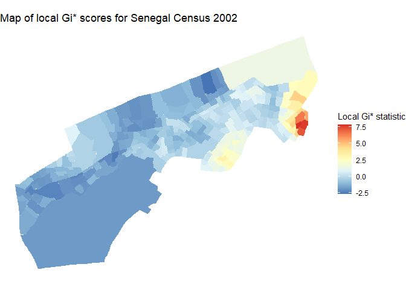<!-- -->

```r
ggsave(paste0(here::here(),"/output/output_img/localgi_rgph_2002.pdf"), width = 8, height = 5)
```

Given that the returned results are z-scores, an analyst can choose hot spot thresholds in the statistic, calculate them with case_when(), then plot them accordingly.


```r
MPI_data_dr_2013 <- MPI_data_dr_2013 %>%
  mutate(hotspot = case_when(
    localG >= 2.576 ~ "High cluster",
    localG <= -2.576 ~ "Low cluster",
    TRUE ~ "Not significant"
  ))

ggplot(MPI_data_dr_2013) + 
  geom_sf(aes(fill = hotspot), color = "grey90", size = 0.1) + 
  scale_fill_manual(values = c("red", "blue", "grey")) + 
  theme_void() +
labs(title = "Map of local Gi* scores with significant clusters highlighted for Guediawaye Census 2013")
```

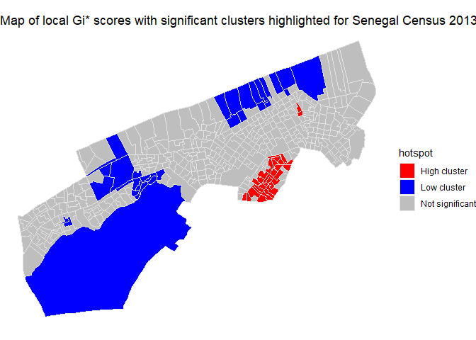<!-- -->

```r
ggsave(paste0(here::here(),"/output/output_img/localgicluster_rgph_2013.pdf"), width = 8, height = 5)
###
MPI_data_dr_2002 <- MPI_data_dr_2002 %>%
  mutate(hotspot = case_when(
    localG >= 2.576 ~ "High cluster",
    localG <= -2.576 ~ "Low cluster",
    TRUE ~ "Not significant"
  ))

ggplot(MPI_data_dr_2002) + 
  geom_sf(aes(fill = hotspot), color = "grey90", size = 0.1) + 
  scale_fill_manual(values = c("red", "blue", "grey")) + 
  theme_void() +
labs(title = "Map of local Gi* scores with significant clusters highlighted for Guediawaye Census 2002")
```

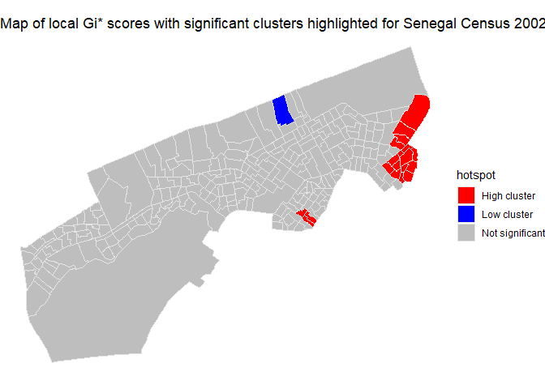<!-- -->

```r
ggsave(paste0(here::here(),"/output/output_img/localgicluster_rgph_2002.pdf"), width = 8, height = 5)
```

## Identifying clusters and spatial outliers with local indicators of spatial association (LISA)


```r
set.seed(1994)

MPI_data_dr_2013$scaled_MPI_men <- as.numeric(scale(MPI_data_dr_2013$MPI_men))
MPI_data_dr_2002$scaled_MPI_men <- as.numeric(scale(MPI_data_dr_2002$MPI_men))

dfw_lisa_2013 <- localmoran_perm(
  MPI_data_dr_2013$scaled_MPI_men, 
  weights_2013, 
  nsim = 999L, 
  alternative = "two.sided"
) %>%
  as_tibble() %>%
  set_names(c("local_i", "exp_i", "var_i", "z_i", "p_i",
              "p_i_sim", "pi_sim_folded", "skewness", "kurtosis"))

dfw_lisa_2013_df <- MPI_data_dr_2013 %>%
  select(id_dr, scaled_MPI_men) %>%
  mutate(lagged_estimate = lag.listw(weights_2013, scaled_MPI_men)) %>%
  bind_cols(dfw_lisa_2013)

##
dfw_lisa_2002 <- localmoran_perm(
  MPI_data_dr_2002$scaled_MPI_men, 
  weights_2002, 
  nsim = 999L, 
  alternative = "two.sided"
) %>%
  as_tibble() %>%
  set_names(c("local_i", "exp_i", "var_i", "z_i", "p_i",
              "p_i_sim", "pi_sim_folded", "skewness", "kurtosis"))

dfw_lisa_2002_df <- MPI_data_dr_2002 %>%
  select(id_dr, scaled_MPI_men) %>%
  mutate(lagged_estimate = lag.listw(weights_2002, scaled_MPI_men)) %>%
  bind_cols(dfw_lisa_2002)
```

The above code uses the following steps:

First, a random number seed is set given that we are using the conditional permutation approach to calculating statistical significance. This will ensure reproducibility of results when the process is re-run.
The ACS estimate for median age is converted to a z-score using scale(), which subtracts the mean from the estimate then divides by its standard deviation. This follows convention from GeoDa.
LISA is computed with localmoran_perm() for the scaled value for median age, using the contiguity-based spatial weights matrix. 999 conditional permutation simulations are used to calculate statistical significance, and the argument alternative = "two.sided" will identify both statistically significant clusters and statistically significant spatial outliers.
The LISA data frame is attached to the Census tract shapes after computing the lagged value for median age.


```r
dfw_lisa_2013_clusters <- dfw_lisa_2013_df %>%
  mutate(lisa_cluster = case_when(
    p_i >= 0.05 ~ "Not significant",
    scaled_MPI_men > 0 & local_i > 0 ~ "High-high",
    scaled_MPI_men > 0 & local_i < 0 ~ "High-low",
    scaled_MPI_men < 0 & local_i > 0 ~ "Low-low",
    scaled_MPI_men < 0 & local_i < 0 ~ "Low-high"
  ))


##
dfw_lisa_2002_clusters <- dfw_lisa_2002_df %>%
  mutate(lisa_cluster = case_when(
    p_i >= 0.05 ~ "Not significant",
    scaled_MPI_men > 0 & local_i > 0 ~ "High-high",
    scaled_MPI_men > 0 & local_i < 0 ~ "High-low",
    scaled_MPI_men < 0 & local_i > 0 ~ "Low-low",
    scaled_MPI_men < 0 & local_i < 0 ~ "Low-high"
  ))
```

The LISA quadrant plot then appears as follow:


```r
color_values <- c(`High-high` = "red", 
                  `High-low` = "pink", 
                  `Low-low` = "blue", 
                  `Low-high` = "lightblue", 
                  `Not significant` = "white")

ggplot(dfw_lisa_2013_clusters, aes(x = scaled_MPI_men, 
                              y = lagged_estimate,
                              fill = lisa_cluster)) + 
  geom_point(color = "black", shape = 21, size = 2) + 
  theme_minimal() + 
  geom_hline(yintercept = 0, linetype = "dashed") + 
  geom_vline(xintercept = 0, linetype = "dashed") + 
  scale_fill_manual(values = color_values) + 
  labs(x = "MPI (z-score)",
       y = "Spatial lag of MPI (z-score)",
       fill = "Cluster type") + 
  labs(title = "LISA quadrant scatterplot for Guediawaye Census 2013")
```

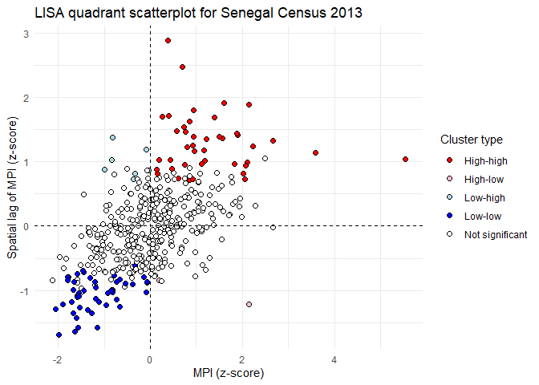<!-- -->

```r
ggsave(paste0(here::here(),"/output/output_img/lisaquadrant_rgph_2013.pdf"), width = 8, height = 5)

##
ggplot(dfw_lisa_2002_clusters, aes(x = scaled_MPI_men, 
                                   y = lagged_estimate,
                                   fill = lisa_cluster)) + 
  geom_point(color = "black", shape = 21, size = 2) + 
  theme_minimal() + 
  geom_hline(yintercept = 0, linetype = "dashed") + 
  geom_vline(xintercept = 0, linetype = "dashed") + 
  scale_fill_manual(values = color_values) + 
  labs(x = "MPI (z-score)",
       y = "Spatial lag of MPI (z-score)",
       fill = "Cluster type") + 
  labs(title = "LISA quadrant scatterplot for Guediawaye Census 2002")
```

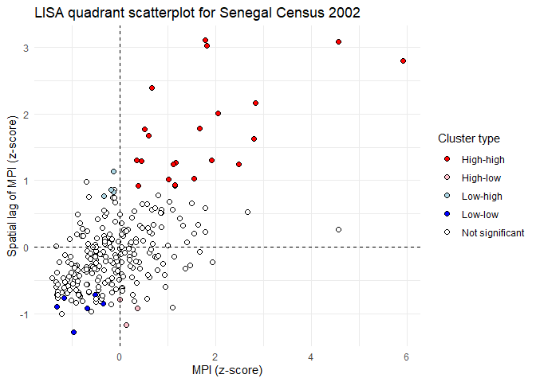<!-- -->

```r
ggsave(paste0(here::here(),"/output/output_img/lisaquadrant_rgph_2002.pdf"), width = 8, height = 5)
```


```r
ggplot(dfw_lisa_2013_clusters, aes(fill = lisa_cluster)) + 
  labs(title = " LISA cluster map for Guediawaye Census 2013") +
  geom_sf(size = 0.1) + 
  theme_void() + 
  scale_fill_manual(values = color_values) + 
  labs(fill = "Cluster type")
```

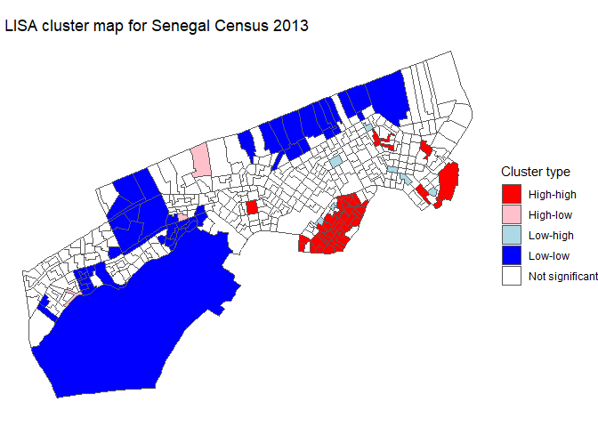<!-- -->

```r
ggsave(paste0(here::here(),"/output/output_img/lisacluster_rgph_2013.pdf"), width = 8, height = 5)

###
ggplot(dfw_lisa_2002_clusters, aes(fill = lisa_cluster)) + 
  labs(title = " LISA cluster map for Guediawaye Census 2002") +
  geom_sf(size = 0.1) + 
  theme_void() + 
  scale_fill_manual(values = color_values) + 
  labs(fill = "Cluster type")
```

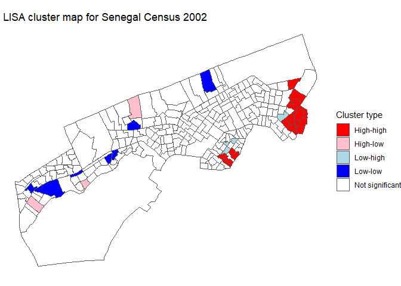<!-- -->

```r
ggsave(paste0(here::here(),"/output/output_img/lisacluster_rgph_2002.pdf"), width = 8, height = 5)
```

