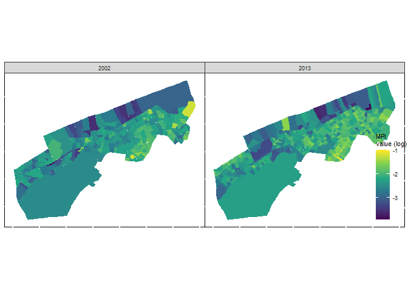

```r
rm(list=ls())
```

## Importing library


```r
## Importing library
### List of required packages
required_packages <- c("tidyverse","janitor" ,"readr","dplyr","haven","sf", "flextable","sp", "factoextra", "FactoMineR","gtsummary", "sjPlot", "fastDummies","ggthemes","spdep","patchwork")

# Check if packages are installed
missing_packages <- setdiff(required_packages, installed.packages()[,"Package"])

### Install missing packages
if (length(missing_packages) > 0) {
  install.packages(missing_packages)
}

### Load all packages
lapply(required_packages, library, character.only = TRUE)
```


```r
# Read shapefile data for 2002 and 2002


MPI_data_dr_2002 <- sf::read_sf(paste0(here::here(),"/output/output_data/MPI_data_dr_2002.shp"))
MPI_data_dr_2013 <- sf::read_sf(paste0(here::here(),"/output/output_data/MPI_data_dr_2013.shp"))
```


# Regression modeling with Senegal Census data


```r
#"nb_indv",
predictors = c("nbr_mng","nbr_dc_p","nbr_dc_m","nbr_dc_sc","nbr_dc_sp","mdn_cm_","mn_cm_g","nbr_cm_h","nbr_cm_f","pct_cm_")
outcome = "MPI_ndx"
```

## Inspecting the outcome variable (MPI) with visualization


```r
mhv_map <- ggplot(MPI_data_dr_2013, aes(fill = MPI_ndx)) + 
  geom_sf(color = NA) + 
  scale_fill_viridis_c() + 
  theme_void() + 
  labs(fill = "MPI ")

mhv_histogram <- ggplot(MPI_data_dr_2013, aes(x = MPI_ndx)) + 
  geom_histogram(alpha = 0.5, fill = "navy", color = "navy",
                 bins = 100) + 
  theme_minimal() + 
  scale_x_continuous(labels = scales::label_number_si(accuracy = 0.1)) + 
  labs(x = "MPI")

mhv_map + mhv_histogram + labs(title = "MPI value charts for Senegal Census 2002")
```

<!-- -->


```r
mhv_map_log <- ggplot(MPI_data_dr_2013, aes(fill = log(MPI_ndx))) + 
  geom_sf(color = NA) + 
  scale_fill_viridis_c() + 
  theme_void() + 
  labs(fill = "MPI\nvalue (log)")

mhv_histogram_log <- ggplot(MPI_data_dr_2013, aes(x = log(MPI_ndx))) + 
  geom_histogram(alpha = 0.5, fill = "navy", color = "navy",
                 bins = 100) + 
  theme_minimal() + 
  scale_x_continuous() + 
  labs(x = "MPI (log)")

mhv_map_log + mhv_histogram_log + labs(title = "Logged MPI value charts for Senegal Census 2002")
```

<!-- -->

## A first regression model


```r
library(sf)
library(units)
predictors = c("nbr_mng","nbr_dc_p","nbr_dc_m","nbr_dc_sc","nbr_dc_sp","mn_cm_g","pct_cm_","nb_indv")
outcome = "MPI_ndx"
MPI_data_dr_2013_for_model<- MPI_data_dr_2013 %>%
  dplyr::select(MPI_ndx,predictors) %>% 
  mutate(pop_density = as.numeric(set_units(nb_indv / st_area(.), "1/km2"))) %>% 
  dplyr::select(-nb_indv)
```


```r
formula <- "log(MPI_ndx) ~ nbr_mng + nbr_dc_p + nbr_dc_m + nbr_dc_sc + nbr_dc_sp + mn_cm_g + pct_cm_ + pop_density "

model1 <- lm(formula = formula, data = MPI_data_dr_2013_for_model)

summary(model1)
```

```
## 
## Call:
## lm(formula = formula, data = MPI_data_dr_2013_for_model)
## 
## Residuals:
##      Min       1Q   Median       3Q      Max 
## -1.25739 -0.15703  0.01659  0.16114  1.04399 
## 
## Coefficients:
##               Estimate Std. Error t value Pr(>|t|)    
## (Intercept) -8.384e-01  2.339e-01  -3.584 0.000377 ***
## nbr_mng      7.733e-03  7.553e-04  10.238  < 2e-16 ***
## nbr_dc_p    -9.840e-03  1.992e-03  -4.939 1.13e-06 ***
## nbr_dc_m    -2.005e-02  2.772e-03  -7.232 2.22e-12 ***
## nbr_dc_sc   -1.396e-02  2.812e-03  -4.963 1.01e-06 ***
## nbr_dc_sp   -1.549e-02  1.587e-03  -9.757  < 2e-16 ***
## mn_cm_g     -3.719e-02  4.190e-03  -8.877  < 2e-16 ***
## pct_cm_      6.054e-01  1.565e-01   3.869 0.000126 ***
## pop_density  1.575e-06  8.175e-07   1.926 0.054765 .  
## ---
## Signif. codes:  0 '***' 0.001 '**' 0.01 '*' 0.05 '.' 0.1 ' ' 1
## 
## Residual standard error: 0.2692 on 426 degrees of freedom
## Multiple R-squared:  0.6061,	Adjusted R-squared:  0.5987 
## F-statistic: 81.93 on 8 and 426 DF,  p-value: < 2.2e-16
```

```r
library(corrr)

dfw_estimates <- MPI_data_dr_2013_for_model%>%
  select(-MPI_ndx) %>%
  st_drop_geometry()

correlations <- correlate(dfw_estimates, method = "pearson")
network_plot(correlations) + labs(title = "Network plot of correlations between model predictors for Senegal Census 2002")
```

<!-- -->


```r
library(car)

vif(model1)
```

```
##     nbr_mng    nbr_dc_p    nbr_dc_m   nbr_dc_sc   nbr_dc_sp     mn_cm_g 
##    3.555007    2.381862    2.434817    2.639560    2.186414    1.097728 
##     pct_cm_ pop_density 
##    1.079553    1.258178
```

## Dimension reduction with principal components analysis


```r
pca <- prcomp(
  formula = ~., 
  data = dfw_estimates, 
  scale. = TRUE, 
  center = TRUE
)

summary(pca)
```

```
## Importance of components:
##                           PC1    PC2    PC3    PC4     PC5     PC6    PC7
## Standard deviation     1.7393 1.2937 1.0202 0.9148 0.78444 0.58939 0.5261
## Proportion of Variance 0.3781 0.2092 0.1301 0.1046 0.07692 0.04342 0.0346
## Cumulative Proportion  0.3781 0.5874 0.7175 0.8220 0.89897 0.94239 0.9770
##                            PC8
## Standard deviation     0.42903
## Proportion of Variance 0.02301
## Cumulative Proportion  1.00000
```

```r
pca_tibble <- pca$rotation %>%
  as_tibble(rownames = "predictor")
pca_tibble
```

```
## # A tibble: 8 × 9
##   predictor      PC1     PC2      PC3     PC4      PC5     PC6      PC7      PC8
##   <chr>        <dbl>   <dbl>    <dbl>   <dbl>    <dbl>   <dbl>    <dbl>    <dbl>
## 1 nbr_mng     0.468   0.344   7.98e-4 -0.106   8.97e-4 -0.231   0.0192   0.773  
## 2 nbr_dc_p    0.252   0.586  -5.06e-2 -0.280  -3.62e-1 -0.290   0.0705  -0.540  
## 3 nbr_dc_m    0.499   0.0175 -3.74e-2 -0.0967 -4.11e-2  0.692  -0.500   -0.104  
## 4 nbr_dc_sc   0.488  -0.196  -6.42e-3  0.0450  2.07e-1  0.212   0.780   -0.158  
## 5 nbr_dc_sp   0.428  -0.289  -2.65e-2  0.213   4.24e-1 -0.552  -0.368   -0.258  
## 6 mn_cm_g     0.0145 -0.436   2.37e-1 -0.859  -2.17e-2 -0.119  -0.0223   0.0322 
## 7 pct_cm_     0.145  -0.120   8.37e-1  0.311  -4.07e-1 -0.0468 -0.0122  -0.00608
## 8 pop_densi… -0.162   0.459   4.89e-1 -0.140   6.92e-1  0.134  -0.00901 -0.0864
```


```r
pca_tibble %>%
  select(predictor:PC5) %>%
  pivot_longer(PC1:PC5, names_to = "component", values_to = "value") %>%
  ggplot(aes(x = value, y = predictor)) + 
  geom_col(fill = "darkgreen", color = "darkgreen", alpha = 0.5) + 
  facet_wrap(~component, nrow = 1) + 
  labs(y = NULL, x = "Value", title = " Loadings for first five principal components  for Senegal Census 2002") + 
  theme_minimal()
```

<!-- -->


```r
components <- predict(pca, dfw_estimates)

dfw_pca <- MPI_data_dr_2013_for_model%>%
  select(MPI_ndx) %>%
  cbind(components) 

ggplot(dfw_pca, aes(fill = PC1)) +
  geom_sf(color = NA) +
  labs(title = "Map of principal component 1 for Senegal Census 2002") +
  theme_void() +
  scale_fill_viridis_c()
```

<!-- -->


```r
pca_formula <- paste0("log(MPI_ndx) ~ ", 
                      paste0('PC', 1:6, collapse = ' + '))

pca_model <- lm(formula = pca_formula, data = dfw_pca)

summary(pca_model)
```

```
## 
## Call:
## lm(formula = pca_formula, data = dfw_pca)
## 
## Residuals:
##      Min       1Q   Median       3Q      Max 
## -1.41657 -0.17138  0.02118  0.18770  1.31306 
## 
## Coefficients:
##              Estimate Std. Error  t value Pr(>|t|)    
## (Intercept) -2.191601   0.014555 -150.578  < 2e-16 ***
## PC1         -0.110044   0.008378  -13.135  < 2e-16 ***
## PC2          0.158967   0.011264   14.113  < 2e-16 ***
## PC3          0.044954   0.014283    3.147  0.00176 ** 
## PC4          0.086249   0.015929    5.415 1.03e-07 ***
## PC5         -0.058104   0.018576   -3.128  0.00188 ** 
## PC6         -0.033497   0.024723   -1.355  0.17617    
## ---
## Signif. codes:  0 '***' 0.001 '**' 0.01 '*' 0.05 '.' 0.1 ' ' 1
## 
## Residual standard error: 0.3036 on 428 degrees of freedom
## Multiple R-squared:  0.4968,	Adjusted R-squared:  0.4898 
## F-statistic: 70.43 on 6 and 428 DF,  p-value: < 2.2e-16
```

## Spatial regression


```r
MPI_data_dr_2013_for_model$residuals <- residuals(model1)

ggplot(MPI_data_dr_2013_for_model, aes(x = residuals)) + 
  geom_histogram(bins = 100, alpha = 0.5, color = "navy",
                 fill = "navy") + 
  labs(title = "Distribution of model residuals for Senegal Census 2002") +
  theme_minimal()
```

<!-- -->


```r
library(spdep)

wts <- MPI_data_dr_2013_for_model %>%
  poly2nb() %>%
  nb2listw()

moran.test(MPI_data_dr_2013_for_model$residuals, wts)
```

```
## 
## 	Moran I test under randomisation
## 
## data:  MPI_data_dr_2013_for_model$residuals  
## weights: wts    
## 
## Moran I statistic standard deviate = 5.0381, p-value = 2.351e-07
## alternative hypothesis: greater
## sample estimates:
## Moran I statistic       Expectation          Variance 
##      0.1417648099     -0.0023041475      0.0008177211
```


```r
MPI_data_dr_2013_for_model$lagged_residuals <- lag.listw(wts, MPI_data_dr_2013_for_model$residuals)

ggplot(MPI_data_dr_2013_for_model, aes(x = residuals, y = lagged_residuals)) + 
  theme_minimal() + 
  labs(title = "Moran scatterplot of residual spatial autocorrelation for Senegal Census 2002") +
  geom_point(alpha = 0.5) + 
  geom_smooth(method = "lm", color = "red")
```

<!-- -->

# Geographically weighted regression

## Choosing a bandwidth for GWR


```r
library(GWmodel)
library(sf)

dfw_data_sp <- MPI_data_dr_2013_for_model%>%
  as_Spatial()

bw <- bw.gwr(
  formula = formula, 
  data = dfw_data_sp, 
  kernel = "bisquare",
  adaptive = TRUE
)
```

```
## Adaptive bandwidth: 276 CV score: 30.72873 
## Adaptive bandwidth: 179 CV score: 30.5402 
## Adaptive bandwidth: 117 CV score: 31.56878 
## Adaptive bandwidth: 215 CV score: 30.53929 
## Adaptive bandwidth: 240 CV score: 30.59468 
## Adaptive bandwidth: 202 CV score: 30.50807 
## Adaptive bandwidth: 191 CV score: 30.50642 
## Adaptive bandwidth: 187 CV score: 30.51038 
## Adaptive bandwidth: 196 CV score: 30.50472 
## Adaptive bandwidth: 196 CV score: 30.50472
```

```r
gw_model <- gwr.basic(
  formula = formula, 
  data = dfw_data_sp, 
  bw = bw,
  kernel = "bisquare",
  adaptive = TRUE
)
```


```r
names(gw_model)
```

```
## [1] "GW.arguments"  "GW.diagnostic" "lm"            "SDF"          
## [5] "timings"       "this.call"     "Ftests"
```


```r
gw_model_results <- gw_model$SDF %>%
  st_as_sf() 

names(gw_model_results)
```

```
##  [1] "Intercept"      "nbr_mng"        "nbr_dc_p"       "nbr_dc_m"      
##  [5] "nbr_dc_sc"      "nbr_dc_sp"      "mn_cm_g"        "pct_cm_"       
##  [9] "pop_density"    "y"              "yhat"           "residual"      
## [13] "CV_Score"       "Stud_residual"  "Intercept_SE"   "nbr_mng_SE"    
## [17] "nbr_dc_p_SE"    "nbr_dc_m_SE"    "nbr_dc_sc_SE"   "nbr_dc_sp_SE"  
## [21] "mn_cm_g_SE"     "pct_cm__SE"     "pop_density_SE" "Intercept_TV"  
## [25] "nbr_mng_TV"     "nbr_dc_p_TV"    "nbr_dc_m_TV"    "nbr_dc_sc_TV"  
## [29] "nbr_dc_sp_TV"   "mn_cm_g_TV"     "pct_cm__TV"     "pop_density_TV"
## [33] "Local_R2"       "geometry"
```


```r
ggplot(gw_model_results, aes(fill = Local_R2)) + 
  geom_sf(color = NA) + 
  scale_fill_viridis_c() + 
  labs(title = "Local R-squared values from the GWR model for Senegal Census 2002") +
  theme_void()
```

<!-- -->

```r
ggplot(gw_model_results, aes(fill = nbr_mng)) + 
  geom_sf(color = NA) + 
  scale_fill_viridis_c() + 
  labs(title = "Local parameter estimates for household members for Senegal Census 2002") +
  theme_void() + 
  labs(fill = "Local β for \nHH")
```

<!-- -->

```r
ggplot(gw_model_results, aes(fill = pop_density)) + 
  geom_sf(color = NA) + 
  scale_fill_viridis_c() + 
  labs(title = "Local parameter estimates for population density for Senegal Census 2002") +
  theme_void() + 
  labs(fill = "Local β for \npopulation density")
```

<!-- -->

# Classification and clustering of Senegal census data

## Geodemographic classification


```r
set.seed(1983)

dfw_kmeans <- dfw_pca %>%
  st_drop_geometry() %>%
  select(PC1:PC8) %>%
  kmeans(centers = 6)

table(dfw_kmeans$cluster)
```

```
## 
##   1   2   3   4   5   6 
##  20  83 101  89  36 106
```


```r
dfw_clusters <- dfw_pca %>%
  mutate(cluster = as.character(dfw_kmeans$cluster))

ggplot(dfw_clusters, aes(fill = cluster)) + 
  geom_sf(size = 0.1) + 
  scale_fill_brewer(palette = "Set1") + 
  labs(title = "Map of geodemographic clusters for Senegal Census 2002") +
  theme_void() + 
  labs(fill = "Cluster ")
```

<!-- -->


```r
library(plotly)

cluster_plot <- ggplot(dfw_clusters, 
                       aes(x = PC1, y = PC2, color = cluster)) + 
  geom_point() + 
  scale_color_brewer(palette = "Set1") + 
  labs(title = "Interactive scatterplot of PC1 and PC2 colored by cluster for Senegal Census 2002") +
  theme_minimal()

ggplotly(cluster_plot) %>%
  layout(legend = list(orientation = "h", y = -0.15, 
                       x = 0.2, title = "Cluster"))
```

```{=html}
<div class="plotly html-widget html-fill-item-overflow-hidden html-fill-item" id="htmlwidget-8bf54f6a22fc54e5bbce" style="width:672px;height:480px;"></div>
<script type="application/json" data-for="htmlwidget-8bf54f6a22fc54e5bbce">{"x":{"data":[{"x":[4.8996510961573083,3.9506908945184311,2.0098088015569302,3.3267116751968362,3.1331684022876964,4.8272994493706927,6.3575784525403209,3.3758164247744595,3.1709826951948248,4.3456594015632861,4.4817956509143286,3.0402315862308709,7.5442419460838837,5.5273406906784475,3.9479961834033142,2.7184920278334164,5.7448021912019325,5.3569212025466628,4.7891935131767767,6.0460667864753717],"y":[-1.9026293523967333,-2.185378873072136,-0.29585730439082991,0.73170175403512749,0.39349732914965618,1.0599092943504149,-0.055092363605813016,-0.42588816056933387,0.011442681601862459,-0.066400245813429848,-1.7472487912303978,0.39962597952491113,-2.4442800542387908,-2.6410837840297972,-3.1830376745224882,-0.95006651583134882,-2.0819855697493912,-0.66344637765689829,-1.1922198334716816,-2.7059250973037767],"text":["PC1:  4.899651096<br />PC2: -1.902629352<br />cluster: 1","PC1:  3.950690895<br />PC2: -2.185378873<br />cluster: 1","PC1:  2.009808802<br />PC2: -0.295857304<br />cluster: 1","PC1:  3.326711675<br />PC2:  0.731701754<br />cluster: 1","PC1:  3.133168402<br />PC2:  0.393497329<br />cluster: 1","PC1:  4.827299449<br />PC2:  1.059909294<br />cluster: 1","PC1:  6.357578453<br />PC2: -0.055092364<br />cluster: 1","PC1:  3.375816425<br />PC2: -0.425888161<br />cluster: 1","PC1:  3.170982695<br />PC2:  0.011442682<br />cluster: 1","PC1:  4.345659402<br />PC2: -0.066400246<br />cluster: 1","PC1:  4.481795651<br />PC2: -1.747248791<br />cluster: 1","PC1:  3.040231586<br />PC2:  0.399625980<br />cluster: 1","PC1:  7.544241946<br />PC2: -2.444280054<br />cluster: 1","PC1:  5.527340691<br />PC2: -2.641083784<br />cluster: 1","PC1:  3.947996183<br />PC2: -3.183037675<br />cluster: 1","PC1:  2.718492028<br />PC2: -0.950066516<br />cluster: 1","PC1:  5.744802191<br />PC2: -2.081985570<br />cluster: 1","PC1:  5.356921203<br />PC2: -0.663446378<br />cluster: 1","PC1:  4.789193513<br />PC2: -1.192219833<br />cluster: 1","PC1:  6.046066786<br />PC2: -2.705925097<br />cluster: 1"],"type":"scatter","mode":"markers","marker":{"autocolorscale":false,"color":"rgba(228,26,28,1)","opacity":1,"size":5.6692913385826778,"symbol":"circle","line":{"width":1.8897637795275593,"color":"rgba(228,26,28,1)"}},"hoveron":"points","name":"1","legendgroup":"1","showlegend":true,"xaxis":"x","yaxis":"y","hoverinfo":"text","frame":null},{"x":[0.63613740301053556,0.31094598025091946,0.53333595711553206,-0.51826522585274692,-1.6227338965835201,-1.4853610028062725,-0.42193974501047882,0.017236707658229988,-0.7216723499310882,0.078517627911683749,0.14085733028908681,-0.74642746934045157,-0.57310910241976876,-0.92093514827582224,-0.30528173379829776,-0.49804425056115459,0.0033407798969399549,0.47861213286752735,-1.0895568414928394,-1.1253933391148132,-0.96961043927043855,-1.3982656305535248,-0.86622184770290367,-0.39063191738863179,0.22646698013857092,-0.28366398202672366,-0.85617491341427576,-0.9523761201559271,-1.9875496899722647,-0.54058666256056498,-1.4415038260382769,-1.8550781964098053,-0.54336086021221253,-1.6871445452173939,-0.76791380347496585,-1.2611810770342053,-1.7737391174108028,-1.737250472988267,-1.3416245117563412,-1.7630586650829385,-1.1465029136818885,-1.5488767543588324,-0.37053909962940629,-1.5192183288221408,-1.0049134951000367,-0.63847883859459098,-1.3210883604533419,-1.7226115798532478,-1.9708987318449718,-2.4230054121229587,-1.8774372587760653,-0.32541610264042808,-0.86534603068191718,-0.63179660790730696,-1.2455358266162175,-0.78780761068206795,-1.5359958675043606,-2.8846767335401058,-0.15148744479872656,-0.46506608242568492,-2.0493688910712464,0.0021368695319749012,-0.05219801481227393,-1.0255823462184672,-0.84711971952050147,-0.86006178112995257,-2.1438732303634396,-1.300890019804497,-2.1144341050012545,-0.41448528156482778,-2.0338074670505781,-1.2354560605749365,-1.2493401231013268,-0.19437370870188214,0.3151690824572958,-0.86711395112281409,-0.58518785020005926,-0.64106098438390957,-3.1842330249701538,-2.090239351794827,-2.0604833712459136,-1.5064660838771613,-2.0531513302113522],"y":[-1.4457709921054502,-1.2705160866589715,-0.31844770144440804,0.24839756898921139,0.098512792676663158,0.47439374957613434,0.0074603632717311352,-0.93184086940400901,-1.5644436288915819,1.7945139678154716,0.17825906006394665,0.03164316979515501,-0.66146215593742863,-0.44460548965491448,-0.48468537331064354,0.16466187832739987,-0.64921977905264339,-0.58323963021845504,0.066470782069983386,-0.070848344404148722,0.35721097476270525,0.25822813198584715,-0.0089506291266455706,0.91546145100335408,0.62747019365691914,-0.62189863957877101,0.50230188754902994,0.13056634453661548,0.10903936797250646,0.58333971901538995,0.34831856054240484,0.29890246844409574,0.54147373387301778,0.07556624187239401,0.091969811024435133,-0.021310966162115086,0.97477146846691409,0.45925524000821311,-0.57677395568866241,0.1562188080630954,0.9480554525898639,-0.46340511145620739,-0.066463568673225004,1.2874227155577711,0.71869998646807587,1.6197789573662249,0.90126888036336417,0.49725485360360705,-0.60208783035804492,-1.556925164571568,0.42903775484688211,1.3078328901059362,0.45116437824975897,0.54400724810860723,1.0901933088687659,0.50449710303937501,0.40725577047186146,0.64899925537791392,-0.36004355443696812,1.7919561796013406,-0.98326057642095233,0.84928643524517633,-0.14642701639224254,-0.44341845448388972,1.9579089749713998,0.56596961373382626,-0.78181907565844955,0.11045323762765594,0.20653885789077314,0.52248799869383011,-0.41574286943201127,-0.20111148188462269,-0.16098909171680445,-1.3568977448494293,0.098362181092517487,-0.30133974576464811,1.8911620563044567,1.7369855350284673,-0.48886664349278025,0.82500411338565782,-0.084469179263728267,0.21704530587202392,1.3349073287657336],"text":["PC1:  0.636137403<br />PC2: -1.445770992<br />cluster: 2","PC1:  0.310945980<br />PC2: -1.270516087<br />cluster: 2","PC1:  0.533335957<br />PC2: -0.318447701<br />cluster: 2","PC1: -0.518265226<br />PC2:  0.248397569<br />cluster: 2","PC1: -1.622733897<br />PC2:  0.098512793<br />cluster: 2","PC1: -1.485361003<br />PC2:  0.474393750<br />cluster: 2","PC1: -0.421939745<br />PC2:  0.007460363<br />cluster: 2","PC1:  0.017236708<br />PC2: -0.931840869<br />cluster: 2","PC1: -0.721672350<br />PC2: -1.564443629<br />cluster: 2","PC1:  0.078517628<br />PC2:  1.794513968<br />cluster: 2","PC1:  0.140857330<br />PC2:  0.178259060<br />cluster: 2","PC1: -0.746427469<br />PC2:  0.031643170<br />cluster: 2","PC1: -0.573109102<br />PC2: -0.661462156<br />cluster: 2","PC1: -0.920935148<br />PC2: -0.444605490<br />cluster: 2","PC1: -0.305281734<br />PC2: -0.484685373<br />cluster: 2","PC1: -0.498044251<br />PC2:  0.164661878<br />cluster: 2","PC1:  0.003340780<br />PC2: -0.649219779<br />cluster: 2","PC1:  0.478612133<br />PC2: -0.583239630<br />cluster: 2","PC1: -1.089556841<br />PC2:  0.066470782<br />cluster: 2","PC1: -1.125393339<br />PC2: -0.070848344<br />cluster: 2","PC1: -0.969610439<br />PC2:  0.357210975<br />cluster: 2","PC1: -1.398265631<br />PC2:  0.258228132<br />cluster: 2","PC1: -0.866221848<br />PC2: -0.008950629<br />cluster: 2","PC1: -0.390631917<br />PC2:  0.915461451<br />cluster: 2","PC1:  0.226466980<br />PC2:  0.627470194<br />cluster: 2","PC1: -0.283663982<br />PC2: -0.621898640<br />cluster: 2","PC1: -0.856174913<br />PC2:  0.502301888<br />cluster: 2","PC1: -0.952376120<br />PC2:  0.130566345<br />cluster: 2","PC1: -1.987549690<br />PC2:  0.109039368<br />cluster: 2","PC1: -0.540586663<br />PC2:  0.583339719<br />cluster: 2","PC1: -1.441503826<br />PC2:  0.348318561<br />cluster: 2","PC1: -1.855078196<br />PC2:  0.298902468<br />cluster: 2","PC1: -0.543360860<br />PC2:  0.541473734<br />cluster: 2","PC1: -1.687144545<br />PC2:  0.075566242<br />cluster: 2","PC1: -0.767913803<br />PC2:  0.091969811<br />cluster: 2","PC1: -1.261181077<br />PC2: -0.021310966<br />cluster: 2","PC1: -1.773739117<br />PC2:  0.974771468<br />cluster: 2","PC1: -1.737250473<br />PC2:  0.459255240<br />cluster: 2","PC1: -1.341624512<br />PC2: -0.576773956<br />cluster: 2","PC1: -1.763058665<br />PC2:  0.156218808<br />cluster: 2","PC1: -1.146502914<br />PC2:  0.948055453<br />cluster: 2","PC1: -1.548876754<br />PC2: -0.463405111<br />cluster: 2","PC1: -0.370539100<br />PC2: -0.066463569<br />cluster: 2","PC1: -1.519218329<br />PC2:  1.287422716<br />cluster: 2","PC1: -1.004913495<br />PC2:  0.718699986<br />cluster: 2","PC1: -0.638478839<br />PC2:  1.619778957<br />cluster: 2","PC1: -1.321088360<br />PC2:  0.901268880<br />cluster: 2","PC1: -1.722611580<br />PC2:  0.497254854<br />cluster: 2","PC1: -1.970898732<br />PC2: -0.602087830<br />cluster: 2","PC1: -2.423005412<br />PC2: -1.556925165<br />cluster: 2","PC1: -1.877437259<br />PC2:  0.429037755<br />cluster: 2","PC1: -0.325416103<br />PC2:  1.307832890<br />cluster: 2","PC1: -0.865346031<br />PC2:  0.451164378<br />cluster: 2","PC1: -0.631796608<br />PC2:  0.544007248<br />cluster: 2","PC1: -1.245535827<br />PC2:  1.090193309<br />cluster: 2","PC1: -0.787807611<br />PC2:  0.504497103<br />cluster: 2","PC1: -1.535995868<br />PC2:  0.407255770<br />cluster: 2","PC1: -2.884676734<br />PC2:  0.648999255<br />cluster: 2","PC1: -0.151487445<br />PC2: -0.360043554<br />cluster: 2","PC1: -0.465066082<br />PC2:  1.791956180<br />cluster: 2","PC1: -2.049368891<br />PC2: -0.983260576<br />cluster: 2","PC1:  0.002136870<br />PC2:  0.849286435<br />cluster: 2","PC1: -0.052198015<br />PC2: -0.146427016<br />cluster: 2","PC1: -1.025582346<br />PC2: -0.443418454<br />cluster: 2","PC1: -0.847119720<br />PC2:  1.957908975<br />cluster: 2","PC1: -0.860061781<br />PC2:  0.565969614<br />cluster: 2","PC1: -2.143873230<br />PC2: -0.781819076<br />cluster: 2","PC1: -1.300890020<br />PC2:  0.110453238<br />cluster: 2","PC1: -2.114434105<br />PC2:  0.206538858<br />cluster: 2","PC1: -0.414485282<br />PC2:  0.522487999<br />cluster: 2","PC1: -2.033807467<br />PC2: -0.415742869<br />cluster: 2","PC1: -1.235456061<br />PC2: -0.201111482<br />cluster: 2","PC1: -1.249340123<br />PC2: -0.160989092<br />cluster: 2","PC1: -0.194373709<br />PC2: -1.356897745<br />cluster: 2","PC1:  0.315169082<br />PC2:  0.098362181<br />cluster: 2","PC1: -0.867113951<br />PC2: -0.301339746<br />cluster: 2","PC1: -0.585187850<br />PC2:  1.891162056<br />cluster: 2","PC1: -0.641060984<br />PC2:  1.736985535<br />cluster: 2","PC1: -3.184233025<br />PC2: -0.488866643<br />cluster: 2","PC1: -2.090239352<br />PC2:  0.825004113<br />cluster: 2","PC1: -2.060483371<br />PC2: -0.084469179<br />cluster: 2","PC1: -1.506466084<br />PC2:  0.217045306<br />cluster: 2","PC1: -2.053151330<br />PC2:  1.334907329<br />cluster: 2"],"type":"scatter","mode":"markers","marker":{"autocolorscale":false,"color":"rgba(55,126,184,1)","opacity":1,"size":5.6692913385826778,"symbol":"circle","line":{"width":1.8897637795275593,"color":"rgba(55,126,184,1)"}},"hoveron":"points","name":"2","legendgroup":"2","showlegend":true,"xaxis":"x","yaxis":"y","hoverinfo":"text","frame":null},{"x":[-0.47017728205645859,1.2037975964233367,0.10852712939218781,0.080148757742699306,0.057863772981417032,0.2195186336418487,0.57593186681947461,-0.93533936808048335,-0.67359456863907308,-0.30610479602893947,-0.47788471384882314,0.81269621267521408,0.95930611830830925,0.45170880442297784,-1.1959808830381797,0.19683544726312222,0.31853409778847452,0.32288482718904343,-0.65195501196497541,-0.95774102370087,-1.1032145656271048,-1.5165984770539918,-0.0014601344600289612,0.96999743207120281,-0.28913032471514943,0.40022781804309482,-1.1802975209918329,0.65527466330318396,-0.20567333527088566,-1.5258355330370261,-0.30796095654038869,0.065984860738890844,-0.12732444614573371,0.13927020804025497,0.51200312928700975,-0.53741207168772154,0.15852925759262382,-0.19426724332239936,-0.49344789448414605,0.658620219564235,-0.4338193239632423,-1.0188949480745819,0.23799189193589079,-0.056650150939406452,-0.57402342543672114,0.035350396367807346,-0.49506409468770496,-0.7087297818260162,-0.064220454249639458,0.21264588162255135,-1.9449806317001233,-0.55589325130485356,-1.3672338878380921,-0.63704911639157302,-1.3332706604605902,-0.34301584823972225,-1.1587373111961792,-1.1073285201966157,-1.6072154765354147,0.19421922349264334,-0.60746075828635682,-0.98832646150078063,-0.53813515221373343,-0.63754057397457697,-0.44606947434045641,-0.55505103821340673,-1.3647660599206164,-0.77101023164559268,-0.91218078973680583,-0.0046327524427771383,-1.3660263740951977,-1.1493939669158348,-0.89976975325289743,-1.1794877907016124,-0.68681209969851187,-0.36181035021248853,-1.1728354457300367,-0.74644195937579105,-0.74160680436435833,-0.7361302427436559,-0.80941922695964241,-0.4814359079616104,-0.67496732504562196,-0.77735866555257127,-0.92748171138879543,-0.95818706861797043,-0.37268307727837036,-1.6259912969895123,-2.3649450641975025,-0.39547558881957606,-1.9684073471653778,-0.55336856443289928,-0.33111012328103345,-1.4732682264570041,-0.51204311657953872,-0.038952864397506712,-0.76266584705109108,-0.80680080310488922,-1.6815864994540755,-0.60706670288590692,0.15717766975472813],"y":[0.3088064660096177,-0.7562131203320821,-0.72616580693659749,-0.87014814907958127,0.15504165185322602,0.26467387328523484,1.0931625760687176,0.44135013178703875,-0.68274397814305499,1.0491006062605017,0.89555812710054938,-0.4328413544873555,0.51457127292689275,-0.41198642050241974,0.13019926016619965,0.7054567404533878,0.64125935028725745,0.2418262013832983,0.82137475091335765,0.10776978877914822,-0.41626826855226212,-0.75991790103383239,1.0075075827755131,0.24932178713975933,0.47581024597235388,1.3011786414951829,-0.09653768149497638,-0.80539020299652342,0.88891380297944134,-0.0027316060756741312,-0.22784379948722533,0.44954621143040574,1.4210502349890295,0.93822923116077273,-0.15673202495389013,-0.080005935745715073,1.0182433418466794,0.43125689975458092,0.65209905058299511,2.7418226685430662,0.87224395974459779,1.3481989688909155,-0.043697674369606365,1.1625883860148578,0.93243240800084426,0.72773714170131798,0.62922025435844864,0.90407131847294298,0.77412321013088825,0.69529360837832876,0.45681495897489682,0.96865200309459998,0.23530694719150996,1.4754988828290911,1.2941369576209147,0.36624148359603625,-0.29541748887229119,1.2054316702231993,0.23597288033685532,2.0511212374054391,1.1383568698813331,0.6279114247134574,0.45810529172153575,0.34351009044608349,0.1746214119494931,0.23527784563336934,0.40824066346703008,0.8763865265662123,1.243626298619817,0.94254740837596906,-0.093661990461265998,0.91242054086000879,1.6282906383341669,1.2468687117724166,1.0677461966525936,0.51609247373681,-0.26599130031600948,1.3626894788928114,-0.15774604322569197,0.38479014983347459,0.99975117797763069,1.0580710442241066,-0.6329459927159552,0.81403379245381791,1.0467601000094149,1.2098896305170368,0.8496309008950097,0.12012950042391712,2.2082418865848625,0.97599493108089741,-0.043100392047705827,2.0638588797188313,2.7441856644065012,1.6539140765113156,1.3550875923683856,1.3965837893408832,1.4660559129365152,1.429312756507036,0.27594616668101202,1.4720498614388107,1.1812999957613486],"text":["PC1: -0.470177282<br />PC2:  0.308806466<br />cluster: 3","PC1:  1.203797596<br />PC2: -0.756213120<br />cluster: 3","PC1:  0.108527129<br />PC2: -0.726165807<br />cluster: 3","PC1:  0.080148758<br />PC2: -0.870148149<br />cluster: 3","PC1:  0.057863773<br />PC2:  0.155041652<br />cluster: 3","PC1:  0.219518634<br />PC2:  0.264673873<br />cluster: 3","PC1:  0.575931867<br />PC2:  1.093162576<br />cluster: 3","PC1: -0.935339368<br />PC2:  0.441350132<br />cluster: 3","PC1: -0.673594569<br />PC2: -0.682743978<br />cluster: 3","PC1: -0.306104796<br />PC2:  1.049100606<br />cluster: 3","PC1: -0.477884714<br />PC2:  0.895558127<br />cluster: 3","PC1:  0.812696213<br />PC2: -0.432841354<br />cluster: 3","PC1:  0.959306118<br />PC2:  0.514571273<br />cluster: 3","PC1:  0.451708804<br />PC2: -0.411986421<br />cluster: 3","PC1: -1.195980883<br />PC2:  0.130199260<br />cluster: 3","PC1:  0.196835447<br />PC2:  0.705456740<br />cluster: 3","PC1:  0.318534098<br />PC2:  0.641259350<br />cluster: 3","PC1:  0.322884827<br />PC2:  0.241826201<br />cluster: 3","PC1: -0.651955012<br />PC2:  0.821374751<br />cluster: 3","PC1: -0.957741024<br />PC2:  0.107769789<br />cluster: 3","PC1: -1.103214566<br />PC2: -0.416268269<br />cluster: 3","PC1: -1.516598477<br />PC2: -0.759917901<br />cluster: 3","PC1: -0.001460134<br />PC2:  1.007507583<br />cluster: 3","PC1:  0.969997432<br />PC2:  0.249321787<br />cluster: 3","PC1: -0.289130325<br />PC2:  0.475810246<br />cluster: 3","PC1:  0.400227818<br />PC2:  1.301178641<br />cluster: 3","PC1: -1.180297521<br />PC2: -0.096537681<br />cluster: 3","PC1:  0.655274663<br />PC2: -0.805390203<br />cluster: 3","PC1: -0.205673335<br />PC2:  0.888913803<br />cluster: 3","PC1: -1.525835533<br />PC2: -0.002731606<br />cluster: 3","PC1: -0.307960957<br />PC2: -0.227843799<br />cluster: 3","PC1:  0.065984861<br />PC2:  0.449546211<br />cluster: 3","PC1: -0.127324446<br />PC2:  1.421050235<br />cluster: 3","PC1:  0.139270208<br />PC2:  0.938229231<br />cluster: 3","PC1:  0.512003129<br />PC2: -0.156732025<br />cluster: 3","PC1: -0.537412072<br />PC2: -0.080005936<br />cluster: 3","PC1:  0.158529258<br />PC2:  1.018243342<br />cluster: 3","PC1: -0.194267243<br />PC2:  0.431256900<br />cluster: 3","PC1: -0.493447894<br />PC2:  0.652099051<br />cluster: 3","PC1:  0.658620220<br />PC2:  2.741822669<br />cluster: 3","PC1: -0.433819324<br />PC2:  0.872243960<br />cluster: 3","PC1: -1.018894948<br />PC2:  1.348198969<br />cluster: 3","PC1:  0.237991892<br />PC2: -0.043697674<br />cluster: 3","PC1: -0.056650151<br />PC2:  1.162588386<br />cluster: 3","PC1: -0.574023425<br />PC2:  0.932432408<br />cluster: 3","PC1:  0.035350396<br />PC2:  0.727737142<br />cluster: 3","PC1: -0.495064095<br />PC2:  0.629220254<br />cluster: 3","PC1: -0.708729782<br />PC2:  0.904071318<br />cluster: 3","PC1: -0.064220454<br />PC2:  0.774123210<br />cluster: 3","PC1:  0.212645882<br />PC2:  0.695293608<br />cluster: 3","PC1: -1.944980632<br />PC2:  0.456814959<br />cluster: 3","PC1: -0.555893251<br />PC2:  0.968652003<br />cluster: 3","PC1: -1.367233888<br />PC2:  0.235306947<br />cluster: 3","PC1: -0.637049116<br />PC2:  1.475498883<br />cluster: 3","PC1: -1.333270660<br />PC2:  1.294136958<br />cluster: 3","PC1: -0.343015848<br />PC2:  0.366241484<br />cluster: 3","PC1: -1.158737311<br />PC2: -0.295417489<br />cluster: 3","PC1: -1.107328520<br />PC2:  1.205431670<br />cluster: 3","PC1: -1.607215477<br />PC2:  0.235972880<br />cluster: 3","PC1:  0.194219223<br />PC2:  2.051121237<br />cluster: 3","PC1: -0.607460758<br />PC2:  1.138356870<br />cluster: 3","PC1: -0.988326462<br />PC2:  0.627911425<br />cluster: 3","PC1: -0.538135152<br />PC2:  0.458105292<br />cluster: 3","PC1: -0.637540574<br />PC2:  0.343510090<br />cluster: 3","PC1: -0.446069474<br />PC2:  0.174621412<br />cluster: 3","PC1: -0.555051038<br />PC2:  0.235277846<br />cluster: 3","PC1: -1.364766060<br />PC2:  0.408240663<br />cluster: 3","PC1: -0.771010232<br />PC2:  0.876386527<br />cluster: 3","PC1: -0.912180790<br />PC2:  1.243626299<br />cluster: 3","PC1: -0.004632752<br />PC2:  0.942547408<br />cluster: 3","PC1: -1.366026374<br />PC2: -0.093661990<br />cluster: 3","PC1: -1.149393967<br />PC2:  0.912420541<br />cluster: 3","PC1: -0.899769753<br />PC2:  1.628290638<br />cluster: 3","PC1: -1.179487791<br />PC2:  1.246868712<br />cluster: 3","PC1: -0.686812100<br />PC2:  1.067746197<br />cluster: 3","PC1: -0.361810350<br />PC2:  0.516092474<br />cluster: 3","PC1: -1.172835446<br />PC2: -0.265991300<br />cluster: 3","PC1: -0.746441959<br />PC2:  1.362689479<br />cluster: 3","PC1: -0.741606804<br />PC2: -0.157746043<br />cluster: 3","PC1: -0.736130243<br />PC2:  0.384790150<br />cluster: 3","PC1: -0.809419227<br />PC2:  0.999751178<br />cluster: 3","PC1: -0.481435908<br />PC2:  1.058071044<br />cluster: 3","PC1: -0.674967325<br />PC2: -0.632945993<br />cluster: 3","PC1: -0.777358666<br />PC2:  0.814033792<br />cluster: 3","PC1: -0.927481711<br />PC2:  1.046760100<br />cluster: 3","PC1: -0.958187069<br />PC2:  1.209889631<br />cluster: 3","PC1: -0.372683077<br />PC2:  0.849630901<br />cluster: 3","PC1: -1.625991297<br />PC2:  0.120129500<br />cluster: 3","PC1: -2.364945064<br />PC2:  2.208241887<br />cluster: 3","PC1: -0.395475589<br />PC2:  0.975994931<br />cluster: 3","PC1: -1.968407347<br />PC2: -0.043100392<br />cluster: 3","PC1: -0.553368564<br />PC2:  2.063858880<br />cluster: 3","PC1: -0.331110123<br />PC2:  2.744185664<br />cluster: 3","PC1: -1.473268226<br />PC2:  1.653914077<br />cluster: 3","PC1: -0.512043117<br />PC2:  1.355087592<br />cluster: 3","PC1: -0.038952864<br />PC2:  1.396583789<br />cluster: 3","PC1: -0.762665847<br />PC2:  1.466055913<br />cluster: 3","PC1: -0.806800803<br />PC2:  1.429312757<br />cluster: 3","PC1: -1.681586499<br />PC2:  0.275946167<br />cluster: 3","PC1: -0.607066703<br />PC2:  1.472049861<br />cluster: 3","PC1:  0.157177670<br />PC2:  1.181299996<br />cluster: 3"],"type":"scatter","mode":"markers","marker":{"autocolorscale":false,"color":"rgba(77,175,74,1)","opacity":1,"size":5.6692913385826778,"symbol":"circle","line":{"width":1.8897637795275593,"color":"rgba(77,175,74,1)"}},"hoveron":"points","name":"3","legendgroup":"3","showlegend":true,"xaxis":"x","yaxis":"y","hoverinfo":"text","frame":null},{"x":[1.2690275590132198,1.0038150497952054,1.6115157623214738,1.1117005755199174,5.0861226625355629,2.959635157066101,2.4434191834956782,2.5949903861240577,2.3672820939393278,0.48460395197857792,2.2224270525332979,0.89297657136918374,1.9341320433153586,2.3465600033435772,2.5970479338575454,1.872172001186976,1.9945850153169973,3.0805437496917882,0.89861469837827035,1.4856754678463218,0.90201798649843412,1.5950890497904704,0.93561292013871189,2.6150323107741995,1.0796079925634774,0.57702005858842031,1.9717517351338192,1.4304335973603319,1.8469219812588122,0.84581517924436256,0.91179043990292719,2.882226497211235,1.4887302788676104,2.3751368503864807,0.26252252385154806,1.3185962084330589,1.5291650118568805,1.3922141108082362,1.6671491385308521,0.59394814822933251,1.3751854678969198,2.1235068379245057,1.0833532071829499,0.95369255609142045,0.89802834808792298,2.6969384244249999,0.49128130510072521,2.1461934162644321,1.0229060491774469,3.7317116274453732,2.6058285030831088,1.4195137173039423,1.7044983893314662,2.491176815753064,1.5290883714040411,2.0295742303082323,2.7566465357344709,1.1238306407888203,3.7451148502245206,1.0327967179372441,1.7372710500817592,0.39265675269579231,0.41818259696304377,0.89723316987671597,0.39744288764782865,1.2837570590566501,0.32923940587485667,0.69053904841688785,0.12566148499745297,0.14416283510528841,0.51845306061200069,0.64435803363511968,0.93319489520874033,2.3648769979832638,2.5413409753363312,0.62667693917612666,1.2133559717661484,2.3855057678919169,0.41690577824248326,2.7304724973472418,0.88473342359929563,2.1757409755543535,1.4470331873721685,1.1050300176660115,1.3279907166115188,0.36103426391439242,1.0454411777007186,0.55233341218994325,0.18703824816918702],"y":[-0.23182459713976941,0.3257069158737107,0.84280906368774733,0.97076636826597096,3.9191153545988691,1.8452550951832047,0.56778745768425942,0.58193329284323703,2.7678877151761769,1.0755809628344219,1.7294364888974767,1.3662493126355661,2.6952270309269157,1.2578112055330599,1.4900247411168142,1.3549008664684867,1.1167219643180326,-0.27063549872725234,-0.042129356858781428,1.368504293919302,0.68408599508253753,-0.12847105914635218,0.14504296344779322,0.43404090861821698,0.6731520287042152,0.35031430436094713,1.0972266108279793,1.8517078121921657,1.6365714052932092,1.1785342939041497,0.44368358708047106,1.791720408499565,1.0622174801017346,2.9057991435361319,1.2217745972591199,1.4502040239503615,1.846052013135117,1.619850738785829,0.72427560673566838,1.3946444012612929,0.44128342998012737,1.5608472175831498,0.3169186864401794,1.5816814246398652,1.1146016014408626,0.59669672212023173,2.3343892601493117,1.5113889556307933,1.2788120060822621,3.3063004758404837,1.658387139459885,0.86765581640550993,0.92910745935080485,1.562631046803159,1.0036134733679394,0.13540440255589636,2.3952089124026457,0.074689557044323673,2.1792196397703503,1.9764976673563688,0.34232523027762229,2.6393262727034621,2.8835827539353622,1.0988191576432214,0.39485259755989144,1.4518920030833096,1.6806495511610491,1.4061452839866488,2.0119162913409077,1.5506705484219487,1.2246796259193768,-0.42339447782602457,-0.45055994012637507,1.1224731697683052,1.3433894602241034,1.4530324403512764,1.2426089648824703,0.367075642360431,1.3838553290555378,-0.46829542083869169,-0.11800054768727553,-0.28901962904883993,0.17768998929981838,0.18415224185096335,0.53375572713633956,2.1633867331891272,0.81359336209884403,1.3898110611716126,1.5062629937101306],"text":["PC1:  1.269027559<br />PC2: -0.231824597<br />cluster: 4","PC1:  1.003815050<br />PC2:  0.325706916<br />cluster: 4","PC1:  1.611515762<br />PC2:  0.842809064<br />cluster: 4","PC1:  1.111700576<br />PC2:  0.970766368<br />cluster: 4","PC1:  5.086122663<br />PC2:  3.919115355<br />cluster: 4","PC1:  2.959635157<br />PC2:  1.845255095<br />cluster: 4","PC1:  2.443419183<br />PC2:  0.567787458<br />cluster: 4","PC1:  2.594990386<br />PC2:  0.581933293<br />cluster: 4","PC1:  2.367282094<br />PC2:  2.767887715<br />cluster: 4","PC1:  0.484603952<br />PC2:  1.075580963<br />cluster: 4","PC1:  2.222427053<br />PC2:  1.729436489<br />cluster: 4","PC1:  0.892976571<br />PC2:  1.366249313<br />cluster: 4","PC1:  1.934132043<br />PC2:  2.695227031<br />cluster: 4","PC1:  2.346560003<br />PC2:  1.257811206<br />cluster: 4","PC1:  2.597047934<br />PC2:  1.490024741<br />cluster: 4","PC1:  1.872172001<br />PC2:  1.354900866<br />cluster: 4","PC1:  1.994585015<br />PC2:  1.116721964<br />cluster: 4","PC1:  3.080543750<br />PC2: -0.270635499<br />cluster: 4","PC1:  0.898614698<br />PC2: -0.042129357<br />cluster: 4","PC1:  1.485675468<br />PC2:  1.368504294<br />cluster: 4","PC1:  0.902017986<br />PC2:  0.684085995<br />cluster: 4","PC1:  1.595089050<br />PC2: -0.128471059<br />cluster: 4","PC1:  0.935612920<br />PC2:  0.145042963<br />cluster: 4","PC1:  2.615032311<br />PC2:  0.434040909<br />cluster: 4","PC1:  1.079607993<br />PC2:  0.673152029<br />cluster: 4","PC1:  0.577020059<br />PC2:  0.350314304<br />cluster: 4","PC1:  1.971751735<br />PC2:  1.097226611<br />cluster: 4","PC1:  1.430433597<br />PC2:  1.851707812<br />cluster: 4","PC1:  1.846921981<br />PC2:  1.636571405<br />cluster: 4","PC1:  0.845815179<br />PC2:  1.178534294<br />cluster: 4","PC1:  0.911790440<br />PC2:  0.443683587<br />cluster: 4","PC1:  2.882226497<br />PC2:  1.791720408<br />cluster: 4","PC1:  1.488730279<br />PC2:  1.062217480<br />cluster: 4","PC1:  2.375136850<br />PC2:  2.905799144<br />cluster: 4","PC1:  0.262522524<br />PC2:  1.221774597<br />cluster: 4","PC1:  1.318596208<br />PC2:  1.450204024<br />cluster: 4","PC1:  1.529165012<br />PC2:  1.846052013<br />cluster: 4","PC1:  1.392214111<br />PC2:  1.619850739<br />cluster: 4","PC1:  1.667149139<br />PC2:  0.724275607<br />cluster: 4","PC1:  0.593948148<br />PC2:  1.394644401<br />cluster: 4","PC1:  1.375185468<br />PC2:  0.441283430<br />cluster: 4","PC1:  2.123506838<br />PC2:  1.560847218<br />cluster: 4","PC1:  1.083353207<br />PC2:  0.316918686<br />cluster: 4","PC1:  0.953692556<br />PC2:  1.581681425<br />cluster: 4","PC1:  0.898028348<br />PC2:  1.114601601<br />cluster: 4","PC1:  2.696938424<br />PC2:  0.596696722<br />cluster: 4","PC1:  0.491281305<br />PC2:  2.334389260<br />cluster: 4","PC1:  2.146193416<br />PC2:  1.511388956<br />cluster: 4","PC1:  1.022906049<br />PC2:  1.278812006<br />cluster: 4","PC1:  3.731711627<br />PC2:  3.306300476<br />cluster: 4","PC1:  2.605828503<br />PC2:  1.658387139<br />cluster: 4","PC1:  1.419513717<br />PC2:  0.867655816<br />cluster: 4","PC1:  1.704498389<br />PC2:  0.929107459<br />cluster: 4","PC1:  2.491176816<br />PC2:  1.562631047<br />cluster: 4","PC1:  1.529088371<br />PC2:  1.003613473<br />cluster: 4","PC1:  2.029574230<br />PC2:  0.135404403<br />cluster: 4","PC1:  2.756646536<br />PC2:  2.395208912<br />cluster: 4","PC1:  1.123830641<br />PC2:  0.074689557<br />cluster: 4","PC1:  3.745114850<br />PC2:  2.179219640<br />cluster: 4","PC1:  1.032796718<br />PC2:  1.976497667<br />cluster: 4","PC1:  1.737271050<br />PC2:  0.342325230<br />cluster: 4","PC1:  0.392656753<br />PC2:  2.639326273<br />cluster: 4","PC1:  0.418182597<br />PC2:  2.883582754<br />cluster: 4","PC1:  0.897233170<br />PC2:  1.098819158<br />cluster: 4","PC1:  0.397442888<br />PC2:  0.394852598<br />cluster: 4","PC1:  1.283757059<br />PC2:  1.451892003<br />cluster: 4","PC1:  0.329239406<br />PC2:  1.680649551<br />cluster: 4","PC1:  0.690539048<br />PC2:  1.406145284<br />cluster: 4","PC1:  0.125661485<br />PC2:  2.011916291<br />cluster: 4","PC1:  0.144162835<br />PC2:  1.550670548<br />cluster: 4","PC1:  0.518453061<br />PC2:  1.224679626<br />cluster: 4","PC1:  0.644358034<br />PC2: -0.423394478<br />cluster: 4","PC1:  0.933194895<br />PC2: -0.450559940<br />cluster: 4","PC1:  2.364876998<br />PC2:  1.122473170<br />cluster: 4","PC1:  2.541340975<br />PC2:  1.343389460<br />cluster: 4","PC1:  0.626676939<br />PC2:  1.453032440<br />cluster: 4","PC1:  1.213355972<br />PC2:  1.242608965<br />cluster: 4","PC1:  2.385505768<br />PC2:  0.367075642<br />cluster: 4","PC1:  0.416905778<br />PC2:  1.383855329<br />cluster: 4","PC1:  2.730472497<br />PC2: -0.468295421<br />cluster: 4","PC1:  0.884733424<br />PC2: -0.118000548<br />cluster: 4","PC1:  2.175740976<br />PC2: -0.289019629<br />cluster: 4","PC1:  1.447033187<br />PC2:  0.177689989<br />cluster: 4","PC1:  1.105030018<br />PC2:  0.184152242<br />cluster: 4","PC1:  1.327990717<br />PC2:  0.533755727<br />cluster: 4","PC1:  0.361034264<br />PC2:  2.163386733<br />cluster: 4","PC1:  1.045441178<br />PC2:  0.813593362<br />cluster: 4","PC1:  0.552333412<br />PC2:  1.389811061<br />cluster: 4","PC1:  0.187038248<br />PC2:  1.506262994<br />cluster: 4"],"type":"scatter","mode":"markers","marker":{"autocolorscale":false,"color":"rgba(152,78,163,1)","opacity":1,"size":5.6692913385826778,"symbol":"circle","line":{"width":1.8897637795275593,"color":"rgba(152,78,163,1)"}},"hoveron":"points","name":"4","legendgroup":"4","showlegend":true,"xaxis":"x","yaxis":"y","hoverinfo":"text","frame":null},{"x":[0.94655815858505354,0.60863933225931566,2.4784313329694503,3.0390149202937216,-0.045658073751631723,1.8960274924840252,1.8542743893240885,0.056898796721738157,-0.041418896114844173,1.2473805306044961,0.42278463852548354,0.19533693353833861,0.76236533816012753,0.44032835159419642,2.8454140997261193,2.8286737018659664,2.8831101597645765,1.6271424471336944,0.64883718811744262,3.8011417646048109,1.8292494405006003,2.2027722278293229,0.76838898244208398,0.97030920889364336,3.0639639582018301,1.6165369661667639,0.8479385651914243,2.3435193858247017,2.4142123838856171,2.7071421301216381,3.5855881619751098,1.1449483852800788,2.9017487027243418,-0.10017119152377668,0.55219562777719988,1.5582225107033281],"y":[-3.6945601217190909,-1.8054229646047657,-1.4564793508586349,-2.1742895009050942,-3.670507248790682,-2.0875240243763664,-2.9594290657370035,-2.2989422127403327,-1.7665540707305101,-0.41992414219150942,-3.3089552975006278,-2.7572395809899453,-1.9273484830165639,-1.9157686984033249,-2.2275636799062468,-2.7767872084221765,-3.0630977667118229,-2.9797378816451623,-2.7123904277476423,-2.1245702918307132,-2.4385219778941742,-0.95503352862975799,-1.2660618130277399,-1.2990589942222823,-3.0974496104802482,-1.9980580263162959,-0.89672184370584485,-3.019070270696548,-3.2391136858844778,-3.4917834721316447,-3.1095083072682477,-3.0917619171110817,-0.54853719565243397,-2.1038527115512569,-3.930968865521749,-1.0206299268858545],"text":["PC1:  0.946558159<br />PC2: -3.694560122<br />cluster: 5","PC1:  0.608639332<br />PC2: -1.805422965<br />cluster: 5","PC1:  2.478431333<br />PC2: -1.456479351<br />cluster: 5","PC1:  3.039014920<br />PC2: -2.174289501<br />cluster: 5","PC1: -0.045658074<br />PC2: -3.670507249<br />cluster: 5","PC1:  1.896027492<br />PC2: -2.087524024<br />cluster: 5","PC1:  1.854274389<br />PC2: -2.959429066<br />cluster: 5","PC1:  0.056898797<br />PC2: -2.298942213<br />cluster: 5","PC1: -0.041418896<br />PC2: -1.766554071<br />cluster: 5","PC1:  1.247380531<br />PC2: -0.419924142<br />cluster: 5","PC1:  0.422784639<br />PC2: -3.308955298<br />cluster: 5","PC1:  0.195336934<br />PC2: -2.757239581<br />cluster: 5","PC1:  0.762365338<br />PC2: -1.927348483<br />cluster: 5","PC1:  0.440328352<br />PC2: -1.915768698<br />cluster: 5","PC1:  2.845414100<br />PC2: -2.227563680<br />cluster: 5","PC1:  2.828673702<br />PC2: -2.776787208<br />cluster: 5","PC1:  2.883110160<br />PC2: -3.063097767<br />cluster: 5","PC1:  1.627142447<br />PC2: -2.979737882<br />cluster: 5","PC1:  0.648837188<br />PC2: -2.712390428<br />cluster: 5","PC1:  3.801141765<br />PC2: -2.124570292<br />cluster: 5","PC1:  1.829249441<br />PC2: -2.438521978<br />cluster: 5","PC1:  2.202772228<br />PC2: -0.955033529<br />cluster: 5","PC1:  0.768388982<br />PC2: -1.266061813<br />cluster: 5","PC1:  0.970309209<br />PC2: -1.299058994<br />cluster: 5","PC1:  3.063963958<br />PC2: -3.097449610<br />cluster: 5","PC1:  1.616536966<br />PC2: -1.998058026<br />cluster: 5","PC1:  0.847938565<br />PC2: -0.896721844<br />cluster: 5","PC1:  2.343519386<br />PC2: -3.019070271<br />cluster: 5","PC1:  2.414212384<br />PC2: -3.239113686<br />cluster: 5","PC1:  2.707142130<br />PC2: -3.491783472<br />cluster: 5","PC1:  3.585588162<br />PC2: -3.109508307<br />cluster: 5","PC1:  1.144948385<br />PC2: -3.091761917<br />cluster: 5","PC1:  2.901748703<br />PC2: -0.548537196<br />cluster: 5","PC1: -0.100171192<br />PC2: -2.103852712<br />cluster: 5","PC1:  0.552195628<br />PC2: -3.930968866<br />cluster: 5","PC1:  1.558222511<br />PC2: -1.020629927<br />cluster: 5"],"type":"scatter","mode":"markers","marker":{"autocolorscale":false,"color":"rgba(255,127,0,1)","opacity":1,"size":5.6692913385826778,"symbol":"circle","line":{"width":1.8897637795275593,"color":"rgba(255,127,0,1)"}},"hoveron":"points","name":"5","legendgroup":"5","showlegend":true,"xaxis":"x","yaxis":"y","hoverinfo":"text","frame":null},{"x":[-0.83568143701965381,0.21719722670534453,-0.95791219730091837,-1.4005275123867011,-0.55284390235437475,-1.4540578247430069,-0.76521671097109656,-0.44134462740361091,-0.22830856624103818,-1.4591692163944627,-0.87409741546279718,-0.79743189734856401,-0.23758502894568001,-1.4464701474898403,-0.68694337000910077,-1.6115648341781723,0.67695260965556525,-1.1842090829430765,-0.36846883987700341,0.21592758014826496,-0.4312499080384018,-1.0783820313786627,-1.0883322629554466,-1.288936767646675,-1.6814712592175793,-1.6168497966876998,-1.7268625111258529,-1.8008387367541048,-1.9998542994337694,-2.1144939999589338,-1.2114721312912946,-1.2345610242474971,-0.35561028325679001,-0.49286810362301742,-0.4205042124384093,-1.2117864665864304,-1.0634047571038088,-0.45690098202127916,-1.5097848205457325,-0.91718359098315005,-1.0173965059173891,-0.043452732839392327,-0.65469984677483595,-0.78350418529251198,-1.2923802485972475,-1.6349190763978632,-1.1248034850459998,-1.8313616968412285,-1.8150847108767891,-1.8810392498063024,-2.1157535860631609,-1.4095652274190376,-1.8103136377139535,-2.0347514615320357,-1.936564433177361,-0.60493410495113764,-1.3791602172720827,-1.4474754073302651,-2.049405324290694,-2.2670830026864657,-1.4681050170087167,-0.30796772475480849,-2.1014826035959762,-2.1631591100655143,-1.1706325973684277,-1.982734227523538,-1.5365670196345063,-1.0161532184943585,-2.3440156021473948,-0.83003178377758557,-2.3726429136681615,-2.1813429527388526,-2.2078074551725848,-1.3028366944454226,-2.1779034358011176,-2.0104047880352822,-1.4033051500654976,-2.0844970565273773,-2.0648746561764124,-0.80871252664266635,-1.071941312643454,-2.6144705320822546,-1.3756158626571651,-2.0278329426442947,-0.71732387853033297,-1.5291132080036893,-2.2922388335649395,-1.6024307501263582,-1.7429918221321583,-0.82895101682168437,-1.7368470300540479,-1.3371706685551961,-1.3774013317291633,-1.9474444192957072,-1.5460591803865851,-1.4994255718638889,-1.6624800163502098,-3.6339507129236694,-1.3162332253598643,-2.434755005328276,-2.9067184527114662,-1.817511003720865,-1.5377158114786187,-2.6804222599852814,-1.5882797843838343,-1.9354927229213512],"y":[-0.19535862785312816,-0.7062110206309381,-1.5044358161306921,-0.33618574672806345,-2.8347734944198733,-1.6769156372759864,-0.66791812701759667,-1.156545295439112,-0.72400446889662262,-0.15792966968658889,-1.6233337627430795,-0.87598073501283402,-0.80435837696983492,-1.0047470411459851,-1.0985528955867994,-1.2608910929867267,-0.8986931840095711,-1.2750422316810952,-0.50439168183008798,-0.69223282898529059,-0.68797890005042395,-0.83474629613269713,-0.23475622470448845,-0.21062702296632885,-0.72514654513244536,-0.45983641498786959,-0.42044114027885043,-0.83090700482053126,-0.63819220384406594,-0.75113521640389203,-0.39905547992899648,0.086002925943374428,-0.39489479921201698,-0.63535616771296932,-0.53496876822108641,-0.49948999220995871,-1.9698965604938183,-0.80276403523116324,-0.081175832062764269,-0.56210612638005941,-0.11377971164081274,-1.6900468638315065,-0.27179820354808792,-1.3626359103772767,-0.30904997222916153,-1.0657472967955288,0.22043207989276387,0.044442576582122917,-1.1636398297131674,-0.84825345489189163,-1.2358964251671707,-0.21168535865276272,-0.047762581474289079,-0.35441599056497386,-0.58275230895131847,-0.42134359672479571,-0.18113031765252241,0.33618465879678694,0.073251793769922247,-1.0817416479875148,-1.5750961054371118,-0.75148519026220217,-0.88183655947464445,-1.5372405526264712,-0.50737881282208119,-2.5504757191799499,-1.0506313127937454,-0.083523106303537736,-1.2948579258684569,0.36249947264690335,-3.6667706214521756,-1.6480006158099378,-1.7267441079509367,-0.013066635771475876,-0.5046242711403599,-0.5729402838159583,-0.1473046510975613,-1.4152798853512423,-0.67913422228555786,-0.24989173409475618,-0.30135428480133897,-0.87845046764834822,-0.46890584437318705,-0.14593773360734449,-2.1151496152069456,-0.37112831498782883,-1.2944455401153252,-0.21319666893487901,-0.53087506906413151,-0.2059348501546244,-1.6150502716919815,-0.51455263957301289,0.13162806118163783,-0.80705140469253622,-0.24666373162662936,-0.95614664762003498,0.65369397509504412,-2.4578758849770708,-0.77820334082009757,-0.75506231579329286,-2.079141753011823,0.60303328469879358,0.23464834554789038,0.38043848220255982,-1.6890270888106513,-0.3112161456423419],"text":["PC1: -0.835681437<br />PC2: -0.195358628<br />cluster: 6","PC1:  0.217197227<br />PC2: -0.706211021<br />cluster: 6","PC1: -0.957912197<br />PC2: -1.504435816<br />cluster: 6","PC1: -1.400527512<br />PC2: -0.336185747<br />cluster: 6","PC1: -0.552843902<br />PC2: -2.834773494<br />cluster: 6","PC1: -1.454057825<br />PC2: -1.676915637<br />cluster: 6","PC1: -0.765216711<br />PC2: -0.667918127<br />cluster: 6","PC1: -0.441344627<br />PC2: -1.156545295<br />cluster: 6","PC1: -0.228308566<br />PC2: -0.724004469<br />cluster: 6","PC1: -1.459169216<br />PC2: -0.157929670<br />cluster: 6","PC1: -0.874097415<br />PC2: -1.623333763<br />cluster: 6","PC1: -0.797431897<br />PC2: -0.875980735<br />cluster: 6","PC1: -0.237585029<br />PC2: -0.804358377<br />cluster: 6","PC1: -1.446470147<br />PC2: -1.004747041<br />cluster: 6","PC1: -0.686943370<br />PC2: -1.098552896<br />cluster: 6","PC1: -1.611564834<br />PC2: -1.260891093<br />cluster: 6","PC1:  0.676952610<br />PC2: -0.898693184<br />cluster: 6","PC1: -1.184209083<br />PC2: -1.275042232<br />cluster: 6","PC1: -0.368468840<br />PC2: -0.504391682<br />cluster: 6","PC1:  0.215927580<br />PC2: -0.692232829<br />cluster: 6","PC1: -0.431249908<br />PC2: -0.687978900<br />cluster: 6","PC1: -1.078382031<br />PC2: -0.834746296<br />cluster: 6","PC1: -1.088332263<br />PC2: -0.234756225<br />cluster: 6","PC1: -1.288936768<br />PC2: -0.210627023<br />cluster: 6","PC1: -1.681471259<br />PC2: -0.725146545<br />cluster: 6","PC1: -1.616849797<br />PC2: -0.459836415<br />cluster: 6","PC1: -1.726862511<br />PC2: -0.420441140<br />cluster: 6","PC1: -1.800838737<br />PC2: -0.830907005<br />cluster: 6","PC1: -1.999854299<br />PC2: -0.638192204<br />cluster: 6","PC1: -2.114494000<br />PC2: -0.751135216<br />cluster: 6","PC1: -1.211472131<br />PC2: -0.399055480<br />cluster: 6","PC1: -1.234561024<br />PC2:  0.086002926<br />cluster: 6","PC1: -0.355610283<br />PC2: -0.394894799<br />cluster: 6","PC1: -0.492868104<br />PC2: -0.635356168<br />cluster: 6","PC1: -0.420504212<br />PC2: -0.534968768<br />cluster: 6","PC1: -1.211786467<br />PC2: -0.499489992<br />cluster: 6","PC1: -1.063404757<br />PC2: -1.969896560<br />cluster: 6","PC1: -0.456900982<br />PC2: -0.802764035<br />cluster: 6","PC1: -1.509784821<br />PC2: -0.081175832<br />cluster: 6","PC1: -0.917183591<br />PC2: -0.562106126<br />cluster: 6","PC1: -1.017396506<br />PC2: -0.113779712<br />cluster: 6","PC1: -0.043452733<br />PC2: -1.690046864<br />cluster: 6","PC1: -0.654699847<br />PC2: -0.271798204<br />cluster: 6","PC1: -0.783504185<br />PC2: -1.362635910<br />cluster: 6","PC1: -1.292380249<br />PC2: -0.309049972<br />cluster: 6","PC1: -1.634919076<br />PC2: -1.065747297<br />cluster: 6","PC1: -1.124803485<br />PC2:  0.220432080<br />cluster: 6","PC1: -1.831361697<br />PC2:  0.044442577<br />cluster: 6","PC1: -1.815084711<br />PC2: -1.163639830<br />cluster: 6","PC1: -1.881039250<br />PC2: -0.848253455<br />cluster: 6","PC1: -2.115753586<br />PC2: -1.235896425<br />cluster: 6","PC1: -1.409565227<br />PC2: -0.211685359<br />cluster: 6","PC1: -1.810313638<br />PC2: -0.047762581<br />cluster: 6","PC1: -2.034751462<br />PC2: -0.354415991<br />cluster: 6","PC1: -1.936564433<br />PC2: -0.582752309<br />cluster: 6","PC1: -0.604934105<br />PC2: -0.421343597<br />cluster: 6","PC1: -1.379160217<br />PC2: -0.181130318<br />cluster: 6","PC1: -1.447475407<br />PC2:  0.336184659<br />cluster: 6","PC1: -2.049405324<br />PC2:  0.073251794<br />cluster: 6","PC1: -2.267083003<br />PC2: -1.081741648<br />cluster: 6","PC1: -1.468105017<br />PC2: -1.575096105<br />cluster: 6","PC1: -0.307967725<br />PC2: -0.751485190<br />cluster: 6","PC1: -2.101482604<br />PC2: -0.881836559<br />cluster: 6","PC1: -2.163159110<br />PC2: -1.537240553<br />cluster: 6","PC1: -1.170632597<br />PC2: -0.507378813<br />cluster: 6","PC1: -1.982734228<br />PC2: -2.550475719<br />cluster: 6","PC1: -1.536567020<br />PC2: -1.050631313<br />cluster: 6","PC1: -1.016153218<br />PC2: -0.083523106<br />cluster: 6","PC1: -2.344015602<br />PC2: -1.294857926<br />cluster: 6","PC1: -0.830031784<br />PC2:  0.362499473<br />cluster: 6","PC1: -2.372642914<br />PC2: -3.666770621<br />cluster: 6","PC1: -2.181342953<br />PC2: -1.648000616<br />cluster: 6","PC1: -2.207807455<br />PC2: -1.726744108<br />cluster: 6","PC1: -1.302836694<br />PC2: -0.013066636<br />cluster: 6","PC1: -2.177903436<br />PC2: -0.504624271<br />cluster: 6","PC1: -2.010404788<br />PC2: -0.572940284<br />cluster: 6","PC1: -1.403305150<br />PC2: -0.147304651<br />cluster: 6","PC1: -2.084497057<br />PC2: -1.415279885<br />cluster: 6","PC1: -2.064874656<br />PC2: -0.679134222<br />cluster: 6","PC1: -0.808712527<br />PC2: -0.249891734<br />cluster: 6","PC1: -1.071941313<br />PC2: -0.301354285<br />cluster: 6","PC1: -2.614470532<br />PC2: -0.878450468<br />cluster: 6","PC1: -1.375615863<br />PC2: -0.468905844<br />cluster: 6","PC1: -2.027832943<br />PC2: -0.145937734<br />cluster: 6","PC1: -0.717323879<br />PC2: -2.115149615<br />cluster: 6","PC1: -1.529113208<br />PC2: -0.371128315<br />cluster: 6","PC1: -2.292238834<br />PC2: -1.294445540<br />cluster: 6","PC1: -1.602430750<br />PC2: -0.213196669<br />cluster: 6","PC1: -1.742991822<br />PC2: -0.530875069<br />cluster: 6","PC1: -0.828951017<br />PC2: -0.205934850<br />cluster: 6","PC1: -1.736847030<br />PC2: -1.615050272<br />cluster: 6","PC1: -1.337170669<br />PC2: -0.514552640<br />cluster: 6","PC1: -1.377401332<br />PC2:  0.131628061<br />cluster: 6","PC1: -1.947444419<br />PC2: -0.807051405<br />cluster: 6","PC1: -1.546059180<br />PC2: -0.246663732<br />cluster: 6","PC1: -1.499425572<br />PC2: -0.956146648<br />cluster: 6","PC1: -1.662480016<br />PC2:  0.653693975<br />cluster: 6","PC1: -3.633950713<br />PC2: -2.457875885<br />cluster: 6","PC1: -1.316233225<br />PC2: -0.778203341<br />cluster: 6","PC1: -2.434755005<br />PC2: -0.755062316<br />cluster: 6","PC1: -2.906718453<br />PC2: -2.079141753<br />cluster: 6","PC1: -1.817511004<br />PC2:  0.603033285<br />cluster: 6","PC1: -1.537715811<br />PC2:  0.234648346<br />cluster: 6","PC1: -2.680422260<br />PC2:  0.380438482<br />cluster: 6","PC1: -1.588279784<br />PC2: -1.689027089<br />cluster: 6","PC1: -1.935492723<br />PC2: -0.311216146<br />cluster: 6"],"type":"scatter","mode":"markers","marker":{"autocolorscale":false,"color":"rgba(255,255,51,1)","opacity":1,"size":5.6692913385826778,"symbol":"circle","line":{"width":1.8897637795275593,"color":"rgba(255,255,51,1)"}},"hoveron":"points","name":"6","legendgroup":"6","showlegend":true,"xaxis":"x","yaxis":"y","hoverinfo":"text","frame":null}],"layout":{"margin":{"t":43.762557077625573,"r":7.3059360730593621,"b":40.182648401826491,"l":37.260273972602747},"font":{"color":"rgba(0,0,0,1)","family":"","size":14.611872146118724},"title":{"text":"Interactive scatterplot of PC1 and PC2 colored by cluster for Senegal Census 2002","font":{"color":"rgba(0,0,0,1)","family":"","size":17.534246575342465},"x":0,"xref":"paper"},"xaxis":{"domain":[0,1],"automargin":true,"type":"linear","autorange":false,"range":[-4.1928603458740472,8.103151579034261],"tickmode":"array","ticktext":["-4","0","4","8"],"tickvals":[-4,0,4,8],"categoryorder":"array","categoryarray":["-4","0","4","8"],"nticks":null,"ticks":"","tickcolor":null,"ticklen":3.6529680365296811,"tickwidth":0,"showticklabels":true,"tickfont":{"color":"rgba(77,77,77,1)","family":"","size":11.68949771689498},"tickangle":-0,"showline":false,"linecolor":null,"linewidth":0,"showgrid":true,"gridcolor":"rgba(235,235,235,1)","gridwidth":0.66417600664176002,"zeroline":false,"anchor":"y","title":{"text":"PC1","font":{"color":"rgba(0,0,0,1)","family":"","size":14.611872146118724}},"hoverformat":".2f"},"yaxis":{"domain":[0,1],"automargin":true,"type":"linear","autorange":false,"range":[-4.3234730765277796,4.3116195656049001],"tickmode":"array","ticktext":["-4","-2","0","2","4"],"tickvals":[-4,-2,0,2,4],"categoryorder":"array","categoryarray":["-4","-2","0","2","4"],"nticks":null,"ticks":"","tickcolor":null,"ticklen":3.6529680365296811,"tickwidth":0,"showticklabels":true,"tickfont":{"color":"rgba(77,77,77,1)","family":"","size":11.68949771689498},"tickangle":-0,"showline":false,"linecolor":null,"linewidth":0,"showgrid":true,"gridcolor":"rgba(235,235,235,1)","gridwidth":0.66417600664176002,"zeroline":false,"anchor":"x","title":{"text":"PC2","font":{"color":"rgba(0,0,0,1)","family":"","size":14.611872146118724}},"hoverformat":".2f"},"shapes":[{"type":"rect","fillcolor":null,"line":{"color":null,"width":0,"linetype":[]},"yref":"paper","xref":"paper","x0":0,"x1":1,"y0":0,"y1":1}],"showlegend":true,"legend":{"bgcolor":null,"bordercolor":null,"borderwidth":0,"font":{"color":"rgba(0,0,0,1)","family":"","size":11.68949771689498},"title":"Cluster","orientation":"h","y":-0.14999999999999999,"x":0.20000000000000001},"hovermode":"closest","barmode":"relative"},"config":{"doubleClick":"reset","modeBarButtonsToAdd":["hoverclosest","hovercompare"],"showSendToCloud":false},"source":"A","attrs":{"b32444ad5ee5":{"x":{},"y":{},"colour":{},"type":"scatter"}},"cur_data":"b32444ad5ee5","visdat":{"b32444ad5ee5":["function (y) ","x"]},"highlight":{"on":"plotly_click","persistent":false,"dynamic":false,"selectize":false,"opacityDim":0.20000000000000001,"selected":{"opacity":1},"debounce":0},"shinyEvents":["plotly_hover","plotly_click","plotly_selected","plotly_relayout","plotly_brushed","plotly_brushing","plotly_clickannotation","plotly_doubleclick","plotly_deselect","plotly_afterplot","plotly_sunburstclick"],"base_url":"https://plot.ly"},"evals":[],"jsHooks":[]}</script>
```

## Spatial clustering & regionalization


```r
library(spdep)

input_vars <- dfw_pca %>%
  select(PC1:PC8) %>%
  st_drop_geometry() %>%
  as.data.frame() 

skater_nbrs <- poly2nb(dfw_pca, queen = TRUE)
costs <- nbcosts(skater_nbrs, input_vars)
skater_weights <- nb2listw(skater_nbrs, costs, style = "B")
```


```r
mst <- mstree(skater_weights)

regions <- skater(
  mst[,1:2], 
  input_vars, 
  ncuts = 7,
  crit = 10
)
```


```r
dfw_clusters$region <- as.character(regions$group)

ggplot(dfw_clusters, aes(fill = region)) + 
  geom_sf(size = 0.1) + 
  labs(title = "Map of contiguous regions derived with the SKATER algorithm for Senegal Census 2002") +
  scale_fill_brewer(palette = "Set1") + 
  theme_void()
```

<!-- -->

