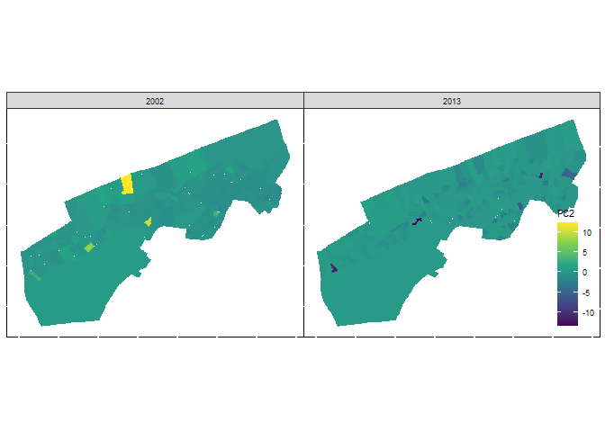
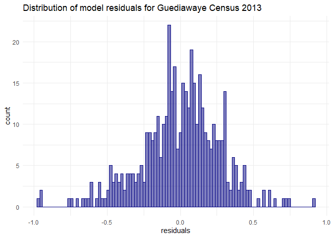
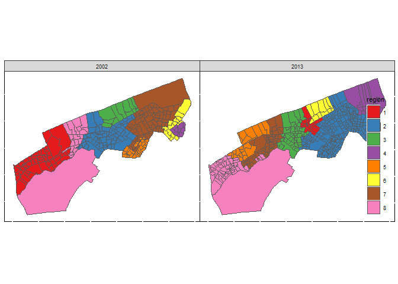

```r
rm(list=ls())
```

## Importing library


```r
## Importing library
### List of required packages
required_packages <- c("tidyverse","janitor" ,"readr","dplyr","haven","sf", "flextable","sp", "factoextra", "FactoMineR","gtsummary", "sjPlot", "fastDummies","ggthemes","spdep","patchwork")

# Check if packages are installed
missing_packages <- setdiff(required_packages, installed.packages()[,"Package"])

### Install missing packages
if (length(missing_packages) > 0) {
  install.packages(missing_packages)
}

### Load all packages
lapply(required_packages, library, character.only = TRUE)
```


```r
# Read shapefile data for 2013 and 2013


MPI_data_dr_2013 <- sf::read_sf(paste0(here::here(),"/output/output_data/MPI_data_dr_2013.shp"))
MPI_data_dr_2002 <- sf::read_sf(paste0(here::here(),"/output/output_data/MPI_data_dr_2002.shp"))
MPI_data_dr <- MPI_data_dr_2013 %>%
  plyr::rbind.fill(MPI_data_dr_2002) %>% 
  st_as_sf()
```


# Regression modeling with Guediawaye Census data


```r
#"hh_size",
predictors = c("menage","Aucun","Primair","Moyen","Secondr","fertlty","Ltrcy_F","nbr_cm_h","nbr_cm_f","pct_cm_f")
outcome = "MPI_men"
```

## Inspecting the outcome variable (MPI) with visualization


```r
mhv_map <- ggplot(MPI_data_dr_2013, aes(fill = MPI_men)) + 
  geom_sf(color = NA) + 
  scale_fill_viridis_c() + 
  theme_void() + 
  labs(fill = "MPI ")

mhv_histogram <- ggplot(MPI_data_dr_2013, aes(x = MPI_men)) + 
  geom_histogram(alpha = 0.5, fill = "navy", color = "navy",
                 bins = 100) + 
  theme_minimal() + 
  scale_x_continuous(labels = scales::label_number_si(accuracy = 0.1)) + 
  labs(x = "MPI")

mhv_map + mhv_histogram + labs(title = "MPI value charts for Guediawaye Census 2013")
```

<!-- -->


```r
MPI_data_dr %>% 
    
      ggplot(aes(fill = MPI_men)) + 
      
      geom_sf(color = NA) + 
  scale_fill_viridis_c() + 
  theme_void() + 
  labs(fill = "MPI ")+
       
      facet_wrap(~RGPH) +
      
      # Adjusting the plot theme
      theme_map(base_size = 8) +
      theme(panel.background = element_rect(),
            legend.background = element_blank(),
            axis.ticks = element_blank(),
            axis.text = element_blank(),
            legend.position = c(.92, .03), 
            text = element_text(size = 8), 
            panel.grid = element_line(color = "white", size = 0.8))
```

<!-- -->

```r
ggplot(MPI_data_dr, aes(x = MPI_men)) + 
  geom_histogram(alpha = 0.5, fill = "navy", color = "navy",
                 bins = 100) + 
  theme_minimal() + 
  scale_x_continuous(labels = scales::label_number_si(accuracy = 0.1)) + 
  labs(x = "MPI")+
       
      facet_wrap(~RGPH) +
      
      # Adjusting the plot theme
      theme_map(base_size = 8) +
      theme(panel.background = element_rect(),
            legend.background = element_blank(),
            axis.ticks = element_blank(),
            axis.text = element_blank(),
            legend.position = c(.92, .03), 
            text = element_text(size = 8), 
            panel.grid = element_line(color = "white", size = 0.8))
```

<!-- -->


```r
mhv_map_log <- ggplot(MPI_data_dr_2013, aes(fill = log(MPI_men))) + 
  geom_sf(color = NA) + 
  scale_fill_viridis_c() + 
  theme_void() + 
  labs(fill = "MPI\nvalue (log)")

mhv_histogram_log <- ggplot(MPI_data_dr_2013, aes(x = log(MPI_men))) + 
  geom_histogram(alpha = 0.5, fill = "navy", color = "navy",
                 bins = 100) + 
  theme_minimal() + 
  scale_x_continuous() + 
  labs(x = "MPI (log)")

mhv_map_log + mhv_histogram_log + labs(title = "Logged MPI value charts for Guediawaye Census 2013")
```

<!-- -->


```r
MPI_data_dr %>% 
    
      ggplot(aes(fill = log(MPI_men))) + 
      
      geom_sf(color = NA) + 
  scale_fill_viridis_c() + 
  theme_void() + 
  labs(fill = "MPI\nvalue (log)")+
       
      facet_wrap(~RGPH) +
      
      # Adjusting the plot theme
      theme_map(base_size = 8) +
      theme(panel.background = element_rect(),
            legend.background = element_blank(),
            axis.ticks = element_blank(),
            axis.text = element_blank(),
            legend.position = c(.92, .03), 
            text = element_text(size = 8), 
            panel.grid = element_line(color = "white", size = 0.8))
```

<!-- -->


## A first regression model


```r
library(sf)
library(units)
predictors = c("menage","Primair","Moyen","Secondr","Ltrcy_F","pct_cm_f","hh_size","Ltrcy_A","Ltrcy_W","Ltrcy_M","fertlty")
outcome = "MPI_men"
MPI_data_dr_2013_for_model<- MPI_data_dr_2013 %>%
  dplyr::select(MPI_men,predictors) %>% 
  mutate(pop_density = as.numeric(set_units(hh_size / st_area(.), "1/km2"))) %>% 
  dplyr::select(-hh_size)

##
MPI_data_dr_2002_for_model<- MPI_data_dr_2002 %>%
  dplyr::select(MPI_men,predictors) %>% 
  mutate(pop_density = as.numeric(set_units(hh_size / st_area(.), "1/km2"))) %>% 
  dplyr::select(-hh_size)
```


```r
formula <- "log(MPI_men) ~ menage  + Primair + Moyen + Secondr + Ltrcy_F + pct_cm_f + pop_density + Ltrcy_A + Ltrcy_W + Ltrcy_M + fertlty"

model_2013 <- lm(formula = formula, data = MPI_data_dr_2013_for_model)
summary(model_2013)
```

```
## 
## Call:
## lm(formula = formula, data = MPI_data_dr_2013_for_model)
## 
## Residuals:
##      Min       1Q   Median       3Q      Max 
## -0.96596 -0.15218  0.01508  0.16678  0.91556 
## 
## Coefficients:
##               Estimate Std. Error t value Pr(>|t|)    
## (Intercept) -2.206e+00  7.882e-02 -27.993  < 2e-16 ***
## menage       8.920e-03  8.090e-04  11.026  < 2e-16 ***
## Primair      4.446e-05  3.742e-04   0.119 0.905487    
## Moyen       -4.062e-03  8.660e-04  -4.690 3.69e-06 ***
## Secondr     -5.420e-03  1.042e-03  -5.202 3.07e-07 ***
## Ltrcy_F     -1.080e-03  2.616e-04  -4.129 4.40e-05 ***
## pct_cm_f    -2.412e-01  1.605e-01  -1.503 0.133712    
## pop_density  3.318e-06  8.565e-07   3.874 0.000124 ***
## Ltrcy_A      8.242e-04  3.680e-04   2.240 0.025632 *  
## Ltrcy_W      3.518e-04  3.775e-04   0.932 0.351926    
## Ltrcy_M     -5.072e-03  1.121e-02  -0.452 0.651151    
## fertlty      1.192e-04  7.926e-05   1.504 0.133383    
## ---
## Signif. codes:  0 '***' 0.001 '**' 0.01 '*' 0.05 '.' 0.1 ' ' 1
## 
## Residual standard error: 0.2763 on 423 degrees of freedom
## Multiple R-squared:  0.5892,	Adjusted R-squared:  0.5786 
## F-statistic: 55.16 on 11 and 423 DF,  p-value: < 2.2e-16
```

```r
###
model_2002 <- lm(formula = formula, data = MPI_data_dr_2002_for_model)

summary(model_2002)
```

```
## 
## Call:
## lm(formula = formula, data = MPI_data_dr_2002_for_model)
## 
## Residuals:
##      Min       1Q   Median       3Q      Max 
## -0.93813 -0.14645  0.02431  0.15303  0.92895 
## 
## Coefficients:
##               Estimate Std. Error t value Pr(>|t|)    
## (Intercept) -2.501e+00  9.538e-02 -26.218  < 2e-16 ***
## menage       5.085e-03  6.443e-04   7.893 8.64e-14 ***
## Primair     -5.171e-04  9.546e-04  -0.542 0.588466    
## Moyen       -4.773e-03  1.305e-03  -3.659 0.000308 ***
## Secondr     -3.697e-03  1.733e-03  -2.134 0.033829 *  
## Ltrcy_F      6.199e-04  1.007e-03   0.615 0.538816    
## pct_cm_f     9.399e-02  2.789e-01   0.337 0.736438    
## pop_density -7.584e-07  8.747e-07  -0.867 0.386742    
## Ltrcy_A      3.455e-04  9.738e-05   3.548 0.000461 ***
## Ltrcy_W      2.135e-03  7.067e-04   3.021 0.002773 ** 
## Ltrcy_M     -1.789e-02  1.211e-02  -1.477 0.140974    
## fertlty      4.070e-05  5.002e-05   0.814 0.416656    
## ---
## Signif. codes:  0 '***' 0.001 '**' 0.01 '*' 0.05 '.' 0.1 ' ' 1
## 
## Residual standard error: 0.2598 on 256 degrees of freedom
## Multiple R-squared:  0.6362,	Adjusted R-squared:  0.6205 
## F-statistic: 40.69 on 11 and 256 DF,  p-value: < 2.2e-16
```


```r
library(corrr)

dfw_estimates_2013 <- MPI_data_dr_2013_for_model%>%
  select(-MPI_men) %>%
  st_drop_geometry()

correlations <- correlate(dfw_estimates_2013, method = "pearson")
network_plot(correlations) + labs(title = "Network plot of correlations between model predictors for Guediawaye Census 2013")
```

<!-- -->

```r
##
dfw_estimates_2002 <- MPI_data_dr_2002_for_model%>%
  select(-MPI_men) %>%
  st_drop_geometry()

correlations <- correlate(dfw_estimates_2002, method = "pearson")
network_plot(correlations) + labs(title = "Network plot of correlations between model predictors for Guediawaye Census 2002")
```

<!-- -->


```r
library(car)

vif(model_2013)
```

```
##      menage     Primair       Moyen     Secondr     Ltrcy_F    pct_cm_f 
##    3.871362    6.365508    8.106130    6.015662    7.975025    1.078787 
## pop_density     Ltrcy_A     Ltrcy_W     Ltrcy_M     fertlty 
##    1.311097    1.753157    1.482201    1.495714    5.367797
```

```r
vif(model_2002)
```

```
##      menage     Primair       Moyen     Secondr     Ltrcy_F    pct_cm_f 
##    3.264182  296.965177   62.395236   23.508009  676.277234    1.192709 
## pop_density     Ltrcy_A     Ltrcy_W     Ltrcy_M     fertlty 
##    5.102300    4.317702    2.812754    2.154419   12.827831
```

## Dimension reduction with principal components analysis


```r
pca_2013 <- prcomp(
  formula = ~., 
  data = dfw_estimates_2013, 
  scale. = TRUE, 
  center = TRUE
)

summary(pca_2013)
```

```
## Importance of components:
##                           PC1    PC2    PC3    PC4     PC5     PC6     PC7
## Standard deviation     2.1830 1.2702 1.1991 1.0093 0.86575 0.70859 0.63546
## Proportion of Variance 0.4332 0.1467 0.1307 0.0926 0.06814 0.04565 0.03671
## Cumulative Proportion  0.4332 0.5799 0.7106 0.8032 0.87134 0.91698 0.95369
##                            PC8     PC9    PC10    PC11
## Standard deviation     0.46543 0.35450 0.28979 0.28829
## Proportion of Variance 0.01969 0.01142 0.00763 0.00756
## Cumulative Proportion  0.97339 0.98481 0.99244 1.00000
```

```r
##
pca_2002 <- prcomp(
  formula = ~., 
  data = dfw_estimates_2002, 
  scale. = TRUE, 
  center = TRUE
)

summary(pca_2002)
```

```
## Importance of components:
##                           PC1    PC2    PC3     PC4     PC5    PC6     PC7
## Standard deviation     2.4838 1.2668 1.1312 0.89900 0.69049 0.5128 0.42401
## Proportion of Variance 0.5608 0.1459 0.1163 0.07347 0.04334 0.0239 0.01634
## Cumulative Proportion  0.5608 0.7067 0.8231 0.89653 0.93988 0.9638 0.98012
##                            PC8     PC9    PC10    PC11
## Standard deviation     0.34342 0.24906 0.19413 0.03123
## Proportion of Variance 0.01072 0.00564 0.00343 0.00009
## Cumulative Proportion  0.99085 0.99649 0.99991 1.00000
```


```r
pca_2013_tibble <- pca_2013$rotation %>%
  as_tibble(rownames = "predictor")
pca_2013_tibble
```

```
## # A tibble: 11 × 12
##    predictor       PC1      PC2     PC3      PC4     PC5    PC6      PC7     PC8
##    <chr>         <dbl>    <dbl>   <dbl>    <dbl>   <dbl>  <dbl>    <dbl>   <dbl>
##  1 menage      0.411    0.0273   0.0207 -0.00164 -0.116   0.171 -0.100   -0.860 
##  2 Primair     0.391    0.00141  0.292  -0.134   -0.0930  0.278 -0.182    0.321 
##  3 Moyen       0.423    0.0591  -0.169  -0.0299  -0.123  -0.105  0.0881   0.292 
##  4 Secondr     0.359    0.0776  -0.404   0.0668  -0.0638 -0.350  0.242   -0.0563
##  5 Ltrcy_F     0.419   -0.0249  -0.140   0.0606   0.118  -0.310  0.179    0.148 
##  6 pct_cm_f   -0.0501  -0.160    0.0501 -0.944    0.0275 -0.226  0.135   -0.0901
##  7 Ltrcy_A     0.187   -0.242    0.385   0.128    0.804  -0.193 -0.00962 -0.0681
##  8 Ltrcy_W     0.00824 -0.670   -0.121   0.0918  -0.249  -0.329 -0.597    0.0156
##  9 Ltrcy_M     0.00631 -0.670   -0.169   0.0737  -0.0180  0.453  0.556    0.0105
## 10 fertlty     0.397   -0.0175   0.210  -0.142   -0.0923  0.369 -0.195    0.177 
## 11 pop_densi…  0.00232 -0.0769   0.682   0.178   -0.477  -0.355  0.370   -0.0461
## # ℹ 3 more variables: PC9 <dbl>, PC10 <dbl>, PC11 <dbl>
```

```r
###
pca_2002_tibble <- pca_2002$rotation %>%
  as_tibble(rownames = "predictor")
pca_2002_tibble
```

```
## # A tibble: 11 × 12
##    predictor       PC1     PC2     PC3      PC4     PC5     PC6     PC7      PC8
##    <chr>         <dbl>   <dbl>   <dbl>    <dbl>   <dbl>   <dbl>   <dbl>    <dbl>
##  1 menage       0.317  -0.151   0.0769  1.55e-1  0.743  -0.382   0.0984 -0.336  
##  2 Primair      0.386  -0.0978 -0.0903  1.81e-2  0.0918  0.125   0.0852  0.551  
##  3 Moyen        0.366   0.0739  0.250   2.22e-1 -0.183   0.0866 -0.0602  0.0991 
##  4 Secondr      0.259   0.199   0.520   3.77e-1 -0.233   0.163  -0.0439 -0.402  
##  5 Ltrcy_F      0.394  -0.0114  0.0839  1.19e-1 -0.0360  0.120   0.0225  0.326  
##  6 pct_cm_f    -0.0470 -0.168  -0.610   7.51e-1 -0.0978  0.0682 -0.0991 -0.0936 
##  7 Ltrcy_A      0.342  -0.0716 -0.174  -2.33e-1 -0.308  -0.483  -0.664  -0.112  
##  8 Ltrcy_W      0.190   0.587  -0.273   5.99e-4 -0.231  -0.446   0.540  -0.0125 
##  9 Ltrcy_M      0.0267  0.708  -0.206  -4.48e-2  0.388   0.349  -0.425  -0.00843
## 10 fertlty      0.373  -0.141  -0.163  -1.39e-1  0.141   0.134   0.0552  0.0928 
## 11 pop_density  0.315  -0.157  -0.316  -3.62e-1 -0.150   0.461   0.226  -0.525  
## # ℹ 3 more variables: PC9 <dbl>, PC10 <dbl>, PC11 <dbl>
```


```r
pca_2013_tibble %>%
  select(predictor:PC5) %>%
  pivot_longer(PC1:PC5, names_to = "component", values_to = "value") %>%
  ggplot(aes(x = value, y = predictor)) + 
  geom_col(fill = "darkgreen", color = "darkgreen", alpha = 0.5) + 
  facet_wrap(~component, nrow = 1) + 
  labs(y = NULL, x = "Value", title = " Loadings for first five principal components  for Guediawaye Census 2013") + 
  theme_minimal()
```

<!-- -->


```r
pca_2002_tibble %>%
  select(predictor:PC5) %>%
  pivot_longer(PC1:PC5, names_to = "component", values_to = "value") %>%
  ggplot(aes(x = value, y = predictor)) + 
  geom_col(fill = "darkgreen", color = "darkgreen", alpha = 0.5) + 
  facet_wrap(~component, nrow = 1) + 
  labs(y = NULL, x = "Value", title = " Loadings for first five principal components  for Guediawaye Census 2002") + 
  theme_minimal()
```

<!-- -->


```r
components_2013 <- predict(pca_2013, dfw_estimates_2013)

dfw_pca_2013 <- MPI_data_dr_2013_for_model%>%
  select(MPI_men) %>%
  cbind(components_2013) 

ggplot(dfw_pca_2013, aes(fill = PC1)) +
  geom_sf(color = NA) +
  labs(title = "Map of principal component 1 for Guediawaye Census 2013") +
  theme_void() +
  scale_fill_viridis_c()
```

<!-- -->


```r
components_2002 <- predict(pca_2002, dfw_estimates_2002)

dfw_pca_2002 <- MPI_data_dr_2002_for_model%>%
  select(MPI_men) %>%
  cbind(components_2002) 

ggplot(dfw_pca_2002, aes(fill = PC1)) +
  geom_sf(color = NA) +
  labs(title = "Map of principal component 1 for Guediawaye Census 2002") +
  theme_void() +
  scale_fill_viridis_c()
```

<!-- -->

```r
dfw_pca_2002$RGPH<-"2002"
dfw_pca_2013$RGPH<-"2013"
dfw_pca <- dfw_pca_2002 %>%
  plyr::rbind.fill(dfw_pca_2013) %>% 
  st_as_sf()


dfw_pca %>% 
    
      ggplot(aes(fill = PC1))  + 
      
      # Adding spatial features to the plot
      geom_sf(color = NA) +
       scale_fill_viridis_c()+
      facet_wrap(~RGPH) +
      
      # Adjusting the plot theme
      theme_map(base_size = 8) +
      theme(panel.background = element_rect(),
            legend.background = element_blank(),
            axis.ticks = element_blank(),
            axis.text = element_blank(),
            legend.position = c(.92, .03), 
            text = element_text(size = 8), 
            panel.grid = element_line(color = "white", size = 0.8))
```

<!-- -->


```r
dfw_pca %>% 
    
      ggplot(aes(fill = PC2))  + 
      
      # Adding spatial features to the plot
      geom_sf(color = NA) +
       scale_fill_viridis_c()+
      facet_wrap(~RGPH) +
      
      # Adjusting the plot theme
      theme_map(base_size = 8) +
      theme(panel.background = element_rect(),
            legend.background = element_blank(),
            axis.ticks = element_blank(),
            axis.text = element_blank(),
            legend.position = c(.92, .03), 
            text = element_text(size = 8), 
            panel.grid = element_line(color = "white", size = 0.8))
```

<!-- -->


```r
pca_2013_formula <- paste0("log(MPI_men) ~ ", 
                      paste0('PC', 1:6, collapse = ' + '))

pca_2013_model <- lm(formula = pca_2013_formula, data = dfw_pca_2013)

summary(pca_2013_model)
```

```
## 
## Call:
## lm(formula = pca_2013_formula, data = dfw_pca_2013)
## 
## Residuals:
##      Min       1Q   Median       3Q      Max 
## -1.24990 -0.18273  0.02651  0.20476  1.04093 
## 
## Coefficients:
##              Estimate Std. Error  t value Pr(>|t|)    
## (Intercept) -2.198765   0.015293 -143.777  < 2e-16 ***
## PC1         -0.053704   0.007014   -7.657 1.28e-13 ***
## PC2         -0.028563   0.012053   -2.370   0.0182 *  
## PC3          0.190385   0.012769   14.910  < 2e-16 ***
## PC4          0.012906   0.015170    0.851   0.3954    
## PC5         -0.024567   0.017685   -1.389   0.1655    
## PC6          0.160993   0.021607    7.451 5.17e-13 ***
## ---
## Signif. codes:  0 '***' 0.001 '**' 0.01 '*' 0.05 '.' 0.1 ' ' 1
## 
## Residual standard error: 0.319 on 428 degrees of freedom
## Multiple R-squared:  0.4461,	Adjusted R-squared:  0.4384 
## F-statistic: 57.46 on 6 and 428 DF,  p-value: < 2.2e-16
```

```r
###
pca_2002_formula <- paste0("log(MPI_men) ~ ", 
                      paste0('PC', 1:6, collapse = ' + '))

pca_2002_model <- lm(formula = pca_2002_formula, data = dfw_pca_2002)

summary(pca_2002_model)
```

```
## 
## Call:
## lm(formula = pca_2002_formula, data = dfw_pca_2002)
## 
## Residuals:
##      Min       1Q   Median       3Q      Max 
## -0.85582 -0.14204  0.02176  0.16668  0.90056 
## 
## Coefficients:
##              Estimate Std. Error  t value Pr(>|t|)    
## (Intercept) -2.372798   0.016131 -147.099  < 2e-16 ***
## PC1         -0.034241   0.006507   -5.263 2.97e-07 ***
## PC2         -0.077437   0.012757   -6.070 4.49e-09 ***
## PC3         -0.184662   0.014286  -12.926  < 2e-16 ***
## PC4         -0.117479   0.017976   -6.535 3.31e-10 ***
## PC5          0.210540   0.023405    8.996  < 2e-16 ***
## PC6         -0.253701   0.031516   -8.050 2.94e-14 ***
## ---
## Signif. codes:  0 '***' 0.001 '**' 0.01 '*' 0.05 '.' 0.1 ' ' 1
## 
## Residual standard error: 0.2641 on 261 degrees of freedom
## Multiple R-squared:  0.6168,	Adjusted R-squared:  0.608 
## F-statistic: 70.01 on 6 and 261 DF,  p-value: < 2.2e-16
```

## Spatial regression


```r
MPI_data_dr_2013_for_model$residuals <- residuals(model_2013)

ggplot(MPI_data_dr_2013_for_model, aes(x = residuals)) + 
  geom_histogram(bins = 100, alpha = 0.5, color = "navy",
                 fill = "navy") + 
  labs(title = "Distribution of model residuals for Guediawaye Census 2013") +
  theme_minimal()
```

<!-- -->


```r
MPI_data_dr_2002_for_model$residuals <- residuals(model_2002)

ggplot(MPI_data_dr_2002_for_model, aes(x = residuals)) + 
  geom_histogram(bins = 100, alpha = 0.5, color = "navy",
                 fill = "navy") + 
  labs(title = "Distribution of model residuals for Guediawaye Census 2002") +
  theme_minimal()
```

<!-- -->


```r
MPI_data_dr_for_model <- MPI_data_dr_2002_for_model %>%
  dplyr::mutate(RGPH = "2002") %>% 
  plyr::rbind.fill(MPI_data_dr_2013_for_model %>%
  dplyr::mutate(RGPH = "2013"))

ggplot(MPI_data_dr_for_model, aes(x = residuals)) + 
      geom_histogram(bins = 100, alpha = 0.5, color = "navy",
                 fill = "navy") +
       
      facet_wrap(~RGPH) +
      
      # Adjusting the plot theme
      theme_map(base_size = 8) +
      theme(panel.background = element_rect(),
            legend.background = element_blank(),
            axis.ticks = element_blank(),
            axis.text = element_blank(),
            legend.position = c(.92, .03), 
            text = element_text(size = 8), 
            panel.grid = element_line(color = "white", size = 0.8))
```

<!-- -->


```r
library(spdep)

wts_2013 <- MPI_data_dr_2013_for_model %>%
  poly2nb() %>%
  nb2listw()

moran.test(MPI_data_dr_2013_for_model$residuals, wts_2013)
```

```
## 
## 	Moran I test under randomisation
## 
## data:  MPI_data_dr_2013_for_model$residuals  
## weights: wts_2013    
## 
## Moran I statistic standard deviate = 4.7138, p-value = 1.216e-06
## alternative hypothesis: greater
## sample estimates:
## Moran I statistic       Expectation          Variance 
##      0.1325984738     -0.0023041475      0.0008190204
```


```r
wts_2002 <- MPI_data_dr_2002_for_model %>%
  poly2nb() %>%
  nb2listw()

moran.test(MPI_data_dr_2002_for_model$residuals, wts_2002)
```

```
## 
## 	Moran I test under randomisation
## 
## data:  MPI_data_dr_2002_for_model$residuals  
## weights: wts_2002    
## 
## Moran I statistic standard deviate = 2.1922, p-value = 0.01418
## alternative hypothesis: greater
## sample estimates:
## Moran I statistic       Expectation          Variance 
##       0.077244085      -0.003745318       0.001364879
```


```r
MPI_data_dr_2013_for_model$lagged_residuals <- lag.listw(wts_2013, MPI_data_dr_2013_for_model$residuals)

ggplot(MPI_data_dr_2013_for_model, aes(x = residuals, y = lagged_residuals)) + 
  theme_minimal() + 
  labs(title = "Moran scatterplot of residual spatial autocorrelation for Guediawaye Census 2013") +
  geom_point(alpha = 0.5) + 
  geom_smooth(method = "lm", color = "red")
```

<!-- -->

```r
MPI_data_dr_2002_for_model$lagged_residuals <- lag.listw(wts_2002, MPI_data_dr_2002_for_model$residuals)

ggplot(MPI_data_dr_2002_for_model, aes(x = residuals, y = lagged_residuals)) + 
  theme_minimal() + 
  labs(title = "Moran scatterplot of residual spatial autocorrelation for Guediawaye Census 2002") +
  geom_point(alpha = 0.5) + 
  geom_smooth(method = "lm", color = "red")
```

<!-- -->

```r
MPI_data_dr_for_model <- MPI_data_dr_2002_for_model %>%
  dplyr::mutate(RGPH = "2002") %>% 
  plyr::rbind.fill(MPI_data_dr_2013_for_model %>%
  dplyr::mutate(RGPH = "2013"))

ggplot(MPI_data_dr_for_model, aes(x = residuals, y = lagged_residuals)) + 
  geom_point(alpha = 0.5) + 
  geom_smooth(method = "lm", color = "red")+
      facet_wrap(~RGPH) +
      
      # Adjusting the plot theme
      theme_map(base_size = 8) +
      theme(panel.background = element_rect(),
            legend.background = element_blank(),
            axis.ticks = element_blank(),
            axis.text = element_blank(),
            legend.position = c(.92, .03), 
            text = element_text(size = 8), 
            panel.grid = element_line(color = "white", size = 0.8))
```

<!-- -->


# Geographically weighted regression

## Choosing a bandwidth for GWR


```r
library(GWmodel)
library(sf)

dfw_data_sp_2013 <- MPI_data_dr_2013_for_model%>%
  as_Spatial()

bw <- bw.gwr(
  formula = formula, 
  data = dfw_data_sp_2013, 
  kernel = "bisquare",
  adaptive = TRUE
)
```

```
## Adaptive bandwidth: 276 CV score: 33.03409 
## Adaptive bandwidth: 179 CV score: 32.93048 
## Adaptive bandwidth: 117 CV score: 34.29743 
## Adaptive bandwidth: 215 CV score: 32.81589 
## Adaptive bandwidth: 240 CV score: 32.88213 
## Adaptive bandwidth: 202 CV score: 32.79958 
## Adaptive bandwidth: 191 CV score: 32.84516 
## Adaptive bandwidth: 205 CV score: 32.78288 
## Adaptive bandwidth: 211 CV score: 32.81568 
## Adaptive bandwidth: 205 CV score: 32.78288
```

```r
###
dfw_data_sp_2002 <- MPI_data_dr_2002_for_model%>%
  as_Spatial()

bw <- bw.gwr(
  formula = formula, 
  data = dfw_data_sp_2002, 
  kernel = "bisquare",
  adaptive = TRUE
)
```

```
## Adaptive bandwidth: 173 CV score: 30.78351 
## Adaptive bandwidth: 115 CV score: 22.6392 
## Adaptive bandwidth: 78 CV score: 18.02988 
## Adaptive bandwidth: 56 CV score: 20.33301 
## Adaptive bandwidth: 92 CV score: 18.84602 
## Adaptive bandwidth: 69 CV score: 18.22104 
## Adaptive bandwidth: 83 CV score: 18.02752 
## Adaptive bandwidth: 87 CV score: 18.63179 
## Adaptive bandwidth: 81 CV score: 17.89142 
## Adaptive bandwidth: 79 CV score: 18.02583 
## Adaptive bandwidth: 81 CV score: 17.89142
```


```r
gw_model_2013 <- gwr.basic(
  formula = formula, 
  data = dfw_data_sp_2013, 
  bw = bw,
  kernel = "bisquare",
  adaptive = TRUE
)

###
gw_model_2002 <- gwr.basic(
  formula = formula, 
  data = dfw_data_sp_2002, 
  bw = bw,
  kernel = "bisquare",
  adaptive = TRUE
)
```


```r
names(gw_model_2013)
```

```
## [1] "GW.arguments"  "GW.diagnostic" "lm"            "SDF"          
## [5] "timings"       "this.call"     "Ftests"
```

```r
##
names(gw_model_2002)
```

```
## [1] "GW.arguments"  "GW.diagnostic" "lm"            "SDF"          
## [5] "timings"       "this.call"     "Ftests"
```


```r
gw_model_2013_results <- gw_model_2013$SDF %>%
  st_as_sf() 

names(gw_model_2013_results)
```

```
##  [1] "Intercept"      "menage"         "Primair"        "Moyen"         
##  [5] "Secondr"        "Ltrcy_F"        "pct_cm_f"       "pop_density"   
##  [9] "Ltrcy_A"        "Ltrcy_W"        "Ltrcy_M"        "fertlty"       
## [13] "y"              "yhat"           "residual"       "CV_Score"      
## [17] "Stud_residual"  "Intercept_SE"   "menage_SE"      "Primair_SE"    
## [21] "Moyen_SE"       "Secondr_SE"     "Ltrcy_F_SE"     "pct_cm_f_SE"   
## [25] "pop_density_SE" "Ltrcy_A_SE"     "Ltrcy_W_SE"     "Ltrcy_M_SE"    
## [29] "fertlty_SE"     "Intercept_TV"   "menage_TV"      "Primair_TV"    
## [33] "Moyen_TV"       "Secondr_TV"     "Ltrcy_F_TV"     "pct_cm_f_TV"   
## [37] "pop_density_TV" "Ltrcy_A_TV"     "Ltrcy_W_TV"     "Ltrcy_M_TV"    
## [41] "fertlty_TV"     "Local_R2"       "geometry"
```

```r
###
gw_model_2002_results <- gw_model_2002$SDF %>%
  st_as_sf() 

names(gw_model_2002_results)
```

```
##  [1] "Intercept"      "menage"         "Primair"        "Moyen"         
##  [5] "Secondr"        "Ltrcy_F"        "pct_cm_f"       "pop_density"   
##  [9] "Ltrcy_A"        "Ltrcy_W"        "Ltrcy_M"        "fertlty"       
## [13] "y"              "yhat"           "residual"       "CV_Score"      
## [17] "Stud_residual"  "Intercept_SE"   "menage_SE"      "Primair_SE"    
## [21] "Moyen_SE"       "Secondr_SE"     "Ltrcy_F_SE"     "pct_cm_f_SE"   
## [25] "pop_density_SE" "Ltrcy_A_SE"     "Ltrcy_W_SE"     "Ltrcy_M_SE"    
## [29] "fertlty_SE"     "Intercept_TV"   "menage_TV"      "Primair_TV"    
## [33] "Moyen_TV"       "Secondr_TV"     "Ltrcy_F_TV"     "pct_cm_f_TV"   
## [37] "pop_density_TV" "Ltrcy_A_TV"     "Ltrcy_W_TV"     "Ltrcy_M_TV"    
## [41] "fertlty_TV"     "Local_R2"       "geometry"
```


```r
ggplot(gw_model_2013_results, aes(fill = Local_R2)) + 
  geom_sf(color = NA) + 
  scale_fill_viridis_c() + 
  labs(title = "Local R-squared values from the GWR model for Guediawaye Census 2013") +
  theme_void()
```

<!-- -->

```r
ggplot(gw_model_2002_results, aes(fill = Local_R2)) + 
  geom_sf(color = NA) + 
  scale_fill_viridis_c() + 
  labs(title = "Local R-squared values from the GWR model for Guediawaye Census 2002") +
  theme_void()
```

<!-- -->


```r
gw_model_results <- gw_model_2002_results %>%
  dplyr::mutate(RGPH = "2002") %>% 
  plyr::rbind.fill(gw_model_2013_results %>%
  dplyr::mutate(RGPH = "2013")) %>% 
  st_as_sf()


gw_model_results %>% 
    
      ggplot(aes(fill = Local_R2)) + 
      
      # Adding spatial features to the plot
      geom_sf() +
      
      scale_fill_viridis_c() +
       
      facet_wrap(~RGPH) +
      
      # Adjusting the plot theme
      theme_map(base_size = 8) +
      theme(panel.background = element_rect(),
            legend.background = element_blank(),
            axis.ticks = element_blank(),
            axis.text = element_blank(),
            legend.position = c(.92, .03), 
            text = element_text(size = 8), 
            panel.grid = element_line(color = "white", size = 0.8))
```

<!-- -->


```r
ggplot(gw_model_2013_results, aes(fill = menage)) + 
  geom_sf(color = NA) + 
  scale_fill_viridis_c() + 
  labs(title = "Local parameter estimates for household members for Guediawaye Census 2013") +
  theme_void() + 
  labs(fill = "Local β for \nHH")
```

<!-- -->

```r
ggplot(gw_model_2002_results, aes(fill = menage)) + 
  geom_sf(color = NA) + 
  scale_fill_viridis_c() + 
  labs(title = "Local parameter estimates for household members for Guediawaye Census 2002") +
  theme_void() + 
  labs(fill = "Local β for \nHH")
```

<!-- -->


```r
gw_model_results <- gw_model_2002_results %>%
  dplyr::mutate(RGPH = "2002") %>% 
  plyr::rbind.fill(gw_model_2013_results %>%
  dplyr::mutate(RGPH = "2013")) %>% 
  st_as_sf()


gw_model_results %>% 
    
      ggplot(aes(fill = menage)) + 
      
      # Adding spatial features to the plot
      geom_sf() +
      
      scale_fill_viridis_c() +
  labs(fill = "Local β for \nHH")+
      facet_wrap(~RGPH) +
      
      # Adjusting the plot theme
      theme_map(base_size = 8) +
      theme(panel.background = element_rect(),
            legend.background = element_blank(),
            axis.ticks = element_blank(),
            axis.text = element_blank(),
            legend.position = c(.92, .03), 
            text = element_text(size = 8), 
            panel.grid = element_line(color = "white", size = 0.8))
```

<!-- -->


```r
ggplot(gw_model_2013_results, aes(fill = pop_density)) + 
  geom_sf(color = NA) + 
  scale_fill_viridis_c() + 
  labs(title = "Local parameter estimates for population density for Guediawaye Census 2013") +
  theme_void() + 
  labs(fill = "Local β for \npopulation density")
```

<!-- -->

```r
ggplot(gw_model_2002_results, aes(fill = pop_density)) + 
  geom_sf(color = NA) + 
  scale_fill_viridis_c() + 
  labs(title = "Local parameter estimates for population density for Guediawaye Census 2002") +
  theme_void() + 
  labs(fill = "Local β for \npopulation density")
```

<!-- -->


```r
gw_model_results <- gw_model_2002_results %>%
  dplyr::mutate(RGPH = "2002") %>% 
  plyr::rbind.fill(gw_model_2013_results %>%
  dplyr::mutate(RGPH = "2013")) %>% 
  st_as_sf()


gw_model_results %>% 
    
      ggplot(aes(fill = pop_density)) + 
      
      # Adding spatial features to the plot
      geom_sf() +
      
      scale_fill_viridis_c() +
  labs(fill = "Local β for \npopulation density")+
      facet_wrap(~RGPH) +
      
      # Adjusting the plot theme
      theme_map(base_size = 8) +
      theme(panel.background = element_rect(),
            legend.background = element_blank(),
            axis.ticks = element_blank(),
            axis.text = element_blank(),
            legend.position = c(.92, .03), 
            text = element_text(size = 8), 
            panel.grid = element_line(color = "white", size = 0.8))
```

<!-- -->


# Classification and clustering of Guediawaye census data

## Geodemographic classification


```r
set.seed(1994)

dfw_kmeans_2013 <- dfw_pca_2013 %>%
  st_drop_geometry() %>%
  select(PC1:PC8) %>%
  kmeans(centers = 6)

table(dfw_kmeans_2013$cluster)
```

```
## 
##   1   2   3   4   5   6 
##  53  73 139  71  95   4
```

```r
##
dfw_kmeans_2002 <- dfw_pca_2002 %>%
  st_drop_geometry() %>%
  select(PC1:PC8) %>%
  kmeans(centers = 6)

table(dfw_kmeans_2002$cluster)
```

```
## 
##  1  2  3  4  5  6 
## 72 38  3  3 83 69
```


```r
dfw_clusters_2013 <- dfw_pca_2013 %>%
  mutate(cluster = as.character(dfw_kmeans_2013$cluster))

ggplot(dfw_clusters_2013, aes(fill = cluster)) + 
  geom_sf(size = 0.1) + 
  scale_fill_brewer(palette = "Set1") + 
  labs(title = "Map of geodemographic clusters for Guediawaye Census 2013") +
  theme_void() + 
  labs(fill = "Cluster ")
```

<!-- -->


```r
dfw_clusters_2002 <- dfw_pca_2002 %>%
  mutate(cluster = as.character(dfw_kmeans_2002$cluster))

ggplot(dfw_clusters_2002, aes(fill = cluster)) + 
  geom_sf(size = 0.1) + 
  scale_fill_brewer(palette = "Set1") + 
  labs(title = "Map of geodemographic clusters for Guediawaye Census 2002") +
  theme_void() + 
  labs(fill = "Cluster ")
```

<!-- -->

```r
dfw_clusters <- dfw_clusters_2002 %>%
  dplyr::mutate(RGPH = "2002") %>% 
  plyr::rbind.fill(dfw_clusters_2013 %>%
  dplyr::mutate(RGPH = "2013")) %>% 
  st_as_sf()


dfw_clusters %>% 
    
      ggplot(aes(fill = cluster)) + 
      
  geom_sf(size = 0.1) + 
  scale_fill_brewer(palette = "Set1") + 
      facet_wrap(~RGPH) +
      
      # Adjusting the plot theme
      theme_map(base_size = 8) +
      theme(panel.background = element_rect(),
            legend.background = element_blank(),
            axis.ticks = element_blank(),
            axis.text = element_blank(),
            legend.position = c(.92, .03), 
            text = element_text(size = 8), 
            panel.grid = element_line(color = "white", size = 0.8))
```

<!-- -->


```r
library(plotly)

cluster_plot <- ggplot(dfw_clusters_2013, 
                       aes(x = PC1, y = PC2, color = cluster)) + 
  geom_point() + 
  scale_color_brewer(palette = "Set1") + 
  labs(title = "Interactive scatterplot of PC1 and PC2 colored by cluster for Guediawaye Census 2013") +
  theme_minimal()

ggplotly(cluster_plot) %>%
  layout(legend = list(orientation = "h", y = -0.15, 
                       x = 0.2, title = "Cluster"))
```

```{=html}
<div class="plotly html-widget html-fill-item-overflow-hidden html-fill-item" id="htmlwidget-c9fb4393a882a12d9b84" style="width:672px;height:480px;"></div>
<script type="application/json" data-for="htmlwidget-c9fb4393a882a12d9b84">{"x":{"data":[{"x":[3.2449423062349845,2.5714762928534709,2.5266240850207851,5.7410601886468928,5.3069909299890234,2.2374845795172194,5.4541357249268376,2.6685303350626226,5.6040729788700432,4.7145412825032231,3.8858688335734759,4.4980751831778978,3.5127472520073808,3.9230229541776236,3.23604296883425,3.5632018017067746,3.8622851842172321,3.803649634099425,3.4757415232635056,2.4837274020979443,2.4596164253342447,3.1870518155817531,3.272438910832479,5.2689215997878245,2.8448694219616053,2.4992724369976531,4.5696355918856559,5.2590116048432849,4.0643739483696395,3.2598735556589484,4.1244059982827457,2.6148829373792246,3.2366286114876202,3.8608219072127303,4.0181855982445738,5.0853186144831657,4.5439357692109246,2.6963610993390401,5.3248478420772019,9.3322646120981396,7.3943432030544427,2.8379306554008967,5.7285285665813364,4.6633463132017567,3.8850888506525258,6.2890625274567444,3.8990048627356413,3.368706573954912,3.9397878264890522,2.5711817688091041,4.1224864059446018,3.1158465466529934,4.1037892693979385],"y":[0.64588227823098765,0.83720718172574426,0.61629673093742532,0.89097829230708414,-0.025928961813309909,0.93288881021202363,0.013278263502480486,0.77210282640336581,0.37612392592873528,0.73067838138907837,-0.9638783238098787,0.065062304518326453,0.28411142161147035,0.81172014232044121,0.75345883901980559,0.28633993800939167,0.06197812510036927,0.42667052889615892,-0.57137040536161243,0.47418685004283945,0.35332034314954336,0.68743634556546085,1.2447598734427407,0.88955940336850337,0.55219218925266733,1.0166898165674203,-0.015869370406749884,0.61675839168349966,0.20450710864211682,0.40184835089516852,0.10129262866074307,0.50632892070256297,0.84672809525237902,0.57660838483010779,-0.27974636661172059,0.07696120627194733,-0.74288150253566965,0.27052059545480744,0.12610811947585884,-2.1114421013991103,-0.15886917779879972,0.17252435371845715,1.009133068476525,-0.72873879399171959,0.45464641730474359,0.52753956211057673,-1.0361217861078846,0.26713372296571558,0.47663706903972197,0.60991163521045111,1.0420697710290689,0.57223052577186262,-0.38316468842993406],"text":["PC1:  3.244942306<br />PC2:   0.645882278<br />cluster: 1","PC1:  2.571476293<br />PC2:   0.837207182<br />cluster: 1","PC1:  2.526624085<br />PC2:   0.616296731<br />cluster: 1","PC1:  5.741060189<br />PC2:   0.890978292<br />cluster: 1","PC1:  5.306990930<br />PC2:  -0.025928962<br />cluster: 1","PC1:  2.237484580<br />PC2:   0.932888810<br />cluster: 1","PC1:  5.454135725<br />PC2:   0.013278264<br />cluster: 1","PC1:  2.668530335<br />PC2:   0.772102826<br />cluster: 1","PC1:  5.604072979<br />PC2:   0.376123926<br />cluster: 1","PC1:  4.714541283<br />PC2:   0.730678381<br />cluster: 1","PC1:  3.885868834<br />PC2:  -0.963878324<br />cluster: 1","PC1:  4.498075183<br />PC2:   0.065062305<br />cluster: 1","PC1:  3.512747252<br />PC2:   0.284111422<br />cluster: 1","PC1:  3.923022954<br />PC2:   0.811720142<br />cluster: 1","PC1:  3.236042969<br />PC2:   0.753458839<br />cluster: 1","PC1:  3.563201802<br />PC2:   0.286339938<br />cluster: 1","PC1:  3.862285184<br />PC2:   0.061978125<br />cluster: 1","PC1:  3.803649634<br />PC2:   0.426670529<br />cluster: 1","PC1:  3.475741523<br />PC2:  -0.571370405<br />cluster: 1","PC1:  2.483727402<br />PC2:   0.474186850<br />cluster: 1","PC1:  2.459616425<br />PC2:   0.353320343<br />cluster: 1","PC1:  3.187051816<br />PC2:   0.687436346<br />cluster: 1","PC1:  3.272438911<br />PC2:   1.244759873<br />cluster: 1","PC1:  5.268921600<br />PC2:   0.889559403<br />cluster: 1","PC1:  2.844869422<br />PC2:   0.552192189<br />cluster: 1","PC1:  2.499272437<br />PC2:   1.016689817<br />cluster: 1","PC1:  4.569635592<br />PC2:  -0.015869370<br />cluster: 1","PC1:  5.259011605<br />PC2:   0.616758392<br />cluster: 1","PC1:  4.064373948<br />PC2:   0.204507109<br />cluster: 1","PC1:  3.259873556<br />PC2:   0.401848351<br />cluster: 1","PC1:  4.124405998<br />PC2:   0.101292629<br />cluster: 1","PC1:  2.614882937<br />PC2:   0.506328921<br />cluster: 1","PC1:  3.236628611<br />PC2:   0.846728095<br />cluster: 1","PC1:  3.860821907<br />PC2:   0.576608385<br />cluster: 1","PC1:  4.018185598<br />PC2:  -0.279746367<br />cluster: 1","PC1:  5.085318614<br />PC2:   0.076961206<br />cluster: 1","PC1:  4.543935769<br />PC2:  -0.742881503<br />cluster: 1","PC1:  2.696361099<br />PC2:   0.270520595<br />cluster: 1","PC1:  5.324847842<br />PC2:   0.126108119<br />cluster: 1","PC1:  9.332264612<br />PC2:  -2.111442101<br />cluster: 1","PC1:  7.394343203<br />PC2:  -0.158869178<br />cluster: 1","PC1:  2.837930655<br />PC2:   0.172524354<br />cluster: 1","PC1:  5.728528567<br />PC2:   1.009133068<br />cluster: 1","PC1:  4.663346313<br />PC2:  -0.728738794<br />cluster: 1","PC1:  3.885088851<br />PC2:   0.454646417<br />cluster: 1","PC1:  6.289062527<br />PC2:   0.527539562<br />cluster: 1","PC1:  3.899004863<br />PC2:  -1.036121786<br />cluster: 1","PC1:  3.368706574<br />PC2:   0.267133723<br />cluster: 1","PC1:  3.939787826<br />PC2:   0.476637069<br />cluster: 1","PC1:  2.571181769<br />PC2:   0.609911635<br />cluster: 1","PC1:  4.122486406<br />PC2:   1.042069771<br />cluster: 1","PC1:  3.115846547<br />PC2:   0.572230526<br />cluster: 1","PC1:  4.103789269<br />PC2:  -0.383164688<br />cluster: 1"],"type":"scatter","mode":"markers","marker":{"autocolorscale":false,"color":"rgba(228,26,28,1)","opacity":1,"size":5.6692913385826778,"symbol":"circle","line":{"width":1.8897637795275593,"color":"rgba(228,26,28,1)"}},"hoveron":"points","name":"1","legendgroup":"1","showlegend":true,"xaxis":"x","yaxis":"y","hoverinfo":"text","frame":null},{"x":[-1.0634440585333407,-0.067736590849060987,-0.33040026607512518,1.1912747834175417,1.7919231832988518,-0.72488034105755539,1.121162528802752,1.738821726859306,0.68801372876600153,0.41624265997097343,1.0103827097649445,-1.0690139668624694,0.43082231015664518,2.3490024656518531,0.24365804983329159,0.20692611180654499,1.3288123732465396,1.2698148838266994,2.3846380881971005,1.5089794615341954,-0.10729539395824253,0.68713846557041025,-0.16030158580732648,0.28266491132317179,-0.1269724086483989,-0.31451979257591656,0.082868096585401771,-0.88885132337814921,0.37539627537363573,-0.2939322878899468,0.093876429511032033,-0.27848163456387237,0.11846980405265543,1.7857380431926591,2.3820625406287146,1.8027871865995471,-0.22217089246015503,-0.81328255734360755,-0.050246361144615385,0.42079394748928234,-0.17815591684274354,-0.72954807100156915,-0.28530500140735582,1.4823561105310556,1.2424021972741606,-0.81129590343234947,0.043317100344406244,-0.89807330284020748,0.029788004549527115,1.9447251471995124,1.2245372083090338,2.1116337496240338,1.0870532919747178,1.2090157867366675,1.2435420799633994,-0.086582550006956124,-0.31368621331604218,0.33973825089280213,0.33760534713150181,0.69058514775955682,0.37035376400954378,1.1074286136052456,-1.3323190784849543,-0.64413718605262771,1.820749170920525,1.6172997344087667,-0.12991241916911975,1.6379522515157465,1.7322627170143889,-0.51960884222358195,0.6730704325146607,0.46659263759574043,-0.064383868489248139],"y":[0.58670956946591013,0.76313285056352098,0.61283290678382507,0.66357692927304057,0.69791297269304808,-0.15224628058412604,0.35511848907662624,0.27053772875141707,0.60849703378176734,-0.46589912138308298,0.25453598397193244,0.38630910377263222,0.41857332436571765,-0.11359511009990883,0.56302363770984187,0.78058058498647409,0.8710051001965301,0.68816330195856656,0.95092291000483875,0.81201091358369704,0.56961484092740933,-1.3813056392626557,-0.18280177424814084,-0.24044424554728741,-0.17659908643188357,-0.64643905549687419,0.10908717999187113,-1.2659490425104878,0.78467297063651031,0.75758007632264435,0.23056392479982227,0.33933161493386577,0.49410672984604181,0.24842009410629978,-0.014086675697306761,0.75116040075376711,0.82070104397737209,0.29934513994685197,0.58802982290117867,0.21323116795043873,0.068404005889462077,0.77403435465743498,0.3746830082239303,0.55447803288334141,0.68956126063652112,-0.2301196376732268,0.35092733595773673,0.58056615932291655,-1.5680314371610269,0.17901301222876381,-1.1969102608884434,0.63636066083403442,-1.5461486516086018,1.0118331643077325,1.1563285336881266,0.79941626949922129,-0.059689907443971638,-0.20614165376114146,0.016379365238453021,0.62434742199909476,-0.18764600929777289,0.6008480726305282,-0.71091957642359893,0.32459879086243759,0.46944070564387552,0.73764143849286579,0.62954710034800643,0.4881020808624289,0.30963576962541783,0.13803100835703039,0.15676574593665016,0.72962398944044127,0.37600629754818282],"text":["PC1: -1.063444059<br />PC2:   0.586709569<br />cluster: 2","PC1: -0.067736591<br />PC2:   0.763132851<br />cluster: 2","PC1: -0.330400266<br />PC2:   0.612832907<br />cluster: 2","PC1:  1.191274783<br />PC2:   0.663576929<br />cluster: 2","PC1:  1.791923183<br />PC2:   0.697912973<br />cluster: 2","PC1: -0.724880341<br />PC2:  -0.152246281<br />cluster: 2","PC1:  1.121162529<br />PC2:   0.355118489<br />cluster: 2","PC1:  1.738821727<br />PC2:   0.270537729<br />cluster: 2","PC1:  0.688013729<br />PC2:   0.608497034<br />cluster: 2","PC1:  0.416242660<br />PC2:  -0.465899121<br />cluster: 2","PC1:  1.010382710<br />PC2:   0.254535984<br />cluster: 2","PC1: -1.069013967<br />PC2:   0.386309104<br />cluster: 2","PC1:  0.430822310<br />PC2:   0.418573324<br />cluster: 2","PC1:  2.349002466<br />PC2:  -0.113595110<br />cluster: 2","PC1:  0.243658050<br />PC2:   0.563023638<br />cluster: 2","PC1:  0.206926112<br />PC2:   0.780580585<br />cluster: 2","PC1:  1.328812373<br />PC2:   0.871005100<br />cluster: 2","PC1:  1.269814884<br />PC2:   0.688163302<br />cluster: 2","PC1:  2.384638088<br />PC2:   0.950922910<br />cluster: 2","PC1:  1.508979462<br />PC2:   0.812010914<br />cluster: 2","PC1: -0.107295394<br />PC2:   0.569614841<br />cluster: 2","PC1:  0.687138466<br />PC2:  -1.381305639<br />cluster: 2","PC1: -0.160301586<br />PC2:  -0.182801774<br />cluster: 2","PC1:  0.282664911<br />PC2:  -0.240444246<br />cluster: 2","PC1: -0.126972409<br />PC2:  -0.176599086<br />cluster: 2","PC1: -0.314519793<br />PC2:  -0.646439055<br />cluster: 2","PC1:  0.082868097<br />PC2:   0.109087180<br />cluster: 2","PC1: -0.888851323<br />PC2:  -1.265949043<br />cluster: 2","PC1:  0.375396275<br />PC2:   0.784672971<br />cluster: 2","PC1: -0.293932288<br />PC2:   0.757580076<br />cluster: 2","PC1:  0.093876430<br />PC2:   0.230563925<br />cluster: 2","PC1: -0.278481635<br />PC2:   0.339331615<br />cluster: 2","PC1:  0.118469804<br />PC2:   0.494106730<br />cluster: 2","PC1:  1.785738043<br />PC2:   0.248420094<br />cluster: 2","PC1:  2.382062541<br />PC2:  -0.014086676<br />cluster: 2","PC1:  1.802787187<br />PC2:   0.751160401<br />cluster: 2","PC1: -0.222170892<br />PC2:   0.820701044<br />cluster: 2","PC1: -0.813282557<br />PC2:   0.299345140<br />cluster: 2","PC1: -0.050246361<br />PC2:   0.588029823<br />cluster: 2","PC1:  0.420793947<br />PC2:   0.213231168<br />cluster: 2","PC1: -0.178155917<br />PC2:   0.068404006<br />cluster: 2","PC1: -0.729548071<br />PC2:   0.774034355<br />cluster: 2","PC1: -0.285305001<br />PC2:   0.374683008<br />cluster: 2","PC1:  1.482356111<br />PC2:   0.554478033<br />cluster: 2","PC1:  1.242402197<br />PC2:   0.689561261<br />cluster: 2","PC1: -0.811295903<br />PC2:  -0.230119638<br />cluster: 2","PC1:  0.043317100<br />PC2:   0.350927336<br />cluster: 2","PC1: -0.898073303<br />PC2:   0.580566159<br />cluster: 2","PC1:  0.029788005<br />PC2:  -1.568031437<br />cluster: 2","PC1:  1.944725147<br />PC2:   0.179013012<br />cluster: 2","PC1:  1.224537208<br />PC2:  -1.196910261<br />cluster: 2","PC1:  2.111633750<br />PC2:   0.636360661<br />cluster: 2","PC1:  1.087053292<br />PC2:  -1.546148652<br />cluster: 2","PC1:  1.209015787<br />PC2:   1.011833164<br />cluster: 2","PC1:  1.243542080<br />PC2:   1.156328534<br />cluster: 2","PC1: -0.086582550<br />PC2:   0.799416269<br />cluster: 2","PC1: -0.313686213<br />PC2:  -0.059689907<br />cluster: 2","PC1:  0.339738251<br />PC2:  -0.206141654<br />cluster: 2","PC1:  0.337605347<br />PC2:   0.016379365<br />cluster: 2","PC1:  0.690585148<br />PC2:   0.624347422<br />cluster: 2","PC1:  0.370353764<br />PC2:  -0.187646009<br />cluster: 2","PC1:  1.107428614<br />PC2:   0.600848073<br />cluster: 2","PC1: -1.332319078<br />PC2:  -0.710919576<br />cluster: 2","PC1: -0.644137186<br />PC2:   0.324598791<br />cluster: 2","PC1:  1.820749171<br />PC2:   0.469440706<br />cluster: 2","PC1:  1.617299734<br />PC2:   0.737641438<br />cluster: 2","PC1: -0.129912419<br />PC2:   0.629547100<br />cluster: 2","PC1:  1.637952252<br />PC2:   0.488102081<br />cluster: 2","PC1:  1.732262717<br />PC2:   0.309635770<br />cluster: 2","PC1: -0.519608842<br />PC2:   0.138031008<br />cluster: 2","PC1:  0.673070433<br />PC2:   0.156765746<br />cluster: 2","PC1:  0.466592638<br />PC2:   0.729623989<br />cluster: 2","PC1: -0.064383868<br />PC2:   0.376006298<br />cluster: 2"],"type":"scatter","mode":"markers","marker":{"autocolorscale":false,"color":"rgba(55,126,184,1)","opacity":1,"size":5.6692913385826778,"symbol":"circle","line":{"width":1.8897637795275593,"color":"rgba(55,126,184,1)"}},"hoveron":"points","name":"2","legendgroup":"2","showlegend":true,"xaxis":"x","yaxis":"y","hoverinfo":"text","frame":null},{"x":[-1.4531608333637065,-0.89950578963965888,-0.27837184525163239,-0.62731991577110313,-0.17199934051674173,0.12518220340535444,-1.234086093085822,0.18630843469863595,-0.82912017750697364,-1.2034089751306278,-0.91432896208464798,-0.085584323877617552,-1.6701550847125755,-0.52567689621249758,-1.0609445587567083,-1.1542862617117211,-0.2775104670587718,-0.11950294902956173,-0.6930407590323806,-1.4393265408287197,-0.57987732862589592,-1.1982174589565671,-1.7163826517136498,0.12180159977526812,-1.0392289791112561,-0.70342697594426851,-1.0690741161943143,-1.2838690141768683,-1.3273003576106095,-1.1465983565055999,-1.030463048286659,-0.28558999308470506,-1.5006255693685959,-1.4495154843676452,-1.985607177110182,-0.67760170776087314,-1.0050597721761789,-1.2404173934007661,-0.18683595851517937,-0.35033366406495781,-1.7870012854846138,-0.82216334230947707,-0.36149277881017694,-0.093357878330148331,-0.44783062306047317,0.41443087705726789,-0.55320265693380855,-1.0484097224801627,-0.41962135013766194,-1.3335947870424147,0.28626856485073898,-0.65400981242150014,-0.81953923189764799,-0.12009883811557508,-0.25233766523070705,-1.0908154631604807,-0.54895782840858554,-0.85710021235826706,-0.74809941464877638,-1.314170611307246,-0.96965875124190415,-0.87153005685498974,-2.0608469080335059,-0.84925699691461753,-0.47810616053351712,-0.7210758140107274,-0.21088441589327003,-0.26258422049227753,-2.0993621913840936,-2.3190181269830008,-1.795311175736968,-1.45214559380893,-0.99787686109467211,-1.1473996873180545,-1.38919904002223,-1.3623964896120278,-0.95517165143679195,0.05296422480503727,-1.0510394044908042,-1.1228836660133295,-1.3011582386550777,-1.7024189416302842,-1.1282149199575739,-1.7204511320320819,-1.0707418857135076,-0.4915602177067806,-0.56217874044480054,0.19849159162309923,-1.3190819112942462,-2.0310100213929561,-0.032400944513670829,-0.83349477706820152,-0.14695676062947327,-1.5815920253698472,-0.89610559478354446,-0.92838028157472274,-2.2203414973259381,-0.43099098527352808,-1.9459662480895017,-0.53939721330004287,-1.0789842831444634,-1.1396150426983322,-0.85750483255519994,-1.6868881169603653,-0.49340745759475257,-1.6804739835010774,-2.0850010171356574,-1.1709236763223543,-0.64029640257434617,-1.7588838595239149,-0.6331296421442798,-1.9229455273362723,-1.4607656440761885,0.36556081123204887,-1.417302819570561,-0.94288480320045109,-1.2450949297245022,-0.14784443578996759,-1.219098592416735,-0.59235971157508205,-0.74729140510887526,-1.5342059761384206,-0.037866626874064183,-0.29285817600979047,-1.5041032195413615,-0.9034869069921394,-1.4052249239194254,-1.3946496301780642,-1.4926777050153024,-1.7586604461362811,-0.95349299574240287,-1.8861755713743549,-1.4290028962662105,-0.90853623830794805,-1.1201622115812075,-1.9406689722553951,-1.9481860408655849,-1.9751587155638595,-0.080012544157120308],"y":[-0.12586299634478582,0.7784578431281971,0.45306206983953601,0.42589052578889258,0.63866185379992035,0.65719116548500089,0.34423869403649127,0.62805312716189643,0.51178142545557093,0.70969361872908965,0.31911148715170345,0.32382862654763211,0.35919542409859828,0.59195525071939725,-0.43923106652942812,0.10187447849923324,-0.63522148198897821,0.61794521820617587,-0.27920463087453201,0.3086346754319309,-0.13089882206616227,0.18590650972778744,0.80334209829354608,0.28521396351269795,0.33683996923107251,0.075213107270191037,0.13852685441425117,-0.39956622950022458,0.43753229017474948,0.18030289423873594,0.66311919209109549,0.41853504980703038,0.30748421459354053,-1.2351142738992451,0.32316008956404252,0.052748771695361907,-0.21455486155888548,0.3259340904499517,-0.51287339679320432,-0.96361263874990755,0.20363291726416297,0.33814180674455718,-0.56312188967195043,0.2324971093939579,-0.033274028541735251,0.64449933149561522,0.42368027926955698,0.26921489809870669,0.27128910055781391,0.29003278403853772,0.65827686657529172,-0.0016382110045721349,0.0033767615581510313,0.66737946175970797,0.2037676746236447,-1.2716201776808687,-0.083028381161124043,0.3684040891148877,0.35693794362932096,0.39827465029446391,0.34865877691191605,-0.52098663806853662,-0.33797748592902654,0.6549876426577832,0.37407816041280917,-1.0399151295851978,-0.10045340503354315,0.14961253338578812,0.30638013819657772,0.0284018975068423,-0.26895300058404514,0.026743733596572936,0.47877249933096172,0.41750720432133515,0.72081809156100918,0.31511676734187,-0.050827952869835616,0.28325235386200842,-0.49076901063061995,0.35416469230632264,-0.7687078429183275,0.28895004099154065,0.38524968123461761,-0.3475712715458395,0.15565646441783487,-0.14632184832682821,-0.093160225290085608,0.054650576168108138,0.13137425933960081,0.01357430896053588,0.20965442994529743,0.4468270900480209,0.58954513767659189,0.12074664987420944,0.32972852901310384,0.25136196266724387,0.12865257575999511,0.24839345073931382,0.13078401416362867,0.14533078312744779,-0.20776309758454858,0.49515634245733253,-1.3046357792710908,0.48151684000622708,0.17385080914711493,0.3989031607789183,0.099956115354001493,0.2653105844107434,0.41681976735629878,0.60732224906720389,-1.4605729093981048,0.41520645495747632,0.43885056383492116,0.83216058583116725,0.25933931192697574,0.90339121918387466,0.56004744676232943,0.3624120424428493,0.27650581758562748,0.17998333540043288,0.32793070564884774,0.015020296562340982,0.047048830577587936,-0.1319351427674807,0.2099126893828443,0.46446265794505465,0.36374495222040693,0.013993259844956418,0.61199369994367492,0.31547600232038842,-0.053465815186645282,0.13685505253298658,0.29584735905200221,-1.8328484000793011,0.2948410859101312,-0.23880416482544459,0.47146477370966294,0.093091542006524572,0.40155827582755405],"text":["PC1: -1.453160833<br />PC2:  -0.125862996<br />cluster: 3","PC1: -0.899505790<br />PC2:   0.778457843<br />cluster: 3","PC1: -0.278371845<br />PC2:   0.453062070<br />cluster: 3","PC1: -0.627319916<br />PC2:   0.425890526<br />cluster: 3","PC1: -0.171999341<br />PC2:   0.638661854<br />cluster: 3","PC1:  0.125182203<br />PC2:   0.657191165<br />cluster: 3","PC1: -1.234086093<br />PC2:   0.344238694<br />cluster: 3","PC1:  0.186308435<br />PC2:   0.628053127<br />cluster: 3","PC1: -0.829120178<br />PC2:   0.511781425<br />cluster: 3","PC1: -1.203408975<br />PC2:   0.709693619<br />cluster: 3","PC1: -0.914328962<br />PC2:   0.319111487<br />cluster: 3","PC1: -0.085584324<br />PC2:   0.323828627<br />cluster: 3","PC1: -1.670155085<br />PC2:   0.359195424<br />cluster: 3","PC1: -0.525676896<br />PC2:   0.591955251<br />cluster: 3","PC1: -1.060944559<br />PC2:  -0.439231067<br />cluster: 3","PC1: -1.154286262<br />PC2:   0.101874478<br />cluster: 3","PC1: -0.277510467<br />PC2:  -0.635221482<br />cluster: 3","PC1: -0.119502949<br />PC2:   0.617945218<br />cluster: 3","PC1: -0.693040759<br />PC2:  -0.279204631<br />cluster: 3","PC1: -1.439326541<br />PC2:   0.308634675<br />cluster: 3","PC1: -0.579877329<br />PC2:  -0.130898822<br />cluster: 3","PC1: -1.198217459<br />PC2:   0.185906510<br />cluster: 3","PC1: -1.716382652<br />PC2:   0.803342098<br />cluster: 3","PC1:  0.121801600<br />PC2:   0.285213964<br />cluster: 3","PC1: -1.039228979<br />PC2:   0.336839969<br />cluster: 3","PC1: -0.703426976<br />PC2:   0.075213107<br />cluster: 3","PC1: -1.069074116<br />PC2:   0.138526854<br />cluster: 3","PC1: -1.283869014<br />PC2:  -0.399566230<br />cluster: 3","PC1: -1.327300358<br />PC2:   0.437532290<br />cluster: 3","PC1: -1.146598357<br />PC2:   0.180302894<br />cluster: 3","PC1: -1.030463048<br />PC2:   0.663119192<br />cluster: 3","PC1: -0.285589993<br />PC2:   0.418535050<br />cluster: 3","PC1: -1.500625569<br />PC2:   0.307484215<br />cluster: 3","PC1: -1.449515484<br />PC2:  -1.235114274<br />cluster: 3","PC1: -1.985607177<br />PC2:   0.323160090<br />cluster: 3","PC1: -0.677601708<br />PC2:   0.052748772<br />cluster: 3","PC1: -1.005059772<br />PC2:  -0.214554862<br />cluster: 3","PC1: -1.240417393<br />PC2:   0.325934090<br />cluster: 3","PC1: -0.186835959<br />PC2:  -0.512873397<br />cluster: 3","PC1: -0.350333664<br />PC2:  -0.963612639<br />cluster: 3","PC1: -1.787001285<br />PC2:   0.203632917<br />cluster: 3","PC1: -0.822163342<br />PC2:   0.338141807<br />cluster: 3","PC1: -0.361492779<br />PC2:  -0.563121890<br />cluster: 3","PC1: -0.093357878<br />PC2:   0.232497109<br />cluster: 3","PC1: -0.447830623<br />PC2:  -0.033274029<br />cluster: 3","PC1:  0.414430877<br />PC2:   0.644499331<br />cluster: 3","PC1: -0.553202657<br />PC2:   0.423680279<br />cluster: 3","PC1: -1.048409722<br />PC2:   0.269214898<br />cluster: 3","PC1: -0.419621350<br />PC2:   0.271289101<br />cluster: 3","PC1: -1.333594787<br />PC2:   0.290032784<br />cluster: 3","PC1:  0.286268565<br />PC2:   0.658276867<br />cluster: 3","PC1: -0.654009812<br />PC2:  -0.001638211<br />cluster: 3","PC1: -0.819539232<br />PC2:   0.003376762<br />cluster: 3","PC1: -0.120098838<br />PC2:   0.667379462<br />cluster: 3","PC1: -0.252337665<br />PC2:   0.203767675<br />cluster: 3","PC1: -1.090815463<br />PC2:  -1.271620178<br />cluster: 3","PC1: -0.548957828<br />PC2:  -0.083028381<br />cluster: 3","PC1: -0.857100212<br />PC2:   0.368404089<br />cluster: 3","PC1: -0.748099415<br />PC2:   0.356937944<br />cluster: 3","PC1: -1.314170611<br />PC2:   0.398274650<br />cluster: 3","PC1: -0.969658751<br />PC2:   0.348658777<br />cluster: 3","PC1: -0.871530057<br />PC2:  -0.520986638<br />cluster: 3","PC1: -2.060846908<br />PC2:  -0.337977486<br />cluster: 3","PC1: -0.849256997<br />PC2:   0.654987643<br />cluster: 3","PC1: -0.478106161<br />PC2:   0.374078160<br />cluster: 3","PC1: -0.721075814<br />PC2:  -1.039915130<br />cluster: 3","PC1: -0.210884416<br />PC2:  -0.100453405<br />cluster: 3","PC1: -0.262584220<br />PC2:   0.149612533<br />cluster: 3","PC1: -2.099362191<br />PC2:   0.306380138<br />cluster: 3","PC1: -2.319018127<br />PC2:   0.028401898<br />cluster: 3","PC1: -1.795311176<br />PC2:  -0.268953001<br />cluster: 3","PC1: -1.452145594<br />PC2:   0.026743734<br />cluster: 3","PC1: -0.997876861<br />PC2:   0.478772499<br />cluster: 3","PC1: -1.147399687<br />PC2:   0.417507204<br />cluster: 3","PC1: -1.389199040<br />PC2:   0.720818092<br />cluster: 3","PC1: -1.362396490<br />PC2:   0.315116767<br />cluster: 3","PC1: -0.955171651<br />PC2:  -0.050827953<br />cluster: 3","PC1:  0.052964225<br />PC2:   0.283252354<br />cluster: 3","PC1: -1.051039404<br />PC2:  -0.490769011<br />cluster: 3","PC1: -1.122883666<br />PC2:   0.354164692<br />cluster: 3","PC1: -1.301158239<br />PC2:  -0.768707843<br />cluster: 3","PC1: -1.702418942<br />PC2:   0.288950041<br />cluster: 3","PC1: -1.128214920<br />PC2:   0.385249681<br />cluster: 3","PC1: -1.720451132<br />PC2:  -0.347571272<br />cluster: 3","PC1: -1.070741886<br />PC2:   0.155656464<br />cluster: 3","PC1: -0.491560218<br />PC2:  -0.146321848<br />cluster: 3","PC1: -0.562178740<br />PC2:  -0.093160225<br />cluster: 3","PC1:  0.198491592<br />PC2:   0.054650576<br />cluster: 3","PC1: -1.319081911<br />PC2:   0.131374259<br />cluster: 3","PC1: -2.031010021<br />PC2:   0.013574309<br />cluster: 3","PC1: -0.032400945<br />PC2:   0.209654430<br />cluster: 3","PC1: -0.833494777<br />PC2:   0.446827090<br />cluster: 3","PC1: -0.146956761<br />PC2:   0.589545138<br />cluster: 3","PC1: -1.581592025<br />PC2:   0.120746650<br />cluster: 3","PC1: -0.896105595<br />PC2:   0.329728529<br />cluster: 3","PC1: -0.928380282<br />PC2:   0.251361963<br />cluster: 3","PC1: -2.220341497<br />PC2:   0.128652576<br />cluster: 3","PC1: -0.430990985<br />PC2:   0.248393451<br />cluster: 3","PC1: -1.945966248<br />PC2:   0.130784014<br />cluster: 3","PC1: -0.539397213<br />PC2:   0.145330783<br />cluster: 3","PC1: -1.078984283<br />PC2:  -0.207763098<br />cluster: 3","PC1: -1.139615043<br />PC2:   0.495156342<br />cluster: 3","PC1: -0.857504833<br />PC2:  -1.304635779<br />cluster: 3","PC1: -1.686888117<br />PC2:   0.481516840<br />cluster: 3","PC1: -0.493407458<br />PC2:   0.173850809<br />cluster: 3","PC1: -1.680473984<br />PC2:   0.398903161<br />cluster: 3","PC1: -2.085001017<br />PC2:   0.099956115<br />cluster: 3","PC1: -1.170923676<br />PC2:   0.265310584<br />cluster: 3","PC1: -0.640296403<br />PC2:   0.416819767<br />cluster: 3","PC1: -1.758883860<br />PC2:   0.607322249<br />cluster: 3","PC1: -0.633129642<br />PC2:  -1.460572909<br />cluster: 3","PC1: -1.922945527<br />PC2:   0.415206455<br />cluster: 3","PC1: -1.460765644<br />PC2:   0.438850564<br />cluster: 3","PC1:  0.365560811<br />PC2:   0.832160586<br />cluster: 3","PC1: -1.417302820<br />PC2:   0.259339312<br />cluster: 3","PC1: -0.942884803<br />PC2:   0.903391219<br />cluster: 3","PC1: -1.245094930<br />PC2:   0.560047447<br />cluster: 3","PC1: -0.147844436<br />PC2:   0.362412042<br />cluster: 3","PC1: -1.219098592<br />PC2:   0.276505818<br />cluster: 3","PC1: -0.592359712<br />PC2:   0.179983335<br />cluster: 3","PC1: -0.747291405<br />PC2:   0.327930706<br />cluster: 3","PC1: -1.534205976<br />PC2:   0.015020297<br />cluster: 3","PC1: -0.037866627<br />PC2:   0.047048831<br />cluster: 3","PC1: -0.292858176<br />PC2:  -0.131935143<br />cluster: 3","PC1: -1.504103220<br />PC2:   0.209912689<br />cluster: 3","PC1: -0.903486907<br />PC2:   0.464462658<br />cluster: 3","PC1: -1.405224924<br />PC2:   0.363744952<br />cluster: 3","PC1: -1.394649630<br />PC2:   0.013993260<br />cluster: 3","PC1: -1.492677705<br />PC2:   0.611993700<br />cluster: 3","PC1: -1.758660446<br />PC2:   0.315476002<br />cluster: 3","PC1: -0.953492996<br />PC2:  -0.053465815<br />cluster: 3","PC1: -1.886175571<br />PC2:   0.136855053<br />cluster: 3","PC1: -1.429002896<br />PC2:   0.295847359<br />cluster: 3","PC1: -0.908536238<br />PC2:  -1.832848400<br />cluster: 3","PC1: -1.120162212<br />PC2:   0.294841086<br />cluster: 3","PC1: -1.940668972<br />PC2:  -0.238804165<br />cluster: 3","PC1: -1.948186041<br />PC2:   0.471464774<br />cluster: 3","PC1: -1.975158716<br />PC2:   0.093091542<br />cluster: 3","PC1: -0.080012544<br />PC2:   0.401558276<br />cluster: 3"],"type":"scatter","mode":"markers","marker":{"autocolorscale":false,"color":"rgba(77,175,74,1)","opacity":1,"size":5.6692913385826778,"symbol":"circle","line":{"width":1.8897637795275593,"color":"rgba(77,175,74,1)"}},"hoveron":"points","name":"3","legendgroup":"3","showlegend":true,"xaxis":"x","yaxis":"y","hoverinfo":"text","frame":null},{"x":[1.2699610752088271,1.5815553622281067,2.3854497366711573,2.6545781591975777,1.9686499816523371,2.2948248106218405,2.4524187399032709,1.475679127763293,0.30871167442876091,2.3608453411932175,1.7175587103031014,2.4080669563842028,2.334129452899282,0.7627707971896609,3.3295928519790077,2.0613431029680203,2.2280350729215876,1.7209192715344614,1.0504513949383367,0.99594434828497991,2.1901303141288602,2.240138490624036,1.5276149856173875,0.68148698807238395,1.9631019182835965,3.2033198652952386,1.5099902446914995,1.2421536503646486,1.3784899526541674,2.1572782662371583,0.60787831061497866,0.57340793628788245,1.0985403315272839,1.4098948832031664,0.76876746389911099,0.56836900553248537,0.53782823304941985,3.4278858768765748,2.285752678307202,2.6209789479142112,1.1701672949258868,1.6619911368865448,1.245886702353769,0.55739165877578145,1.0136648387329295,1.9756803061146349,0.47080445675311294,0.67369508204390738,2.1059618499781481,1.3124941319863501,2.7274910049454211,1.3819056074968405,0.97828731969202243,1.2349382982966197,2.449799872855738,0.67271619261077542,0.54821656732978874,2.4337435664165548,1.9380198356166956,1.2218760226723959,1.9046622583045294,1.4317521199786567,1.0991120378390222,0.77570935490816262,3.0233571775359711,0.60905988931021104,1.6764272209127222,1.8173997907274833,0.78680003598314185,2.7533894593891892,1.7587354539184854],"y":[0.10744447728229631,-0.094838713994934445,0.67734090319286089,0.43166539768280293,0.76880441507254138,-0.14410484679448976,-0.12278702303240102,-0.074509712745333884,-0.75409977033801523,0.54240924667932133,-0.3824521339237692,0.28113206596636725,0.30400493373350546,-0.44506610704428717,-0.037587653473108516,0.22975913624163469,0.64874279104301258,0.76466229786017559,-0.094877080141948067,0.21714043781341172,0.11899745500198386,0.1007420833199059,0.61731019751794713,0.52637345641753819,-0.29186700181556297,-1.3293339088223508,0.29670052344604891,-0.15243990232163829,0.016374554590459889,-0.50350148732237077,-0.15551793370226458,0.2229801852386849,-0.30888520755091392,-0.28917993335584347,-0.2738581035621222,0.24538103331156819,0.079179068488620052,0.17727767465501146,0.018092363318081915,-0.5753687222627295,0.097732401816895006,0.3440059867794063,-1.3616210786811285,0.12941475122256993,-0.90866912114508736,0.20738615603107721,-1.2803099831476554,-0.49397526425015731,0.23516904600074306,0.27922465747537667,-0.0083472629006691272,0.49938081154927216,0.14299112712496781,0.064740815319552211,-0.44686694775208502,-0.36988732494324672,-0.085742199894405333,-1.2634567078297907,-1.7429366588813033,-1.6652235665980433,-2.3602001025866159,-3.9647865870791361,0.30050772695380989,0.60903711376422587,0.17539618943272972,0.086548700680358442,0.57906457560139157,-0.63410463750467272,-1.3126831721985395,-6.1800643512081699,-0.27208515126008659],"text":["PC1:  1.269961075<br />PC2:   0.107444477<br />cluster: 4","PC1:  1.581555362<br />PC2:  -0.094838714<br />cluster: 4","PC1:  2.385449737<br />PC2:   0.677340903<br />cluster: 4","PC1:  2.654578159<br />PC2:   0.431665398<br />cluster: 4","PC1:  1.968649982<br />PC2:   0.768804415<br />cluster: 4","PC1:  2.294824811<br />PC2:  -0.144104847<br />cluster: 4","PC1:  2.452418740<br />PC2:  -0.122787023<br />cluster: 4","PC1:  1.475679128<br />PC2:  -0.074509713<br />cluster: 4","PC1:  0.308711674<br />PC2:  -0.754099770<br />cluster: 4","PC1:  2.360845341<br />PC2:   0.542409247<br />cluster: 4","PC1:  1.717558710<br />PC2:  -0.382452134<br />cluster: 4","PC1:  2.408066956<br />PC2:   0.281132066<br />cluster: 4","PC1:  2.334129453<br />PC2:   0.304004934<br />cluster: 4","PC1:  0.762770797<br />PC2:  -0.445066107<br />cluster: 4","PC1:  3.329592852<br />PC2:  -0.037587653<br />cluster: 4","PC1:  2.061343103<br />PC2:   0.229759136<br />cluster: 4","PC1:  2.228035073<br />PC2:   0.648742791<br />cluster: 4","PC1:  1.720919272<br />PC2:   0.764662298<br />cluster: 4","PC1:  1.050451395<br />PC2:  -0.094877080<br />cluster: 4","PC1:  0.995944348<br />PC2:   0.217140438<br />cluster: 4","PC1:  2.190130314<br />PC2:   0.118997455<br />cluster: 4","PC1:  2.240138491<br />PC2:   0.100742083<br />cluster: 4","PC1:  1.527614986<br />PC2:   0.617310198<br />cluster: 4","PC1:  0.681486988<br />PC2:   0.526373456<br />cluster: 4","PC1:  1.963101918<br />PC2:  -0.291867002<br />cluster: 4","PC1:  3.203319865<br />PC2:  -1.329333909<br />cluster: 4","PC1:  1.509990245<br />PC2:   0.296700523<br />cluster: 4","PC1:  1.242153650<br />PC2:  -0.152439902<br />cluster: 4","PC1:  1.378489953<br />PC2:   0.016374555<br />cluster: 4","PC1:  2.157278266<br />PC2:  -0.503501487<br />cluster: 4","PC1:  0.607878311<br />PC2:  -0.155517934<br />cluster: 4","PC1:  0.573407936<br />PC2:   0.222980185<br />cluster: 4","PC1:  1.098540332<br />PC2:  -0.308885208<br />cluster: 4","PC1:  1.409894883<br />PC2:  -0.289179933<br />cluster: 4","PC1:  0.768767464<br />PC2:  -0.273858104<br />cluster: 4","PC1:  0.568369006<br />PC2:   0.245381033<br />cluster: 4","PC1:  0.537828233<br />PC2:   0.079179068<br />cluster: 4","PC1:  3.427885877<br />PC2:   0.177277675<br />cluster: 4","PC1:  2.285752678<br />PC2:   0.018092363<br />cluster: 4","PC1:  2.620978948<br />PC2:  -0.575368722<br />cluster: 4","PC1:  1.170167295<br />PC2:   0.097732402<br />cluster: 4","PC1:  1.661991137<br />PC2:   0.344005987<br />cluster: 4","PC1:  1.245886702<br />PC2:  -1.361621079<br />cluster: 4","PC1:  0.557391659<br />PC2:   0.129414751<br />cluster: 4","PC1:  1.013664839<br />PC2:  -0.908669121<br />cluster: 4","PC1:  1.975680306<br />PC2:   0.207386156<br />cluster: 4","PC1:  0.470804457<br />PC2:  -1.280309983<br />cluster: 4","PC1:  0.673695082<br />PC2:  -0.493975264<br />cluster: 4","PC1:  2.105961850<br />PC2:   0.235169046<br />cluster: 4","PC1:  1.312494132<br />PC2:   0.279224657<br />cluster: 4","PC1:  2.727491005<br />PC2:  -0.008347263<br />cluster: 4","PC1:  1.381905607<br />PC2:   0.499380812<br />cluster: 4","PC1:  0.978287320<br />PC2:   0.142991127<br />cluster: 4","PC1:  1.234938298<br />PC2:   0.064740815<br />cluster: 4","PC1:  2.449799873<br />PC2:  -0.446866948<br />cluster: 4","PC1:  0.672716193<br />PC2:  -0.369887325<br />cluster: 4","PC1:  0.548216567<br />PC2:  -0.085742200<br />cluster: 4","PC1:  2.433743566<br />PC2:  -1.263456708<br />cluster: 4","PC1:  1.938019836<br />PC2:  -1.742936659<br />cluster: 4","PC1:  1.221876023<br />PC2:  -1.665223567<br />cluster: 4","PC1:  1.904662258<br />PC2:  -2.360200103<br />cluster: 4","PC1:  1.431752120<br />PC2:  -3.964786587<br />cluster: 4","PC1:  1.099112038<br />PC2:   0.300507727<br />cluster: 4","PC1:  0.775709355<br />PC2:   0.609037114<br />cluster: 4","PC1:  3.023357178<br />PC2:   0.175396189<br />cluster: 4","PC1:  0.609059889<br />PC2:   0.086548701<br />cluster: 4","PC1:  1.676427221<br />PC2:   0.579064576<br />cluster: 4","PC1:  1.817399791<br />PC2:  -0.634104638<br />cluster: 4","PC1:  0.786800036<br />PC2:  -1.312683172<br />cluster: 4","PC1:  2.753389459<br />PC2:  -6.180064351<br />cluster: 4","PC1:  1.758735454<br />PC2:  -0.272085151<br />cluster: 4"],"type":"scatter","mode":"markers","marker":{"autocolorscale":false,"color":"rgba(152,78,163,1)","opacity":1,"size":5.6692913385826778,"symbol":"circle","line":{"width":1.8897637795275593,"color":"rgba(152,78,163,1)"}},"hoveron":"points","name":"4","legendgroup":"4","showlegend":true,"xaxis":"x","yaxis":"y","hoverinfo":"text","frame":null},{"x":[-1.4734359765505252,-1.5248738338306482,-2.2165856801709403,-1.6760397390597039,-1.7355889518249308,-2.5313746701546629,-2.5485052125000087,-2.5521795774560152,-2.8741548960212695,-2.6286581433741185,-2.0791580696071255,-2.2778430813087382,-3.2547789930275197,-3.465739321318134,-2.0719497077716373,-3.0096997120340725,-1.4005330071511881,-2.2867586709059236,-1.7253946223042851,-1.9442554059326509,-1.3872355296216961,-1.7042747214153073,-1.6496515596579215,-2.991347773665348,-2.0144552198578825,-2.0736884594625153,-1.8635415180507233,-1.7630192004110146,-1.8660448596406307,-2.4406699251839732,-2.8720399049870857,-1.4781888582872265,-2.2404861243196152,-1.1898035891028662,-2.2951277196128639,-1.5610301425318007,-2.5915664762496928,-2.2897532313478526,-1.419992948602669,-2.2331443405795293,-2.5348655514239589,-2.6357310169034229,-2.3304676742195753,-2.2731641656619237,-2.3818204051828307,-2.3276931339571703,-2.3191761603148757,-2.1153709508918164,-3.4095546375769796,-1.7527340058711596,-2.4099133091430942,-3.9425136256008089,-1.4676083927961039,-3.1645128095424457,-1.5589381714607324,-3.179191422864315,-4.6134122453546418,-3.9730690671635163,-2.3377106017346234,-3.4672013724854676,-1.9366789296300566,-4.6578312343835986,-1.955903808075671,-2.1317539890163104,-2.4228059369529769,-2.806401344325284,-2.295683544289516,-2.2998350964663139,-0.84162635902788241,-2.1196931500422784,-2.7463620038723118,-1.8469726094895391,-3.1144671095911907,-2.910925590420653,-2.0387896619152746,-2.6753594420907882,-1.8887234358678284,-2.2052233828521515,-2.1487824543285701,-2.5359720729064459,-2.0320678075832839,-2.1157993470350909,-2.2889417609983642,-3.3100291631913321,-3.1567426820378222,-1.5096767695254643,-2.1452167499509009,-1.6405247091658861,-3.5908226479269945,-2.8697507011130527,-5.1484729666196154,-2.5245486879107477,-1.8233305928526944,-4.3342741253649377,-2.840486894224123],"y":[0.54468723291357668,0.61727286048271379,0.40458054630667811,-0.95051409133265774,0.71971728729250428,0.80427681933968054,0.25017997746410869,0.71928917117745328,0.14104873778823493,0.048531244657518471,0.36224048818620957,0.41055179095855238,0.76619496195429537,0.4739733400989683,0.92626866300278432,0.30843404374803135,-0.2189659229885359,0.33090107675899583,-0.13252329859251594,0.42399818334228156,0.4849515018459023,-1.3009826366514414,0.32381135066872629,0.71845693941972677,0.4046017305172146,0.20345910310846904,-2.9474294536959547,0.12453747008643407,0.38805007399040126,0.57791426676514013,0.33271093882174507,-1.773705447047524,-2.5510084628399321,0.72696787979249511,0.54398485616670422,0.30879339704211189,0.34187119796221116,-0.99773709508863651,-0.31128902136643283,0.13618571026209003,-2.8213920804081503,0.15014857950751309,0.49948730061708702,0.043490278922005701,0.71827137373593397,0.38339441137987551,0.22691144308222774,-0.24313591059499437,0.33915223291598662,0.70662587172280544,0.61421666576342615,0.39139970561609705,0.29673715241242227,0.69008985307090587,0.42543829748195944,0.23621598900469493,0.92449461850893888,0.60255666867314606,-0.38489680415301775,0.08904969127189559,-2.6673909949226142,0.098619739443904703,0.17556592335969815,0.4297915181714666,0.26661208954946281,0.62660273760228702,0.30690117148027768,0.32327433837732084,-0.31985658345041201,-0.28662511507763477,0.24675007617081707,0.40832654161564663,0.36069853624396581,0.28277606066023281,0.36087895492352756,0.05389373947066084,0.67851715283904634,0.86261055642692464,-0.063558486327581931,0.20473435658215816,0.15229664669789611,-1.1482279026263411,0.46556482608429434,-0.11832142483425917,0.42658719822391705,-0.015662171571455108,0.62875486631465971,-3.3408968067567684,0.40327668121377536,-1.8575902193151785,-0.083956049158060042,0.31863325587118335,-0.063789612645723276,-0.15037586061351696,0.61890763615301425],"text":["PC1: -1.473435977<br />PC2:   0.544687233<br />cluster: 5","PC1: -1.524873834<br />PC2:   0.617272860<br />cluster: 5","PC1: -2.216585680<br />PC2:   0.404580546<br />cluster: 5","PC1: -1.676039739<br />PC2:  -0.950514091<br />cluster: 5","PC1: -1.735588952<br />PC2:   0.719717287<br />cluster: 5","PC1: -2.531374670<br />PC2:   0.804276819<br />cluster: 5","PC1: -2.548505213<br />PC2:   0.250179977<br />cluster: 5","PC1: -2.552179577<br />PC2:   0.719289171<br />cluster: 5","PC1: -2.874154896<br />PC2:   0.141048738<br />cluster: 5","PC1: -2.628658143<br />PC2:   0.048531245<br />cluster: 5","PC1: -2.079158070<br />PC2:   0.362240488<br />cluster: 5","PC1: -2.277843081<br />PC2:   0.410551791<br />cluster: 5","PC1: -3.254778993<br />PC2:   0.766194962<br />cluster: 5","PC1: -3.465739321<br />PC2:   0.473973340<br />cluster: 5","PC1: -2.071949708<br />PC2:   0.926268663<br />cluster: 5","PC1: -3.009699712<br />PC2:   0.308434044<br />cluster: 5","PC1: -1.400533007<br />PC2:  -0.218965923<br />cluster: 5","PC1: -2.286758671<br />PC2:   0.330901077<br />cluster: 5","PC1: -1.725394622<br />PC2:  -0.132523299<br />cluster: 5","PC1: -1.944255406<br />PC2:   0.423998183<br />cluster: 5","PC1: -1.387235530<br />PC2:   0.484951502<br />cluster: 5","PC1: -1.704274721<br />PC2:  -1.300982637<br />cluster: 5","PC1: -1.649651560<br />PC2:   0.323811351<br />cluster: 5","PC1: -2.991347774<br />PC2:   0.718456939<br />cluster: 5","PC1: -2.014455220<br />PC2:   0.404601731<br />cluster: 5","PC1: -2.073688459<br />PC2:   0.203459103<br />cluster: 5","PC1: -1.863541518<br />PC2:  -2.947429454<br />cluster: 5","PC1: -1.763019200<br />PC2:   0.124537470<br />cluster: 5","PC1: -1.866044860<br />PC2:   0.388050074<br />cluster: 5","PC1: -2.440669925<br />PC2:   0.577914267<br />cluster: 5","PC1: -2.872039905<br />PC2:   0.332710939<br />cluster: 5","PC1: -1.478188858<br />PC2:  -1.773705447<br />cluster: 5","PC1: -2.240486124<br />PC2:  -2.551008463<br />cluster: 5","PC1: -1.189803589<br />PC2:   0.726967880<br />cluster: 5","PC1: -2.295127720<br />PC2:   0.543984856<br />cluster: 5","PC1: -1.561030143<br />PC2:   0.308793397<br />cluster: 5","PC1: -2.591566476<br />PC2:   0.341871198<br />cluster: 5","PC1: -2.289753231<br />PC2:  -0.997737095<br />cluster: 5","PC1: -1.419992949<br />PC2:  -0.311289021<br />cluster: 5","PC1: -2.233144341<br />PC2:   0.136185710<br />cluster: 5","PC1: -2.534865551<br />PC2:  -2.821392080<br />cluster: 5","PC1: -2.635731017<br />PC2:   0.150148580<br />cluster: 5","PC1: -2.330467674<br />PC2:   0.499487301<br />cluster: 5","PC1: -2.273164166<br />PC2:   0.043490279<br />cluster: 5","PC1: -2.381820405<br />PC2:   0.718271374<br />cluster: 5","PC1: -2.327693134<br />PC2:   0.383394411<br />cluster: 5","PC1: -2.319176160<br />PC2:   0.226911443<br />cluster: 5","PC1: -2.115370951<br />PC2:  -0.243135911<br />cluster: 5","PC1: -3.409554638<br />PC2:   0.339152233<br />cluster: 5","PC1: -1.752734006<br />PC2:   0.706625872<br />cluster: 5","PC1: -2.409913309<br />PC2:   0.614216666<br />cluster: 5","PC1: -3.942513626<br />PC2:   0.391399706<br />cluster: 5","PC1: -1.467608393<br />PC2:   0.296737152<br />cluster: 5","PC1: -3.164512810<br />PC2:   0.690089853<br />cluster: 5","PC1: -1.558938171<br />PC2:   0.425438297<br />cluster: 5","PC1: -3.179191423<br />PC2:   0.236215989<br />cluster: 5","PC1: -4.613412245<br />PC2:   0.924494619<br />cluster: 5","PC1: -3.973069067<br />PC2:   0.602556669<br />cluster: 5","PC1: -2.337710602<br />PC2:  -0.384896804<br />cluster: 5","PC1: -3.467201372<br />PC2:   0.089049691<br />cluster: 5","PC1: -1.936678930<br />PC2:  -2.667390995<br />cluster: 5","PC1: -4.657831234<br />PC2:   0.098619739<br />cluster: 5","PC1: -1.955903808<br />PC2:   0.175565923<br />cluster: 5","PC1: -2.131753989<br />PC2:   0.429791518<br />cluster: 5","PC1: -2.422805937<br />PC2:   0.266612090<br />cluster: 5","PC1: -2.806401344<br />PC2:   0.626602738<br />cluster: 5","PC1: -2.295683544<br />PC2:   0.306901171<br />cluster: 5","PC1: -2.299835096<br />PC2:   0.323274338<br />cluster: 5","PC1: -0.841626359<br />PC2:  -0.319856583<br />cluster: 5","PC1: -2.119693150<br />PC2:  -0.286625115<br />cluster: 5","PC1: -2.746362004<br />PC2:   0.246750076<br />cluster: 5","PC1: -1.846972609<br />PC2:   0.408326542<br />cluster: 5","PC1: -3.114467110<br />PC2:   0.360698536<br />cluster: 5","PC1: -2.910925590<br />PC2:   0.282776061<br />cluster: 5","PC1: -2.038789662<br />PC2:   0.360878955<br />cluster: 5","PC1: -2.675359442<br />PC2:   0.053893739<br />cluster: 5","PC1: -1.888723436<br />PC2:   0.678517153<br />cluster: 5","PC1: -2.205223383<br />PC2:   0.862610556<br />cluster: 5","PC1: -2.148782454<br />PC2:  -0.063558486<br />cluster: 5","PC1: -2.535972073<br />PC2:   0.204734357<br />cluster: 5","PC1: -2.032067808<br />PC2:   0.152296647<br />cluster: 5","PC1: -2.115799347<br />PC2:  -1.148227903<br />cluster: 5","PC1: -2.288941761<br />PC2:   0.465564826<br />cluster: 5","PC1: -3.310029163<br />PC2:  -0.118321425<br />cluster: 5","PC1: -3.156742682<br />PC2:   0.426587198<br />cluster: 5","PC1: -1.509676770<br />PC2:  -0.015662172<br />cluster: 5","PC1: -2.145216750<br />PC2:   0.628754866<br />cluster: 5","PC1: -1.640524709<br />PC2:  -3.340896807<br />cluster: 5","PC1: -3.590822648<br />PC2:   0.403276681<br />cluster: 5","PC1: -2.869750701<br />PC2:  -1.857590219<br />cluster: 5","PC1: -5.148472967<br />PC2:  -0.083956049<br />cluster: 5","PC1: -2.524548688<br />PC2:   0.318633256<br />cluster: 5","PC1: -1.823330593<br />PC2:  -0.063789613<br />cluster: 5","PC1: -4.334274125<br />PC2:  -0.150375861<br />cluster: 5","PC1: -2.840486894<br />PC2:   0.618907636<br />cluster: 5"],"type":"scatter","mode":"markers","marker":{"autocolorscale":false,"color":"rgba(255,127,0,1)","opacity":1,"size":5.6692913385826778,"symbol":"circle","line":{"width":1.8897637795275593,"color":"rgba(255,127,0,1)"}},"hoveron":"points","name":"5","legendgroup":"5","showlegend":true,"xaxis":"x","yaxis":"y","hoverinfo":"text","frame":null},{"x":[1.4911317422786607,0.1327656903546286,-3.0479338941645033,0.0084811575131868537],"y":[-11.039650842453613,-13.468393514044145,-11.450025482239178,-5.1132600370195052],"text":["PC1:  1.491131742<br />PC2: -11.039650842<br />cluster: 6","PC1:  0.132765690<br />PC2: -13.468393514<br />cluster: 6","PC1: -3.047933894<br />PC2: -11.450025482<br />cluster: 6","PC1:  0.008481158<br />PC2:  -5.113260037<br />cluster: 6"],"type":"scatter","mode":"markers","marker":{"autocolorscale":false,"color":"rgba(255,255,51,1)","opacity":1,"size":5.6692913385826778,"symbol":"circle","line":{"width":1.8897637795275593,"color":"rgba(255,255,51,1)"}},"hoveron":"points","name":"6","legendgroup":"6","showlegend":true,"xaxis":"x","yaxis":"y","hoverinfo":"text","frame":null}],"layout":{"margin":{"t":43.762557077625573,"r":7.3059360730593621,"b":40.182648401826491,"l":43.105022831050235},"font":{"color":"rgba(0,0,0,1)","family":"","size":14.611872146118724},"title":{"text":"Interactive scatterplot of PC1 and PC2 colored by cluster for Guediawaye Census 2013","font":{"color":"rgba(0,0,0,1)","family":"","size":17.534246575342465},"x":0,"xref":"paper"},"xaxis":{"domain":[0,1],"automargin":true,"type":"linear","autorange":false,"range":[-5.8725098455555029,10.056301491034027],"tickmode":"array","ticktext":["-5","0","5","10"],"tickvals":[-5,0,4.9999999999999991,10],"categoryorder":"array","categoryarray":["-5","0","5","10"],"nticks":null,"ticks":"","tickcolor":null,"ticklen":3.6529680365296811,"tickwidth":0,"showticklabels":true,"tickfont":{"color":"rgba(77,77,77,1)","family":"","size":11.68949771689498},"tickangle":-0,"showline":false,"linecolor":null,"linewidth":0,"showgrid":true,"gridcolor":"rgba(235,235,235,1)","gridwidth":0.66417600664176002,"zeroline":false,"anchor":"y","title":{"text":"PC1","font":{"color":"rgba(0,0,0,1)","family":"","size":14.611872146118724}},"hoverformat":".2f"},"yaxis":{"domain":[0,1],"automargin":true,"type":"linear","autorange":false,"range":[-14.204051183418489,1.9804175428170852],"tickmode":"array","ticktext":["-10","-5","0"],"tickvals":[-10,-5,0],"categoryorder":"array","categoryarray":["-10","-5","0"],"nticks":null,"ticks":"","tickcolor":null,"ticklen":3.6529680365296811,"tickwidth":0,"showticklabels":true,"tickfont":{"color":"rgba(77,77,77,1)","family":"","size":11.68949771689498},"tickangle":-0,"showline":false,"linecolor":null,"linewidth":0,"showgrid":true,"gridcolor":"rgba(235,235,235,1)","gridwidth":0.66417600664176002,"zeroline":false,"anchor":"x","title":{"text":"PC2","font":{"color":"rgba(0,0,0,1)","family":"","size":14.611872146118724}},"hoverformat":".2f"},"shapes":[{"type":"rect","fillcolor":null,"line":{"color":null,"width":0,"linetype":[]},"yref":"paper","xref":"paper","x0":0,"x1":1,"y0":0,"y1":1}],"showlegend":true,"legend":{"bgcolor":null,"bordercolor":null,"borderwidth":0,"font":{"color":"rgba(0,0,0,1)","family":"","size":11.68949771689498},"title":"Cluster","orientation":"h","y":-0.14999999999999999,"x":0.20000000000000001},"hovermode":"closest","barmode":"relative"},"config":{"doubleClick":"reset","modeBarButtonsToAdd":["hoverclosest","hovercompare"],"showSendToCloud":false},"source":"A","attrs":{"a9603b8f516c":{"x":{},"y":{},"colour":{},"type":"scatter"}},"cur_data":"a9603b8f516c","visdat":{"a9603b8f516c":["function (y) ","x"]},"highlight":{"on":"plotly_click","persistent":false,"dynamic":false,"selectize":false,"opacityDim":0.20000000000000001,"selected":{"opacity":1},"debounce":0},"shinyEvents":["plotly_hover","plotly_click","plotly_selected","plotly_relayout","plotly_brushed","plotly_brushing","plotly_clickannotation","plotly_doubleclick","plotly_deselect","plotly_afterplot","plotly_sunburstclick"],"base_url":"https://plot.ly"},"evals":[],"jsHooks":[]}</script>
```


```r
cluster_plot <- ggplot(dfw_clusters_2002, 
                       aes(x = PC1, y = PC2, color = cluster)) + 
  geom_point() + 
  scale_color_brewer(palette = "Set1") + 
  labs(title = "Interactive scatterplot of PC1 and PC2 colored by cluster for Guediawaye Census 2002") +
  theme_minimal()

ggplotly(cluster_plot) %>%
  layout(legend = list(orientation = "h", y = -0.15, 
                       x = 0.2, title = "Cluster"))
```

```{=html}
<div class="plotly html-widget html-fill-item-overflow-hidden html-fill-item" id="htmlwidget-8bc471d399af9e9bc5e5" style="width:672px;height:480px;"></div>
<script type="application/json" data-for="htmlwidget-8bc471d399af9e9bc5e5">{"x":{"data":[{"x":[-1.2148321643429316,-3.0464764388148673,-1.3377273239738687,-1.5796139119852686,-1.9751749459029173,-1.895469851707603,-0.63704166602059231,-1.5226026449249002,-2.5401117769680588,-0.67476577549655148,-1.1915642559109454,-1.499556300610053,-1.9816839610241761,-1.2672428525760799,-2.3377950539224019,-1.5743770300427729,-1.4902286241513929,-0.62842769415094435,-1.5612920456574959,-2.4543774172987578,-0.5695090289685899,-1.4823687110524155,-0.90585557220107493,-1.4308543679375179,-1.6853124327426854,-0.6711318151793183,-0.99000777600101664,-0.79313192682069322,-2.3098100481043882,-1.8734627638411279,-1.6109477140806632,-0.75277668572225398,-1.4564966153153838,-1.3327220859442692,-0.43229258601398091,-0.74848441714848335,-0.73484765622497972,-0.34488475462826745,-0.978546589132815,-2.3590305008600145,-0.67884727056170158,-0.98267235845652723,-2.2144071014732147,-1.3082589606359976,-2.454476767118329,-1.3463433224027441,-0.97044520834413484,-0.93790479766854862,-0.99831834829592303,-1.7381915028352521,-0.27282775178632002,-3.1291984755105635,-0.49118430298697568,-2.4032991488822297,-1.0917641121931922,-0.89170153268524344,-0.5975243409734462,-2.0293949048629658,-0.48851546472477847,-2.5634806830016625,-1.0614702950679078,-0.88442020700082624,-0.41850969350788947,-1.7751639481511665,-0.89278774013276163,-1.2273264697645401,-3.2323517644317339,-1.6257001852852944,-1.6576744783938508,-2.0109795762818266,-1.2019160012972214,-0.79709459217554701],"y":[0.28695050907630576,0.11169229701098625,0.37452145817973248,0.35671756272910993,0.58459144138416597,-0.26767067897099311,0.055611348860813314,0.78469662260146356,0.19831180484404995,0.17730833197976192,1.526806766455397,0.16200320790455738,0.63111901383819102,-0.23836424609650253,0.073332014682409519,-0.29417852530415811,0.027296826893312705,-0.51905965366552909,0.21215596746051105,-0.20449651550938464,-0.33375545955150815,-0.67229497831093965,0.10783593309602943,-0.17862552158521383,-0.27124183852767392,-0.21433822883481338,-0.13764070962418279,-0.36393492879930461,0.57265493639401654,-0.21956664875217233,-0.19678147446702005,-0.23121553902140157,-0.22100591637441214,-0.12776130260272633,-0.2760446055373274,-0.17953690865772592,-0.19084943684672098,-0.075358128020165963,-0.19458374846238302,-0.31098161527106377,-0.28369523974957661,-0.13239974837182805,-0.22293899927906605,-0.15297433168052421,-0.45814871823888603,-0.50018430543475212,-0.4784557108066016,0.022631621665819633,-0.24619598002866405,-0.08814063286242127,0.17861448847655856,-0.19694105737693568,-0.17821483586765058,0.0027797283601623465,-0.39699658041607627,-0.31208845404238683,3.109799572176791,-0.042623370852234221,-0.60347955301454148,-0.25887181108614682,-0.43750895173369214,-0.33975432416264478,-0.49583778932119182,-0.25337205173173433,-0.59739688757885734,-0.50828102030504907,-0.17036842003204927,0.13933549304147291,-0.3433691454748436,0.086750955348180961,-0.44336633237966527,-0.66580449023409027],"text":["PC1: -1.214832164<br />PC2:  0.286950509<br />cluster: 1","PC1: -3.046476439<br />PC2:  0.111692297<br />cluster: 1","PC1: -1.337727324<br />PC2:  0.374521458<br />cluster: 1","PC1: -1.579613912<br />PC2:  0.356717563<br />cluster: 1","PC1: -1.975174946<br />PC2:  0.584591441<br />cluster: 1","PC1: -1.895469852<br />PC2: -0.267670679<br />cluster: 1","PC1: -0.637041666<br />PC2:  0.055611349<br />cluster: 1","PC1: -1.522602645<br />PC2:  0.784696623<br />cluster: 1","PC1: -2.540111777<br />PC2:  0.198311805<br />cluster: 1","PC1: -0.674765775<br />PC2:  0.177308332<br />cluster: 1","PC1: -1.191564256<br />PC2:  1.526806766<br />cluster: 1","PC1: -1.499556301<br />PC2:  0.162003208<br />cluster: 1","PC1: -1.981683961<br />PC2:  0.631119014<br />cluster: 1","PC1: -1.267242853<br />PC2: -0.238364246<br />cluster: 1","PC1: -2.337795054<br />PC2:  0.073332015<br />cluster: 1","PC1: -1.574377030<br />PC2: -0.294178525<br />cluster: 1","PC1: -1.490228624<br />PC2:  0.027296827<br />cluster: 1","PC1: -0.628427694<br />PC2: -0.519059654<br />cluster: 1","PC1: -1.561292046<br />PC2:  0.212155967<br />cluster: 1","PC1: -2.454377417<br />PC2: -0.204496516<br />cluster: 1","PC1: -0.569509029<br />PC2: -0.333755460<br />cluster: 1","PC1: -1.482368711<br />PC2: -0.672294978<br />cluster: 1","PC1: -0.905855572<br />PC2:  0.107835933<br />cluster: 1","PC1: -1.430854368<br />PC2: -0.178625522<br />cluster: 1","PC1: -1.685312433<br />PC2: -0.271241839<br />cluster: 1","PC1: -0.671131815<br />PC2: -0.214338229<br />cluster: 1","PC1: -0.990007776<br />PC2: -0.137640710<br />cluster: 1","PC1: -0.793131927<br />PC2: -0.363934929<br />cluster: 1","PC1: -2.309810048<br />PC2:  0.572654936<br />cluster: 1","PC1: -1.873462764<br />PC2: -0.219566649<br />cluster: 1","PC1: -1.610947714<br />PC2: -0.196781474<br />cluster: 1","PC1: -0.752776686<br />PC2: -0.231215539<br />cluster: 1","PC1: -1.456496615<br />PC2: -0.221005916<br />cluster: 1","PC1: -1.332722086<br />PC2: -0.127761303<br />cluster: 1","PC1: -0.432292586<br />PC2: -0.276044606<br />cluster: 1","PC1: -0.748484417<br />PC2: -0.179536909<br />cluster: 1","PC1: -0.734847656<br />PC2: -0.190849437<br />cluster: 1","PC1: -0.344884755<br />PC2: -0.075358128<br />cluster: 1","PC1: -0.978546589<br />PC2: -0.194583748<br />cluster: 1","PC1: -2.359030501<br />PC2: -0.310981615<br />cluster: 1","PC1: -0.678847271<br />PC2: -0.283695240<br />cluster: 1","PC1: -0.982672358<br />PC2: -0.132399748<br />cluster: 1","PC1: -2.214407101<br />PC2: -0.222938999<br />cluster: 1","PC1: -1.308258961<br />PC2: -0.152974332<br />cluster: 1","PC1: -2.454476767<br />PC2: -0.458148718<br />cluster: 1","PC1: -1.346343322<br />PC2: -0.500184305<br />cluster: 1","PC1: -0.970445208<br />PC2: -0.478455711<br />cluster: 1","PC1: -0.937904798<br />PC2:  0.022631622<br />cluster: 1","PC1: -0.998318348<br />PC2: -0.246195980<br />cluster: 1","PC1: -1.738191503<br />PC2: -0.088140633<br />cluster: 1","PC1: -0.272827752<br />PC2:  0.178614488<br />cluster: 1","PC1: -3.129198476<br />PC2: -0.196941057<br />cluster: 1","PC1: -0.491184303<br />PC2: -0.178214836<br />cluster: 1","PC1: -2.403299149<br />PC2:  0.002779728<br />cluster: 1","PC1: -1.091764112<br />PC2: -0.396996580<br />cluster: 1","PC1: -0.891701533<br />PC2: -0.312088454<br />cluster: 1","PC1: -0.597524341<br />PC2:  3.109799572<br />cluster: 1","PC1: -2.029394905<br />PC2: -0.042623371<br />cluster: 1","PC1: -0.488515465<br />PC2: -0.603479553<br />cluster: 1","PC1: -2.563480683<br />PC2: -0.258871811<br />cluster: 1","PC1: -1.061470295<br />PC2: -0.437508952<br />cluster: 1","PC1: -0.884420207<br />PC2: -0.339754324<br />cluster: 1","PC1: -0.418509694<br />PC2: -0.495837789<br />cluster: 1","PC1: -1.775163948<br />PC2: -0.253372052<br />cluster: 1","PC1: -0.892787740<br />PC2: -0.597396888<br />cluster: 1","PC1: -1.227326470<br />PC2: -0.508281020<br />cluster: 1","PC1: -3.232351764<br />PC2: -0.170368420<br />cluster: 1","PC1: -1.625700185<br />PC2:  0.139335493<br />cluster: 1","PC1: -1.657674478<br />PC2: -0.343369145<br />cluster: 1","PC1: -2.010979576<br />PC2:  0.086750955<br />cluster: 1","PC1: -1.201916001<br />PC2: -0.443366332<br />cluster: 1","PC1: -0.797094592<br />PC2: -0.665804490<br />cluster: 1"],"type":"scatter","mode":"markers","marker":{"autocolorscale":false,"color":"rgba(228,26,28,1)","opacity":1,"size":5.6692913385826778,"symbol":"circle","line":{"width":1.8897637795275593,"color":"rgba(228,26,28,1)"}},"hoveron":"points","name":"1","legendgroup":"1","showlegend":true,"xaxis":"x","yaxis":"y","hoverinfo":"text","frame":null},{"x":[-0.62837598802679662,1.217100159329767,0.40246691311631183,-0.45874443874756321,1.1247297495553001,1.3675742155354216,0.20900189918125389,0.5593275920543086,-0.093739794888183403,-0.0052628927819520221,-0.38190827681605721,2.2335969144896897,0.61073181525213738,0.98823811224666047,-0.021762873181587636,0.58221971954421525,1.1463760585308125,1.7148497158403935,1.9476703031956331,2.489328669752799,-0.29063960633474906,-0.22448481451923238,1.1892247517948544,-0.012235647252867687,0.97706403388897889,3.0850660129038845,2.8620452233537312,-0.732745801233053,-0.064461847844160119,0.055061622535063318,0.30085143948085602,0.90714345094285687,1.1982162778910892,2.4706225446714947,2.0091912487674195,1.2348522991469411,0.63025544453694116,4.1919474851266401],"y":[0.28672520670143919,0.041188898544497962,0.18626139005847722,0.67894840355387565,-0.12638874957255214,0.81907500463743965,1.4053582983024742,1.5255093184831949,0.68587135616050698,0.96293920817450984,1.7158582753890144,1.6032467299271917,0.48883821433907826,0.28236813551354217,0.26151668365186076,0.54763485886403929,-0.20739017939925772,0.49677987510707305,-0.22188223391239842,-0.41559126918373201,2.9670732409055609,0.39972281175525315,0.38968372616964808,0.47801293294180242,-0.0032886451586567472,-0.31112057301349744,-0.31923794471294664,0.60126463539172204,0.67302116200809858,1.9239226591010503,1.2527939703811137,1.1506730214308505,1.4938835946736408,0.99288120437121785,1.0625415852453672,0.43857954185159864,0.19117454834132067,-0.031680893169241109],"text":["PC1: -0.628375988<br />PC2:  0.286725207<br />cluster: 2","PC1:  1.217100159<br />PC2:  0.041188899<br />cluster: 2","PC1:  0.402466913<br />PC2:  0.186261390<br />cluster: 2","PC1: -0.458744439<br />PC2:  0.678948404<br />cluster: 2","PC1:  1.124729750<br />PC2: -0.126388750<br />cluster: 2","PC1:  1.367574216<br />PC2:  0.819075005<br />cluster: 2","PC1:  0.209001899<br />PC2:  1.405358298<br />cluster: 2","PC1:  0.559327592<br />PC2:  1.525509318<br />cluster: 2","PC1: -0.093739795<br />PC2:  0.685871356<br />cluster: 2","PC1: -0.005262893<br />PC2:  0.962939208<br />cluster: 2","PC1: -0.381908277<br />PC2:  1.715858275<br />cluster: 2","PC1:  2.233596914<br />PC2:  1.603246730<br />cluster: 2","PC1:  0.610731815<br />PC2:  0.488838214<br />cluster: 2","PC1:  0.988238112<br />PC2:  0.282368136<br />cluster: 2","PC1: -0.021762873<br />PC2:  0.261516684<br />cluster: 2","PC1:  0.582219720<br />PC2:  0.547634859<br />cluster: 2","PC1:  1.146376059<br />PC2: -0.207390179<br />cluster: 2","PC1:  1.714849716<br />PC2:  0.496779875<br />cluster: 2","PC1:  1.947670303<br />PC2: -0.221882234<br />cluster: 2","PC1:  2.489328670<br />PC2: -0.415591269<br />cluster: 2","PC1: -0.290639606<br />PC2:  2.967073241<br />cluster: 2","PC1: -0.224484815<br />PC2:  0.399722812<br />cluster: 2","PC1:  1.189224752<br />PC2:  0.389683726<br />cluster: 2","PC1: -0.012235647<br />PC2:  0.478012933<br />cluster: 2","PC1:  0.977064034<br />PC2: -0.003288645<br />cluster: 2","PC1:  3.085066013<br />PC2: -0.311120573<br />cluster: 2","PC1:  2.862045223<br />PC2: -0.319237945<br />cluster: 2","PC1: -0.732745801<br />PC2:  0.601264635<br />cluster: 2","PC1: -0.064461848<br />PC2:  0.673021162<br />cluster: 2","PC1:  0.055061623<br />PC2:  1.923922659<br />cluster: 2","PC1:  0.300851439<br />PC2:  1.252793970<br />cluster: 2","PC1:  0.907143451<br />PC2:  1.150673021<br />cluster: 2","PC1:  1.198216278<br />PC2:  1.493883595<br />cluster: 2","PC1:  2.470622545<br />PC2:  0.992881204<br />cluster: 2","PC1:  2.009191249<br />PC2:  1.062541585<br />cluster: 2","PC1:  1.234852299<br />PC2:  0.438579542<br />cluster: 2","PC1:  0.630255445<br />PC2:  0.191174548<br />cluster: 2","PC1:  4.191947485<br />PC2: -0.031680893<br />cluster: 2"],"type":"scatter","mode":"markers","marker":{"autocolorscale":false,"color":"rgba(55,126,184,1)","opacity":1,"size":5.6692913385826778,"symbol":"circle","line":{"width":1.8897637795275593,"color":"rgba(55,126,184,1)"}},"hoveron":"points","name":"2","legendgroup":"2","showlegend":true,"xaxis":"x","yaxis":"y","hoverinfo":"text","frame":null},{"x":[31.600634987032667,11.061578765790317,11.695226125391002],"y":[-0.04981734069007171,-0.9057999182707771,-1.4329180279047662],"text":["PC1: 31.600634987<br />PC2: -0.049817341<br />cluster: 3","PC1: 11.061578766<br />PC2: -0.905799918<br />cluster: 3","PC1: 11.695226125<br />PC2: -1.432918028<br />cluster: 3"],"type":"scatter","mode":"markers","marker":{"autocolorscale":false,"color":"rgba(77,175,74,1)","opacity":1,"size":5.6692913385826778,"symbol":"circle","line":{"width":1.8897637795275593,"color":"rgba(77,175,74,1)"}},"hoveron":"points","name":"3","legendgroup":"3","showlegend":true,"xaxis":"x","yaxis":"y","hoverinfo":"text","frame":null},{"x":[-0.0082925559694839723,1.8809498358199059,0.82597037579052901],"y":[7.8590873077862691,12.318324536670298,10.293891883674467],"text":["PC1: -0.008292556<br />PC2:  7.859087308<br />cluster: 4","PC1:  1.880949836<br />PC2: 12.318324537<br />cluster: 4","PC1:  0.825970376<br />PC2: 10.293891884<br />cluster: 4"],"type":"scatter","mode":"markers","marker":{"autocolorscale":false,"color":"rgba(152,78,163,1)","opacity":1,"size":5.6692913385826778,"symbol":"circle","line":{"width":1.8897637795275593,"color":"rgba(152,78,163,1)"}},"hoveron":"points","name":"4","legendgroup":"4","showlegend":true,"xaxis":"x","yaxis":"y","hoverinfo":"text","frame":null},{"x":[0.6434477280834322,-0.32505513548400849,0.13760487120292411,0.22535548519385687,1.156862040904056,-0.29045938122792953,0.80628296444316971,1.0908282446260631,1.0858037665467417,-0.13441468481637675,0.39254928325717842,0.49122496061277665,1.0513461033595821,1.0935380373101014,0.48069444558156593,0.2413392971910874,0.34070335494582088,0.074733205822887394,0.14711473518637841,-0.25680166187924652,0.49829945528340303,0.75554729491554629,2.4623775899018581,-0.073332735895476897,0.20277565384791554,0.056659493884981899,1.109964313908786,1.240522215854307,1.1379910720734796,-0.061601275054717047,0.039569567406618954,-0.32550132217566058,0.38815062174170273,0.78186685687004731,0.71673933164653336,0.78091986413673176,0.10668812569249456,0.1118432847459683,-0.01923669952627809,-0.089415350710820171,0.130556096759401,0.38331889775950095,-0.19248715198976046,0.14774782857755916,-0.20339667081978838,0.79038197832112433,1.1542384722127856,0.11247334617104297,0.091119984066870871,-0.043156811599119348,0.34293163221717105,0.6908532281918992,0.0021230496745115249,0.8018235155867447,-0.17982499614677666,-0.25394304108669685,-0.25753886883712351,0.55745473594663097,-0.45084577627128253,0.42443975521541866,-0.018203681455625231,-0.16895678295950894,0.53207266411880605,0.4206170652422026,-0.41587090876369115,-0.27332481117963509,-0.016792465562369921,-0.040516573519603319,0.59449281662728737,0.77932284055368106,0.28326153449594071,0.18473160417058787,0.16314263892593683,-0.52627393936972156,0.033149905534335347,-0.36903591788776874,1.5808878786670866,0.67883427377297134,0.066947376178675855,4.348011816434445,1.2883685409944241,1.8684844328391816,6.220884672119924],"y":[0.1387684195950431,0.13388912222345306,1.1789936545003588,0.25824811627228828,-0.53137748865152001,-0.15030095717885991,-0.59587891069211207,-0.34846457082045201,-0.4299338508337035,0.40620391120609423,-0.29998752427523001,-0.1190375087338663,0.11629489821169156,-0.29910254612110648,0.070562949453093909,1.3612242050604031,-0.033562526931017182,-0.15979669462363469,-0.26620625299107636,-0.06542174122749661,-0.23035345928468282,-0.35814381653496824,-0.10212886524764041,-0.032286957854272977,-0.29364256240968456,-0.02481880833790337,0.089886353364261165,-0.067839190408946606,0.11159564842062819,-0.028045725010857628,-0.579313641890983,1.2449019215652923,-0.40239901579475756,-0.31645845523115879,-0.4284089084988586,-0.41424965305623773,-0.1457836357369886,-0.3051676308427847,-0.29117315360689189,-0.48046959908977921,-0.41692687262781947,0.49684070530055963,-0.24685462403368855,-0.046652515947034609,-0.34382859126502241,-0.43461075566517865,-0.67652976725440084,-0.50023785611542515,-0.40049456552262941,-0.26704287603607063,-0.48425872091419969,-0.16872622996220982,-0.056942855678904274,-0.39568388402893967,-0.31005616208136744,-0.37523130114311892,-0.40861953076054408,-0.5333176728818706,-0.035886170878626042,-0.66327813578658334,-0.28386262172667576,-0.29073353218615428,2.0751805115273951,0.24178433296551571,0.11643886000786259,-0.41853496996523731,-0.48814522285020467,-0.45431204524097396,-0.54474799029124832,-0.50696867084973329,-0.46395118411418523,-0.62909279653212125,-0.7250382529064997,-0.56193440769438874,-0.62082187067219474,-0.11046038059498048,-1.063683701187728,-0.055874809726490171,-0.74635248252746367,-1.9169303818001593,-1.2248184864977176,-0.71875272017546732,-1.9896699250201504],"text":["PC1:  0.643447728<br />PC2:  0.138768420<br />cluster: 5","PC1: -0.325055135<br />PC2:  0.133889122<br />cluster: 5","PC1:  0.137604871<br />PC2:  1.178993655<br />cluster: 5","PC1:  0.225355485<br />PC2:  0.258248116<br />cluster: 5","PC1:  1.156862041<br />PC2: -0.531377489<br />cluster: 5","PC1: -0.290459381<br />PC2: -0.150300957<br />cluster: 5","PC1:  0.806282964<br />PC2: -0.595878911<br />cluster: 5","PC1:  1.090828245<br />PC2: -0.348464571<br />cluster: 5","PC1:  1.085803767<br />PC2: -0.429933851<br />cluster: 5","PC1: -0.134414685<br />PC2:  0.406203911<br />cluster: 5","PC1:  0.392549283<br />PC2: -0.299987524<br />cluster: 5","PC1:  0.491224961<br />PC2: -0.119037509<br />cluster: 5","PC1:  1.051346103<br />PC2:  0.116294898<br />cluster: 5","PC1:  1.093538037<br />PC2: -0.299102546<br />cluster: 5","PC1:  0.480694446<br />PC2:  0.070562949<br />cluster: 5","PC1:  0.241339297<br />PC2:  1.361224205<br />cluster: 5","PC1:  0.340703355<br />PC2: -0.033562527<br />cluster: 5","PC1:  0.074733206<br />PC2: -0.159796695<br />cluster: 5","PC1:  0.147114735<br />PC2: -0.266206253<br />cluster: 5","PC1: -0.256801662<br />PC2: -0.065421741<br />cluster: 5","PC1:  0.498299455<br />PC2: -0.230353459<br />cluster: 5","PC1:  0.755547295<br />PC2: -0.358143817<br />cluster: 5","PC1:  2.462377590<br />PC2: -0.102128865<br />cluster: 5","PC1: -0.073332736<br />PC2: -0.032286958<br />cluster: 5","PC1:  0.202775654<br />PC2: -0.293642562<br />cluster: 5","PC1:  0.056659494<br />PC2: -0.024818808<br />cluster: 5","PC1:  1.109964314<br />PC2:  0.089886353<br />cluster: 5","PC1:  1.240522216<br />PC2: -0.067839190<br />cluster: 5","PC1:  1.137991072<br />PC2:  0.111595648<br />cluster: 5","PC1: -0.061601275<br />PC2: -0.028045725<br />cluster: 5","PC1:  0.039569567<br />PC2: -0.579313642<br />cluster: 5","PC1: -0.325501322<br />PC2:  1.244901922<br />cluster: 5","PC1:  0.388150622<br />PC2: -0.402399016<br />cluster: 5","PC1:  0.781866857<br />PC2: -0.316458455<br />cluster: 5","PC1:  0.716739332<br />PC2: -0.428408908<br />cluster: 5","PC1:  0.780919864<br />PC2: -0.414249653<br />cluster: 5","PC1:  0.106688126<br />PC2: -0.145783636<br />cluster: 5","PC1:  0.111843285<br />PC2: -0.305167631<br />cluster: 5","PC1: -0.019236700<br />PC2: -0.291173154<br />cluster: 5","PC1: -0.089415351<br />PC2: -0.480469599<br />cluster: 5","PC1:  0.130556097<br />PC2: -0.416926873<br />cluster: 5","PC1:  0.383318898<br />PC2:  0.496840705<br />cluster: 5","PC1: -0.192487152<br />PC2: -0.246854624<br />cluster: 5","PC1:  0.147747829<br />PC2: -0.046652516<br />cluster: 5","PC1: -0.203396671<br />PC2: -0.343828591<br />cluster: 5","PC1:  0.790381978<br />PC2: -0.434610756<br />cluster: 5","PC1:  1.154238472<br />PC2: -0.676529767<br />cluster: 5","PC1:  0.112473346<br />PC2: -0.500237856<br />cluster: 5","PC1:  0.091119984<br />PC2: -0.400494566<br />cluster: 5","PC1: -0.043156812<br />PC2: -0.267042876<br />cluster: 5","PC1:  0.342931632<br />PC2: -0.484258721<br />cluster: 5","PC1:  0.690853228<br />PC2: -0.168726230<br />cluster: 5","PC1:  0.002123050<br />PC2: -0.056942856<br />cluster: 5","PC1:  0.801823516<br />PC2: -0.395683884<br />cluster: 5","PC1: -0.179824996<br />PC2: -0.310056162<br />cluster: 5","PC1: -0.253943041<br />PC2: -0.375231301<br />cluster: 5","PC1: -0.257538869<br />PC2: -0.408619531<br />cluster: 5","PC1:  0.557454736<br />PC2: -0.533317673<br />cluster: 5","PC1: -0.450845776<br />PC2: -0.035886171<br />cluster: 5","PC1:  0.424439755<br />PC2: -0.663278136<br />cluster: 5","PC1: -0.018203681<br />PC2: -0.283862622<br />cluster: 5","PC1: -0.168956783<br />PC2: -0.290733532<br />cluster: 5","PC1:  0.532072664<br />PC2:  2.075180512<br />cluster: 5","PC1:  0.420617065<br />PC2:  0.241784333<br />cluster: 5","PC1: -0.415870909<br />PC2:  0.116438860<br />cluster: 5","PC1: -0.273324811<br />PC2: -0.418534970<br />cluster: 5","PC1: -0.016792466<br />PC2: -0.488145223<br />cluster: 5","PC1: -0.040516574<br />PC2: -0.454312045<br />cluster: 5","PC1:  0.594492817<br />PC2: -0.544747990<br />cluster: 5","PC1:  0.779322841<br />PC2: -0.506968671<br />cluster: 5","PC1:  0.283261534<br />PC2: -0.463951184<br />cluster: 5","PC1:  0.184731604<br />PC2: -0.629092797<br />cluster: 5","PC1:  0.163142639<br />PC2: -0.725038253<br />cluster: 5","PC1: -0.526273939<br />PC2: -0.561934408<br />cluster: 5","PC1:  0.033149906<br />PC2: -0.620821871<br />cluster: 5","PC1: -0.369035918<br />PC2: -0.110460381<br />cluster: 5","PC1:  1.580887879<br />PC2: -1.063683701<br />cluster: 5","PC1:  0.678834274<br />PC2: -0.055874810<br />cluster: 5","PC1:  0.066947376<br />PC2: -0.746352483<br />cluster: 5","PC1:  4.348011816<br />PC2: -1.916930382<br />cluster: 5","PC1:  1.288368541<br />PC2: -1.224818486<br />cluster: 5","PC1:  1.868484433<br />PC2: -0.718752720<br />cluster: 5","PC1:  6.220884672<br />PC2: -1.989669925<br />cluster: 5"],"type":"scatter","mode":"markers","marker":{"autocolorscale":false,"color":"rgba(255,127,0,1)","opacity":1,"size":5.6692913385826778,"symbol":"circle","line":{"width":1.8897637795275593,"color":"rgba(255,127,0,1)"}},"hoveron":"points","name":"5","legendgroup":"5","showlegend":true,"xaxis":"x","yaxis":"y","hoverinfo":"text","frame":null},{"x":[-0.89860051784897599,0.2496478074138182,-1.2553605540371897,0.48203177193544033,-0.079041639878469044,-0.5756237641818297,-0.57824046329149148,-0.61441738934428147,0.15100548154135118,-0.77599550384064575,0.55906783249555736,-0.38801045598125011,-0.39044607149222255,-1.06742134468564,-0.28264561735315935,-0.99950737577597348,-1.2313810918798909,-1.4258911607106048,-1.4978084859148528,-0.026023077854551685,-0.65558184487093818,-1.1833043348404226,-0.15048043275211326,-1.6740352479278391,-1.0777080719149854,-0.94505501100654687,-0.88477541063881704,-0.86102990927649303,0.12927680323520394,0.50954314469902939,-0.319378740473101,0.028577163965548609,-0.40290119569210625,-0.16813683367713567,-0.29544806540316271,-0.41386714965666604,-0.79249424977043004,-0.0041065578441799276,-0.069055036928021507,0.055617261503552951,0.20573476176242805,0.31438145156113056,-0.27879333546688867,0.057887662010952481,-0.62794477403499216,-0.22193586499176049,-1.3294440980330311,-0.033237608640090351,0.27849128728093098,-0.47791031427774533,-1.3351692046792878,-0.79789762034242784,-0.9249721074160564,-1.4805348063570061,-0.081141336744461737,-0.67301778387545363,-0.18459878858705339,-0.45765762914534242,-0.97818660694941717,-0.47007647962840537,-0.48686776138013976,-0.70483271767104894,-0.42449884933293586,-1.2369577482810254,0.51758821693331791,0.41049564564131252,-0.80314468444262732,0.94585010208611453,-0.038105004980988566],"y":[-0.14577165023645533,-0.057308111113948068,-0.2891861481710109,-0.46640698327426444,0.566166176512238,-0.20554655308719771,-0.26774380176008972,-0.35391484503127807,0.24041506663425335,-0.46460371718299465,-0.368241780467984,0.24888854462760984,0.25837035514958395,-0.70496136333684611,1.229705985449564,-0.20667964204440481,-0.44431422724165681,-0.27048964713182622,-0.49565243892148525,-0.2728334568889052,-0.386144025535127,-0.12090618040772205,-0.28619814885381351,-0.47418416892211462,-0.55072230205571837,-0.60772082253796578,-0.42454518833124893,-0.33931867108335684,-0.47042090210597909,-0.84366242552281245,-0.5007408223587404,-0.61049984429611437,-0.72910195631776897,-0.34361369312346501,-0.26501164173086028,0.58867303896536549,-0.41641009266571888,-0.39659689402365439,-0.8303224447298414,-0.68060519151200449,-0.7366193152550663,-0.91245236627628967,-0.44386924593396121,-0.75486430238979096,-0.31686615392127748,-0.61457319052511472,-0.41001332318192785,-0.74573646113558067,-0.29331753362862439,-0.95011754977445462,-0.53710832963289856,-0.54588075359709043,0.22033973872470469,0.043952604824170322,-0.90633831027905676,-0.49308496708356703,-0.75811306962782854,-0.84158386189318368,-0.50144508815940669,-0.039005482550854606,-0.66784874107078418,-0.48717037107014155,-0.3370358963251836,-0.82056801712972471,-0.71087275879826706,-0.49950541754164413,-0.83052332069341128,-0.3278697422699538,-0.79130157247505484],"text":["PC1: -0.898600518<br />PC2: -0.145771650<br />cluster: 6","PC1:  0.249647807<br />PC2: -0.057308111<br />cluster: 6","PC1: -1.255360554<br />PC2: -0.289186148<br />cluster: 6","PC1:  0.482031772<br />PC2: -0.466406983<br />cluster: 6","PC1: -0.079041640<br />PC2:  0.566166177<br />cluster: 6","PC1: -0.575623764<br />PC2: -0.205546553<br />cluster: 6","PC1: -0.578240463<br />PC2: -0.267743802<br />cluster: 6","PC1: -0.614417389<br />PC2: -0.353914845<br />cluster: 6","PC1:  0.151005482<br />PC2:  0.240415067<br />cluster: 6","PC1: -0.775995504<br />PC2: -0.464603717<br />cluster: 6","PC1:  0.559067832<br />PC2: -0.368241780<br />cluster: 6","PC1: -0.388010456<br />PC2:  0.248888545<br />cluster: 6","PC1: -0.390446071<br />PC2:  0.258370355<br />cluster: 6","PC1: -1.067421345<br />PC2: -0.704961363<br />cluster: 6","PC1: -0.282645617<br />PC2:  1.229705985<br />cluster: 6","PC1: -0.999507376<br />PC2: -0.206679642<br />cluster: 6","PC1: -1.231381092<br />PC2: -0.444314227<br />cluster: 6","PC1: -1.425891161<br />PC2: -0.270489647<br />cluster: 6","PC1: -1.497808486<br />PC2: -0.495652439<br />cluster: 6","PC1: -0.026023078<br />PC2: -0.272833457<br />cluster: 6","PC1: -0.655581845<br />PC2: -0.386144026<br />cluster: 6","PC1: -1.183304335<br />PC2: -0.120906180<br />cluster: 6","PC1: -0.150480433<br />PC2: -0.286198149<br />cluster: 6","PC1: -1.674035248<br />PC2: -0.474184169<br />cluster: 6","PC1: -1.077708072<br />PC2: -0.550722302<br />cluster: 6","PC1: -0.945055011<br />PC2: -0.607720823<br />cluster: 6","PC1: -0.884775411<br />PC2: -0.424545188<br />cluster: 6","PC1: -0.861029909<br />PC2: -0.339318671<br />cluster: 6","PC1:  0.129276803<br />PC2: -0.470420902<br />cluster: 6","PC1:  0.509543145<br />PC2: -0.843662426<br />cluster: 6","PC1: -0.319378740<br />PC2: -0.500740822<br />cluster: 6","PC1:  0.028577164<br />PC2: -0.610499844<br />cluster: 6","PC1: -0.402901196<br />PC2: -0.729101956<br />cluster: 6","PC1: -0.168136834<br />PC2: -0.343613693<br />cluster: 6","PC1: -0.295448065<br />PC2: -0.265011642<br />cluster: 6","PC1: -0.413867150<br />PC2:  0.588673039<br />cluster: 6","PC1: -0.792494250<br />PC2: -0.416410093<br />cluster: 6","PC1: -0.004106558<br />PC2: -0.396596894<br />cluster: 6","PC1: -0.069055037<br />PC2: -0.830322445<br />cluster: 6","PC1:  0.055617262<br />PC2: -0.680605192<br />cluster: 6","PC1:  0.205734762<br />PC2: -0.736619315<br />cluster: 6","PC1:  0.314381452<br />PC2: -0.912452366<br />cluster: 6","PC1: -0.278793335<br />PC2: -0.443869246<br />cluster: 6","PC1:  0.057887662<br />PC2: -0.754864302<br />cluster: 6","PC1: -0.627944774<br />PC2: -0.316866154<br />cluster: 6","PC1: -0.221935865<br />PC2: -0.614573191<br />cluster: 6","PC1: -1.329444098<br />PC2: -0.410013323<br />cluster: 6","PC1: -0.033237609<br />PC2: -0.745736461<br />cluster: 6","PC1:  0.278491287<br />PC2: -0.293317534<br />cluster: 6","PC1: -0.477910314<br />PC2: -0.950117550<br />cluster: 6","PC1: -1.335169205<br />PC2: -0.537108330<br />cluster: 6","PC1: -0.797897620<br />PC2: -0.545880754<br />cluster: 6","PC1: -0.924972107<br />PC2:  0.220339739<br />cluster: 6","PC1: -1.480534806<br />PC2:  0.043952605<br />cluster: 6","PC1: -0.081141337<br />PC2: -0.906338310<br />cluster: 6","PC1: -0.673017784<br />PC2: -0.493084967<br />cluster: 6","PC1: -0.184598789<br />PC2: -0.758113070<br />cluster: 6","PC1: -0.457657629<br />PC2: -0.841583862<br />cluster: 6","PC1: -0.978186607<br />PC2: -0.501445088<br />cluster: 6","PC1: -0.470076480<br />PC2: -0.039005483<br />cluster: 6","PC1: -0.486867761<br />PC2: -0.667848741<br />cluster: 6","PC1: -0.704832718<br />PC2: -0.487170371<br />cluster: 6","PC1: -0.424498849<br />PC2: -0.337035896<br />cluster: 6","PC1: -1.236957748<br />PC2: -0.820568017<br />cluster: 6","PC1:  0.517588217<br />PC2: -0.710872759<br />cluster: 6","PC1:  0.410495646<br />PC2: -0.499505418<br />cluster: 6","PC1: -0.803144684<br />PC2: -0.830523321<br />cluster: 6","PC1:  0.945850102<br />PC2: -0.327869742<br />cluster: 6","PC1: -0.038105005<br />PC2: -0.791301572<br />cluster: 6"],"type":"scatter","mode":"markers","marker":{"autocolorscale":false,"color":"rgba(255,255,51,1)","opacity":1,"size":5.6692913385826778,"symbol":"circle","line":{"width":1.8897637795275593,"color":"rgba(255,255,51,1)"}},"hoveron":"points","name":"6","legendgroup":"6","showlegend":true,"xaxis":"x","yaxis":"y","hoverinfo":"text","frame":null}],"layout":{"margin":{"t":43.762557077625573,"r":7.3059360730593621,"b":40.182648401826491,"l":37.260273972602747},"font":{"color":"rgba(0,0,0,1)","family":"","size":14.611872146118724},"title":{"text":"Interactive scatterplot of PC1 and PC2 colored by cluster for Guediawaye Census 2002","font":{"color":"rgba(0,0,0,1)","family":"","size":17.534246575342465},"x":0,"xref":"paper"},"xaxis":{"domain":[0,1],"automargin":true,"type":"linear","autorange":false,"range":[-4.9740011020049542,33.342284324605885],"tickmode":"array","ticktext":["0","10","20","30"],"tickvals":[0,10,20,30],"categoryorder":"array","categoryarray":["0","10","20","30"],"nticks":null,"ticks":"","tickcolor":null,"ticklen":3.6529680365296811,"tickwidth":0,"showticklabels":true,"tickfont":{"color":"rgba(77,77,77,1)","family":"","size":11.68949771689498},"tickangle":-0,"showline":false,"linecolor":null,"linewidth":0,"showgrid":true,"gridcolor":"rgba(235,235,235,1)","gridwidth":0.66417600664176002,"zeroline":false,"anchor":"y","title":{"text":"PC1","font":{"color":"rgba(0,0,0,1)","family":"","size":14.611872146118724}},"hoverformat":".2f"},"yaxis":{"domain":[0,1],"automargin":true,"type":"linear","autorange":false,"range":[-2.705069648104673,13.03372425975482],"tickmode":"array","ticktext":["0","4","8","12"],"tickvals":[0,4,7.9999999999999991,12],"categoryorder":"array","categoryarray":["0","4","8","12"],"nticks":null,"ticks":"","tickcolor":null,"ticklen":3.6529680365296811,"tickwidth":0,"showticklabels":true,"tickfont":{"color":"rgba(77,77,77,1)","family":"","size":11.68949771689498},"tickangle":-0,"showline":false,"linecolor":null,"linewidth":0,"showgrid":true,"gridcolor":"rgba(235,235,235,1)","gridwidth":0.66417600664176002,"zeroline":false,"anchor":"x","title":{"text":"PC2","font":{"color":"rgba(0,0,0,1)","family":"","size":14.611872146118724}},"hoverformat":".2f"},"shapes":[{"type":"rect","fillcolor":null,"line":{"color":null,"width":0,"linetype":[]},"yref":"paper","xref":"paper","x0":0,"x1":1,"y0":0,"y1":1}],"showlegend":true,"legend":{"bgcolor":null,"bordercolor":null,"borderwidth":0,"font":{"color":"rgba(0,0,0,1)","family":"","size":11.68949771689498},"title":"Cluster","orientation":"h","y":-0.14999999999999999,"x":0.20000000000000001},"hovermode":"closest","barmode":"relative"},"config":{"doubleClick":"reset","modeBarButtonsToAdd":["hoverclosest","hovercompare"],"showSendToCloud":false},"source":"A","attrs":{"a960721c653a":{"x":{},"y":{},"colour":{},"type":"scatter"}},"cur_data":"a960721c653a","visdat":{"a960721c653a":["function (y) ","x"]},"highlight":{"on":"plotly_click","persistent":false,"dynamic":false,"selectize":false,"opacityDim":0.20000000000000001,"selected":{"opacity":1},"debounce":0},"shinyEvents":["plotly_hover","plotly_click","plotly_selected","plotly_relayout","plotly_brushed","plotly_brushing","plotly_clickannotation","plotly_doubleclick","plotly_deselect","plotly_afterplot","plotly_sunburstclick"],"base_url":"https://plot.ly"},"evals":[],"jsHooks":[]}</script>
```


## Spatial clustering & regionalization


```r
library(spdep)

input_vars <- dfw_pca_2013 %>%
  select(PC1:PC8) %>%
  st_drop_geometry() %>%
  as.data.frame() 

skater_nbrs <- poly2nb(dfw_pca_2013, queen = TRUE)
costs <- nbcosts(skater_nbrs, input_vars)
skater_weights <- nb2listw(skater_nbrs, costs, style = "B")
```


```r
mst <- mstree(skater_weights)

regions <- skater(
  mst[,1:2], 
  input_vars, 
  ncuts = 7,
  crit = 10
)
```


```r
dfw_clusters_2013$region <- as.character(regions$group)

ggplot(dfw_clusters_2013, aes(fill = region)) + 
  geom_sf(size = 0.1) + 
  labs(title = "Map of contiguous regions derived with the SKATER algorithm for Guediawaye Census 2013") +
  scale_fill_brewer(palette = "Set1") + 
  theme_void()
```

<!-- -->

```r
input_vars <- dfw_pca_2002 %>%
  select(PC1:PC8) %>%
  st_drop_geometry() %>%
  as.data.frame() 

skater_nbrs <- poly2nb(dfw_pca_2002, queen = TRUE)
costs <- nbcosts(skater_nbrs, input_vars)
skater_weights <- nb2listw(skater_nbrs, costs, style = "B")
```


```r
mst <- mstree(skater_weights)

regions <- skater(
  mst[,1:2], 
  input_vars, 
  ncuts = 7,
  crit = 10
)
```


```r
dfw_clusters_2002$region <- as.character(regions$group)

ggplot(dfw_clusters_2002, aes(fill = region)) + 
  geom_sf(size = 0.1) + 
  labs(title = "Map of contiguous regions derived with the SKATER algorithm for Guediawaye Census 2002") +
  scale_fill_brewer(palette = "Set1") + 
  theme_void()
```

<!-- -->

```r
dfw_clusters <- dfw_clusters_2002 %>%
  dplyr::mutate(RGPH = "2002") %>% 
  plyr::rbind.fill(dfw_clusters_2013 %>%
  dplyr::mutate(RGPH = "2013")) %>% 
  st_as_sf()


dfw_clusters %>% 
    
      ggplot(aes(fill = region)) + 
      
  geom_sf(size = 0.1) + 
  scale_fill_brewer(palette = "Set1") + 
      facet_wrap(~RGPH) +
      
      # Adjusting the plot theme
      theme_map(base_size = 8) +
      theme(panel.background = element_rect(),
            legend.background = element_blank(),
            axis.ticks = element_blank(),
            axis.text = element_blank(),
            legend.position = c(.92, .03), 
            text = element_text(size = 8), 
            panel.grid = element_line(color = "white", size = 0.8))
```

<!-- -->

