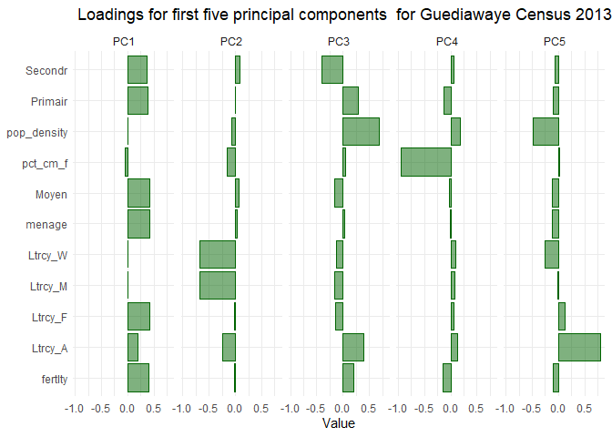

```r
rm(list=ls())
```

## Importing library


```r
## Importing library
### List of required packages
required_packages <- c("tidyverse","janitor" ,"readr","dplyr","haven","sf", "flextable","sp", "factoextra", "FactoMineR","gtsummary", "sjPlot", "fastDummies","ggthemes","spdep","patchwork")

# Check if packages are installed
missing_packages <- setdiff(required_packages, installed.packages()[,"Package"])

### Install missing packages
if (length(missing_packages) > 0) {
  install.packages(missing_packages)
}

### Load all packages
lapply(required_packages, library, character.only = TRUE)
```


```r
# Read shapefile data for 2013 and 2013


MPI_data_dr_2013 <- sf::read_sf(paste0(here::here(),"/output/output_data/MPI_data_dr_2013.shp"))
MPI_data_dr_2002 <- sf::read_sf(paste0(here::here(),"/output/output_data/MPI_data_dr_2002.shp"))
MPI_data_dr <- MPI_data_dr_2013 %>%
  plyr::rbind.fill(MPI_data_dr_2002) %>% 
  st_as_sf()
```


# Regression modeling with Guediawaye Census data


```r
#"hh_size",
predictors = c("menage","Aucun","Primair","Moyen","Secondr","fertlty","Ltrcy_F","nbr_cm_h","nbr_cm_f","pct_cm_f")
outcome = "MPI_men"
```

## Inspecting the outcome variable (MPI) with visualization


```r
mhv_map <- ggplot(MPI_data_dr_2013, aes(fill = MPI_men)) + 
  geom_sf(color = NA) + 
  scale_fill_viridis_c(direction = -1) + 
  theme_void() + 
  labs(fill = "MPI ")

mhv_histogram <- ggplot(MPI_data_dr_2013, aes(x = MPI_men)) + 
  geom_histogram(alpha = 0.5, fill = "navy", color = "navy",
                 bins = 100) + 
  theme_minimal() + 
  scale_x_continuous(labels = scales::label_number_si(accuracy = 0.1)) + 
  labs(x = "MPI")

mhv_map + mhv_histogram + labs(title = "MPI value charts for Guediawaye Census 2013")
```

<!-- -->


```r
MPI_data_dr %>% 
    
      ggplot(aes(fill = MPI_men)) + 
      
      geom_sf(color = NA) + 
  scale_fill_viridis_c(direction = -1) + 
  theme_void() + 
  labs(fill = "MPI ")+
       
      facet_wrap(~RGPH) +
      
      # Adjusting the plot theme
      theme_map(base_size = 8) +
      theme(panel.background = element_rect(),
            legend.background = element_blank(),
            axis.ticks = element_blank(),
            axis.text = element_blank(),
            legend.position = "bottom", 
            text = element_text(size = 8), 
            panel.grid = element_line(color = "white", size = 0.8))
```

<!-- -->

```r
ggplot(MPI_data_dr, aes(x = MPI_men)) + 
  geom_histogram(alpha = 0.5, fill = "navy", color = "navy",
                 bins = 100) + 
  theme_minimal() + 
  scale_x_continuous(labels = scales::label_number_si(accuracy = 0.1)) + 
  labs(x = "MPI")+
       
      facet_wrap(~RGPH) +
      
      # Adjusting the plot theme
      theme_map(base_size = 8) +
      theme(panel.background = element_rect(),
            legend.background = element_blank(),
            axis.ticks = element_blank(),
            axis.text = element_blank(),
            legend.position = "bottom", 
            text = element_text(size = 8), 
            panel.grid = element_line(color = "white", size = 0.8))
```

<!-- -->


```r
mhv_map_log <- ggplot(MPI_data_dr_2013, aes(fill = log(MPI_men))) + 
  geom_sf(color = NA) + 
  scale_fill_viridis_c(direction = -1) + 
  theme_void() + 
  labs(fill = "MPI\nvalue (log)")

mhv_histogram_log <- ggplot(MPI_data_dr_2013, aes(x = log(MPI_men))) + 
  geom_histogram(alpha = 0.5, fill = "navy", color = "navy",
                 bins = 100) + 
  theme_minimal() + 
  scale_x_continuous() + 
  labs(x = "MPI (log)")

mhv_map_log + mhv_histogram_log + labs(title = "Logged MPI value charts for Guediawaye Census 2013")
```

<!-- -->


```r
MPI_data_dr %>% 
    
      ggplot(aes(fill = log(MPI_men))) + 
      
      geom_sf(color = NA) + 
  scale_fill_viridis_c(direction = -1) + 
  theme_void() + 
  labs(fill = "MPI\nvalue (log)")+
       
      facet_wrap(~RGPH) +
      
      # Adjusting the plot theme
      theme_map(base_size = 8) +
      theme(panel.background = element_rect(),
            legend.background = element_blank(),
            axis.ticks = element_blank(),
            axis.text = element_blank(),
            legend.position = "bottom", 
            text = element_text(size = 8), 
            panel.grid = element_line(color = "white", size = 0.8))
```

<!-- -->


## A first regression model


```r
library(sf)
library(units)
predictors = c("menage","Primair","Moyen","Secondr","Ltrcy_F","pct_cm_f","hh_size","Ltrcy_A","Ltrcy_W","Ltrcy_M","fertlty")
outcome = "MPI_men"
MPI_data_dr_2013_for_model<- MPI_data_dr_2013 %>%
  dplyr::select(MPI_men,predictors) %>% 
  mutate(pop_density = as.numeric(set_units(hh_size / st_area(.), "1/km2"))) %>% 
  dplyr::select(-hh_size)

##
MPI_data_dr_2002_for_model<- MPI_data_dr_2002 %>%
  dplyr::select(MPI_men,predictors) %>% 
  mutate(pop_density = as.numeric(set_units(hh_size / st_area(.), "1/km2"))) %>% 
  dplyr::select(-hh_size)
```


```r
formula <- "log(MPI_men) ~ menage  + Primair + Moyen + Secondr + Ltrcy_F + pct_cm_f + pop_density + Ltrcy_A + Ltrcy_W + Ltrcy_M + fertlty"

model_2013 <- lm(formula = formula, data = MPI_data_dr_2013_for_model)
summary(model_2013)
```

```
## 
## Call:
## lm(formula = formula, data = MPI_data_dr_2013_for_model)
## 
## Residuals:
##     Min      1Q  Median      3Q     Max 
## -0.9660 -0.1522  0.0151  0.1668  0.9155 
## 
## Coefficients:
##               Estimate Std. Error t value Pr(>|t|)    
## (Intercept) -2.206e+00  7.881e-02 -27.993  < 2e-16 ***
## menage       8.920e-03  8.090e-04  11.026  < 2e-16 ***
## Primair      4.489e-05  3.742e-04   0.120 0.904572    
## Moyen       -4.062e-03  8.660e-04  -4.690 3.69e-06 ***
## Secondr     -5.420e-03  1.042e-03  -5.202 3.09e-07 ***
## Ltrcy_F     -1.080e-03  2.616e-04  -4.130 4.37e-05 ***
## pct_cm_f    -2.412e-01  1.605e-01  -1.502 0.133743    
## pop_density  3.315e-06  8.562e-07   3.872 0.000125 ***
## Ltrcy_A      8.242e-04  3.680e-04   2.240 0.025623 *  
## Ltrcy_W      3.519e-04  3.775e-04   0.932 0.351822    
## Ltrcy_M     -5.074e-03  1.121e-02  -0.453 0.651031    
## fertlty      1.192e-04  7.926e-05   1.504 0.133427    
## ---
## Signif. codes:  0 '***' 0.001 '**' 0.01 '*' 0.05 '.' 0.1 ' ' 1
## 
## Residual standard error: 0.2763 on 423 degrees of freedom
## Multiple R-squared:  0.5892,	Adjusted R-squared:  0.5785 
## F-statistic: 55.16 on 11 and 423 DF,  p-value: < 2.2e-16
```

```r
###
model_2002 <- lm(formula = formula, data = MPI_data_dr_2002_for_model)

summary(model_2002)
```

```
## 
## Call:
## lm(formula = formula, data = MPI_data_dr_2002_for_model)
## 
## Residuals:
##      Min       1Q   Median       3Q      Max 
## -0.93801 -0.14626  0.02407  0.15328  0.92920 
## 
## Coefficients:
##               Estimate Std. Error t value Pr(>|t|)    
## (Intercept) -2.502e+00  9.521e-02 -26.277  < 2e-16 ***
## menage       5.094e-03  6.425e-04   7.929 6.84e-14 ***
## Primair     -5.197e-04  9.546e-04  -0.544 0.586581    
## Moyen       -4.774e-03  1.305e-03  -3.659 0.000307 ***
## Secondr     -3.697e-03  1.733e-03  -2.133 0.033870 *  
## Ltrcy_F      6.215e-04  1.007e-03   0.617 0.537825    
## pct_cm_f     9.499e-02  2.789e-01   0.341 0.733699    
## pop_density -7.412e-07  8.743e-07  -0.848 0.397346    
## Ltrcy_A      3.452e-04  9.737e-05   3.545 0.000467 ***
## Ltrcy_W      2.135e-03  7.068e-04   3.021 0.002772 ** 
## Ltrcy_M     -1.789e-02  1.212e-02  -1.477 0.140927    
## fertlty      4.018e-05  5.000e-05   0.804 0.422424    
## ---
## Signif. codes:  0 '***' 0.001 '**' 0.01 '*' 0.05 '.' 0.1 ' ' 1
## 
## Residual standard error: 0.2598 on 256 degrees of freedom
## Multiple R-squared:  0.6361,	Adjusted R-squared:  0.6205 
## F-statistic: 40.69 on 11 and 256 DF,  p-value: < 2.2e-16
```


```r
library(corrr)

dfw_estimates_2013 <- MPI_data_dr_2013_for_model%>%
  select(-MPI_men) %>%
  st_drop_geometry()

correlations <- correlate(dfw_estimates_2013, method = "pearson")
network_plot(correlations) + labs(title = "Network plot of correlations between model predictors for Guediawaye Census 2013")
```

<!-- -->

```r
##
dfw_estimates_2002 <- MPI_data_dr_2002_for_model%>%
  select(-MPI_men) %>%
  st_drop_geometry()

correlations <- correlate(dfw_estimates_2002, method = "pearson")
network_plot(correlations) + labs(title = "Network plot of correlations between model predictors for Guediawaye Census 2002")
```

<!-- -->


```r
library(car)

vif(model_2013)
```

```
##      menage     Primair       Moyen     Secondr     Ltrcy_F    pct_cm_f 
##    3.871359    6.364877    8.106134    6.016109    7.975205    1.078805 
## pop_density     Ltrcy_A     Ltrcy_W     Ltrcy_M     fertlty 
##    1.310951    1.753154    1.482194    1.495710    5.367791
```

```r
vif(model_2002)
```

```
##      menage     Primair       Moyen     Secondr     Ltrcy_F    pct_cm_f 
##    3.245263  296.905235   62.394454   23.511511  676.243716    1.192264 
## pop_density     Ltrcy_A     Ltrcy_W     Ltrcy_M     fertlty 
##    5.093219    4.316810    2.813059    2.154716   12.816729
```

## Dimension reduction with principal components analysis


```r
pca_2013 <- prcomp(
  formula = ~., 
  data = dfw_estimates_2013, 
  scale. = TRUE, 
  center = TRUE
)

summary(pca_2013)
```

```
## Importance of components:
##                           PC1    PC2    PC3    PC4     PC5     PC6     PC7
## Standard deviation     2.1830 1.2702 1.1990 1.0093 0.86570 0.70864 0.63550
## Proportion of Variance 0.4332 0.1467 0.1307 0.0926 0.06813 0.04565 0.03671
## Cumulative Proportion  0.4332 0.5799 0.7106 0.8032 0.87133 0.91698 0.95369
##                            PC8     PC9    PC10    PC11
## Standard deviation     0.46543 0.35450 0.28978 0.28829
## Proportion of Variance 0.01969 0.01142 0.00763 0.00756
## Cumulative Proportion  0.97339 0.98481 0.99244 1.00000
```

```r
##
pca_2002 <- prcomp(
  formula = ~., 
  data = dfw_estimates_2002, 
  scale. = TRUE, 
  center = TRUE
)

summary(pca_2002)
```

```
## Importance of components:
##                          PC1    PC2    PC3     PC4    PC5     PC6     PC7
## Standard deviation     2.484 1.2669 1.1310 0.89828 0.6902 0.51195 0.42413
## Proportion of Variance 0.561 0.1459 0.1163 0.07335 0.0433 0.02383 0.01635
## Cumulative Proportion  0.561 0.7069 0.8232 0.89657 0.9399 0.96370 0.98005
##                            PC8     PC9    PC10    PC11
## Standard deviation     0.34446 0.24919 0.19411 0.03123
## Proportion of Variance 0.01079 0.00565 0.00343 0.00009
## Cumulative Proportion  0.99084 0.99649 0.99991 1.00000
```


```r
pca_2013_tibble <- pca_2013$rotation %>%
  as_tibble(rownames = "predictor")
pca_2013_tibble
```

```
## # A tibble: 11 × 12
##    predictor       PC1      PC2     PC3      PC4     PC5    PC6      PC7     PC8
##    <chr>         <dbl>    <dbl>   <dbl>    <dbl>   <dbl>  <dbl>    <dbl>   <dbl>
##  1 menage      0.411    0.0273   0.0207 -0.00165 -0.116   0.171 -0.100   -0.860 
##  2 Primair     0.391    0.00136  0.292  -0.134   -0.0931  0.278 -0.182    0.321 
##  3 Moyen       0.423    0.0591  -0.169  -0.0299  -0.123  -0.105  0.0880   0.292 
##  4 Secondr     0.359    0.0776  -0.404   0.0669  -0.0637 -0.350  0.241   -0.0562
##  5 Ltrcy_F     0.419   -0.0249  -0.140   0.0607   0.118  -0.310  0.179    0.148 
##  6 pct_cm_f   -0.0501  -0.160    0.0499 -0.944    0.0273 -0.226  0.135   -0.0901
##  7 Ltrcy_A     0.187   -0.242    0.385   0.127    0.804  -0.193 -0.00979 -0.0681
##  8 Ltrcy_W     0.00824 -0.670   -0.121   0.0919  -0.249  -0.329 -0.598    0.0156
##  9 Ltrcy_M     0.00631 -0.670   -0.169   0.0737  -0.0179  0.453  0.556    0.0105
## 10 fertlty     0.397   -0.0175   0.210  -0.142   -0.0923  0.369 -0.195    0.177 
## 11 pop_densi…  0.00230 -0.0771   0.682   0.178   -0.477  -0.355  0.370   -0.0462
## # ℹ 3 more variables: PC9 <dbl>, PC10 <dbl>, PC11 <dbl>
```

```r
###
pca_2002_tibble <- pca_2002$rotation %>%
  as_tibble(rownames = "predictor")
pca_2002_tibble
```

```
## # A tibble: 11 × 12
##    predictor       PC1     PC2     PC3      PC4     PC5     PC6     PC7      PC8
##    <chr>         <dbl>   <dbl>   <dbl>    <dbl>   <dbl>   <dbl>   <dbl>    <dbl>
##  1 menage       0.317  -0.151   0.0760  1.53e-1  0.743  -0.386   0.0986 -0.334  
##  2 Primair      0.386  -0.0977 -0.0903  1.77e-2  0.0916  0.125   0.0829  0.551  
##  3 Moyen        0.366   0.0740  0.250   2.23e-1 -0.182   0.0868 -0.0602  0.0971 
##  4 Secondr      0.259   0.199   0.519   3.79e-1 -0.230   0.162  -0.0422 -0.401  
##  5 Ltrcy_F      0.394  -0.0113  0.0838  1.19e-1 -0.0357  0.120   0.0212  0.326  
##  6 pct_cm_f    -0.0469 -0.168  -0.612   7.50e-1 -0.0961  0.0674 -0.0988 -0.0935 
##  7 Ltrcy_A      0.342  -0.0715 -0.174  -2.34e-1 -0.311  -0.481  -0.664  -0.115  
##  8 Ltrcy_W      0.190   0.586  -0.273  -7.74e-6 -0.233  -0.446   0.540  -0.00999
##  9 Ltrcy_M      0.0267  0.707  -0.206  -4.56e-2  0.388   0.348  -0.425  -0.0105 
## 10 fertlty      0.373  -0.141  -0.163  -1.40e-1  0.140   0.135   0.0543  0.0967 
## 11 pop_density  0.316  -0.157  -0.315  -3.60e-1 -0.148   0.462   0.229  -0.526  
## # ℹ 3 more variables: PC9 <dbl>, PC10 <dbl>, PC11 <dbl>
```


```r
pca_2013_tibble %>%
  select(predictor:PC5) %>%
  pivot_longer(PC1:PC5, names_to = "component", values_to = "value") %>%
  ggplot(aes(x = value, y = predictor)) + 
  geom_col(fill = "darkgreen", color = "darkgreen", alpha = 0.5) + 
  facet_wrap(~component, nrow = 1) + 
  labs(y = NULL, x = "Value", title = " Loadings for first five principal components  for Guediawaye Census 2013") + 
  theme_minimal()
```

<!-- -->


```r
pca_2002_tibble %>%
  select(predictor:PC5) %>%
  pivot_longer(PC1:PC5, names_to = "component", values_to = "value") %>%
  ggplot(aes(x = value, y = predictor)) + 
  geom_col(fill = "darkgreen", color = "darkgreen", alpha = 0.5) + 
  facet_wrap(~component, nrow = 1) + 
  labs(y = NULL, x = "Value", title = " Loadings for first five principal components  for Guediawaye Census 2002") + 
  theme_minimal()
```

<!-- -->


```r
components_2013 <- predict(pca_2013, dfw_estimates_2013)

dfw_pca_2013 <- MPI_data_dr_2013_for_model%>%
  select(MPI_men) %>%
  cbind(components_2013) 

ggplot(dfw_pca_2013, aes(fill = PC1)) +
  geom_sf(color = NA) +
  labs(title = "Map of principal component 1 for Guediawaye Census 2013") +
  theme_void() +
  scale_fill_viridis_c(direction = -1)
```

<!-- -->


```r
components_2002 <- predict(pca_2002, dfw_estimates_2002)

dfw_pca_2002 <- MPI_data_dr_2002_for_model%>%
  select(MPI_men) %>%
  cbind(components_2002) 

ggplot(dfw_pca_2002, aes(fill = PC1)) +
  geom_sf(color = NA) +
  labs(title = "Map of principal component 1 for Guediawaye Census 2002") +
  theme_void() +
  scale_fill_viridis_c(direction = -1)
```

<!-- -->

```r
dfw_pca_2002$RGPH<-"Census 2002"
dfw_pca_2013$RGPH<-"Census 2013"
dfw_pca <- dfw_pca_2002 %>%
  plyr::rbind.fill(dfw_pca_2013) %>% 
  st_as_sf()


dfw_pca %>% 
    
      ggplot(aes(fill = PC1))  + 
      
      # Adding spatial features to the plot
      geom_sf(color = NA) +
       scale_fill_viridis_c(direction = -1)+
      facet_wrap(~RGPH) +
      
      # Adjusting the plot theme
      theme_map(base_size = 8) +
      theme(panel.background = element_rect(),
            legend.background = element_blank(),
            axis.ticks = element_blank(),
            axis.text = element_blank(),
            legend.position = "bottom", 
            text = element_text(size = 8), 
            panel.grid = element_line(color = "white", size = 0.8))
```

<!-- -->


```r
dfw_pca %>% 
    
      ggplot(aes(fill = PC2))  + 
      
      # Adding spatial features to the plot
      geom_sf(color = NA) +
       scale_fill_viridis_c(direction = -1)+
      facet_wrap(~RGPH) +
      
      # Adjusting the plot theme
      theme_map(base_size = 8) +
      theme(panel.background = element_rect(),
            legend.background = element_blank(),
            axis.ticks = element_blank(),
            axis.text = element_blank(),
            legend.position = "bottom", 
            text = element_text(size = 8), 
            panel.grid = element_line(color = "white", size = 0.8))
```

<!-- -->


```r
pca_2013_formula <- paste0("log(MPI_men) ~ ", 
                      paste0('PC', 1:6, collapse = ' + '))

pca_2013_model <- lm(formula = pca_2013_formula, data = dfw_pca_2013)

summary(pca_2013_model)
```

```
## 
## Call:
## lm(formula = pca_2013_formula, data = dfw_pca_2013)
## 
## Residuals:
##      Min       1Q   Median       3Q      Max 
## -1.24987 -0.18277  0.02653  0.20470  1.04081 
## 
## Coefficients:
##              Estimate Std. Error  t value Pr(>|t|)    
## (Intercept) -2.198765   0.015293 -143.780  < 2e-16 ***
## PC1         -0.053705   0.007013   -7.657 1.28e-13 ***
## PC2         -0.028598   0.012053   -2.373   0.0181 *  
## PC3          0.190360   0.012769   14.908  < 2e-16 ***
## PC4          0.012829   0.015169    0.846   0.3982    
## PC5         -0.024572   0.017685   -1.389   0.1654    
## PC6          0.161101   0.021605    7.457 4.97e-13 ***
## ---
## Signif. codes:  0 '***' 0.001 '**' 0.01 '*' 0.05 '.' 0.1 ' ' 1
## 
## Residual standard error: 0.319 on 428 degrees of freedom
## Multiple R-squared:  0.4461,	Adjusted R-squared:  0.4384 
## F-statistic: 57.46 on 6 and 428 DF,  p-value: < 2.2e-16
```

```r
###
pca_2002_formula <- paste0("log(MPI_men) ~ ", 
                      paste0('PC', 1:6, collapse = ' + '))

pca_2002_model <- lm(formula = pca_2002_formula, data = dfw_pca_2002)

summary(pca_2002_model)
```

```
## 
## Call:
## lm(formula = pca_2002_formula, data = dfw_pca_2002)
## 
## Residuals:
##      Min       1Q   Median       3Q      Max 
## -0.85562 -0.14210  0.02181  0.16672  0.90081 
## 
## Coefficients:
##              Estimate Std. Error  t value Pr(>|t|)    
## (Intercept) -2.372798   0.016131 -147.095  < 2e-16 ***
## PC1         -0.034208   0.006506   -5.258 3.03e-07 ***
## PC2         -0.077519   0.012757   -6.077 4.33e-09 ***
## PC3         -0.184749   0.014289  -12.929  < 2e-16 ***
## PC4         -0.118827   0.017991   -6.605 2.22e-10 ***
## PC5          0.209272   0.023416    8.937  < 2e-16 ***
## PC6         -0.254087   0.031568   -8.049 2.96e-14 ***
## ---
## Signif. codes:  0 '***' 0.001 '**' 0.01 '*' 0.05 '.' 0.1 ' ' 1
## 
## Residual standard error: 0.2641 on 261 degrees of freedom
## Multiple R-squared:  0.6167,	Adjusted R-squared:  0.6079 
## F-statistic:    70 on 6 and 261 DF,  p-value: < 2.2e-16
```

## Spatial regression


```r
MPI_data_dr_2013_for_model$residuals <- residuals(model_2013)

ggplot(MPI_data_dr_2013_for_model, aes(x = residuals)) + 
  geom_histogram(bins = 100, alpha = 0.5, color = "navy",
                 fill = "navy") + 
  labs(title = "Distribution of model residuals for Guediawaye Census 2013") +
  theme_minimal()
```

<!-- -->


```r
MPI_data_dr_2002_for_model$residuals <- residuals(model_2002)

ggplot(MPI_data_dr_2002_for_model, aes(x = residuals)) + 
  geom_histogram(bins = 100, alpha = 0.5, color = "navy",
                 fill = "navy") + 
  labs(title = "Distribution of model residuals for Guediawaye Census 2002") +
  theme_minimal()
```

<!-- -->


```r
MPI_data_dr_for_model <- MPI_data_dr_2002_for_model %>%
  dplyr::mutate(RGPH = "Census 2002") %>% 
  plyr::rbind.fill(MPI_data_dr_2013_for_model %>%
  dplyr::mutate(RGPH = "Census 2013"))

ggplot(MPI_data_dr_for_model, aes(x = residuals)) + 
      geom_histogram(bins = 100, alpha = 0.5, color = "navy",
                 fill = "navy") +
       
      facet_wrap(~RGPH) +
      
      # Adjusting the plot theme
      theme_map(base_size = 8) +
      theme(panel.background = element_rect(),
            legend.background = element_blank(),
            axis.ticks = element_blank(),
            axis.text = element_blank(),
            legend.position = "bottom", 
            text = element_text(size = 8), 
            panel.grid = element_line(color = "white", size = 0.8))
```

<!-- -->


```r
library(spdep)

wts_2013 <- MPI_data_dr_2013_for_model %>%
  poly2nb() %>%
  nb2listw()

moran.test(MPI_data_dr_2013_for_model$residuals, wts_2013)
```

```
## 
## 	Moran I test under randomisation
## 
## data:  MPI_data_dr_2013_for_model$residuals  
## weights: wts_2013    
## 
## Moran I statistic standard deviate = 4.7117, p-value = 1.228e-06
## alternative hypothesis: greater
## sample estimates:
## Moran I statistic       Expectation          Variance 
##      0.1325997182     -0.0023041475      0.0008197714
```


```r
wts_2002 <- MPI_data_dr_2002_for_model %>%
  poly2nb() %>%
  nb2listw()

moran.test(MPI_data_dr_2002_for_model$residuals, wts_2002)
```

```
## 
## 	Moran I test under randomisation
## 
## data:  MPI_data_dr_2002_for_model$residuals  
## weights: wts_2002    
## 
## Moran I statistic standard deviate = 2.1911, p-value = 0.01422
## alternative hypothesis: greater
## sample estimates:
## Moran I statistic       Expectation          Variance 
##       0.077202122      -0.003745318       0.001364795
```


```r
MPI_data_dr_2013_for_model$lagged_residuals <- lag.listw(wts_2013, MPI_data_dr_2013_for_model$residuals)

ggplot(MPI_data_dr_2013_for_model, aes(x = residuals, y = lagged_residuals)) + 
  theme_minimal() + 
  labs(title = "Moran scatterplot of residual spatial autocorrelation for Guediawaye Census 2013") +
  geom_point(alpha = 0.5) + 
  geom_smooth(method = "lm", color = "red")
```

<!-- -->

```r
MPI_data_dr_2002_for_model$lagged_residuals <- lag.listw(wts_2002, MPI_data_dr_2002_for_model$residuals)

ggplot(MPI_data_dr_2002_for_model, aes(x = residuals, y = lagged_residuals)) + 
  theme_minimal() + 
  labs(title = "Moran scatterplot of residual spatial autocorrelation for Guediawaye Census 2002") +
  geom_point(alpha = 0.5) + 
  geom_smooth(method = "lm", color = "red")
```

<!-- -->

```r
MPI_data_dr_for_model <- MPI_data_dr_2002_for_model %>%
  dplyr::mutate(RGPH = "Census 2002") %>% 
  plyr::rbind.fill(MPI_data_dr_2013_for_model %>%
  dplyr::mutate(RGPH = "Census 2013"))

ggplot(MPI_data_dr_for_model, aes(x = residuals, y = lagged_residuals)) + 
  geom_point(alpha = 0.5) + 
  geom_smooth(method = "lm", color = "red")+
      facet_wrap(~RGPH) +
      
      # Adjusting the plot theme
      theme_map(base_size = 8) +
      theme(panel.background = element_rect(),
            legend.background = element_blank(),
            axis.ticks = element_blank(),
            axis.text = element_blank(),
            legend.position = "bottom", 
            text = element_text(size = 8), 
            panel.grid = element_line(color = "white", size = 0.8))
```

<!-- -->


# Geographically weighted regression

## Choosing a bandwidth for GWR


```r
library(GWmodel)
library(sf)

dfw_data_sp_2013 <- MPI_data_dr_2013_for_model%>%
  as_Spatial()

bw <- bw.gwr(
  formula = formula, 
  data = dfw_data_sp_2013, 
  kernel = "bisquare",
  adaptive = TRUE
)
```

```
## Adaptive bandwidth: 276 CV score: 33.03686 
## Adaptive bandwidth: 179 CV score: 32.93194 
## Adaptive bandwidth: 117 CV score: 34.2892 
## Adaptive bandwidth: 215 CV score: 32.81678 
## Adaptive bandwidth: 240 CV score: 32.88297 
## Adaptive bandwidth: 202 CV score: 32.80238 
## Adaptive bandwidth: 191 CV score: 32.84514 
## Adaptive bandwidth: 205 CV score: 32.78626 
## Adaptive bandwidth: 211 CV score: 32.81625 
## Adaptive bandwidth: 205 CV score: 32.78626
```

```r
###
dfw_data_sp_2002 <- MPI_data_dr_2002_for_model%>%
  as_Spatial()

bw <- bw.gwr(
  formula = formula, 
  data = dfw_data_sp_2002, 
  kernel = "bisquare",
  adaptive = TRUE
)
```

```
## Adaptive bandwidth: 173 CV score: 30.77821 
## Adaptive bandwidth: 115 CV score: 22.62838 
## Adaptive bandwidth: 78 CV score: 18.01934 
## Adaptive bandwidth: 56 CV score: 20.35081 
## Adaptive bandwidth: 92 CV score: 18.83631 
## Adaptive bandwidth: 69 CV score: 18.26553 
## Adaptive bandwidth: 83 CV score: 18.02488 
## Adaptive bandwidth: 74 CV score: 18.01254 
## Adaptive bandwidth: 72 CV score: 18.08195 
## Adaptive bandwidth: 75 CV score: 17.91883 
## Adaptive bandwidth: 76 CV score: 17.96413 
## Adaptive bandwidth: 74 CV score: 18.01254 
## Adaptive bandwidth: 75 CV score: 17.91883
```


```r
gw_model_2013 <- gwr.basic(
  formula = formula, 
  data = dfw_data_sp_2013, 
  bw = bw,
  kernel = "bisquare",
  adaptive = TRUE
)

###
gw_model_2002 <- gwr.basic(
  formula = formula, 
  data = dfw_data_sp_2002, 
  bw = bw,
  kernel = "bisquare",
  adaptive = TRUE
)
```


```r
names(gw_model_2013)
```

```
## [1] "GW.arguments"  "GW.diagnostic" "lm"            "SDF"          
## [5] "timings"       "this.call"     "Ftests"
```

```r
##
names(gw_model_2002)
```

```
## [1] "GW.arguments"  "GW.diagnostic" "lm"            "SDF"          
## [5] "timings"       "this.call"     "Ftests"
```


```r
gw_model_2013_results <- gw_model_2013$SDF %>%
  st_as_sf() 

names(gw_model_2013_results)
```

```
##  [1] "Intercept"      "menage"         "Primair"        "Moyen"         
##  [5] "Secondr"        "Ltrcy_F"        "pct_cm_f"       "pop_density"   
##  [9] "Ltrcy_A"        "Ltrcy_W"        "Ltrcy_M"        "fertlty"       
## [13] "y"              "yhat"           "residual"       "CV_Score"      
## [17] "Stud_residual"  "Intercept_SE"   "menage_SE"      "Primair_SE"    
## [21] "Moyen_SE"       "Secondr_SE"     "Ltrcy_F_SE"     "pct_cm_f_SE"   
## [25] "pop_density_SE" "Ltrcy_A_SE"     "Ltrcy_W_SE"     "Ltrcy_M_SE"    
## [29] "fertlty_SE"     "Intercept_TV"   "menage_TV"      "Primair_TV"    
## [33] "Moyen_TV"       "Secondr_TV"     "Ltrcy_F_TV"     "pct_cm_f_TV"   
## [37] "pop_density_TV" "Ltrcy_A_TV"     "Ltrcy_W_TV"     "Ltrcy_M_TV"    
## [41] "fertlty_TV"     "Local_R2"       "geometry"
```

```r
###
gw_model_2002_results <- gw_model_2002$SDF %>%
  st_as_sf() 

names(gw_model_2002_results)
```

```
##  [1] "Intercept"      "menage"         "Primair"        "Moyen"         
##  [5] "Secondr"        "Ltrcy_F"        "pct_cm_f"       "pop_density"   
##  [9] "Ltrcy_A"        "Ltrcy_W"        "Ltrcy_M"        "fertlty"       
## [13] "y"              "yhat"           "residual"       "CV_Score"      
## [17] "Stud_residual"  "Intercept_SE"   "menage_SE"      "Primair_SE"    
## [21] "Moyen_SE"       "Secondr_SE"     "Ltrcy_F_SE"     "pct_cm_f_SE"   
## [25] "pop_density_SE" "Ltrcy_A_SE"     "Ltrcy_W_SE"     "Ltrcy_M_SE"    
## [29] "fertlty_SE"     "Intercept_TV"   "menage_TV"      "Primair_TV"    
## [33] "Moyen_TV"       "Secondr_TV"     "Ltrcy_F_TV"     "pct_cm_f_TV"   
## [37] "pop_density_TV" "Ltrcy_A_TV"     "Ltrcy_W_TV"     "Ltrcy_M_TV"    
## [41] "fertlty_TV"     "Local_R2"       "geometry"
```


```r
ggplot(gw_model_2013_results, aes(fill = Local_R2)) + 
  geom_sf(color = NA) + 
  scale_fill_viridis_c(direction = -1) + 
  labs(title = "Local R-squared values from the GWR model for Guediawaye Census 2013") +
  theme_void()
```

<!-- -->

```r
ggplot(gw_model_2002_results, aes(fill = Local_R2)) + 
  geom_sf(color = NA) + 
  scale_fill_viridis_c(direction = -1) + 
  labs(title = "Local R-squared values from the GWR model for Guediawaye Census 2002") +
  theme_void()
```

<!-- -->


```r
gw_model_results <- gw_model_2002_results %>%
  dplyr::mutate(RGPH = "Census 2002") %>% 
  plyr::rbind.fill(gw_model_2013_results %>%
  dplyr::mutate(RGPH = "Census 2013")) %>% 
  st_as_sf()


gw_model_results %>% 
    
      ggplot(aes(fill = Local_R2)) + 
      
      # Adding spatial features to the plot
      geom_sf() +
      
      scale_fill_viridis_c(direction = -1) +
       
      facet_wrap(~RGPH) +
      
      # Adjusting the plot theme
      theme_map(base_size = 8) +
      theme(panel.background = element_rect(),
            legend.background = element_blank(),
            axis.ticks = element_blank(),
            axis.text = element_blank(),
            legend.position = "bottom", 
            text = element_text(size = 8), 
            panel.grid = element_line(color = "white", size = 0.8))
```

<!-- -->


```r
ggplot(gw_model_2013_results, aes(fill = menage)) + 
  geom_sf(color = NA) + 
  scale_fill_viridis_c(direction = -1) + 
  labs(title = "Local parameter estimates for household members for Guediawaye Census 2013") +
  theme_void() + 
  labs(fill = "Local β for \nHH")
```

<!-- -->

```r
ggplot(gw_model_2002_results, aes(fill = menage)) + 
  geom_sf(color = NA) + 
  scale_fill_viridis_c(direction = -1) + 
  labs(title = "Local parameter estimates for household members for Guediawaye Census 2002") +
  theme_void() + 
  labs(fill = "Local β for \nHH")
```

<!-- -->


```r
gw_model_results <- gw_model_2002_results %>%
  dplyr::mutate(RGPH = "Census 2002") %>% 
  plyr::rbind.fill(gw_model_2013_results %>%
  dplyr::mutate(RGPH = "Census 2013")) %>% 
  st_as_sf()


gw_model_results %>% 
    
      ggplot(aes(fill = menage)) + 
      
      # Adding spatial features to the plot
      geom_sf() +
      
      scale_fill_viridis_c(direction = -1) +
  labs(fill = "Local β for \nHH")+
      facet_wrap(~RGPH) +
      
      # Adjusting the plot theme
      theme_map(base_size = 8) +
      theme(panel.background = element_rect(),
            legend.background = element_blank(),
            axis.ticks = element_blank(),
            axis.text = element_blank(),
            legend.position = "bottom", 
            text = element_text(size = 8), 
            panel.grid = element_line(color = "white", size = 0.8))
```

<!-- -->


```r
ggplot(gw_model_2013_results, aes(fill = pop_density)) + 
  geom_sf(color = NA) + 
  scale_fill_viridis_c(direction = -1) + 
  labs(title = "Local parameter estimates for population density for Guediawaye Census 2013") +
  theme_void() + 
  labs(fill = "Local β for \npopulation density")
```

<!-- -->

```r
ggplot(gw_model_2002_results, aes(fill = pop_density)) + 
  geom_sf(color = NA) + 
  scale_fill_viridis_c(direction = -1) + 
  labs(title = "Local parameter estimates for population density for Guediawaye Census 2002") +
  theme_void() + 
  labs(fill = "Local β for \npopulation density")
```

<!-- -->


```r
gw_model_results <- gw_model_2002_results %>%
  dplyr::mutate(RGPH = "Census 2002") %>% 
  plyr::rbind.fill(gw_model_2013_results %>%
  dplyr::mutate(RGPH = "Census 2013")) %>% 
  st_as_sf()


gw_model_results %>% 
    
      ggplot(aes(fill = pop_density)) + 
      
      # Adding spatial features to the plot
      geom_sf() +
      
      scale_fill_viridis_c(direction = -1) +
  labs(fill = "Local β for \npopulation density")+
      facet_wrap(~RGPH) +
      
      # Adjusting the plot theme
      theme_map(base_size = 8) +
      theme(panel.background = element_rect(),
            legend.background = element_blank(),
            axis.ticks = element_blank(),
            axis.text = element_blank(),
            legend.position = "bottom", 
            text = element_text(size = 8), 
            panel.grid = element_line(color = "white", size = 0.8))
```

<!-- -->


# Classification and clustering of Guediawaye census data

## Geodemographic classification


```r
set.seed(1994)

dfw_kmeans_2013 <- dfw_pca_2013 %>%
  st_drop_geometry() %>%
  select(PC1:PC8) %>%
  kmeans(centers = 6)

table(dfw_kmeans_2013$cluster)
```

```
## 
##   1   2   3   4   5   6 
##  53  73 139  71  95   4
```

```r
##
dfw_kmeans_2002 <- dfw_pca_2002 %>%
  st_drop_geometry() %>%
  select(PC1:PC8) %>%
  kmeans(centers = 6)

table(dfw_kmeans_2002$cluster)
```

```
## 
##  1  2  3  4  5  6 
## 71 38  3  3 85 68
```


```r
dfw_clusters_2013 <- dfw_pca_2013 %>%
  mutate(cluster = as.character(dfw_kmeans_2013$cluster))

ggplot(dfw_clusters_2013, aes(fill = cluster)) + 
  geom_sf(size = 0.1) + 
  scale_fill_brewer(palette = "Set1") + 
  labs(title = "Map of geodemographic clusters for Guediawaye Census 2013") +
  theme_void() + 
  labs(fill = "Cluster ")
```

<!-- -->


```r
dfw_clusters_2002 <- dfw_pca_2002 %>%
  mutate(cluster = as.character(dfw_kmeans_2002$cluster))

ggplot(dfw_clusters_2002, aes(fill = cluster)) + 
  geom_sf(size = 0.1) + 
  scale_fill_brewer(palette = "Set1") + 
  labs(title = "Map of geodemographic clusters for Guediawaye Census 2002") +
  theme_void() + 
  labs(fill = "Cluster ")
```

<!-- -->

```r
dfw_clusters <- dfw_clusters_2002 %>%
  dplyr::mutate(RGPH = "Census 2002") %>% 
  plyr::rbind.fill(dfw_clusters_2013 %>%
  dplyr::mutate(RGPH = "Census 2013")) %>% 
  st_as_sf()


dfw_clusters %>% 
    
      ggplot(aes(fill = cluster)) + 
      
  geom_sf(size = 0.1) + 
  scale_fill_brewer(palette = "Set1") + 
      facet_wrap(~RGPH) +
      
      # Adjusting the plot theme
      theme_map(base_size = 8) +
      theme(panel.background = element_rect(),
            legend.background = element_blank(),
            axis.ticks = element_blank(),
            axis.text = element_blank(),
            legend.position = "bottom", 
            text = element_text(size = 8), 
            panel.grid = element_line(color = "white", size = 0.8))
```

<!-- -->


```r
library(plotly)

cluster_plot <- ggplot(dfw_clusters_2013, 
                       aes(x = PC1, y = PC2, color = cluster)) + 
  geom_point() + 
  scale_color_brewer(palette = "Set1") + 
  labs(title = "Interactive scatterplot of PC1 and PC2 colored by cluster for Guediawaye Census 2013") +
  theme_minimal()

ggplotly(cluster_plot) %>%
  layout(legend = list(orientation = "h", y = -0.15, 
                       x = 0.2, title = "Cluster"))
```

```{=html}
<div class="plotly html-widget html-fill-item-overflow-hidden html-fill-item" id="htmlwidget-c9fb4393a882a12d9b84" style="width:672px;height:480px;"></div>
<script type="application/json" data-for="htmlwidget-c9fb4393a882a12d9b84">{"x":{"data":[{"x":[3.2450046121419733,2.5715118251503237,2.5266280720644905,5.7410435255660399,5.3069869715382767,2.2374826927994249,5.4541592074985337,2.6685355738251322,5.604062987931469,4.7145302409722865,3.8858269323661281,4.498059360990478,3.5127505562004422,3.9230272598493849,3.2360590246239194,3.563203330265253,3.8622952357284062,3.8036316438819435,3.4757211582218792,2.4837541634695657,2.4596164801976945,3.1870977302002435,3.272496882272812,5.2689782995672259,2.8449305001390641,2.4993040130125785,4.5696190332447113,5.258983245555962,4.0643596369589439,3.2598555770100384,4.1243860797771239,2.6149431264429217,3.2366279615937446,3.8608096780771084,4.0181794546400553,5.0852993928803221,4.54389546261954,2.6963567324418434,5.3248467207168764,9.3322187640450522,7.394376206092419,2.8379747220933065,5.728564554481947,4.6633568436041308,3.8851364488899289,6.2891263663397057,3.8990619889544806,3.3687120739404586,3.9397920352643547,2.5711782163360128,4.1225023989337704,3.1158902157706896,4.103855725405638],"y":[0.64646426594050177,0.83764367483862823,0.61640202975422542,0.89094172988840103,-0.026098550931764802,0.93294341727733288,0.013596106305033273,0.77221639738727577,0.37596226233935859,0.73061787278919221,-0.96419536058099931,0.064840644350016713,0.28405944405958067,0.81178549360830454,0.75362409937947372,0.28618509352023863,0.061981982522160348,0.42647660649211516,-0.57140984740718559,0.47435721929439673,0.35339780673997356,0.68775309651118166,1.2454413863318088,0.89005671162976119,0.55283334381967331,1.0170634576213693,-0.016219377979511312,0.61640796881398863,0.20432047358723254,0.40168133633037562,0.10121887816145431,0.50674787708971802,0.84672245565627469,0.57642531168199818,-0.2799960438062255,0.076705003528374505,-0.74323742222717115,0.27047625438628176,0.12596496793056094,-2.1120133431348695,-0.15888436099287262,0.17265435745861615,1.0096212363171695,-0.7285889566960706,0.45519090797311978,0.5283346084564926,-1.0357574220430521,0.26716521447193092,0.47661425436777433,0.60991104920353456,1.0423482214000332,0.57255013267094479,-0.38256674557998965],"text":["PC1:  3.245004612<br />PC2:   0.646464266<br />cluster: 1","PC1:  2.571511825<br />PC2:   0.837643675<br />cluster: 1","PC1:  2.526628072<br />PC2:   0.616402030<br />cluster: 1","PC1:  5.741043526<br />PC2:   0.890941730<br />cluster: 1","PC1:  5.306986972<br />PC2:  -0.026098551<br />cluster: 1","PC1:  2.237482693<br />PC2:   0.932943417<br />cluster: 1","PC1:  5.454159207<br />PC2:   0.013596106<br />cluster: 1","PC1:  2.668535574<br />PC2:   0.772216397<br />cluster: 1","PC1:  5.604062988<br />PC2:   0.375962262<br />cluster: 1","PC1:  4.714530241<br />PC2:   0.730617873<br />cluster: 1","PC1:  3.885826932<br />PC2:  -0.964195361<br />cluster: 1","PC1:  4.498059361<br />PC2:   0.064840644<br />cluster: 1","PC1:  3.512750556<br />PC2:   0.284059444<br />cluster: 1","PC1:  3.923027260<br />PC2:   0.811785494<br />cluster: 1","PC1:  3.236059025<br />PC2:   0.753624099<br />cluster: 1","PC1:  3.563203330<br />PC2:   0.286185094<br />cluster: 1","PC1:  3.862295236<br />PC2:   0.061981983<br />cluster: 1","PC1:  3.803631644<br />PC2:   0.426476606<br />cluster: 1","PC1:  3.475721158<br />PC2:  -0.571409847<br />cluster: 1","PC1:  2.483754163<br />PC2:   0.474357219<br />cluster: 1","PC1:  2.459616480<br />PC2:   0.353397807<br />cluster: 1","PC1:  3.187097730<br />PC2:   0.687753097<br />cluster: 1","PC1:  3.272496882<br />PC2:   1.245441386<br />cluster: 1","PC1:  5.268978300<br />PC2:   0.890056712<br />cluster: 1","PC1:  2.844930500<br />PC2:   0.552833344<br />cluster: 1","PC1:  2.499304013<br />PC2:   1.017063458<br />cluster: 1","PC1:  4.569619033<br />PC2:  -0.016219378<br />cluster: 1","PC1:  5.258983246<br />PC2:   0.616407969<br />cluster: 1","PC1:  4.064359637<br />PC2:   0.204320474<br />cluster: 1","PC1:  3.259855577<br />PC2:   0.401681336<br />cluster: 1","PC1:  4.124386080<br />PC2:   0.101218878<br />cluster: 1","PC1:  2.614943126<br />PC2:   0.506747877<br />cluster: 1","PC1:  3.236627962<br />PC2:   0.846722456<br />cluster: 1","PC1:  3.860809678<br />PC2:   0.576425312<br />cluster: 1","PC1:  4.018179455<br />PC2:  -0.279996044<br />cluster: 1","PC1:  5.085299393<br />PC2:   0.076705004<br />cluster: 1","PC1:  4.543895463<br />PC2:  -0.743237422<br />cluster: 1","PC1:  2.696356732<br />PC2:   0.270476254<br />cluster: 1","PC1:  5.324846721<br />PC2:   0.125964968<br />cluster: 1","PC1:  9.332218764<br />PC2:  -2.112013343<br />cluster: 1","PC1:  7.394376206<br />PC2:  -0.158884361<br />cluster: 1","PC1:  2.837974722<br />PC2:   0.172654357<br />cluster: 1","PC1:  5.728564554<br />PC2:   1.009621236<br />cluster: 1","PC1:  4.663356844<br />PC2:  -0.728588957<br />cluster: 1","PC1:  3.885136449<br />PC2:   0.455190908<br />cluster: 1","PC1:  6.289126366<br />PC2:   0.528334608<br />cluster: 1","PC1:  3.899061989<br />PC2:  -1.035757422<br />cluster: 1","PC1:  3.368712074<br />PC2:   0.267165214<br />cluster: 1","PC1:  3.939792035<br />PC2:   0.476614254<br />cluster: 1","PC1:  2.571178216<br />PC2:   0.609911049<br />cluster: 1","PC1:  4.122502399<br />PC2:   1.042348221<br />cluster: 1","PC1:  3.115890216<br />PC2:   0.572550133<br />cluster: 1","PC1:  4.103855725<br />PC2:  -0.382566746<br />cluster: 1"],"type":"scatter","mode":"markers","marker":{"autocolorscale":false,"color":"rgba(228,26,28,1)","opacity":1,"size":5.6692913385826778,"symbol":"circle","line":{"width":1.8897637795275593,"color":"rgba(228,26,28,1)"}},"hoveron":"points","name":"1","legendgroup":"1","showlegend":true,"xaxis":"x","yaxis":"y","hoverinfo":"text","frame":null},{"x":[-1.0634094533451821,-0.067730685948234615,-0.33040353834835556,1.1912939706019163,1.7919218268120796,-0.72483437591358935,1.121170743237812,1.738827457438586,0.6879976733886416,0.41623236967383465,1.0104011235814288,-1.0689756589309658,0.43082409902933433,2.3490486653580129,0.24368468604477569,0.20694152902060314,1.3288409527647507,1.2698458790139455,2.3846968744845469,1.5090267397986152,-0.1072620204852716,0.68716774521239121,-0.16029746435431533,0.28267746684303174,-0.12695413009783807,-0.31449895880887246,0.082899523195397562,-0.88881655372565804,0.37541002998115131,-0.2939155544787862,0.093877959730083602,-0.278453478553355,0.11846909022903623,1.7857953881214166,2.38212006846795,1.8028228280715435,-0.22212261186844662,-0.81321957591584226,-0.050199046822192075,0.42085457848711733,-0.17814261550749813,-0.7295191839034163,-0.2852702590789809,1.4823845120916499,1.2424229070975052,-0.81126966220936014,0.043359135587070358,-0.89803540547258476,0.029790593909320352,1.9447863728493371,1.2245636449105275,2.1116905112056075,1.0871011547669005,1.2090645308391772,1.2435950807625722,-0.086521859304350884,-0.313654349783488,0.33976656169956321,0.33761314737956977,0.69060517852535808,0.3703739995489338,1.1074476774968014,-1.3322925282535565,-0.64408150401927,1.8207728452368792,1.6173234247126766,-0.12985500530127278,1.6379974911790203,1.732314089982903,-0.51956778688505967,0.67311675255934733,0.46651310814950225,-0.06436209406317768],"y":[0.5870869891185686,0.76325762756865168,0.61298092190475972,0.66380231000292678,0.69796132153632306,-0.15201037635776071,0.35513754801622904,0.27062196132052296,0.60843969932892794,-0.46584413498605814,0.25482829513581845,0.38664315593034398,0.41855994299673766,-0.11329398301655481,0.56321455044904711,0.78074766507463966,0.87132872538544814,0.68846566912634932,0.95144178591488116,0.81240024657959442,0.56994311282602628,-1.3809749055344551,-0.18271955064257767,-0.24040538806927536,-0.17651084588841451,-0.64644382025537939,0.10917719934529664,-1.2655638282627584,0.78489510546148955,0.75781420096838514,0.23061713778582252,0.33955206639743651,0.49409059002652927,0.24893032306559473,-0.01379237120693258,0.75163016907063684,0.82113043243017092,0.29987782686465314,0.58833921746944484,0.21363880094135693,0.068530034594723038,0.77421452419147041,0.37483412377780273,0.55473753693372618,0.68981837489278597,-0.22996718453808146,0.35113395780482382,0.58087133791505241,-1.5679366610690686,0.17940728629968083,-1.1965483725533472,0.63671255688415096,-1.5458496763824452,1.0123159220920575,1.1568967143054369,0.79993694291689044,-0.059467812083695309,-0.20606944730619126,0.016388513655341483,0.62440875510060745,-0.18759717092827474,0.60103420661210905,-0.71057857186717799,0.32491652268835086,0.46977320611004947,0.73793282215784139,0.62998954321183509,0.48833002386749408,0.30991407658638115,0.13822649433319065,0.1570655075329776,0.73477491786610349,0.37605943723391783],"text":["PC1: -1.063409453<br />PC2:   0.587086989<br />cluster: 2","PC1: -0.067730686<br />PC2:   0.763257628<br />cluster: 2","PC1: -0.330403538<br />PC2:   0.612980922<br />cluster: 2","PC1:  1.191293971<br />PC2:   0.663802310<br />cluster: 2","PC1:  1.791921827<br />PC2:   0.697961322<br />cluster: 2","PC1: -0.724834376<br />PC2:  -0.152010376<br />cluster: 2","PC1:  1.121170743<br />PC2:   0.355137548<br />cluster: 2","PC1:  1.738827457<br />PC2:   0.270621961<br />cluster: 2","PC1:  0.687997673<br />PC2:   0.608439699<br />cluster: 2","PC1:  0.416232370<br />PC2:  -0.465844135<br />cluster: 2","PC1:  1.010401124<br />PC2:   0.254828295<br />cluster: 2","PC1: -1.068975659<br />PC2:   0.386643156<br />cluster: 2","PC1:  0.430824099<br />PC2:   0.418559943<br />cluster: 2","PC1:  2.349048665<br />PC2:  -0.113293983<br />cluster: 2","PC1:  0.243684686<br />PC2:   0.563214550<br />cluster: 2","PC1:  0.206941529<br />PC2:   0.780747665<br />cluster: 2","PC1:  1.328840953<br />PC2:   0.871328725<br />cluster: 2","PC1:  1.269845879<br />PC2:   0.688465669<br />cluster: 2","PC1:  2.384696874<br />PC2:   0.951441786<br />cluster: 2","PC1:  1.509026740<br />PC2:   0.812400247<br />cluster: 2","PC1: -0.107262020<br />PC2:   0.569943113<br />cluster: 2","PC1:  0.687167745<br />PC2:  -1.380974906<br />cluster: 2","PC1: -0.160297464<br />PC2:  -0.182719551<br />cluster: 2","PC1:  0.282677467<br />PC2:  -0.240405388<br />cluster: 2","PC1: -0.126954130<br />PC2:  -0.176510846<br />cluster: 2","PC1: -0.314498959<br />PC2:  -0.646443820<br />cluster: 2","PC1:  0.082899523<br />PC2:   0.109177199<br />cluster: 2","PC1: -0.888816554<br />PC2:  -1.265563828<br />cluster: 2","PC1:  0.375410030<br />PC2:   0.784895105<br />cluster: 2","PC1: -0.293915554<br />PC2:   0.757814201<br />cluster: 2","PC1:  0.093877960<br />PC2:   0.230617138<br />cluster: 2","PC1: -0.278453479<br />PC2:   0.339552066<br />cluster: 2","PC1:  0.118469090<br />PC2:   0.494090590<br />cluster: 2","PC1:  1.785795388<br />PC2:   0.248930323<br />cluster: 2","PC1:  2.382120068<br />PC2:  -0.013792371<br />cluster: 2","PC1:  1.802822828<br />PC2:   0.751630169<br />cluster: 2","PC1: -0.222122612<br />PC2:   0.821130432<br />cluster: 2","PC1: -0.813219576<br />PC2:   0.299877827<br />cluster: 2","PC1: -0.050199047<br />PC2:   0.588339217<br />cluster: 2","PC1:  0.420854578<br />PC2:   0.213638801<br />cluster: 2","PC1: -0.178142616<br />PC2:   0.068530035<br />cluster: 2","PC1: -0.729519184<br />PC2:   0.774214524<br />cluster: 2","PC1: -0.285270259<br />PC2:   0.374834124<br />cluster: 2","PC1:  1.482384512<br />PC2:   0.554737537<br />cluster: 2","PC1:  1.242422907<br />PC2:   0.689818375<br />cluster: 2","PC1: -0.811269662<br />PC2:  -0.229967185<br />cluster: 2","PC1:  0.043359136<br />PC2:   0.351133958<br />cluster: 2","PC1: -0.898035405<br />PC2:   0.580871338<br />cluster: 2","PC1:  0.029790594<br />PC2:  -1.567936661<br />cluster: 2","PC1:  1.944786373<br />PC2:   0.179407286<br />cluster: 2","PC1:  1.224563645<br />PC2:  -1.196548373<br />cluster: 2","PC1:  2.111690511<br />PC2:   0.636712557<br />cluster: 2","PC1:  1.087101155<br />PC2:  -1.545849676<br />cluster: 2","PC1:  1.209064531<br />PC2:   1.012315922<br />cluster: 2","PC1:  1.243595081<br />PC2:   1.156896714<br />cluster: 2","PC1: -0.086521859<br />PC2:   0.799936943<br />cluster: 2","PC1: -0.313654350<br />PC2:  -0.059467812<br />cluster: 2","PC1:  0.339766562<br />PC2:  -0.206069447<br />cluster: 2","PC1:  0.337613147<br />PC2:   0.016388514<br />cluster: 2","PC1:  0.690605179<br />PC2:   0.624408755<br />cluster: 2","PC1:  0.370374000<br />PC2:  -0.187597171<br />cluster: 2","PC1:  1.107447677<br />PC2:   0.601034207<br />cluster: 2","PC1: -1.332292528<br />PC2:  -0.710578572<br />cluster: 2","PC1: -0.644081504<br />PC2:   0.324916523<br />cluster: 2","PC1:  1.820772845<br />PC2:   0.469773206<br />cluster: 2","PC1:  1.617323425<br />PC2:   0.737932822<br />cluster: 2","PC1: -0.129855005<br />PC2:   0.629989543<br />cluster: 2","PC1:  1.637997491<br />PC2:   0.488330024<br />cluster: 2","PC1:  1.732314090<br />PC2:   0.309914077<br />cluster: 2","PC1: -0.519567787<br />PC2:   0.138226494<br />cluster: 2","PC1:  0.673116753<br />PC2:   0.157065508<br />cluster: 2","PC1:  0.466513108<br />PC2:   0.734774918<br />cluster: 2","PC1: -0.064362094<br />PC2:   0.376059437<br />cluster: 2"],"type":"scatter","mode":"markers","marker":{"autocolorscale":false,"color":"rgba(55,126,184,1)","opacity":1,"size":5.6692913385826778,"symbol":"circle","line":{"width":1.8897637795275593,"color":"rgba(55,126,184,1)"}},"hoveron":"points","name":"2","legendgroup":"2","showlegend":true,"xaxis":"x","yaxis":"y","hoverinfo":"text","frame":null},{"x":[-1.4533539881664743,-0.89949228392855618,-0.27839098847566884,-0.62731105277127375,-0.17201136376270454,0.12515542660676471,-1.2341332011226376,0.18628603308539862,-0.82911168866113216,-1.2034123269104211,-0.91431544240466645,-0.085619389411940611,-1.6701873341142388,-0.5256825965210179,-1.0609547485848556,-1.1542880595835086,-0.27751693915149483,-0.11951317937299444,-0.69304947296281949,-1.4393697119743027,-0.57988270414463072,-1.1982431347518063,-1.7164102177158558,0.12178050121068872,-1.0392267326859506,-0.7034398674976825,-1.0690585680343219,-1.2838615070055115,-1.3273166059592876,-1.1465985711812672,-1.0304853185926479,-0.28558629177188455,-1.5006256064057835,-1.4495336293492671,-1.9856424057897861,-0.6776309003029215,-1.0050872221020657,-1.2404239447574728,-0.18685692360777464,-0.35035058510776512,-1.7870181575911526,-0.822165709598081,-0.36150363660926055,-0.093368917747447502,-0.44783963684210903,0.41440844919160574,-0.55323863655562666,-1.0484246281034879,-0.41963505159496617,-1.3336103485125854,0.28621130417187918,-0.65404788604581121,-0.81958056476366992,-0.12008301497510014,-0.25234692692325333,-1.0908354626531631,-0.54896701417652327,-0.85708979447398648,-0.74809670222383151,-1.3141595492732223,-0.96968509867012609,-0.87152187528899738,-2.0608676582980485,-0.84928693497724006,-0.4781117541469459,-0.72109726780422112,-0.21091629370687792,-0.26261886293732134,-2.0993802835833932,-2.3190462926837365,-1.7953270042219218,-1.4521688491855949,-0.99790209392635498,-1.1473946682233254,-1.3892015889515021,-1.3623943152488938,-0.95521395460453262,0.052937080712736624,-1.0510629008838432,-1.1228868195189672,-1.3011712176599428,-1.702430451396783,-1.12824353161402,-1.7204630518226045,-1.0707292285544052,-0.49158712553988687,-0.56220209652586628,0.19847988791073182,-1.3190910004192626,-2.0310285218355779,-0.032415245585727545,-0.83348827724243579,-0.14698160186477346,-1.5816101722469829,-0.89610257014223538,-0.92840504678434577,-2.2203730325675362,-0.43101584772769852,-1.9459924918302933,-0.53943796751242312,-1.0790122330630409,-1.1395860344121769,-0.8575346949955116,-1.6869190824789282,-0.49345670485549425,-1.6804815197609817,-2.0850398200804499,-1.1709553273195974,-0.64032249199286939,-1.7589051353934695,-0.63314074272950571,-1.9229708971678632,-1.4607740885500364,0.36555355288907321,-1.4173013915294534,-0.94288205890417442,-1.2450988116610353,-0.14787144570166588,-1.2190962018631855,-0.59238984171450626,-0.74731531757468395,-1.5342239900702268,-0.037909923544915472,-0.29289177701625535,-1.504131705863843,-0.90347875429660685,-1.4052445164497516,-1.3948045671294023,-1.4926760264557299,-1.7586673455100228,-0.95354455802423665,-1.8861813635530222,-1.4290427059686726,-0.90859140311268294,-1.1201849091086942,-1.9407563976232816,-1.9482176287784234,-1.9751890274587882,-0.080021825945094716],"y":[-0.12697022943415831,0.77861243020587556,0.45306430818592164,0.42594255884443483,0.63856947865725311,0.6570439485796109,0.34390884336893507,0.62794378215151425,0.51187333923375777,0.70979624259686558,0.31923530387357196,0.32361654051377081,0.35895962062127357,0.59199020083785792,-0.43933424455879566,0.10187268559441211,-0.63530379251582703,0.61798850857056364,-0.27928121328375621,0.30840519437535385,-0.13099167515836155,0.18568805795814491,0.80325356642014334,0.28500374904074022,0.33692511365824035,0.075145385167763729,0.13869811856337907,-0.39950540619946523,0.43750233171171882,0.18031550134837543,0.66293850797174725,0.41851527727744714,0.30744650151755532,-1.2352083812265928,0.32294303471611197,0.052447209193000971,-0.214729825426412,0.325894477672592,-0.5129613318786872,-0.96387937763755094,0.20343329889111811,0.33811029702891909,-0.56336976053320775,0.23243953239567258,-0.033263159448213044,0.64438183034881247,0.42347120374172659,0.26917841474618842,0.27124257684381969,0.28993666879418056,0.65798575474362941,-0.0018958995360310732,0.003092417680805537,0.66738757638633217,0.20361403253051133,-1.2718145370894938,-0.083183327967586651,0.36842940721212381,0.35700588568989328,0.39826588363030963,0.34850011695146244,-0.52092054348859373,-0.3381402239925741,0.65477467724715044,0.37391249169608537,-1.0402274991308438,-0.10073640078978634,0.14936624214812377,0.30627306757339851,0.027626735607013189,-0.26901240356478462,0.026439447233718064,0.47859054836300835,0.41742998385638863,0.72075168379904608,0.31511429880584124,-0.05115234695182122,0.28307162894986276,-0.49091783051617432,0.35421867375229682,-0.76875919258814962,0.28889591777818302,0.38502272269091392,-0.34767839949570162,0.1557490384337249,-0.14649173273480243,-0.093316228732864048,0.054544812123535923,0.13124688439986038,0.013405871319000555,0.20948790630869077,0.44679658131825817,0.58939118699345039,0.12059047496150736,0.32976014361035422,0.25114577100769753,0.12841863573981016,0.24814931893737116,0.1306294991983738,0.14503535794767347,-0.20796537075953597,0.4953407063820161,-1.3046965083829811,0.481274248369011,0.17348597836315538,0.39891901834757248,0.09961645254509667,0.26504257022006972,0.41653715430243887,0.60717609806852568,-1.4606222517782825,0.41503518029591302,0.43875831399662052,0.83203907155484447,0.25930807955496088,0.90345105647433399,0.56004593076547793,0.36220507204395769,0.27656322977054071,0.17973972368537625,0.32777531717945035,0.014831103423640669,0.046708308036165866,-0.13215961636420692,0.20960218635055303,0.46438663265252894,0.36354388098011786,0.013004726448159198,0.6119599572040243,0.31534540320973437,-0.053930842771476625,0.13677104948960131,0.29548355108577185,-1.8331645847277438,0.2946380220022255,-0.23946223563035302,0.47121083252522389,0.092797634147929131,0.40143339410103457],"text":["PC1: -1.453353988<br />PC2:  -0.126970229<br />cluster: 3","PC1: -0.899492284<br />PC2:   0.778612430<br />cluster: 3","PC1: -0.278390988<br />PC2:   0.453064308<br />cluster: 3","PC1: -0.627311053<br />PC2:   0.425942559<br />cluster: 3","PC1: -0.172011364<br />PC2:   0.638569479<br />cluster: 3","PC1:  0.125155427<br />PC2:   0.657043949<br />cluster: 3","PC1: -1.234133201<br />PC2:   0.343908843<br />cluster: 3","PC1:  0.186286033<br />PC2:   0.627943782<br />cluster: 3","PC1: -0.829111689<br />PC2:   0.511873339<br />cluster: 3","PC1: -1.203412327<br />PC2:   0.709796243<br />cluster: 3","PC1: -0.914315442<br />PC2:   0.319235304<br />cluster: 3","PC1: -0.085619389<br />PC2:   0.323616541<br />cluster: 3","PC1: -1.670187334<br />PC2:   0.358959621<br />cluster: 3","PC1: -0.525682597<br />PC2:   0.591990201<br />cluster: 3","PC1: -1.060954749<br />PC2:  -0.439334245<br />cluster: 3","PC1: -1.154288060<br />PC2:   0.101872686<br />cluster: 3","PC1: -0.277516939<br />PC2:  -0.635303793<br />cluster: 3","PC1: -0.119513179<br />PC2:   0.617988509<br />cluster: 3","PC1: -0.693049473<br />PC2:  -0.279281213<br />cluster: 3","PC1: -1.439369712<br />PC2:   0.308405194<br />cluster: 3","PC1: -0.579882704<br />PC2:  -0.130991675<br />cluster: 3","PC1: -1.198243135<br />PC2:   0.185688058<br />cluster: 3","PC1: -1.716410218<br />PC2:   0.803253566<br />cluster: 3","PC1:  0.121780501<br />PC2:   0.285003749<br />cluster: 3","PC1: -1.039226733<br />PC2:   0.336925114<br />cluster: 3","PC1: -0.703439867<br />PC2:   0.075145385<br />cluster: 3","PC1: -1.069058568<br />PC2:   0.138698119<br />cluster: 3","PC1: -1.283861507<br />PC2:  -0.399505406<br />cluster: 3","PC1: -1.327316606<br />PC2:   0.437502332<br />cluster: 3","PC1: -1.146598571<br />PC2:   0.180315501<br />cluster: 3","PC1: -1.030485319<br />PC2:   0.662938508<br />cluster: 3","PC1: -0.285586292<br />PC2:   0.418515277<br />cluster: 3","PC1: -1.500625606<br />PC2:   0.307446502<br />cluster: 3","PC1: -1.449533629<br />PC2:  -1.235208381<br />cluster: 3","PC1: -1.985642406<br />PC2:   0.322943035<br />cluster: 3","PC1: -0.677630900<br />PC2:   0.052447209<br />cluster: 3","PC1: -1.005087222<br />PC2:  -0.214729825<br />cluster: 3","PC1: -1.240423945<br />PC2:   0.325894478<br />cluster: 3","PC1: -0.186856924<br />PC2:  -0.512961332<br />cluster: 3","PC1: -0.350350585<br />PC2:  -0.963879378<br />cluster: 3","PC1: -1.787018158<br />PC2:   0.203433299<br />cluster: 3","PC1: -0.822165710<br />PC2:   0.338110297<br />cluster: 3","PC1: -0.361503637<br />PC2:  -0.563369761<br />cluster: 3","PC1: -0.093368918<br />PC2:   0.232439532<br />cluster: 3","PC1: -0.447839637<br />PC2:  -0.033263159<br />cluster: 3","PC1:  0.414408449<br />PC2:   0.644381830<br />cluster: 3","PC1: -0.553238637<br />PC2:   0.423471204<br />cluster: 3","PC1: -1.048424628<br />PC2:   0.269178415<br />cluster: 3","PC1: -0.419635052<br />PC2:   0.271242577<br />cluster: 3","PC1: -1.333610349<br />PC2:   0.289936669<br />cluster: 3","PC1:  0.286211304<br />PC2:   0.657985755<br />cluster: 3","PC1: -0.654047886<br />PC2:  -0.001895900<br />cluster: 3","PC1: -0.819580565<br />PC2:   0.003092418<br />cluster: 3","PC1: -0.120083015<br />PC2:   0.667387576<br />cluster: 3","PC1: -0.252346927<br />PC2:   0.203614033<br />cluster: 3","PC1: -1.090835463<br />PC2:  -1.271814537<br />cluster: 3","PC1: -0.548967014<br />PC2:  -0.083183328<br />cluster: 3","PC1: -0.857089794<br />PC2:   0.368429407<br />cluster: 3","PC1: -0.748096702<br />PC2:   0.357005886<br />cluster: 3","PC1: -1.314159549<br />PC2:   0.398265884<br />cluster: 3","PC1: -0.969685099<br />PC2:   0.348500117<br />cluster: 3","PC1: -0.871521875<br />PC2:  -0.520920543<br />cluster: 3","PC1: -2.060867658<br />PC2:  -0.338140224<br />cluster: 3","PC1: -0.849286935<br />PC2:   0.654774677<br />cluster: 3","PC1: -0.478111754<br />PC2:   0.373912492<br />cluster: 3","PC1: -0.721097268<br />PC2:  -1.040227499<br />cluster: 3","PC1: -0.210916294<br />PC2:  -0.100736401<br />cluster: 3","PC1: -0.262618863<br />PC2:   0.149366242<br />cluster: 3","PC1: -2.099380284<br />PC2:   0.306273068<br />cluster: 3","PC1: -2.319046293<br />PC2:   0.027626736<br />cluster: 3","PC1: -1.795327004<br />PC2:  -0.269012404<br />cluster: 3","PC1: -1.452168849<br />PC2:   0.026439447<br />cluster: 3","PC1: -0.997902094<br />PC2:   0.478590548<br />cluster: 3","PC1: -1.147394668<br />PC2:   0.417429984<br />cluster: 3","PC1: -1.389201589<br />PC2:   0.720751684<br />cluster: 3","PC1: -1.362394315<br />PC2:   0.315114299<br />cluster: 3","PC1: -0.955213955<br />PC2:  -0.051152347<br />cluster: 3","PC1:  0.052937081<br />PC2:   0.283071629<br />cluster: 3","PC1: -1.051062901<br />PC2:  -0.490917831<br />cluster: 3","PC1: -1.122886820<br />PC2:   0.354218674<br />cluster: 3","PC1: -1.301171218<br />PC2:  -0.768759193<br />cluster: 3","PC1: -1.702430451<br />PC2:   0.288895918<br />cluster: 3","PC1: -1.128243532<br />PC2:   0.385022723<br />cluster: 3","PC1: -1.720463052<br />PC2:  -0.347678399<br />cluster: 3","PC1: -1.070729229<br />PC2:   0.155749038<br />cluster: 3","PC1: -0.491587126<br />PC2:  -0.146491733<br />cluster: 3","PC1: -0.562202097<br />PC2:  -0.093316229<br />cluster: 3","PC1:  0.198479888<br />PC2:   0.054544812<br />cluster: 3","PC1: -1.319091000<br />PC2:   0.131246884<br />cluster: 3","PC1: -2.031028522<br />PC2:   0.013405871<br />cluster: 3","PC1: -0.032415246<br />PC2:   0.209487906<br />cluster: 3","PC1: -0.833488277<br />PC2:   0.446796581<br />cluster: 3","PC1: -0.146981602<br />PC2:   0.589391187<br />cluster: 3","PC1: -1.581610172<br />PC2:   0.120590475<br />cluster: 3","PC1: -0.896102570<br />PC2:   0.329760144<br />cluster: 3","PC1: -0.928405047<br />PC2:   0.251145771<br />cluster: 3","PC1: -2.220373033<br />PC2:   0.128418636<br />cluster: 3","PC1: -0.431015848<br />PC2:   0.248149319<br />cluster: 3","PC1: -1.945992492<br />PC2:   0.130629499<br />cluster: 3","PC1: -0.539437968<br />PC2:   0.145035358<br />cluster: 3","PC1: -1.079012233<br />PC2:  -0.207965371<br />cluster: 3","PC1: -1.139586034<br />PC2:   0.495340706<br />cluster: 3","PC1: -0.857534695<br />PC2:  -1.304696508<br />cluster: 3","PC1: -1.686919082<br />PC2:   0.481274248<br />cluster: 3","PC1: -0.493456705<br />PC2:   0.173485978<br />cluster: 3","PC1: -1.680481520<br />PC2:   0.398919018<br />cluster: 3","PC1: -2.085039820<br />PC2:   0.099616453<br />cluster: 3","PC1: -1.170955327<br />PC2:   0.265042570<br />cluster: 3","PC1: -0.640322492<br />PC2:   0.416537154<br />cluster: 3","PC1: -1.758905135<br />PC2:   0.607176098<br />cluster: 3","PC1: -0.633140743<br />PC2:  -1.460622252<br />cluster: 3","PC1: -1.922970897<br />PC2:   0.415035180<br />cluster: 3","PC1: -1.460774089<br />PC2:   0.438758314<br />cluster: 3","PC1:  0.365553553<br />PC2:   0.832039072<br />cluster: 3","PC1: -1.417301392<br />PC2:   0.259308080<br />cluster: 3","PC1: -0.942882059<br />PC2:   0.903451056<br />cluster: 3","PC1: -1.245098812<br />PC2:   0.560045931<br />cluster: 3","PC1: -0.147871446<br />PC2:   0.362205072<br />cluster: 3","PC1: -1.219096202<br />PC2:   0.276563230<br />cluster: 3","PC1: -0.592389842<br />PC2:   0.179739724<br />cluster: 3","PC1: -0.747315318<br />PC2:   0.327775317<br />cluster: 3","PC1: -1.534223990<br />PC2:   0.014831103<br />cluster: 3","PC1: -0.037909924<br />PC2:   0.046708308<br />cluster: 3","PC1: -0.292891777<br />PC2:  -0.132159616<br />cluster: 3","PC1: -1.504131706<br />PC2:   0.209602186<br />cluster: 3","PC1: -0.903478754<br />PC2:   0.464386633<br />cluster: 3","PC1: -1.405244516<br />PC2:   0.363543881<br />cluster: 3","PC1: -1.394804567<br />PC2:   0.013004726<br />cluster: 3","PC1: -1.492676026<br />PC2:   0.611959957<br />cluster: 3","PC1: -1.758667346<br />PC2:   0.315345403<br />cluster: 3","PC1: -0.953544558<br />PC2:  -0.053930843<br />cluster: 3","PC1: -1.886181364<br />PC2:   0.136771049<br />cluster: 3","PC1: -1.429042706<br />PC2:   0.295483551<br />cluster: 3","PC1: -0.908591403<br />PC2:  -1.833164585<br />cluster: 3","PC1: -1.120184909<br />PC2:   0.294638022<br />cluster: 3","PC1: -1.940756398<br />PC2:  -0.239462236<br />cluster: 3","PC1: -1.948217629<br />PC2:   0.471210833<br />cluster: 3","PC1: -1.975189027<br />PC2:   0.092797634<br />cluster: 3","PC1: -0.080021826<br />PC2:   0.401433394<br />cluster: 3"],"type":"scatter","mode":"markers","marker":{"autocolorscale":false,"color":"rgba(77,175,74,1)","opacity":1,"size":5.6692913385826778,"symbol":"circle","line":{"width":1.8897637795275593,"color":"rgba(77,175,74,1)"}},"hoveron":"points","name":"3","legendgroup":"3","showlegend":true,"xaxis":"x","yaxis":"y","hoverinfo":"text","frame":null},{"x":[1.2699452418665713,1.5815417973265731,2.3854418400576347,2.6545510567545954,1.9686533855334563,2.2948185231737757,2.452408568318869,1.4756674440736057,0.30870554177475296,2.3608587807627655,1.717531764000648,2.4080354504290669,2.3340815975310512,0.76277972922330695,3.3295710819982323,2.0613260042087864,2.2280287760983,1.7209378048606698,1.0504379878903165,0.9959132939685188,2.1900634273880684,2.2401215968625285,1.5275969962226041,0.68147597669979298,1.9631092901468057,3.2032935554426438,1.5099873843223199,1.2421126463475276,1.3784438663280698,2.1572401942088479,0.60789216865662854,0.57337380936653215,1.0985148570395731,1.4098374337670661,0.76874271124089077,0.56832242856538606,0.53781204698927498,3.4278641332714215,2.2857319289013009,2.6210071969412856,1.1701325197406807,1.6619643904950985,1.245853065512629,0.55739515744335089,1.0136388851614961,1.9757283646024992,0.47078345478485689,0.67369548400681345,2.1059311983149716,1.3124732690433734,2.7274809531367348,1.3818899296193417,0.97829052689815343,1.234980571217086,2.4497807478502804,0.67269198291194821,0.54820444848688221,2.4337146876582079,1.9380096701208731,1.2218518915427874,1.9046006346514528,1.4316628971541252,1.0990723808745368,0.77568738324854392,3.0233074688641337,0.60901727255412863,1.6764263692586383,1.8173503133914006,0.78673364818156444,2.7533742114727771,1.7587112805037344],"y":[0.10738030471479434,-0.095075160590211621,0.6772914374773622,0.43147416365879177,0.76885784236901356,-0.14414621965462934,-0.12289480260418101,-0.074506564142196127,-0.7542561386340092,0.54237063161445076,-0.38273144015375071,0.28083749971624683,0.30363090610306553,-0.4451240220751983,-0.037860140308639698,0.22962077837727773,0.64872580543676339,0.76470854669291366,-0.094983430399351532,0.21691229142725105,0.11845712441855891,0.10049245143866334,0.61718640886607601,0.52626654992370592,-0.29184678459504759,-1.3297379658545805,0.29667300347140485,-0.15276730572975766,0.015909543035183715,-0.50376904435810954,-0.15560715081745147,0.22293311410042185,-0.30920340079728525,-0.2897727562479766,-0.27409063995407507,0.2450404793798974,0.078976793217881147,0.17702248503360313,0.017815682515469652,-0.57533504571852201,0.097512832464355353,0.3437688689521185,-1.3620759332899641,0.1293030152263949,-0.90907667463397135,0.20745339993673986,-1.2803715941997014,-0.49422058140337122,0.2348561741870091,0.27903449669801184,-0.0084921501796338152,0.49922281123492424,0.14291009883205005,0.064829805258543372,-0.44723456066278044,-0.37001272819887171,-0.085846252998293709,-1.26395779631826,-1.7432175673510633,-1.6657591726572425,-2.3608241502955036,-3.9655542044009442,0.30012239660510981,0.60880430611334235,0.1749351505119135,0.086119190896097916,0.57898557151943608,-0.63470259852649469,-1.3135295880147762,-6.1799447609240641,-0.27247354675235647],"text":["PC1:  1.269945242<br />PC2:   0.107380305<br />cluster: 4","PC1:  1.581541797<br />PC2:  -0.095075161<br />cluster: 4","PC1:  2.385441840<br />PC2:   0.677291437<br />cluster: 4","PC1:  2.654551057<br />PC2:   0.431474164<br />cluster: 4","PC1:  1.968653386<br />PC2:   0.768857842<br />cluster: 4","PC1:  2.294818523<br />PC2:  -0.144146220<br />cluster: 4","PC1:  2.452408568<br />PC2:  -0.122894803<br />cluster: 4","PC1:  1.475667444<br />PC2:  -0.074506564<br />cluster: 4","PC1:  0.308705542<br />PC2:  -0.754256139<br />cluster: 4","PC1:  2.360858781<br />PC2:   0.542370632<br />cluster: 4","PC1:  1.717531764<br />PC2:  -0.382731440<br />cluster: 4","PC1:  2.408035450<br />PC2:   0.280837500<br />cluster: 4","PC1:  2.334081598<br />PC2:   0.303630906<br />cluster: 4","PC1:  0.762779729<br />PC2:  -0.445124022<br />cluster: 4","PC1:  3.329571082<br />PC2:  -0.037860140<br />cluster: 4","PC1:  2.061326004<br />PC2:   0.229620778<br />cluster: 4","PC1:  2.228028776<br />PC2:   0.648725805<br />cluster: 4","PC1:  1.720937805<br />PC2:   0.764708547<br />cluster: 4","PC1:  1.050437988<br />PC2:  -0.094983430<br />cluster: 4","PC1:  0.995913294<br />PC2:   0.216912291<br />cluster: 4","PC1:  2.190063427<br />PC2:   0.118457124<br />cluster: 4","PC1:  2.240121597<br />PC2:   0.100492451<br />cluster: 4","PC1:  1.527596996<br />PC2:   0.617186409<br />cluster: 4","PC1:  0.681475977<br />PC2:   0.526266550<br />cluster: 4","PC1:  1.963109290<br />PC2:  -0.291846785<br />cluster: 4","PC1:  3.203293555<br />PC2:  -1.329737966<br />cluster: 4","PC1:  1.509987384<br />PC2:   0.296673003<br />cluster: 4","PC1:  1.242112646<br />PC2:  -0.152767306<br />cluster: 4","PC1:  1.378443866<br />PC2:   0.015909543<br />cluster: 4","PC1:  2.157240194<br />PC2:  -0.503769044<br />cluster: 4","PC1:  0.607892169<br />PC2:  -0.155607151<br />cluster: 4","PC1:  0.573373809<br />PC2:   0.222933114<br />cluster: 4","PC1:  1.098514857<br />PC2:  -0.309203401<br />cluster: 4","PC1:  1.409837434<br />PC2:  -0.289772756<br />cluster: 4","PC1:  0.768742711<br />PC2:  -0.274090640<br />cluster: 4","PC1:  0.568322429<br />PC2:   0.245040479<br />cluster: 4","PC1:  0.537812047<br />PC2:   0.078976793<br />cluster: 4","PC1:  3.427864133<br />PC2:   0.177022485<br />cluster: 4","PC1:  2.285731929<br />PC2:   0.017815683<br />cluster: 4","PC1:  2.621007197<br />PC2:  -0.575335046<br />cluster: 4","PC1:  1.170132520<br />PC2:   0.097512832<br />cluster: 4","PC1:  1.661964390<br />PC2:   0.343768869<br />cluster: 4","PC1:  1.245853066<br />PC2:  -1.362075933<br />cluster: 4","PC1:  0.557395157<br />PC2:   0.129303015<br />cluster: 4","PC1:  1.013638885<br />PC2:  -0.909076675<br />cluster: 4","PC1:  1.975728365<br />PC2:   0.207453400<br />cluster: 4","PC1:  0.470783455<br />PC2:  -1.280371594<br />cluster: 4","PC1:  0.673695484<br />PC2:  -0.494220581<br />cluster: 4","PC1:  2.105931198<br />PC2:   0.234856174<br />cluster: 4","PC1:  1.312473269<br />PC2:   0.279034497<br />cluster: 4","PC1:  2.727480953<br />PC2:  -0.008492150<br />cluster: 4","PC1:  1.381889930<br />PC2:   0.499222811<br />cluster: 4","PC1:  0.978290527<br />PC2:   0.142910099<br />cluster: 4","PC1:  1.234980571<br />PC2:   0.064829805<br />cluster: 4","PC1:  2.449780748<br />PC2:  -0.447234561<br />cluster: 4","PC1:  0.672691983<br />PC2:  -0.370012728<br />cluster: 4","PC1:  0.548204448<br />PC2:  -0.085846253<br />cluster: 4","PC1:  2.433714688<br />PC2:  -1.263957796<br />cluster: 4","PC1:  1.938009670<br />PC2:  -1.743217567<br />cluster: 4","PC1:  1.221851892<br />PC2:  -1.665759173<br />cluster: 4","PC1:  1.904600635<br />PC2:  -2.360824150<br />cluster: 4","PC1:  1.431662897<br />PC2:  -3.965554204<br />cluster: 4","PC1:  1.099072381<br />PC2:   0.300122397<br />cluster: 4","PC1:  0.775687383<br />PC2:   0.608804306<br />cluster: 4","PC1:  3.023307469<br />PC2:   0.174935151<br />cluster: 4","PC1:  0.609017273<br />PC2:   0.086119191<br />cluster: 4","PC1:  1.676426369<br />PC2:   0.578985572<br />cluster: 4","PC1:  1.817350313<br />PC2:  -0.634702599<br />cluster: 4","PC1:  0.786733648<br />PC2:  -1.313529588<br />cluster: 4","PC1:  2.753374211<br />PC2:  -6.179944761<br />cluster: 4","PC1:  1.758711281<br />PC2:  -0.272473547<br />cluster: 4"],"type":"scatter","mode":"markers","marker":{"autocolorscale":false,"color":"rgba(152,78,163,1)","opacity":1,"size":5.6692913385826778,"symbol":"circle","line":{"width":1.8897637795275593,"color":"rgba(152,78,163,1)"}},"hoveron":"points","name":"4","legendgroup":"4","showlegend":true,"xaxis":"x","yaxis":"y","hoverinfo":"text","frame":null},{"x":[-1.4733690474470089,-1.5248544463661191,-2.2165796431733584,-1.6760448226164406,-1.735562054877642,-2.53137496851499,-2.5485011982864401,-2.5521675873135123,-2.8741508837642558,-2.6286653351163682,-2.0791474189894212,-2.2777801664402744,-3.2547143942595445,-3.4656853235444811,-2.0719125428241245,-3.0096734391674267,-1.40049964054228,-2.2867160167492422,-1.7253767414500694,-1.944241061361885,-1.3872102676445062,-1.7042946299399246,-1.6496281958586214,-2.9913774129169584,-2.0144548638760389,-2.0736619567733743,-1.8635012207087169,-1.7630216811796364,-1.8660488093358281,-2.4406520646142384,-2.8720461314326662,-1.478172375762721,-2.2404583080348841,-1.1897855966041906,-2.2950702692175575,-1.561024385246484,-2.5915353082190524,-2.2897629444051342,-1.4199594511466893,-2.2331481035533169,-2.5348600556948178,-2.6357341027578176,-2.3304730505283291,-2.2731686126399988,-2.3818472454690234,-2.327675594309778,-2.3191823673049856,-2.1153362780623239,-3.4095147440707265,-1.752728737134013,-2.4099061313427095,-3.9425040185059803,-1.4675961085635094,-3.1644699174227338,-1.5589198453475488,-3.1791549538479074,-4.6133667368245108,-3.9730520960489519,-2.3377177428229876,-3.4671739907093668,-1.9366602933061028,-4.6577828781139337,-1.9558993129405289,-2.1317614512512524,-2.4228257153169963,-2.8063737754747895,-2.2956823613217061,-2.2998008925730908,-0.84158039450235322,-2.1196637258105775,-2.7463595629730406,-1.8469401101816438,-3.1144892301927563,-2.9109374509826305,-2.0388071321688539,-2.6753678783905741,-1.8886721347654714,-2.2051632128881988,-2.1487664659529808,-2.5359654169171661,-2.0320699561682667,-2.1157796210865905,-2.2889266174759211,-3.3100346219606358,-3.1567335160607017,-1.5096542589893682,-2.1452162981449967,-1.6405325176557854,-3.5907964608926388,-2.869777781814665,-5.1484283112191909,-2.524556402617526,-1.8233152797659029,-4.3342531489973251,-2.840480309260689],"y":[0.54506961892315675,0.61749369852311264,0.4046767031563267,-0.95043603291530621,0.71991114965882919,0.80431752445512961,0.25020532423107522,0.7194048106354477,0.14097083904496646,0.048521193792779485,0.36231892021491641,0.41099309148747398,0.76661082851617268,0.47432590182593115,0.92659755052528636,0.30865276460901503,-0.21879653675880112,0.33118503642189345,-0.13233185933638317,0.42417662301846842,0.4851169424234037,-1.3011075852907601,0.32405946646471573,0.71824199288099333,0.40466585560259671,0.20359028913791624,-2.9469101352661999,0.12447570371950312,0.38798953280167697,0.57800969304289773,0.33266089114097003,-1.7735823862103417,-2.5507558653940872,0.72709211465937351,0.54430037727572445,0.30879724316134571,0.34204558721328482,-0.99771373932096197,-0.31119308699144838,0.1360844732883893,-2.8212703801466921,0.15011657180121368,0.49947078628940939,0.043402683955969371,0.71806741153352194,0.38353277478973274,0.22682821042410281,-0.24296479826208728,0.33933610362613731,0.70662656034153237,0.61428805625691651,0.3914370098335308,0.29679079018657201,0.69034176537108405,0.42542869058810401,0.23629702684138365,0.9247364210500687,0.60265533761240853,-0.38492570918331492,0.08921990689617032,-2.6670609347112628,0.098908920474493733,0.1755772594550038,0.42973575470643921,0.26640825762579168,0.62675015371666054,0.30679447370950336,0.3235288403863682,-0.31973274801098361,-0.28638682847044861,0.24678687756226511,0.40841375731742285,0.36055541868059776,0.28271269969991525,0.36069412470757517,0.05380137967010841,0.67890559406132756,0.86308470800814729,-0.063360154644625771,0.2047380210043066,0.1521911681112314,-1.1481793973292034,0.46561952757790798,-0.11834718813610942,0.42652944913677587,-0.015679866638183979,0.62870092128707833,-3.340935629950776,0.4033896964242274,-1.8577792512702989,-0.083698033402677369,0.31853605843052946,-0.063774796499476788,-0.15026104109369631,0.61896089057150294],"text":["PC1: -1.473369047<br />PC2:   0.545069619<br />cluster: 5","PC1: -1.524854446<br />PC2:   0.617493699<br />cluster: 5","PC1: -2.216579643<br />PC2:   0.404676703<br />cluster: 5","PC1: -1.676044823<br />PC2:  -0.950436033<br />cluster: 5","PC1: -1.735562055<br />PC2:   0.719911150<br />cluster: 5","PC1: -2.531374969<br />PC2:   0.804317524<br />cluster: 5","PC1: -2.548501198<br />PC2:   0.250205324<br />cluster: 5","PC1: -2.552167587<br />PC2:   0.719404811<br />cluster: 5","PC1: -2.874150884<br />PC2:   0.140970839<br />cluster: 5","PC1: -2.628665335<br />PC2:   0.048521194<br />cluster: 5","PC1: -2.079147419<br />PC2:   0.362318920<br />cluster: 5","PC1: -2.277780166<br />PC2:   0.410993091<br />cluster: 5","PC1: -3.254714394<br />PC2:   0.766610829<br />cluster: 5","PC1: -3.465685324<br />PC2:   0.474325902<br />cluster: 5","PC1: -2.071912543<br />PC2:   0.926597551<br />cluster: 5","PC1: -3.009673439<br />PC2:   0.308652765<br />cluster: 5","PC1: -1.400499641<br />PC2:  -0.218796537<br />cluster: 5","PC1: -2.286716017<br />PC2:   0.331185036<br />cluster: 5","PC1: -1.725376741<br />PC2:  -0.132331859<br />cluster: 5","PC1: -1.944241061<br />PC2:   0.424176623<br />cluster: 5","PC1: -1.387210268<br />PC2:   0.485116942<br />cluster: 5","PC1: -1.704294630<br />PC2:  -1.301107585<br />cluster: 5","PC1: -1.649628196<br />PC2:   0.324059466<br />cluster: 5","PC1: -2.991377413<br />PC2:   0.718241993<br />cluster: 5","PC1: -2.014454864<br />PC2:   0.404665856<br />cluster: 5","PC1: -2.073661957<br />PC2:   0.203590289<br />cluster: 5","PC1: -1.863501221<br />PC2:  -2.946910135<br />cluster: 5","PC1: -1.763021681<br />PC2:   0.124475704<br />cluster: 5","PC1: -1.866048809<br />PC2:   0.387989533<br />cluster: 5","PC1: -2.440652065<br />PC2:   0.578009693<br />cluster: 5","PC1: -2.872046131<br />PC2:   0.332660891<br />cluster: 5","PC1: -1.478172376<br />PC2:  -1.773582386<br />cluster: 5","PC1: -2.240458308<br />PC2:  -2.550755865<br />cluster: 5","PC1: -1.189785597<br />PC2:   0.727092115<br />cluster: 5","PC1: -2.295070269<br />PC2:   0.544300377<br />cluster: 5","PC1: -1.561024385<br />PC2:   0.308797243<br />cluster: 5","PC1: -2.591535308<br />PC2:   0.342045587<br />cluster: 5","PC1: -2.289762944<br />PC2:  -0.997713739<br />cluster: 5","PC1: -1.419959451<br />PC2:  -0.311193087<br />cluster: 5","PC1: -2.233148104<br />PC2:   0.136084473<br />cluster: 5","PC1: -2.534860056<br />PC2:  -2.821270380<br />cluster: 5","PC1: -2.635734103<br />PC2:   0.150116572<br />cluster: 5","PC1: -2.330473051<br />PC2:   0.499470786<br />cluster: 5","PC1: -2.273168613<br />PC2:   0.043402684<br />cluster: 5","PC1: -2.381847245<br />PC2:   0.718067412<br />cluster: 5","PC1: -2.327675594<br />PC2:   0.383532775<br />cluster: 5","PC1: -2.319182367<br />PC2:   0.226828210<br />cluster: 5","PC1: -2.115336278<br />PC2:  -0.242964798<br />cluster: 5","PC1: -3.409514744<br />PC2:   0.339336104<br />cluster: 5","PC1: -1.752728737<br />PC2:   0.706626560<br />cluster: 5","PC1: -2.409906131<br />PC2:   0.614288056<br />cluster: 5","PC1: -3.942504019<br />PC2:   0.391437010<br />cluster: 5","PC1: -1.467596109<br />PC2:   0.296790790<br />cluster: 5","PC1: -3.164469917<br />PC2:   0.690341765<br />cluster: 5","PC1: -1.558919845<br />PC2:   0.425428691<br />cluster: 5","PC1: -3.179154954<br />PC2:   0.236297027<br />cluster: 5","PC1: -4.613366737<br />PC2:   0.924736421<br />cluster: 5","PC1: -3.973052096<br />PC2:   0.602655338<br />cluster: 5","PC1: -2.337717743<br />PC2:  -0.384925709<br />cluster: 5","PC1: -3.467173991<br />PC2:   0.089219907<br />cluster: 5","PC1: -1.936660293<br />PC2:  -2.667060935<br />cluster: 5","PC1: -4.657782878<br />PC2:   0.098908920<br />cluster: 5","PC1: -1.955899313<br />PC2:   0.175577259<br />cluster: 5","PC1: -2.131761451<br />PC2:   0.429735755<br />cluster: 5","PC1: -2.422825715<br />PC2:   0.266408258<br />cluster: 5","PC1: -2.806373775<br />PC2:   0.626750154<br />cluster: 5","PC1: -2.295682361<br />PC2:   0.306794474<br />cluster: 5","PC1: -2.299800893<br />PC2:   0.323528840<br />cluster: 5","PC1: -0.841580395<br />PC2:  -0.319732748<br />cluster: 5","PC1: -2.119663726<br />PC2:  -0.286386828<br />cluster: 5","PC1: -2.746359563<br />PC2:   0.246786878<br />cluster: 5","PC1: -1.846940110<br />PC2:   0.408413757<br />cluster: 5","PC1: -3.114489230<br />PC2:   0.360555419<br />cluster: 5","PC1: -2.910937451<br />PC2:   0.282712700<br />cluster: 5","PC1: -2.038807132<br />PC2:   0.360694125<br />cluster: 5","PC1: -2.675367878<br />PC2:   0.053801380<br />cluster: 5","PC1: -1.888672135<br />PC2:   0.678905594<br />cluster: 5","PC1: -2.205163213<br />PC2:   0.863084708<br />cluster: 5","PC1: -2.148766466<br />PC2:  -0.063360155<br />cluster: 5","PC1: -2.535965417<br />PC2:   0.204738021<br />cluster: 5","PC1: -2.032069956<br />PC2:   0.152191168<br />cluster: 5","PC1: -2.115779621<br />PC2:  -1.148179397<br />cluster: 5","PC1: -2.288926617<br />PC2:   0.465619528<br />cluster: 5","PC1: -3.310034622<br />PC2:  -0.118347188<br />cluster: 5","PC1: -3.156733516<br />PC2:   0.426529449<br />cluster: 5","PC1: -1.509654259<br />PC2:  -0.015679867<br />cluster: 5","PC1: -2.145216298<br />PC2:   0.628700921<br />cluster: 5","PC1: -1.640532518<br />PC2:  -3.340935630<br />cluster: 5","PC1: -3.590796461<br />PC2:   0.403389696<br />cluster: 5","PC1: -2.869777782<br />PC2:  -1.857779251<br />cluster: 5","PC1: -5.148428311<br />PC2:  -0.083698033<br />cluster: 5","PC1: -2.524556403<br />PC2:   0.318536058<br />cluster: 5","PC1: -1.823315280<br />PC2:  -0.063774796<br />cluster: 5","PC1: -4.334253149<br />PC2:  -0.150261041<br />cluster: 5","PC1: -2.840480309<br />PC2:   0.618960891<br />cluster: 5"],"type":"scatter","mode":"markers","marker":{"autocolorscale":false,"color":"rgba(255,127,0,1)","opacity":1,"size":5.6692913385826778,"symbol":"circle","line":{"width":1.8897637795275593,"color":"rgba(255,127,0,1)"}},"hoveron":"points","name":"5","legendgroup":"5","showlegend":true,"xaxis":"x","yaxis":"y","hoverinfo":"text","frame":null},{"x":[1.4911354762817937,0.13277434029959173,-3.0479284977039307,0.0085174413139774141],"y":[-11.039171395158791,-13.467675753448622,-11.44961969435297,-5.1130299456540476],"text":["PC1:  1.491135476<br />PC2: -11.039171395<br />cluster: 6","PC1:  0.132774340<br />PC2: -13.467675753<br />cluster: 6","PC1: -3.047928498<br />PC2: -11.449619694<br />cluster: 6","PC1:  0.008517441<br />PC2:  -5.113029946<br />cluster: 6"],"type":"scatter","mode":"markers","marker":{"autocolorscale":false,"color":"rgba(255,255,51,1)","opacity":1,"size":5.6692913385826778,"symbol":"circle","line":{"width":1.8897637795275593,"color":"rgba(255,255,51,1)"}},"hoveron":"points","name":"6","legendgroup":"6","showlegend":true,"xaxis":"x","yaxis":"y","hoverinfo":"text","frame":null}],"layout":{"margin":{"t":43.762557077625573,"r":7.3059360730593621,"b":40.182648401826491,"l":43.105022831050235},"font":{"color":"rgba(0,0,0,1)","family":"","size":14.611872146118724},"title":{"text":"Interactive scatterplot of PC1 and PC2 colored by cluster for Guediawaye Census 2013","font":{"color":"rgba(0,0,0,1)","family":"","size":17.534246575342465},"x":0,"xref":"paper"},"xaxis":{"domain":[0,1],"automargin":true,"type":"linear","autorange":false,"range":[-5.8724606649824036,10.056251117808264],"tickmode":"array","ticktext":["-5","0","5","10"],"tickvals":[-5,0,5,10],"categoryorder":"array","categoryarray":["-5","0","5","10"],"nticks":null,"ticks":"","tickcolor":null,"ticklen":3.6529680365296811,"tickwidth":0,"showticklabels":true,"tickfont":{"color":"rgba(77,77,77,1)","family":"","size":11.68949771689498},"tickangle":-0,"showline":false,"linecolor":null,"linewidth":0,"showgrid":true,"gridcolor":"rgba(235,235,235,1)","gridwidth":0.66417600664176002,"zeroline":false,"anchor":"y","title":{"text":"PC1","font":{"color":"rgba(0,0,0,1)","family":"","size":14.611872146118724}},"hoverformat":".2f"},"yaxis":{"domain":[0,1],"automargin":true,"type":"linear","autorange":false,"range":[-14.203331610437644,1.9810972433208303],"tickmode":"array","ticktext":["-10","-5","0"],"tickvals":[-10,-5,0],"categoryorder":"array","categoryarray":["-10","-5","0"],"nticks":null,"ticks":"","tickcolor":null,"ticklen":3.6529680365296811,"tickwidth":0,"showticklabels":true,"tickfont":{"color":"rgba(77,77,77,1)","family":"","size":11.68949771689498},"tickangle":-0,"showline":false,"linecolor":null,"linewidth":0,"showgrid":true,"gridcolor":"rgba(235,235,235,1)","gridwidth":0.66417600664176002,"zeroline":false,"anchor":"x","title":{"text":"PC2","font":{"color":"rgba(0,0,0,1)","family":"","size":14.611872146118724}},"hoverformat":".2f"},"shapes":[{"type":"rect","fillcolor":null,"line":{"color":null,"width":0,"linetype":[]},"yref":"paper","xref":"paper","x0":0,"x1":1,"y0":0,"y1":1}],"showlegend":true,"legend":{"bgcolor":null,"bordercolor":null,"borderwidth":0,"font":{"color":"rgba(0,0,0,1)","family":"","size":11.68949771689498},"title":"Cluster","orientation":"h","y":-0.14999999999999999,"x":0.20000000000000001},"hovermode":"closest","barmode":"relative"},"config":{"doubleClick":"reset","modeBarButtonsToAdd":["hoverclosest","hovercompare"],"showSendToCloud":false},"source":"A","attrs":{"fc4074964be":{"x":{},"y":{},"colour":{},"type":"scatter"}},"cur_data":"fc4074964be","visdat":{"fc4074964be":["function (y) ","x"]},"highlight":{"on":"plotly_click","persistent":false,"dynamic":false,"selectize":false,"opacityDim":0.20000000000000001,"selected":{"opacity":1},"debounce":0},"shinyEvents":["plotly_hover","plotly_click","plotly_selected","plotly_relayout","plotly_brushed","plotly_brushing","plotly_clickannotation","plotly_doubleclick","plotly_deselect","plotly_afterplot","plotly_sunburstclick"],"base_url":"https://plot.ly"},"evals":[],"jsHooks":[]}</script>
```


```r
cluster_plot <- ggplot(dfw_clusters_2002, 
                       aes(x = PC1, y = PC2, color = cluster)) + 
  geom_point() + 
  scale_color_brewer(palette = "Set1") + 
  labs(title = "Interactive scatterplot of PC1 and PC2 colored by cluster for Guediawaye Census 2002") +
  theme_minimal()

ggplotly(cluster_plot) %>%
  layout(legend = list(orientation = "h", y = -0.15, 
                       x = 0.2, title = "Cluster"))
```

```{=html}
<div class="plotly html-widget html-fill-item-overflow-hidden html-fill-item" id="htmlwidget-8bc471d399af9e9bc5e5" style="width:672px;height:480px;"></div>
<script type="application/json" data-for="htmlwidget-8bc471d399af9e9bc5e5">{"x":{"data":[{"x":[-1.2151159559093896,-3.0463853253707076,-1.3380828039152575,-1.5800379837440075,-1.9756169245255142,-1.8955821736030547,-0.6374079258786659,-1.5233988200619397,-2.5406878113370799,-0.67461528097239343,-1.2085096655987924,-1.4998028837032815,-1.982417993637192,-1.2675140248796821,-2.3380457700901185,-1.5744736031178697,-1.4903886187993425,-0.62827706231109781,-1.5615696334372746,-2.4544272974223262,-0.56950450086527538,-1.4822745382868694,-0.90590731837773741,-1.4307373716424627,-1.6851927915449314,-0.67110653804821452,-0.99041808983538304,-0.7933171193551023,-2.310495799063208,-1.8736519229571111,-1.6112066102434519,-0.75270744566592251,-1.4565428187841696,-1.3327114741093973,-0.43245975991975871,-0.74859993253168189,-0.73504122688479756,-0.34508832456428973,-0.97865215459795385,-2.3589679773734527,-0.67905897945326532,-0.983072143054044,-2.214463464887575,-1.3085630126439991,-2.4544644558167406,-1.346479466263687,-0.97068914420039232,-0.93825548134518344,-0.99887432927570452,-1.7387393398162057,-0.27316800545759867,-3.1293106610042498,-0.49134816409903903,-2.4034839814397069,-1.0914165254849233,-0.89235054718629336,-0.59699806702911384,-2.0294859751232677,-0.48835130453855113,-2.5634524997105976,-1.0614282576909873,-0.88427718677519662,-0.41833239508653192,-1.7752174215873988,-0.89272757974326777,-3.2325733520608151,-1.6258956451254378,-1.6575952857138505,-2.0111821927392377,-1.2020289885465072,-0.79672049596219896],"y":[0.28702160801631282,0.11092930257704002,0.3747131904443875,0.35687937737482689,0.58495611081715493,-0.26798866721586023,0.055919832693337085,0.78541308812467414,0.19848771462556861,0.17744181171485413,1.5350472045228001,0.16216549117898954,0.6319117362893234,-0.23843873925964915,0.073233782632934924,-0.29437497045827316,0.027096986842382001,-0.51936701191558976,0.21206752522214378,-0.20511282842912765,-0.33381352548137477,-0.67281162896779734,0.1076031423421427,-0.17887912796618397,-0.27161267144901929,-0.21430033792463818,-0.13741788547828021,-0.36390198014061248,0.5731490474858344,-0.21976564157196504,-0.19692291916329011,-0.23138846669702032,-0.2213490908836736,-0.12794739253500306,-0.27586401068602967,-0.17938640107550824,-0.19063576774968863,-0.075118695905418517,-0.19444972580429379,-0.31141316784472245,-0.28367389671575849,-0.13228195252188979,-0.22347402109073988,-0.15279368470442312,-0.45874555491621083,-0.5004200938244493,-0.478424842592655,0.022916826115647299,-0.24576353108995724,-0.087894861282487469,0.17888678790129842,-0.1974386021027916,-0.17797414292475222,0.0025991454872254377,-0.39740242271406628,-0.31169841531225645,3.1086330324197102,-0.042685425253664061,-0.60374472859671635,-0.25946234829163428,-0.43783027163536598,-0.33981847840237406,-0.49609602717947116,-0.25360887517536657,-0.5976551912975151,-0.17090626186102217,0.13918548224733671,-0.34378767587916409,0.086659643742202364,-0.44355961412762579,-0.6662566370486146],"text":["PC1: -1.215115956<br />PC2:  0.287021608<br />cluster: 1","PC1: -3.046385325<br />PC2:  0.110929303<br />cluster: 1","PC1: -1.338082804<br />PC2:  0.374713190<br />cluster: 1","PC1: -1.580037984<br />PC2:  0.356879377<br />cluster: 1","PC1: -1.975616925<br />PC2:  0.584956111<br />cluster: 1","PC1: -1.895582174<br />PC2: -0.267988667<br />cluster: 1","PC1: -0.637407926<br />PC2:  0.055919833<br />cluster: 1","PC1: -1.523398820<br />PC2:  0.785413088<br />cluster: 1","PC1: -2.540687811<br />PC2:  0.198487715<br />cluster: 1","PC1: -0.674615281<br />PC2:  0.177441812<br />cluster: 1","PC1: -1.208509666<br />PC2:  1.535047205<br />cluster: 1","PC1: -1.499802884<br />PC2:  0.162165491<br />cluster: 1","PC1: -1.982417994<br />PC2:  0.631911736<br />cluster: 1","PC1: -1.267514025<br />PC2: -0.238438739<br />cluster: 1","PC1: -2.338045770<br />PC2:  0.073233783<br />cluster: 1","PC1: -1.574473603<br />PC2: -0.294374970<br />cluster: 1","PC1: -1.490388619<br />PC2:  0.027096987<br />cluster: 1","PC1: -0.628277062<br />PC2: -0.519367012<br />cluster: 1","PC1: -1.561569633<br />PC2:  0.212067525<br />cluster: 1","PC1: -2.454427297<br />PC2: -0.205112828<br />cluster: 1","PC1: -0.569504501<br />PC2: -0.333813525<br />cluster: 1","PC1: -1.482274538<br />PC2: -0.672811629<br />cluster: 1","PC1: -0.905907318<br />PC2:  0.107603142<br />cluster: 1","PC1: -1.430737372<br />PC2: -0.178879128<br />cluster: 1","PC1: -1.685192792<br />PC2: -0.271612671<br />cluster: 1","PC1: -0.671106538<br />PC2: -0.214300338<br />cluster: 1","PC1: -0.990418090<br />PC2: -0.137417885<br />cluster: 1","PC1: -0.793317119<br />PC2: -0.363901980<br />cluster: 1","PC1: -2.310495799<br />PC2:  0.573149047<br />cluster: 1","PC1: -1.873651923<br />PC2: -0.219765642<br />cluster: 1","PC1: -1.611206610<br />PC2: -0.196922919<br />cluster: 1","PC1: -0.752707446<br />PC2: -0.231388467<br />cluster: 1","PC1: -1.456542819<br />PC2: -0.221349091<br />cluster: 1","PC1: -1.332711474<br />PC2: -0.127947393<br />cluster: 1","PC1: -0.432459760<br />PC2: -0.275864011<br />cluster: 1","PC1: -0.748599933<br />PC2: -0.179386401<br />cluster: 1","PC1: -0.735041227<br />PC2: -0.190635768<br />cluster: 1","PC1: -0.345088325<br />PC2: -0.075118696<br />cluster: 1","PC1: -0.978652155<br />PC2: -0.194449726<br />cluster: 1","PC1: -2.358967977<br />PC2: -0.311413168<br />cluster: 1","PC1: -0.679058979<br />PC2: -0.283673897<br />cluster: 1","PC1: -0.983072143<br />PC2: -0.132281953<br />cluster: 1","PC1: -2.214463465<br />PC2: -0.223474021<br />cluster: 1","PC1: -1.308563013<br />PC2: -0.152793685<br />cluster: 1","PC1: -2.454464456<br />PC2: -0.458745555<br />cluster: 1","PC1: -1.346479466<br />PC2: -0.500420094<br />cluster: 1","PC1: -0.970689144<br />PC2: -0.478424843<br />cluster: 1","PC1: -0.938255481<br />PC2:  0.022916826<br />cluster: 1","PC1: -0.998874329<br />PC2: -0.245763531<br />cluster: 1","PC1: -1.738739340<br />PC2: -0.087894861<br />cluster: 1","PC1: -0.273168005<br />PC2:  0.178886788<br />cluster: 1","PC1: -3.129310661<br />PC2: -0.197438602<br />cluster: 1","PC1: -0.491348164<br />PC2: -0.177974143<br />cluster: 1","PC1: -2.403483981<br />PC2:  0.002599145<br />cluster: 1","PC1: -1.091416525<br />PC2: -0.397402423<br />cluster: 1","PC1: -0.892350547<br />PC2: -0.311698415<br />cluster: 1","PC1: -0.596998067<br />PC2:  3.108633032<br />cluster: 1","PC1: -2.029485975<br />PC2: -0.042685425<br />cluster: 1","PC1: -0.488351305<br />PC2: -0.603744729<br />cluster: 1","PC1: -2.563452500<br />PC2: -0.259462348<br />cluster: 1","PC1: -1.061428258<br />PC2: -0.437830272<br />cluster: 1","PC1: -0.884277187<br />PC2: -0.339818478<br />cluster: 1","PC1: -0.418332395<br />PC2: -0.496096027<br />cluster: 1","PC1: -1.775217422<br />PC2: -0.253608875<br />cluster: 1","PC1: -0.892727580<br />PC2: -0.597655191<br />cluster: 1","PC1: -3.232573352<br />PC2: -0.170906262<br />cluster: 1","PC1: -1.625895645<br />PC2:  0.139185482<br />cluster: 1","PC1: -1.657595286<br />PC2: -0.343787676<br />cluster: 1","PC1: -2.011182193<br />PC2:  0.086659644<br />cluster: 1","PC1: -1.202028989<br />PC2: -0.443559614<br />cluster: 1","PC1: -0.796720496<br />PC2: -0.666256637<br />cluster: 1"],"type":"scatter","mode":"markers","marker":{"autocolorscale":false,"color":"rgba(228,26,28,1)","opacity":1,"size":5.6692913385826778,"symbol":"circle","line":{"width":1.8897637795275593,"color":"rgba(228,26,28,1)"}},"hoveron":"points","name":"1","legendgroup":"1","showlegend":true,"xaxis":"x","yaxis":"y","hoverinfo":"text","frame":null},{"x":[-0.62878265503288955,1.2166677920206757,0.40200847077674334,-0.45924364815093432,1.1243429972045245,1.366801382714784,0.20818074263432218,0.5586704030137315,-0.094554936962738534,-0.0061037419303875962,-0.38276600962851215,2.2328457424026609,0.61028240545721102,0.98779398531834917,-0.022211687096428845,0.58192373046461654,1.1461050756733762,1.7145601040110208,1.9470891288072238,2.5642033165929203,-0.29132505943944609,-0.22524158857518836,1.1884528734308724,-0.013102416989988319,0.97654752662595512,3.0844521532373048,2.8614313957224486,-0.73349974152420394,-0.065212439732008631,0.054388701679419726,0.29988553396770012,0.90621545874610487,1.1973972565731792,2.4695650690352551,2.0081757268430263,1.2341739858831118,0.62987758715906739,4.1892026864829051],"y":[0.28702645835150536,0.041876161517071769,0.18678323065943764,0.6795851109348866,-0.1257240233212493,0.82052434332372548,1.406348169622921,1.5261444061037563,0.68683891599921088,0.96396359029749279,1.7166755624398535,1.6042270222003554,0.48939894816269125,0.28299398160831829,0.26200882651839263,0.54806478554591276,-0.20691935926088753,0.49725458872542833,-0.22124320780301404,-0.45245645542357193,2.9669630454388054,0.40051193891280873,0.39061728040219701,0.47900023227216443,-0.0026175120037801869,-0.31004744660531675,-0.31821724807097179,0.60182147325401958,0.67390785294243727,1.9247160604802254,1.2540002846460505,1.1517226070750357,1.4950281242197996,0.99449514432194486,1.0639754432451654,0.4394597212558366,0.19170809744523737,-0.029164795389662351],"text":["PC1: -0.628782655<br />PC2:  0.287026458<br />cluster: 2","PC1:  1.216667792<br />PC2:  0.041876162<br />cluster: 2","PC1:  0.402008471<br />PC2:  0.186783231<br />cluster: 2","PC1: -0.459243648<br />PC2:  0.679585111<br />cluster: 2","PC1:  1.124342997<br />PC2: -0.125724023<br />cluster: 2","PC1:  1.366801383<br />PC2:  0.820524343<br />cluster: 2","PC1:  0.208180743<br />PC2:  1.406348170<br />cluster: 2","PC1:  0.558670403<br />PC2:  1.526144406<br />cluster: 2","PC1: -0.094554937<br />PC2:  0.686838916<br />cluster: 2","PC1: -0.006103742<br />PC2:  0.963963590<br />cluster: 2","PC1: -0.382766010<br />PC2:  1.716675562<br />cluster: 2","PC1:  2.232845742<br />PC2:  1.604227022<br />cluster: 2","PC1:  0.610282405<br />PC2:  0.489398948<br />cluster: 2","PC1:  0.987793985<br />PC2:  0.282993982<br />cluster: 2","PC1: -0.022211687<br />PC2:  0.262008827<br />cluster: 2","PC1:  0.581923730<br />PC2:  0.548064786<br />cluster: 2","PC1:  1.146105076<br />PC2: -0.206919359<br />cluster: 2","PC1:  1.714560104<br />PC2:  0.497254589<br />cluster: 2","PC1:  1.947089129<br />PC2: -0.221243208<br />cluster: 2","PC1:  2.564203317<br />PC2: -0.452456455<br />cluster: 2","PC1: -0.291325059<br />PC2:  2.966963045<br />cluster: 2","PC1: -0.225241589<br />PC2:  0.400511939<br />cluster: 2","PC1:  1.188452873<br />PC2:  0.390617280<br />cluster: 2","PC1: -0.013102417<br />PC2:  0.479000232<br />cluster: 2","PC1:  0.976547527<br />PC2: -0.002617512<br />cluster: 2","PC1:  3.084452153<br />PC2: -0.310047447<br />cluster: 2","PC1:  2.861431396<br />PC2: -0.318217248<br />cluster: 2","PC1: -0.733499742<br />PC2:  0.601821473<br />cluster: 2","PC1: -0.065212440<br />PC2:  0.673907853<br />cluster: 2","PC1:  0.054388702<br />PC2:  1.924716060<br />cluster: 2","PC1:  0.299885534<br />PC2:  1.254000285<br />cluster: 2","PC1:  0.906215459<br />PC2:  1.151722607<br />cluster: 2","PC1:  1.197397257<br />PC2:  1.495028124<br />cluster: 2","PC1:  2.469565069<br />PC2:  0.994495144<br />cluster: 2","PC1:  2.008175727<br />PC2:  1.063975443<br />cluster: 2","PC1:  1.234173986<br />PC2:  0.439459721<br />cluster: 2","PC1:  0.629877587<br />PC2:  0.191708097<br />cluster: 2","PC1:  4.189202686<br />PC2: -0.029164795<br />cluster: 2"],"type":"scatter","mode":"markers","marker":{"autocolorscale":false,"color":"rgba(55,126,184,1)","opacity":1,"size":5.6692913385826778,"symbol":"circle","line":{"width":1.8897637795275593,"color":"rgba(55,126,184,1)"}},"hoveron":"points","name":"2","legendgroup":"2","showlegend":true,"xaxis":"x","yaxis":"y","hoverinfo":"text","frame":null},{"x":[31.602251978265834,11.062422147874997,11.696215693078839],"y":[-0.045592414254557179,-0.90465376559943422,-1.431625666535268],"text":["PC1: 31.602251978<br />PC2: -0.045592414<br />cluster: 3","PC1: 11.062422148<br />PC2: -0.904653766<br />cluster: 3","PC1: 11.696215693<br />PC2: -1.431625667<br />cluster: 3"],"type":"scatter","mode":"markers","marker":{"autocolorscale":false,"color":"rgba(77,175,74,1)","opacity":1,"size":5.6692913385826778,"symbol":"circle","line":{"width":1.8897637795275593,"color":"rgba(77,175,74,1)"}},"hoveron":"points","name":"3","legendgroup":"3","showlegend":true,"xaxis":"x","yaxis":"y","hoverinfo":"text","frame":null},{"x":[-0.0094458951935658952,1.8789363563757906,0.82472361897464441],"y":[7.8586679615270896,12.317917982463756,10.292555737688138],"text":["PC1: -0.009445895<br />PC2:  7.858667962<br />cluster: 4","PC1:  1.878936356<br />PC2: 12.317917982<br />cluster: 4","PC1:  0.824723619<br />PC2: 10.292555738<br />cluster: 4"],"type":"scatter","mode":"markers","marker":{"autocolorscale":false,"color":"rgba(152,78,163,1)","opacity":1,"size":5.6692913385826778,"symbol":"circle","line":{"width":1.8897637795275593,"color":"rgba(152,78,163,1)"}},"hoveron":"points","name":"4","legendgroup":"4","showlegend":true,"xaxis":"x","yaxis":"y","hoverinfo":"text","frame":null},{"x":[0.64258481987630434,-0.32529379356434607,0.13737953417071808,0.22497301790519511,1.1564185192745744,-0.2907683119892322,0.8060007035105996,1.0907394429205339,1.0852497698748744,-0.13491219672867361,0.39220011586369569,0.49098640933023402,1.0509840808808057,1.0930863059121709,0.48036608083344767,0.24089042088495827,0.34036193905808382,0.07445908365767781,0.14682887279583445,-0.25693161254633007,0.55889940539357208,0.49756881337000936,0.75528525479841913,2.4617602869946751,-0.0735864573605437,0.20218703624427042,0.056139186058123292,1.1095948400095481,1.2399370397294684,1.1376288703371029,-0.062092972778198099,0.039426173237302291,-0.32576158442806613,0.38813417267633299,0.78174400910153419,0.7165587301464923,0.78051269414040103,0.1065034736930732,0.11159217234214343,-0.019440791707115136,-0.089401453328375777,0.12987171866037045,0.38277995249225549,-0.19279624576881654,0.14718005257820344,-0.20354474430753752,0.79004081497950318,1.1536497437677973,0.11211337296827519,0.091082602158326059,-0.043497466660487413,0.34292806383619501,0.6907354763855742,0.0018771716129828003,0.80132455122385493,-0.17981414553632924,-0.25395989197144248,-0.25754091249745747,0.55733052162563945,-0.450794417755916,0.4243667430822804,-0.01874897163246303,-0.16911083381275716,0.5316129875513842,0.42030860451505275,-0.41608003369056767,-0.27335537314347036,-0.017069558647780869,-0.040861432681060947,0.59394058029581798,0.77882505526651569,0.28321420796961183,0.18489411766636535,0.16338126792024912,-0.52624950917339031,0.033218616241830978,-0.3691673741374743,1.5813913178342029,0.4105692620869239,0.67946066355150625,0.067353101291000417,4.3492189038484845,1.2907421984930874,1.8679503583636194,6.2220447081639909],"y":[0.13957025345743734,0.13416994362758086,1.1791288203513899,0.25864789077936745,-0.53092376129005781,-0.15005096529591769,-0.59554605711024655,-0.34822538508880174,-0.42934718679735973,0.40644602769838056,-0.29963198804709401,-0.11859757790023848,0.11674644934867118,-0.2984579673245088,0.07091414248755,1.3614169154942597,-0.032916765137459891,-0.15941364326877139,-0.26589887322338646,-0.065116026895662107,-0.36815519881674263,-0.22959862007946519,-0.35772930174701145,-0.1012402519142368,-0.03197063591282473,-0.29303813458134154,-0.024425031588936191,0.090295303817103184,-0.067077366500793628,0.11212485173712682,-0.027565041275196378,-0.5792888724472155,1.2447593689856025,-0.40232167137111469,-0.31641966522978698,-0.42833390364438223,-0.41391859128302821,-0.14566962655764079,-0.30498869712548271,-0.29096306097518559,-0.48053099016967438,-0.41649024865135287,0.49709622373271345,-0.2466486871704292,-0.046180143649067695,-0.34376611285781411,-0.43408179220919707,-0.67608041167086141,-0.4999716481069415,-0.4004769749242485,-0.26668261501944229,-0.4842010209055817,-0.16871721182907959,-0.056733326943433596,-0.39520285855855741,-0.31017576650812484,-0.37526346807103383,-0.40869081683640218,-0.53319065695159507,-0.036186110861176776,-0.66334875580628694,-0.28348218628132449,-0.29057835774367613,2.0750418802484631,0.24195680837701633,0.11647414895112312,-0.41857235089855988,-0.48799326918585356,-0.45406833664972951,-0.54425177829425286,-0.50639429368247235,-0.46384813555343063,-0.62912823374061089,-0.72522945629060631,-0.56214840873428751,-0.62094716050930365,-0.11034695508120024,-1.0641907650020741,-0.49966274352775275,-0.056139105694935465,-0.74654556649491344,-1.917098605486951,-1.2263008358189087,-0.71788204270124523,-1.9893495886650561],"text":["PC1:  0.642584820<br />PC2:  0.139570253<br />cluster: 5","PC1: -0.325293794<br />PC2:  0.134169944<br />cluster: 5","PC1:  0.137379534<br />PC2:  1.179128820<br />cluster: 5","PC1:  0.224973018<br />PC2:  0.258647891<br />cluster: 5","PC1:  1.156418519<br />PC2: -0.530923761<br />cluster: 5","PC1: -0.290768312<br />PC2: -0.150050965<br />cluster: 5","PC1:  0.806000704<br />PC2: -0.595546057<br />cluster: 5","PC1:  1.090739443<br />PC2: -0.348225385<br />cluster: 5","PC1:  1.085249770<br />PC2: -0.429347187<br />cluster: 5","PC1: -0.134912197<br />PC2:  0.406446028<br />cluster: 5","PC1:  0.392200116<br />PC2: -0.299631988<br />cluster: 5","PC1:  0.490986409<br />PC2: -0.118597578<br />cluster: 5","PC1:  1.050984081<br />PC2:  0.116746449<br />cluster: 5","PC1:  1.093086306<br />PC2: -0.298457967<br />cluster: 5","PC1:  0.480366081<br />PC2:  0.070914142<br />cluster: 5","PC1:  0.240890421<br />PC2:  1.361416915<br />cluster: 5","PC1:  0.340361939<br />PC2: -0.032916765<br />cluster: 5","PC1:  0.074459084<br />PC2: -0.159413643<br />cluster: 5","PC1:  0.146828873<br />PC2: -0.265898873<br />cluster: 5","PC1: -0.256931613<br />PC2: -0.065116027<br />cluster: 5","PC1:  0.558899405<br />PC2: -0.368155199<br />cluster: 5","PC1:  0.497568813<br />PC2: -0.229598620<br />cluster: 5","PC1:  0.755285255<br />PC2: -0.357729302<br />cluster: 5","PC1:  2.461760287<br />PC2: -0.101240252<br />cluster: 5","PC1: -0.073586457<br />PC2: -0.031970636<br />cluster: 5","PC1:  0.202187036<br />PC2: -0.293038135<br />cluster: 5","PC1:  0.056139186<br />PC2: -0.024425032<br />cluster: 5","PC1:  1.109594840<br />PC2:  0.090295304<br />cluster: 5","PC1:  1.239937040<br />PC2: -0.067077367<br />cluster: 5","PC1:  1.137628870<br />PC2:  0.112124852<br />cluster: 5","PC1: -0.062092973<br />PC2: -0.027565041<br />cluster: 5","PC1:  0.039426173<br />PC2: -0.579288872<br />cluster: 5","PC1: -0.325761584<br />PC2:  1.244759369<br />cluster: 5","PC1:  0.388134173<br />PC2: -0.402321671<br />cluster: 5","PC1:  0.781744009<br />PC2: -0.316419665<br />cluster: 5","PC1:  0.716558730<br />PC2: -0.428333904<br />cluster: 5","PC1:  0.780512694<br />PC2: -0.413918591<br />cluster: 5","PC1:  0.106503474<br />PC2: -0.145669627<br />cluster: 5","PC1:  0.111592172<br />PC2: -0.304988697<br />cluster: 5","PC1: -0.019440792<br />PC2: -0.290963061<br />cluster: 5","PC1: -0.089401453<br />PC2: -0.480530990<br />cluster: 5","PC1:  0.129871719<br />PC2: -0.416490249<br />cluster: 5","PC1:  0.382779952<br />PC2:  0.497096224<br />cluster: 5","PC1: -0.192796246<br />PC2: -0.246648687<br />cluster: 5","PC1:  0.147180053<br />PC2: -0.046180144<br />cluster: 5","PC1: -0.203544744<br />PC2: -0.343766113<br />cluster: 5","PC1:  0.790040815<br />PC2: -0.434081792<br />cluster: 5","PC1:  1.153649744<br />PC2: -0.676080412<br />cluster: 5","PC1:  0.112113373<br />PC2: -0.499971648<br />cluster: 5","PC1:  0.091082602<br />PC2: -0.400476975<br />cluster: 5","PC1: -0.043497467<br />PC2: -0.266682615<br />cluster: 5","PC1:  0.342928064<br />PC2: -0.484201021<br />cluster: 5","PC1:  0.690735476<br />PC2: -0.168717212<br />cluster: 5","PC1:  0.001877172<br />PC2: -0.056733327<br />cluster: 5","PC1:  0.801324551<br />PC2: -0.395202859<br />cluster: 5","PC1: -0.179814146<br />PC2: -0.310175767<br />cluster: 5","PC1: -0.253959892<br />PC2: -0.375263468<br />cluster: 5","PC1: -0.257540912<br />PC2: -0.408690817<br />cluster: 5","PC1:  0.557330522<br />PC2: -0.533190657<br />cluster: 5","PC1: -0.450794418<br />PC2: -0.036186111<br />cluster: 5","PC1:  0.424366743<br />PC2: -0.663348756<br />cluster: 5","PC1: -0.018748972<br />PC2: -0.283482186<br />cluster: 5","PC1: -0.169110834<br />PC2: -0.290578358<br />cluster: 5","PC1:  0.531612988<br />PC2:  2.075041880<br />cluster: 5","PC1:  0.420308605<br />PC2:  0.241956808<br />cluster: 5","PC1: -0.416080034<br />PC2:  0.116474149<br />cluster: 5","PC1: -0.273355373<br />PC2: -0.418572351<br />cluster: 5","PC1: -0.017069559<br />PC2: -0.487993269<br />cluster: 5","PC1: -0.040861433<br />PC2: -0.454068337<br />cluster: 5","PC1:  0.593940580<br />PC2: -0.544251778<br />cluster: 5","PC1:  0.778825055<br />PC2: -0.506394294<br />cluster: 5","PC1:  0.283214208<br />PC2: -0.463848136<br />cluster: 5","PC1:  0.184894118<br />PC2: -0.629128234<br />cluster: 5","PC1:  0.163381268<br />PC2: -0.725229456<br />cluster: 5","PC1: -0.526249509<br />PC2: -0.562148409<br />cluster: 5","PC1:  0.033218616<br />PC2: -0.620947161<br />cluster: 5","PC1: -0.369167374<br />PC2: -0.110346955<br />cluster: 5","PC1:  1.581391318<br />PC2: -1.064190765<br />cluster: 5","PC1:  0.410569262<br />PC2: -0.499662744<br />cluster: 5","PC1:  0.679460664<br />PC2: -0.056139106<br />cluster: 5","PC1:  0.067353101<br />PC2: -0.746545566<br />cluster: 5","PC1:  4.349218904<br />PC2: -1.917098605<br />cluster: 5","PC1:  1.290742198<br />PC2: -1.226300836<br />cluster: 5","PC1:  1.867950358<br />PC2: -0.717882043<br />cluster: 5","PC1:  6.222044708<br />PC2: -1.989349589<br />cluster: 5"],"type":"scatter","mode":"markers","marker":{"autocolorscale":false,"color":"rgba(255,127,0,1)","opacity":1,"size":5.6692913385826778,"symbol":"circle","line":{"width":1.8897637795275593,"color":"rgba(255,127,0,1)"}},"hoveron":"points","name":"5","legendgroup":"5","showlegend":true,"xaxis":"x","yaxis":"y","hoverinfo":"text","frame":null},{"x":[-0.89894871769310303,0.24930810319020649,-1.2554999514319687,0.48166041375346541,-0.079411695345085673,-0.57578790542660196,-0.57860891208216958,-0.61452738037741017,0.15076637395659573,-0.77617676481598696,-0.38831355621223929,-0.39058543557697356,-1.0673012734982634,-0.28289634088000731,-0.99949342364659532,-1.2311713559756012,-1.4260095063510381,-1.4980447356409035,-0.026046091218072536,-0.65558451105844007,-1.1836478931979373,-0.15061383116681371,-1.6739390222874477,-1.0778150395741861,-0.94531193365560651,-0.88494464787737392,-0.86099427260913219,0.12905769833315453,0.50920452065781896,-0.3195225367458755,0.028596171691351875,-0.40285648809840607,-0.16827253765030806,-0.29566080214314466,-0.41406842342889733,-0.79245522274979363,-0.0042829183919540666,-0.069125529446128792,0.055381327802940333,0.20565457989702907,0.31465143952293623,-0.27888968899548511,0.057833668882374616,-0.62821167585081494,-0.22190342683617054,-1.3295357735658848,-0.033243815000429687,0.27823656534722568,-0.47805457762406411,-1.3351828023668033,-0.79792556062574582,-0.9249594098591668,-1.4806020058688925,-0.08122860577441901,-0.67300581990588149,-0.18460226520321152,-0.45745562949041862,-0.97798193334602712,-0.46980553659397639,-0.48701628959585208,-0.70500245031921427,-0.42449342201765883,-1.2363219331973911,0.51754820143606006,-1.2273397810763442,-0.80291943678419619,0.94615402139613813,-0.03741610028560588],"y":[-0.14590695067055415,-0.057102002377478096,-0.28955093797216802,-0.46621227412905936,0.56623369068486995,-0.20560581313421614,-0.26764946722514804,-0.35403805246428299,0.24047388214839746,-0.46482438149410005,0.24887561526951404,0.25831427343921243,-0.70562990510954837,1.2294161309978033,-0.20719622495317,-0.44485434372405158,-0.27080290192907874,-0.49587791188464575,-0.27317860114323622,-0.38639397950299748,-0.12090878850341356,-0.28635912569252714,-0.47475837463329418,-0.55101579719823013,-0.60788928923579288,-0.42460802757990723,-0.33961901229089564,-0.47035966094109094,-0.84366977425486211,-0.50078710106020075,-0.61087460359039991,-0.72954133837822532,-0.3436470981882398,-0.26506548708313432,0.58816415190480342,-0.41679152592999297,-0.39665706549311769,-0.8306247094942526,-0.68063333922869573,-0.73680001394070338,-0.91309100944801891,-0.44396717818742204,-0.75502792169724864,-0.31714215900920217,-0.61483797510230809,-0.410349160753812,-0.74597837698360214,-0.29339469008193736,-0.95069466144732928,-0.53751351609884046,-0.54614544920485053,0.21965839659600422,0.043225781289364065,-0.90665119717612686,-0.49353812909382516,-0.75838249398362689,-0.84219958591512278,-0.5019463830704316,-0.039569442727923163,-0.66805389362740408,-0.48727734135200246,-0.3372542798020417,-0.82159455829406847,-0.71119286142941307,-0.50860768516146226,-0.83115586752596626,-0.32833548086205516,-0.79198896579775357],"text":["PC1: -0.898948718<br />PC2: -0.145906951<br />cluster: 6","PC1:  0.249308103<br />PC2: -0.057102002<br />cluster: 6","PC1: -1.255499951<br />PC2: -0.289550938<br />cluster: 6","PC1:  0.481660414<br />PC2: -0.466212274<br />cluster: 6","PC1: -0.079411695<br />PC2:  0.566233691<br />cluster: 6","PC1: -0.575787905<br />PC2: -0.205605813<br />cluster: 6","PC1: -0.578608912<br />PC2: -0.267649467<br />cluster: 6","PC1: -0.614527380<br />PC2: -0.354038052<br />cluster: 6","PC1:  0.150766374<br />PC2:  0.240473882<br />cluster: 6","PC1: -0.776176765<br />PC2: -0.464824381<br />cluster: 6","PC1: -0.388313556<br />PC2:  0.248875615<br />cluster: 6","PC1: -0.390585436<br />PC2:  0.258314273<br />cluster: 6","PC1: -1.067301273<br />PC2: -0.705629905<br />cluster: 6","PC1: -0.282896341<br />PC2:  1.229416131<br />cluster: 6","PC1: -0.999493424<br />PC2: -0.207196225<br />cluster: 6","PC1: -1.231171356<br />PC2: -0.444854344<br />cluster: 6","PC1: -1.426009506<br />PC2: -0.270802902<br />cluster: 6","PC1: -1.498044736<br />PC2: -0.495877912<br />cluster: 6","PC1: -0.026046091<br />PC2: -0.273178601<br />cluster: 6","PC1: -0.655584511<br />PC2: -0.386393980<br />cluster: 6","PC1: -1.183647893<br />PC2: -0.120908789<br />cluster: 6","PC1: -0.150613831<br />PC2: -0.286359126<br />cluster: 6","PC1: -1.673939022<br />PC2: -0.474758375<br />cluster: 6","PC1: -1.077815040<br />PC2: -0.551015797<br />cluster: 6","PC1: -0.945311934<br />PC2: -0.607889289<br />cluster: 6","PC1: -0.884944648<br />PC2: -0.424608028<br />cluster: 6","PC1: -0.860994273<br />PC2: -0.339619012<br />cluster: 6","PC1:  0.129057698<br />PC2: -0.470359661<br />cluster: 6","PC1:  0.509204521<br />PC2: -0.843669774<br />cluster: 6","PC1: -0.319522537<br />PC2: -0.500787101<br />cluster: 6","PC1:  0.028596172<br />PC2: -0.610874604<br />cluster: 6","PC1: -0.402856488<br />PC2: -0.729541338<br />cluster: 6","PC1: -0.168272538<br />PC2: -0.343647098<br />cluster: 6","PC1: -0.295660802<br />PC2: -0.265065487<br />cluster: 6","PC1: -0.414068423<br />PC2:  0.588164152<br />cluster: 6","PC1: -0.792455223<br />PC2: -0.416791526<br />cluster: 6","PC1: -0.004282918<br />PC2: -0.396657065<br />cluster: 6","PC1: -0.069125529<br />PC2: -0.830624709<br />cluster: 6","PC1:  0.055381328<br />PC2: -0.680633339<br />cluster: 6","PC1:  0.205654580<br />PC2: -0.736800014<br />cluster: 6","PC1:  0.314651440<br />PC2: -0.913091009<br />cluster: 6","PC1: -0.278889689<br />PC2: -0.443967178<br />cluster: 6","PC1:  0.057833669<br />PC2: -0.755027922<br />cluster: 6","PC1: -0.628211676<br />PC2: -0.317142159<br />cluster: 6","PC1: -0.221903427<br />PC2: -0.614837975<br />cluster: 6","PC1: -1.329535774<br />PC2: -0.410349161<br />cluster: 6","PC1: -0.033243815<br />PC2: -0.745978377<br />cluster: 6","PC1:  0.278236565<br />PC2: -0.293394690<br />cluster: 6","PC1: -0.478054578<br />PC2: -0.950694661<br />cluster: 6","PC1: -1.335182802<br />PC2: -0.537513516<br />cluster: 6","PC1: -0.797925561<br />PC2: -0.546145449<br />cluster: 6","PC1: -0.924959410<br />PC2:  0.219658397<br />cluster: 6","PC1: -1.480602006<br />PC2:  0.043225781<br />cluster: 6","PC1: -0.081228606<br />PC2: -0.906651197<br />cluster: 6","PC1: -0.673005820<br />PC2: -0.493538129<br />cluster: 6","PC1: -0.184602265<br />PC2: -0.758382494<br />cluster: 6","PC1: -0.457455629<br />PC2: -0.842199586<br />cluster: 6","PC1: -0.977981933<br />PC2: -0.501946383<br />cluster: 6","PC1: -0.469805537<br />PC2: -0.039569443<br />cluster: 6","PC1: -0.487016290<br />PC2: -0.668053894<br />cluster: 6","PC1: -0.705002450<br />PC2: -0.487277341<br />cluster: 6","PC1: -0.424493422<br />PC2: -0.337254280<br />cluster: 6","PC1: -1.236321933<br />PC2: -0.821594558<br />cluster: 6","PC1:  0.517548201<br />PC2: -0.711192861<br />cluster: 6","PC1: -1.227339781<br />PC2: -0.508607685<br />cluster: 6","PC1: -0.802919437<br />PC2: -0.831155868<br />cluster: 6","PC1:  0.946154021<br />PC2: -0.328335481<br />cluster: 6","PC1: -0.037416100<br />PC2: -0.791988966<br />cluster: 6"],"type":"scatter","mode":"markers","marker":{"autocolorscale":false,"color":"rgba(255,255,51,1)","opacity":1,"size":5.6692913385826778,"symbol":"circle","line":{"width":1.8897637795275593,"color":"rgba(255,255,51,1)"}},"hoveron":"points","name":"6","legendgroup":"6","showlegend":true,"xaxis":"x","yaxis":"y","hoverinfo":"text","frame":null}],"layout":{"margin":{"t":43.762557077625573,"r":7.3059360730593621,"b":40.182648401826491,"l":37.260273972602747},"font":{"color":"rgba(0,0,0,1)","family":"","size":14.611872146118724},"title":{"text":"Interactive scatterplot of PC1 and PC2 colored by cluster for Guediawaye Census 2002","font":{"color":"rgba(0,0,0,1)","family":"","size":17.534246575342465},"x":0,"xref":"paper"},"xaxis":{"domain":[0,1],"automargin":true,"type":"linear","autorange":false,"range":[-4.9743146185771483,33.343993244782169],"tickmode":"array","ticktext":["0","10","20","30"],"tickvals":[0,10,20,30],"categoryorder":"array","categoryarray":["0","10","20","30"],"nticks":null,"ticks":"","tickcolor":null,"ticklen":3.6529680365296811,"tickwidth":0,"showticklabels":true,"tickfont":{"color":"rgba(77,77,77,1)","family":"","size":11.68949771689498},"tickangle":-0,"showline":false,"linecolor":null,"linewidth":0,"showgrid":true,"gridcolor":"rgba(235,235,235,1)","gridwidth":0.66417600664176002,"zeroline":false,"anchor":"y","title":{"text":"PC1","font":{"color":"rgba(0,0,0,1)","family":"","size":14.611872146118724}},"hoverformat":".2f"},"yaxis":{"domain":[0,1],"automargin":true,"type":"linear","autorange":false,"range":[-2.7047129672214965,13.033281361020197],"tickmode":"array","ticktext":["0","4","8","12"],"tickvals":[0,4,8,12],"categoryorder":"array","categoryarray":["0","4","8","12"],"nticks":null,"ticks":"","tickcolor":null,"ticklen":3.6529680365296811,"tickwidth":0,"showticklabels":true,"tickfont":{"color":"rgba(77,77,77,1)","family":"","size":11.68949771689498},"tickangle":-0,"showline":false,"linecolor":null,"linewidth":0,"showgrid":true,"gridcolor":"rgba(235,235,235,1)","gridwidth":0.66417600664176002,"zeroline":false,"anchor":"x","title":{"text":"PC2","font":{"color":"rgba(0,0,0,1)","family":"","size":14.611872146118724}},"hoverformat":".2f"},"shapes":[{"type":"rect","fillcolor":null,"line":{"color":null,"width":0,"linetype":[]},"yref":"paper","xref":"paper","x0":0,"x1":1,"y0":0,"y1":1}],"showlegend":true,"legend":{"bgcolor":null,"bordercolor":null,"borderwidth":0,"font":{"color":"rgba(0,0,0,1)","family":"","size":11.68949771689498},"title":"Cluster","orientation":"h","y":-0.14999999999999999,"x":0.20000000000000001},"hovermode":"closest","barmode":"relative"},"config":{"doubleClick":"reset","modeBarButtonsToAdd":["hoverclosest","hovercompare"],"showSendToCloud":false},"source":"A","attrs":{"fc401d375398":{"x":{},"y":{},"colour":{},"type":"scatter"}},"cur_data":"fc401d375398","visdat":{"fc401d375398":["function (y) ","x"]},"highlight":{"on":"plotly_click","persistent":false,"dynamic":false,"selectize":false,"opacityDim":0.20000000000000001,"selected":{"opacity":1},"debounce":0},"shinyEvents":["plotly_hover","plotly_click","plotly_selected","plotly_relayout","plotly_brushed","plotly_brushing","plotly_clickannotation","plotly_doubleclick","plotly_deselect","plotly_afterplot","plotly_sunburstclick"],"base_url":"https://plot.ly"},"evals":[],"jsHooks":[]}</script>
```


## Spatial clustering & regionalization


```r
library(spdep)

input_vars <- dfw_pca_2013 %>%
  select(PC1:PC8) %>%
  st_drop_geometry() %>%
  as.data.frame() 

skater_nbrs <- poly2nb(dfw_pca_2013, queen = TRUE)
costs <- nbcosts(skater_nbrs, input_vars)
skater_weights <- nb2listw(skater_nbrs, costs, style = "B")
```


```r
mst <- mstree(skater_weights)

regions <- skater(
  mst[,1:2], 
  input_vars, 
  ncuts = 7,
  crit = 10
)
```


```r
dfw_clusters_2013$region <- as.character(regions$group)

ggplot(dfw_clusters_2013, aes(fill = region)) + 
  geom_sf(size = 0.1) + 
  labs(title = "Map of contiguous regions derived with the SKATER algorithm for Guediawaye Census 2013") +
  scale_fill_brewer(palette = "Set1") + 
  theme_void()
```

<!-- -->

```r
input_vars <- dfw_pca_2002 %>%
  select(PC1:PC8) %>%
  st_drop_geometry() %>%
  as.data.frame() 

skater_nbrs <- poly2nb(dfw_pca_2002, queen = TRUE)
costs <- nbcosts(skater_nbrs, input_vars)
skater_weights <- nb2listw(skater_nbrs, costs, style = "B")
```


```r
mst <- mstree(skater_weights)

regions <- skater(
  mst[,1:2], 
  input_vars, 
  ncuts = 7,
  crit = 10
)
```


```r
dfw_clusters_2002$region <- as.character(regions$group)

ggplot(dfw_clusters_2002, aes(fill = region)) + 
  geom_sf(size = 0.1) + 
  labs(title = "Map of contiguous regions derived with the SKATER algorithm for Guediawaye Census 2002") +
  scale_fill_brewer(palette = "Set1") + 
  theme_void()
```

<!-- -->


```r
dfw_clusters <- dfw_clusters_2002 %>%
  dplyr::mutate(RGPH = "Census 2002") %>% 
  plyr::rbind.fill(dfw_clusters_2013 %>%
  dplyr::mutate(RGPH = "Census 2013")) %>% 
  st_as_sf()


dfw_clusters %>% 
    
      ggplot(aes(fill = region)) + 
      
  geom_sf(size = 0.1) + 
  scale_fill_brewer(palette = "Set2") + 
      facet_wrap(~RGPH) +
      
      # Adjusting the plot theme
      theme_map(base_size = 8) +
      theme(panel.background = element_rect(),
            #legend.background = element_blank(),
            axis.ticks = element_blank(),
            axis.text = element_blank(),
            legend.position = "bottom", 
            text = element_text(size = 8), 
            #panel.grid = element_line(color = "white", size = 0.8),
            legend.box.background = element_rect(),
            legend.box.margin = margin(6, 6, 6, 6),
            plot.background = element_rect(fill = "white"))+
  ggspatial::annotation_scale(
    location = "br",
    bar_cols = c("grey60", "white"),
    text_family = "ArcherPro Book"
  ) +
  ggspatial::annotation_north_arrow(
    location = "tl", which_north = "true",
    #pad_x = unit(0.4, "in"), pad_y = unit(0.4, "in"),
    #which_north = "grid",
  height = unit(1, "cm"),
  width = unit(1, "cm"),
  )
```

<!-- -->


